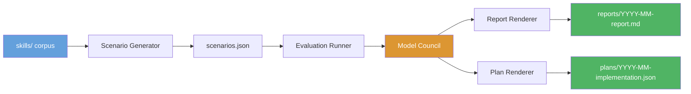
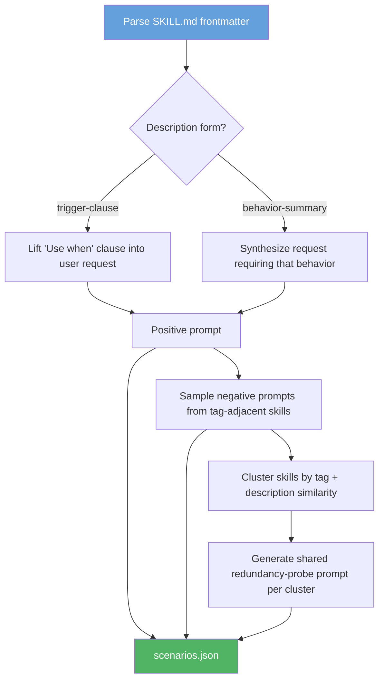
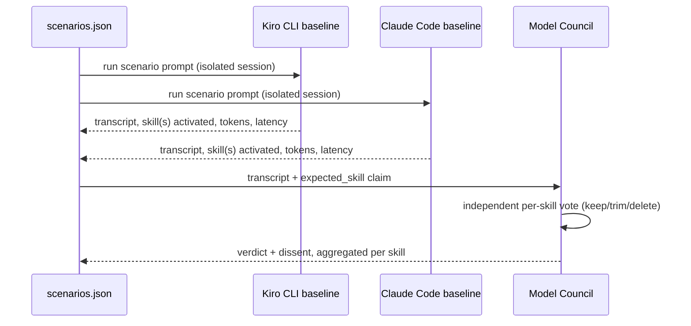
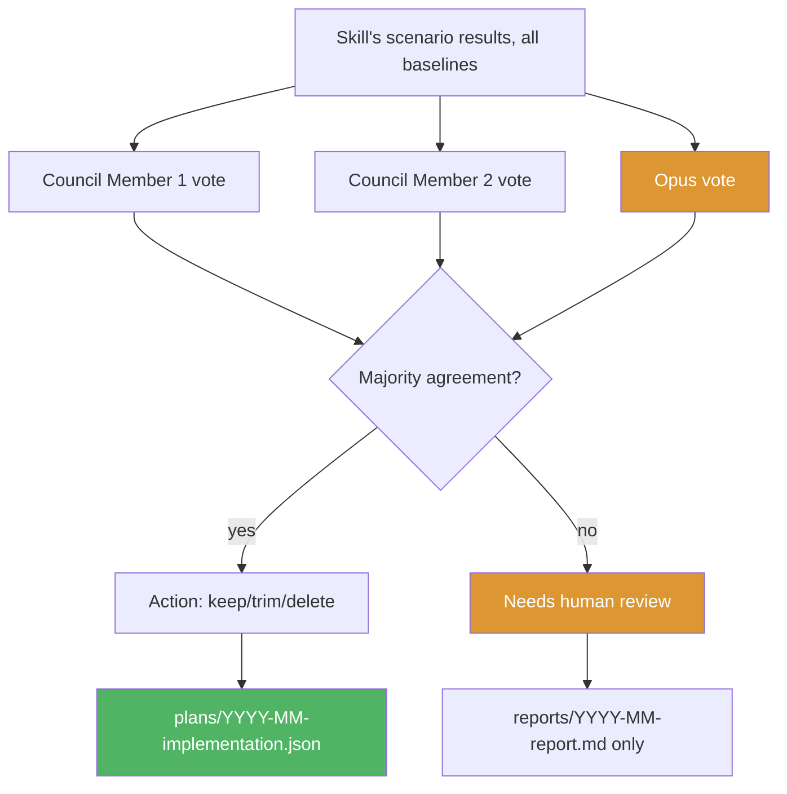

# Skill Benchmarking Framework — Design

## Problem
# Skill Benchmarking Framework — Design

## Problem

Konductor ships 82 skills under `skills/`. Nothing measures whether a skill earns its token cost. Three concrete gaps:

- **No redundancy signal.** `dynamodb-design` and `dynamodb-validation`, or `code-review` and `adversarial-code-review`, could overlap in what they cover, and there is no evidence either way.
- **No trigger-quality signal.** A skill's `description` states an activation condition, but nothing checks whether a model actually picks that skill over a lexically similar neighbor when it should.
- **No cost signal.** Every skill loaded into an agent's context costs tokens on every session. There is no per-skill measurement of whether that cost is justified by the skill firing correctly when needed.

The existing harness under `tests/` (`scripts/benchmark.js`, `tests/judges/claude-code-agent-runner.js`, `tests/registry.json`, per-agent scenario sets in `tests/asdlc-*/`) benchmarks two agents end-to-end against hand-written scenarios. It answers "does this agent pass its scenarios," not "does this skill earn its token cost" or "does this skill duplicate that one." It also runs against a single subject model, not a council, so there is no built-in mechanism for judgment disagreement or dissent. This design replaces it rather than extending it — the scenario format, per-skill signal, and council-based judgment are different enough that adapting the existing harness in place would leave two half-compatible schemas.

Design target: konductor's `skills/` (82 skills).

Out of scope: implementation code (`scripts/` ships as placeholders only), specific scenario content, council-model orchestration internals.

## Requirements

**Functional**
- Scriptable benchmark run on a configurable cadence (default monthly; see Non-functional) — no manual scenario curation per run.
- A council of 5 models (must include Opus, plus 4 others) judges each skill, not a single subject model. Fixed at 5, an odd number, so majority/tie logic in [Council voting and consolidation](#council-voting-and-consolidation) is well-defined.
- Skills are scored against generated scenarios derived from the skill corpus itself.
- Output is a human-readable report and a machine-readable implementation plan.

**Constraints**
- The existing benchmark harness under `tests/` and `scripts/benchmark.js` is deleted, not extended — see [Implementation Plan](#implementation-plan) for exact scope.
- The corpus to benchmark is a parameter (`corpus_path`), not hardcoded — defaults to `skills/`.

**Non-functional**
- The monthly report is written per the `humanize-writing` skill's conventions — no filler, no hedge words.
- Cadence is configurable (default monthly, supports bi-monthly or ad-hoc via `--frequency` flag); the framework does not run continuously or on every commit.

**Deferred (explicitly out of scope for this design)**
- Token budget threshold value — left as external config; no default proposed.
- Whether council votes should weight real usage/invocation telemetry alongside scenario evidence — scenario-only for now.

## Solution Overview



Four stages, run once a month: **generate** scenarios from the skill corpus, **evaluate** each scenario against baseline agents, have a **council** of models judge the results per skill, and **render** both a report for a person and a plan for an agent to execute. Each stage writes its output to disk before the next stage starts, so a run can be resumed or re-scored without repeating earlier stages.

## ADR: Council voting over single-model pass/fail

**Context.** The existing harness scores each scenario pass/fail against one subject model. That format cannot express "the skill fired correctly but its guidance was subtly wrong" or "two skills both plausibly should have fired and reasonable judges disagree about which one."

**Decision.** Judgment is a vote across multiple models (Opus + others), not a single model's binary verdict. Each council member independently returns `keep` / `trim` / `delete` per skill after reviewing all of that skill's scenario transcripts. The council has a fixed size of **5 members**, set as an odd number specifically so a tie is structurally impossible and every vote resolves to a majority, a plurality, or the abstention-quorum rule in [Failure Handling](#failure-handling).

**Status.** Accepted.

**Alternatives considered.**
- *Single-judge pass/fail* (status quo): rejected — cannot capture qualitative disagreement, and a single judge model's own blind spots go undetected.
- *Single-judge score (0–10)*: rejected — a number hides the same disagreement a vote surfaces; two judges landing on "6" for different reasons looks like agreement when it isn't.

**Consequences.** A tie or plurality-only result must be reported as "needs human review," not auto-escalated — the report format and the plan schema both need a place for that outcome (see [Report Format](#report-format) and [Implementation Plan Schema](#implementation-plan-schema)). With a fixed 5-member council, a true tie is impossible; "plurality-only" is retained in the report/plan language only for the case where abstentions reduce the effective vote count to an even number (e.g., one abstention leaves 4 live votes, which can split 2-2). Running 5 council members costs 5 times the judgment tokens of a single judge; that cost is accepted because the framework runs monthly, not per-commit.

## ADR: Separate scenarios/, results/, and reports/plans/ directories

**Context.** Scenario generation, evaluation results, and the two output artifacts have different reuse and lifecycle needs within a single run and across runs.

**Decision.** Three top-level directories, each keyed by `YYYY-MM/` where applicable: `scenarios/` (generator output, reusable across a re-score), `results/` (evaluation + council output, tied to one specific run), and `reports/` + `plans/` (final artifacts, one file per month, not nested by date since the filename already carries it).

**Status.** Accepted.

**Alternatives considered.**
- *Single flat run directory* (`runs/YYYY-MM/` with everything inside): rejected — makes it awkward to re-run evaluation against the same scenario set (e.g. to add a council member) without either duplicating scenarios or breaking the "one run = one directory" convention.
- *No date partitioning* (overwrite in place each month): rejected — loses the ability to compare month-over-month trend on a skill's pass rate, which is the main reason to run this monthly instead of once.

**Consequences.** `corpus-snapshot.json` inside `scenarios/YYYY-MM/` has to independently capture a content hash per skill, since `skills/` itself is not versioned by date — this is what lets a report be regenerated later and still show exactly which skill states were scored.

## How It Works

### Scenario generation



Every scenario traces back to one line in one skill's frontmatter, since there is no external scenario bank to validate against otherwise:

1. **Parse.** Extract `name`, `description`, `tags` from every `SKILL.md`.
2. **Positive prompt.** Trigger-clause descriptions ("Use when X") become a first-person request built directly from X. Behavior-summary descriptions ("Does X") get a synthesized request that would plausibly need X — a template transform, not free generation.
3. **Negative prompts.** 2–3 prompts sampled from other skills' positive prompts that share a tag or are lexically close — this tests whether the *right* skill fires among confusable neighbors, which is the actual redundancy signal.
4. **Redundancy probes.** Skills are clustered by tag intersection and description similarity. Each cluster of 2+ skills gets one shared prompt a human would expect exactly one skill to own.
5. **Expected outcome.** Recorded as a claim (`expected_skill` or `expected_none`) plus the source description line, not a fixed string — grading is "did the model's skill selection and output match the stated purpose," judged by the council.

`corpus-snapshot.json` records a content hash per skill alongside the generated scenarios, so a scenario can be flagged stale if its source skill changed before the next run.

### Evaluation protocol



Each scenario runs once per baseline agent (Kiro CLI's `kiro-default`, Claude Code's default agent), in isolated sessions with no shared context between runs. Each run captures which skill(s) activated, latency, token count, and a pass/fail judgment against `expected_skill`.

The council then votes **per skill**, not per scenario — each member reviews all of a skill's scenario results together before voting `keep`, `trim` (with the line range flagged), or `delete` (naming the redundant skill). A vote is action-eligible only on majority agreement; a tie or plurality-only result is marked "needs human review" and excluded from the implementation plan.

Metrics aggregated per skill across both baselines and all its scenarios: pass rate, confusion rate (a different skill fired instead — the direct redundancy signal), average latency, average token cost, token-budget-breach percentage (against a configurable external threshold), and the council's vote distribution.

### Council voting and consolidation



Dissent is recorded, not discarded — a 3-keep/1-delete vote and a 2-keep/2-delete tie are different findings and the report format keeps them distinguishable (see below). A run where every skill ties or lands on plurality-only is a valid outcome, not an error: the report's "Needs Human Review" section lists all of them and `plans/YYYY-MM-implementation.json` is emitted with an empty `actions` array.

## Failure Handling

Both external-dependency calls in the pipeline — a baseline agent run (Evaluation protocol) and a council member's vote (Council voting and consolidation) — can time out, crash mid-run, or return malformed/partial output. This section states what happens in each case, since the framework runs unattended on a monthly cadence and a run that silently stalls or silently drops a partial result defeats the "no manual scenario curation per run" requirement.

**Baseline agent run failure (Evaluation protocol, Stage 2):**
- A scenario run against a baseline agent gets one retry on timeout or crash; a second failure marks that `(scenario_id, baseline)` pair `run_failed` in `results/YYYY-MM/raw/<baseline>.json` rather than omitting it.
- A skill whose scenarios are all `run_failed` for a given baseline is excluded from that baseline's per-skill metrics (pass rate, confusion rate) for this run, not silently scored as a failure — the Metrics Appendix marks the cell `N/A (run_failed)` instead of `0%`.
- No retry budget is unbounded: one retry per scenario per baseline, consistent with this being a human-retriable offline batch tool, not a live service needing exponential backoff or circuit breaking.

**Council member failure (Council voting and consolidation, Stage 3):**
- A council member that times out, crashes, or returns a response that fails to parse as a `keep`/`trim`/`delete` vote is recorded as `abstain` for that skill, not silently excluded from the denominator — `council-votes.json` carries an explicit `abstentions` count alongside the vote tally.
- Majority agreement (the action-eligibility rule in Council voting) is computed over members who actually voted; an abstention lowers the effective quorum but does not by itself force "needs human review" — 3 keep / 0 delete / 1 abstain is still an actionable majority.
- If 3 or more of the 5 council members abstain on a skill, that skill is forced to "needs human review" regardless of the surviving votes' agreement — too few real votes (2 or fewer) to trust a majority computed over the rest.

**Partial or stale corpus snapshot:**
- If `corpus-snapshot.json`'s content hash for a skill no longer matches the live file when Stage 2 runs (the skill changed between generation and evaluation), that skill's scenarios are marked `stale_snapshot` in the raw results and excluded from this run's council vote — re-generated on the next run instead of scored against an outdated source.
- A run where every skill is excluded for staleness or failure is still a valid, non-erroring run: the report's "Needs Human Review" section lists them by exclusion reason, and `plans/YYYY-MM-implementation.json` emits with an empty `actions` array, same as the all-tie case already described in Council voting.

**Minimum operational signal (addresses the "scriptable, cadence-configurable run" requirement):**
- Each stage writes a `status` field (`ok`, `partial`, `failed`) and a `duration_seconds` to its own output file on completion (`corpus-snapshot.json`, `raw/<baseline>.json`, `council-votes.json`) — this is the run's own health signal, distinct from the skill pass/fail metrics the run produces. No separate metrics/logging system is introduced; this design does not require CI/CD integration beyond a process exit code (`0` for `ok`/`partial`, non-zero for `failed`) that a caller (cron, Pipelines, or manual invocation) can check.
- A stage that itself fails outright (not a single scenario or council member, but the stage process) halts the run and leaves later stages' directories absent for that `YYYY-MM` — a resumed run detects this by the missing directory, matching the "each stage writes output before the next starts" resumability already stated in Solution Overview.

## Implementation Details

### Directory layout

```
benchmarking/
├── scenarios/
│   └── YYYY-MM/
│       ├── scenarios.json           # generated scenario set for this run
│       └── corpus-snapshot.json     # skill inventory + content hash at generation time
├── results/
│   └── YYYY-MM/
│       ├── raw/
│       │   ├── kiro-default.json    # per-scenario, per-baseline raw run output
│       │   └── claude-default.json
│       └── council-votes.json       # per-skill council verdicts + dissent
├── reports/
│   └── YYYY-MM-report.md            # human-readable output artifact
├── plans/
│   └── YYYY-MM-implementation.json  # machine-readable output artifact
└── scripts/                         # placeholders only — not authored in this design
    ├── generate-scenarios.*
    ├── run-evaluation.*
    ├── tally-council.*
    └── render-report.*
```

`scenarios/` is split from `results/` because scenario generation is reusable across a re-score (e.g. adding a council member later), while results are specific to one evaluation run.

### Scenario schema (`scenarios.json`)

| Field | Type | Meaning |
|---|---|---|
| `scenario_id` | string | `YYYY-MM-NNN`, unique per run |
| `type` | enum | `positive`, `negative`, `redundancy-probe` |
| `prompt` | string | the user request text |
| `expected_skill` | string \| null | source skill path, or `null` for `expected_none` |
| `source_description_line` | string | the exact frontmatter line the scenario was derived from |
| `cluster_id` | string \| null | set for `redundancy-probe` scenarios; format `cluster-NNN`, assigned sequentially as clusters are formed during generation (step 4 of Scenario generation), stable only within a single run |

### Report format

Structure for a once-a-month skim, written per `humanize-writing` conventions (no filler, no hedge words, metrics stated once):

```markdown
# Skill Benchmark Report — <Month Year>

## Summary
- Skills evaluated: N
- Scenarios run: N (N positive, N negative, N redundancy-probe)
- Recommended for deletion: N
- Recommended for trimming: N
- Needs human review (no consensus, run failure, or stale snapshot): N

## Recommendations

### Delete: <skill-name>
- Redundant with: <other-skill-name>
- Evidence: confusion rate X%, council vote (3 delete / 1 trim)
- Justification: <one paragraph>

### Trim: <skill-name>
- Affected lines: L<start>-L<end>
- Evidence: <metric that triggered this>
- Justification: <one paragraph>

## Needs Human Review
- <skill-name>: council split 2-2, reason: <summary>
- <skill-name>: excluded, reason: run_failed (both baselines) | stale_snapshot | council abstention exceeded quorum

## Metrics Appendix
| Skill | Pass Rate | Confusion Rate | Avg Tokens | Budget Breach % | Council Vote |
|---|---|---|---|---|---|
```

### Implementation plan schema (`plans/YYYY-MM-implementation.json`)

One entry per majority-agreed action (delete/trim only — "needs human review" is excluded, since this file is meant to be directly executable):

```json
{
  "schema_version": "1.0",
  "generated_at": "YYYY-MM-DDTHH:MM:SSZ",
  "corpus_path": "skills/",
  "actions": [
    {
      "skill_path": "skills/<name>/SKILL.md",
      "action": "delete",
      "line_range": null,
      "justification": "Redundant with skills/<other>/SKILL.md; confusion rate 62% across 8 scenarios.",
      "evidence": {
        "confusion_rate": 0.62,
        "redundant_with": "skills/<other>/SKILL.md",
        "council_vote": {"delete": 3, "trim": 1, "keep": 0},
        "scenario_ids": ["2026-09-014", "2026-09-019"]
      }
    },
    {
      "skill_path": "skills/<name>/SKILL.md",
      "action": "trim",
      "line_range": {"start_line": 45, "end_line": 98},
      "justification": "Section unused across all scenarios; token budget breached in 6/9 runs.",
      "evidence": {
        "token_budget_breach_pct": 0.67,
        "council_vote": {"delete": 0, "trim": 4, "keep": 0},
        "scenario_ids": ["2026-09-003"]
      }
    }
  ]
}
```

This file is structured for direct machine parsing, not direct machine execution: an agent can read `skill_path` and the proposed `action` without additional interpretation, but every entry requires human confirmation before anything runs. Concretely: an executing agent MUST default to a dry-run mode that prints the proposed change (file removed, or line range removed) without touching disk, and MUST require an explicit per-entry or per-run confirmation flag before it checks for dangling references (`delete`) or re-validates the trimmed file (`trim`) and writes the result. There is no auto-execution path in this design; the confirmation gate is a required behavior of any agent that consumes this file, not an optional safeguard left to that agent's own future spec.

## Threat Model

**Assets.**
- `scenarios.json` — the scenario set, which defines what each skill is asked to do
- `corpus-snapshot.json` — the skill inventory with content hashes, used to detect staleness
- `results/YYYY-MM/raw/*.json` — raw evaluation transcripts and metrics
- `council-votes.json` — council verdicts and dissent records
- `reports/YYYY-MM-report.md` — human-readable conclusions
- `plans/YYYY-MM-implementation.json` — machine-readable action plan

**Threats.**
| Threat | Impact | Mitigation |
|--------|--------|------------|
| Scenario tampering (change `scenarios.json` between generation and evaluation) | False pass/fail; skills scored against wrong expectations | `corpus-snapshot.json` content hashes detect staleness; scenarios regenerated if source changed |
| Council vote manipulation (alter `council-votes.json`) | Incorrect recommendations; `delete`/`trim` on wrong skills | Council votes logged with member identity; `council-votes.json` stored in results directory keyed by run timestamp |
| Baseline agent run manipulation (modify `kiro-default.json` or `claude-default.json`) | Skewed metrics; pass rate/inflation or deflation | Raw transcripts stored per scenario per baseline; independent replay possible from `scenarios.json` |
| Report forgery (substitute wrong `reports/YYYY-MM-report.md`) | Wrong decisions; wrong skills deleted/trimmed | Report hash recorded in `plans/YYYY-MM-implementation.json`; plan execution requires report match |
| Council member bias (one model systematically favors certain skills) | Skewed outcomes toward that model's preferences | Council uses 5 members; dissent recorded; majority required; no single member can unilaterally decide |
| Token budget threshold manipulation (external config change mid-run) | Applicable skills change unexpectedly | Threshold is external config; run health signal (`status` field) flags configuration changes as a precautionary note in the report |

**Trust boundaries.**
- Scenario generation → evaluation: trusted channel (same `YYYY-MM` run directory)
- Evaluation → council: trusted channel (same `YYYY-MM` run directory)
- Council → report/plan: trusted channel (same `YYYY-MM` run directory)
- External config (token budget threshold): untrusted input; logged in report if changed mid-run

**High-severity risks.**
1. **Scenario staleness** — skill frontmatter changed after scenarios generated but before evaluation: mitigated by content hash comparison and `stale_snapshot` exclusion.
2. **Council bias without detection** — 3 of 5 members share a blind spot: mitigated by 2-2 split detection (plurality-only result forces "needs human review").
3. **Report tampering without detection** — substituted report leads to wrong action: mitigated by plan-report hash linkage.

## Decision Requested

Approve this design to replace the existing benchmark harness under `tests/` with a monthly skill evaluation framework that:

1. **Identifies redundant skills** — via confusion rate (a different skill fires when the expected one should) across scenarios derived from skill frontmatter
2. **Identifies trimmable skills** — via token budget breach percentage and unused sections
3. **Validates trigger quality** — via pass rate (skill fires correctly when it should) and correct-skill selection among confusable neighbors

The framework runs monthly with a council of 5 models (Opus + 4 others) voting per skill on keep/trim/delete, producing a human-readable report and machine-readable implementation plan. Implementation is phased: Phase 0 deletes the existing harness, Phases 1-4 are placeholders for the actual implementation, and Phase 5 validates parameterized `corpus_path`.

### Phase 1-5 are placeholders

Per MUST NOT DO for this design pass, Phase 1-4 of the Implementation Plan are intentionally unimplemented. They are defined here to show what the framework's implementation will require, but no code is to be written for these phases. A future feature-splitting pass should size each into task-level tickets once Phase 3 of the SOP runs.

## Verification

No code change expected if Phase 1–4 held `corpus_path` as a real parameter throughout — this phase is a validation pass, not new implementation.
