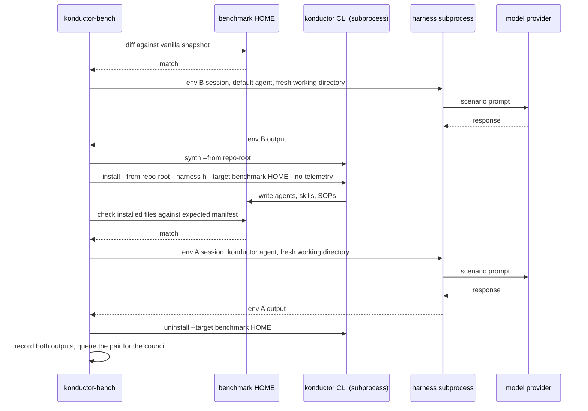
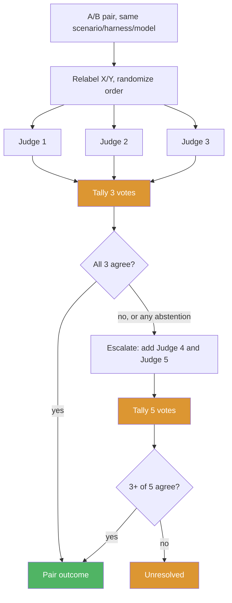
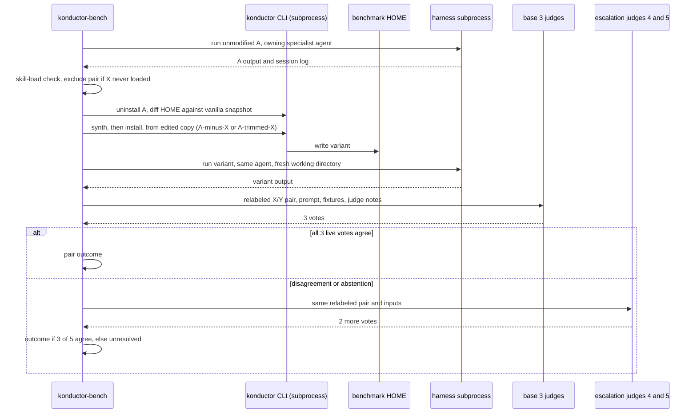

# Skill Benchmarking Framework Design

**Status:** Proposed
**Date:** 2026-09-29

## Problem

Konductor ships 82 skills under `skills/`. Nothing measures whether a skill earns its token cost, whether it activates when its description says it should, or whether another skill already covers the same ground.

The existing harness under `tests/` (`scripts/benchmark.js` at the repo root, `tests/judges/claude-code-agent-runner.js`, `tests/registry.json`, per-agent scenario sets under `tests/asdlc-*/`) runs one subject model against hand-written scenarios and checks pass or fail. It has no baseline to compare against, so it cannot say whether a skill helped. `tests/registry.json` is a two-entry subset registry naming a dataset path, subject model, and default judge, not a per-scenario record store; it has no field for a second environment's output, a pair verdict, or an ablation variant's identity. This design replaces the harness rather than extending it.

`konductor-bench`, a separate binary built from the same checkout as `konductor`, runs it. See [CLI Surface](#cli-surface) and [Build and Invocation](#build-and-invocation).


## Goals and Non-Goals

**Goals**

- Decide, per skill, whether to keep, prune, or trim it, backed by quality evidence instead of a description read.
- Cover more than one harness (Kiro CLI, Claude Code) and more than one model per harness, since a skill's effect can vary by both. Separate "does the whole stack help" from "does this one skill help": the first cannot answer the second.
- Build the framework itself: scenario generator, environment runner, council judge, report and plan renderers. Nothing like this exists today. Build a reviewed scenario bank with prompts, fixtures, and judge notes for every skill.
- Treat coverage as more important than run cost. Cost is controlled by repeat count, models per harness, and the run cap, never by dropping a coverage scenario. A candidate whose coverage set does not fully run goes to needs human review.

**Non-Goals**

- Running continuously or per commit. The framework runs on a configured cadence.
- Weighting verdicts by real usage or invocation telemetry. Scenario evidence only, for now.

## Requirements

| # | Requirement |
|---|---|
| F1 | Generate draft scenarios for every skill, review once, reuse the approved set on every run. |
| F2 | Run a screening stage comparing a full Konductor environment against a vanilla baseline, per scenario, harness, and model. |
| F3 | Select ablation candidates from the screen using the rules in [Ablation and Verdict Rules](#ablation-and-verdict-rules). |
| F4 | Run an ablation stage per candidate, in a direct arm and a routed arm, isolating that skill's effect. |
| F5 | Judge every pair blind and pairwise with a council that starts at three judges and escalates to five on disagreement (ablation only). |
| F6 | Render a human-readable report and an implementation plan a person can act on. |

**Constraints**

- `konductor-bench` runs only inside a git checkout of Konductor. It reads the scenario bank, fixtures, and prompts from `<repo-root>/benchmarking/`, and writes results, reports, and plans there. There is no mode against a released `konductor` binary: a release carries no scenario bank and no repository tree to write a report into.
- The corpus to benchmark is `bench.corpus_path`, default `skills/`.
- Harnesses are config: `bench.harnesses`, default `[kiro-v3, claude]`. `kiro-cli-v2` is being deprecated in favor of `kiro-v3` but can still be listed while it exists.
- Models per harness are config: `bench.models.kiro`, `bench.models.claude`, each defaulting to at least two models.
- Claude Code's provider is config: `bench.providers.claude`, `bedrock` (default) or `anthropic`. Setup only, recorded for traceability; it never splits pairs or verdicts. See [Model Access and Credentials](#model-access-and-credentials).
- Cadence is a `--frequency` flag, default monthly. A scheduled job invokes the runner on that cadence; a person can also run it manually.
- Scenario counts, council composition, threshold values, and the run cap are all config; see the tables in [How It Works](#how-it-works), [CLI Surface](#cli-surface), and [Run Cost](#run-cost).

**Non-Functional**

- The rendered report follows the `humanize-writing` skill's conventions: no filler, no hedge words, no promotional language.

## Solution Overview

```mermaid
flowchart LR
    A[skills/ corpus] --> B[Scenario Generator]
    B --> C[Stage 1: Screen]
    C -->|"env A: konductor
    vs env B: vanilla"| D[Candidate Selection]
    D --> E[Stage 2a: Ablation, direct arm]
    E -->|"specialist agent
    A vs A-minus-X / A-trimmed-X"| F[Council]
    F -->|"prune or trim"| E2[Stage 2b: Ablation, routed arm]
    E2 -->|"konductor orchestrator
    A vs A-minus-X / A-trimmed-X"| F2[Council]
    F2 --> G[Report + Plan]

    style A fill:#64a0dc,color:#fff
    style F fill:#dc9632,color:#fff
    style F2 fill:#dc9632,color:#fff
    style G fill:#50b464,color:#fff
```



Two stages answer two different questions. The screen compares the full Konductor stack (env A, through the `konductor` orchestrator) against a vanilla harness with no Konductor install (env B). A difference there is whole-stack: env A and env B differ in the orchestrator and every skill at once, and the orchestrator sits on the request path for every screen scenario, so a screen result cannot be pinned on one skill's own content versus a routing effect. The screen's only job is narrowing 82 skills to a candidate list; only ablation decides a skill's fate.

Ablation removes or trims one candidate skill at a time from a copy of env A and compares that copy against unmodified env A, in two arms:

| Arm | Invokes | Question | Runs when |
|---|---|---|---|
| Direct | The specialist agent that owns the skill (`k-architect` for `threat-modeling`), never `konductor` | Does the skill's own content help the agent that owns it | Always, first |
| Routed | The `konductor` orchestrator, both sides | Does removing or trimming the skill change what a real user gets, including any routing shift | Only if the direct arm resolves to prune or trim |

The direct arm targets a named agent so the run does not depend on the orchestrator's own delegation choice: removing the skill cannot change which agent the scenario reaches, only what that agent does with it. The routed arm has no fixed target and no skill-load exclusion (see [Ablation and Verdict Rules](#ablation-and-verdict-rules)): a routing shift away from the owning agent is itself part of what it measures. It is the final gate before a candidate reaches the plan.

## How It Works

### Scenarios

A scenario is more than a prompt: `code-review` needs a diff, `dynamodb-validation` needs a table design, `threat-modeling` needs a system description. Each scenario carries a prompt (the request, phrased the way a developer would ask), fixtures (input files from `benchmarking/fixtures/`, copied into a fresh working directory), and judge notes (what a strong answer covers).

Judge notes are drafted from a plain description of the task before the generator reads the skill's body, then reconciled against the skill's stated capabilities. Task-first drafting stops the notes from encoding the skill's own section headings as the definition of a good answer, which would score "looks like this skill's output" over "solves the task well." Notes go through the same review as their scenario.

Every skill gets two sets:

| Set | Size | Built | Runs against |
|---|---|---|---|
| Core | `bench.scenarios.core`, default 3: trigger, variation, near-miss | Every skill, up front | The screen |
| Coverage | Floor `bench.scenarios.min_coverage`, default 5, no cap; includes the core set | Only once a skill becomes a candidate | Ablation |

The generator builds the coverage set by enumerating the skill's distinct capabilities (modes, major sections, called-out edge cases) from the full `SKILL.md`, drafting one scenario per capability. Below the floor it fills with variations of an existing capability, never an invented one. A coverage set over `bench.scenarios.review_flag` (default 15) is flagged in the report as a possible split candidate.

Each scenario records `covers_sections`: the `SKILL.md` headings it exercises. Every name must match a heading at the entry's `skill_hash`, case- and whitespace-insensitive. `konductor bench scenarios review` lists any mismatch next to pending drafts, and `konductor bench run` re-checks every approved entry before dispatch, exiting `64` if one fails.

A generator model drafts, a person reviews once, and approved scenarios move to `benchmarking/scenarios/bank/<skill>/`, checked in and keyed by `skill_hash`. A changed hash marks the entry stale: excluded from runs and re-drafted for review. The generator is never the only author, since a scenario written purely from a skill's own text mostly tests the generator, not the skill.

#### Near-miss scenarios

A near-miss sounds related to skill X but belongs to another skill, so X should not change the output. "Design a DynamoDB table" is a near-miss for `dynamodb-validation` because it belongs to `dynamodb-design`.

Near-misses are borrowed from the approved core trigger scenarios of skills in X's overlap cluster (`near_miss_source: borrowed`, `borrowed_from: <skill>`). Borrowed near-misses are already reviewed and are the confusions most likely in real use. A skill with no neighbour gets no drafted near-miss by default; the report says "near-miss untested," never "well-scoped." A reviewer may instead add a boundary-mutation near-miss: one element of the skill's own approved trigger scenario changed to move it out of scope (`near_miss_source: mutation`), with judge notes stating the changed element and why it is now out of scope.

In the direct arm, a near-miss pair counts only if X loaded in env A, matching the skill-load exclusion's scope (see [Ablation and Verdict Rules](#ablation-and-verdict-rules)). If X loaded on no qualifying near-miss, the near-miss condition is met and X is reported "well-scoped." There is no minimum-pairs floor. In the routed arm, "loaded" has no session-log signal to check against, since that arm skips the skill-load check entirely: a routed-arm near-miss pair counts whenever the orchestrator reached X's owning agent, using the same reached-agent signal the routed arm already records for `own`/`overlap` pairs. On a harness with unreliable load evidence (see [Open Questions](#open-questions)), near-miss pairs from it are reported only. The report shows X's near-miss load rate per arm; a high direct-arm rate suggests an over-broad description even when the skill is kept.

### Environments

`konductor-bench` runs only inside a git checkout. At startup it walks up from the working directory, or from `--bench-dir`'s parent, for a directory containing `.git`, `skills/`, `agents/`, and `benchmarking/`. Reaching the filesystem root without finding one exits `64`. Before any run, it also checks installed `konductor --version` against the checkout's `VERSION` file; a mismatch exits `64` rather than running an install, uninstall, or synth subprocess call whose behavior the harness was not written against.

Environments are states of one dedicated **benchmark HOME** per harness (mode `0700`, logged in once), toggled with real `konductor install`/`uninstall` subprocess calls, never the developer's own HOME. Each harness needs its own HOME because an install target is locked to one `--harness` value.

- Env B (vanilla): no Konductor install, invoked through the harness's own default agent.
- Env A (konductor): after `konductor synth --from <repo-root>` and `konductor install --from <repo-root> --harness <h> --target <bench-home> --no-telemetry`, invoked through the `konductor` agent.
- Ablation variants: the runner copies the source tree to a temp directory and edits it, `A-minus-X` removing skill X and every reference to it, `A-trimmed-X` applying the trim patch to X's `SKILL.md`, then synths and installs the copy the same way. Synth failure sends the candidate to needs human review. The temp copy is deleted once the variant's runs finish.

Every run record and the report header carry the checkout's commit SHA and dirty-tree flag. A dirty tree is allowed and flagged rather than blocked, but its result does not map to one commit.

**Hygiene checks.** Right after login, the runner snapshots the benchmark HOME (every path, content hash), excluding session-history and cache directories. After every uninstall it diffs against that snapshot; a mismatch stops that HOME's queue and marks the stage partial. Before every env A or variant run it checks installed files against the expected manifest; anything outside agents, skills, steering, and SOPs is a mismatch, which also catches content copied in from a developer's own `~/.kiro` or `~/.claude`. Every run starts a new session in a fresh, empty working directory, so repo files like `AGENTS.md` or `.konductor/memory/` never carry over.

**Accepted risk: cache carryover.** Session-history and cache directories are excluded by design, not because they are verified clean. A harness's model-response cache or an MCP server's state directory can persist across a toggle without appearing in either check above. Randomizing which environment runs first within each shard spreads this bias rather than removing it. Exact cache paths per harness are still open; see [Open Questions](#open-questions).

`KONDUCTOR_TELEMETRY=off` is set for every subprocess, alongside `--no-telemetry` on install. One screen cell (one scenario, harness, model) on one benchmark HOME runs env B first; other shards run env A first, same steps in between: snapshot check, run, install (env A only), manifest check, run, uninstall, record.



### Model access and credentials

| Caller | Provider | Credential | Supplied as |
|---|---|---|---|
| Claude Code, env A/B | `bench.providers.claude: bedrock` (default) | Short-lived AWS credentials, dedicated subject role | Subprocess env vars: `CLAUDE_CODE_USE_BEDROCK=1`, `AWS_REGION`, temporary keys, model ID |
| Claude Code, env A/B | `bench.providers.claude: anthropic` | Anthropic API key | `ANTHROPIC_API_KEY` on the subprocess |
| Kiro CLI, env A/B | Kiro's own backend | The Kiro CLI login | Done once per benchmark HOME, assumed to persist across toggles; not verified. If a Kiro CLI session on that HOME returns an auth-required response mid-run, the runner treats it as `run_failed` for that cell (one retry, per [Failure Handling](#failure-handling)) rather than re-logging in automatically, since an unattended re-login is out of scope for this design |
| Council judges | `bench.council.judges[]` / `escalation_judges[]` | Short-lived AWS credentials, separate least-privilege Bedrock judge role | Held by the runner process only, never a subprocess |

Subject and judge roles allow only `bedrock:InvokeModel`/`InvokeModelWithResponseStream` on listed ARNs, including both the judges' inference profile ARNs and the underlying foundation-model ARNs a profile resolves to at call time. `~/.aws` is never copied into a benchmark HOME. Judge credentials never reach a subject: a subject model can run tools and read its own environment, so judge credentials stay off every harness subprocess. Judges run on Amazon Bedrock only regardless of `bench.providers.claude`, so benchmarking needs Bedrock access even when Claude Code itself uses the Anthropic API.

A pair is valid if both sides come from the same run, harness, and configured model. `bench.providers.claude` is recorded for traceability and shown in the report header, but pairs from different provider values pool into one verdict. Transcripts are scanned for credential patterns before writing to `results/`; a match is redacted and flagged.

### Council judging



Both outputs in a pair are relabeled X/Y in randomized order. Each judge returns a preference (X, Y, or no meaningful difference), a strength, and rubric scores for correctness, completeness, adherence, and actionable detail, against `benchmarking/prompts/judge-pair.md` plus the scenario's prompt, fixtures, and notes.

All judges run on Amazon Bedrock via Converse on `bedrock-runtime`, region `bench.council.region` (default `us-west-2`). The base council, `bench.council.judges[]`, is Claude Opus 5.5 (`us.anthropic.claude-opus-5-5`), GPT-6 Astra (`us.openai.gpt-6-astra`), and DeepSeek V3.2 (`deepseek.v3.2`). Escalation judges, `bench.council.escalation_judges[]`, are Kimi K3 (`us.moonshotai.kimi-k3`) and Mistral Large 3 (`mistral.mistral-large-3-675b-instruct`), five model families across the full panel. Verified against Bedrock model cards on 2026-09-29. Two caveats: Mistral Large 3's lifecycle states end-of-life no sooner than December 2, 2026, and the judge IAM role must allow both the inference profile ARNs and the underlying foundation-model ARNs.

| Stage | Panel | Resolves at 3 when | Escalates when | Resolves at 5 when |
|---|---|---|---|---|
| Screen | 3, no escalation | At least 2 of 3 live votes agree | Never | n/a |
| Ablation | 3, escalates to `bench.council.escalate_to` (default 5) | All 3 live votes agree | Any disagreement or abstention | At least 3 of 5 live votes agree; otherwise unresolved |

A judge timeout or unparseable reply is an abstention. The screen only narrows the candidate list, so it does not pay for escalation; ablation decides a skill's fate, so a close 2-1 split there buys two more judges. Same-family judging is allowed: both sides of a pair always come from the same subject model, so any self-preference bias applies equally to both sides, and blind relabeling removes the identity cues a biased judge would use. The report tracks same-family versus cross-family agreement and flags any skill where they disagree.

One direct-arm ablation pair for candidate X: run unmodified A on the owning specialist agent, skill-load check, uninstall and diff against the vanilla snapshot, synth and install the edited copy (`A-minus-X` or `A-trimmed-X`), run the variant on the same agent in a fresh working directory, then dispatch the relabeled pair to the base three judges, escalating to the two escalation judges on disagreement or abstention per the panel table above. The routed arm runs the same sequence with `konductor` on both sides, skips the skill-load check, and records reached agents and skills.

### Ablation and verdict rules

Pairs split by `kind`: `own` and `overlap` pairs measure whether removing X hurts where it should help and carry the prune evidence; `near_miss` pairs measure whether X changed output where it should not, and never pool into the `own`/`overlap` ratio.

| Verdict | Rule | Runs |
|---|---|---|
| Prune | Ablated variant not worse in at least `bench.thresholds.no_regression` (0.9) of resolved `own`/`overlap` pairs, no pair strongly favors A, and the near-miss condition holds | Against `A-minus-X` |
| Trim | Same rule, and valid only for sections a coverage scenario's `covers_sections` named and the direct arm showed unneeded; untested sections are reported untested, not trimmed | Against `A-trimmed-X` |
| Keep | Neither rule met | n/a |
| Needs human review | More than `bench.thresholds.max_unresolved` (0.2) of pairs unresolved or `run_failed`; coverage incomplete; synth failed; or routing regression | n/a |

**Candidate selection (screen only, not ablation).** A skill becomes a candidate if any rule fires: (a) it did not activate in env A on its own scenarios; (b) env A is not better than env B on the skill's scenarios, whole-stack, not skill-scoped; (c) another skill activated on its scenarios (overlap); (d) its rendered `SKILL.md` exceeds `bench.thresholds.skill_tokens` (default 4,000 tokens). The "median skill is about 2,100 tokens, so 4,000 flags around 17 of 82" framing used to justify that default is a rough character-count estimate, not a token count run through the actual model tokenizer; see [Open Questions](#open-questions). Any single rule firing is enough. Only ablation results feed plan actions.

**Skill-load exclusion (direct arm only).** A direct-arm pair counts only if the env A session log shows a load event for X; an unloaded run is excluded, since an unloaded skill was never isolated. The routed arm has no such exclusion for `own`/`overlap` pairs, since a run where the orchestrator never reaches X's agent is itself the effect this arm measures. If every direct-arm pair for a candidate is excluded this way, none of its coverage scenarios produced a usable pair; that candidate goes to needs human review, reason `coverage incomplete`, the same reason used when a coverage set does not fully run. It is not reported as keep, since keep requires the direct arm to have actually resolved the candidate, and it is not reported as trim for any section, since trim requires the direct arm to have shown that section unneeded.

**Repeat instability.** `bench.repeats.ablation` (default 2; `bench.repeats.screen` default 1) samples the same cell more than once. If a scenario's repeats disagree, the runner flags it repeat-unstable in the report alongside its resolved outcomes; both repeats still count toward the ratios.

**Trim patches.** An LLM drafts the trimmed `SKILL.md`, limited to sections a coverage scenario covered and the direct arm showed unneeded. A person approves the patch before the variant runs; the patch is stored with the run. After drafting, the runner scans the remaining text for a reference to a removed heading and flags a hit next to the trim recommendation, non-blocking, since a reference may be stale prose rather than a real dependency.

**Combining the two arms.** The direct arm runs first. Direct-arm keep or needs human review ends the candidate there; the routed arm never runs. Only prune or trim triggers it (`bench.ablation.routed_arm`, default true; false skips it and the report states routed effects were not checked). A candidate reaches the plan only if both arms independently resolve to the same action. Direct pass plus routed regression (routed resolves to keep, or unresolved above `max_unresolved`) goes to needs human review, reason `routing regression`, both arms' evidence shown side by side. A direct/routed mismatch between prune and trim (either arm recommends the stronger action while the other recommends the weaker one) is not a routing regression, since both arms still agree the skill should not stay as-is; it goes to needs human review, reason `arm mismatch`, with both arms' evidence shown side by side, since which action is correct depends on the two arms' own trim-versus-prune reasoning, not something this rule set can arbitrate. Pairs never cross arms.

One direct-arm ablation pair for candidate X is below. The routed arm runs the same sequence with `Sub` running the `konductor` agent on both sides, skips the skill-load exclusion for `own`/`overlap` pairs, and records which agents and skills each run reached.



The threshold defaults above are rationale-backed starting points, not measured values, expected to be revised once the Phase 1 pilot's real pair outcomes exist to check them against.

## CLI Surface

| Command | Does |
|---|---|
| `konductor bench scenarios draft [--skill <name>] [--set core\|coverage]` | Drafts scenarios. `--set coverage` requires the skill to already be a candidate. Drafts land in the bank with `status: draft`. |
| `konductor bench scenarios review` | Lists pending drafts. A scenario's `status` field in its bank YAML is what review edits; works in any text editor or as a PR diff. |
| `konductor bench run [--stage screen\|ablation\|all] [--frequency <cron-or-interval>] [--resume <YYYY-MM>] [--bench-dir <path>] [--estimate] [--yes]` | Executes a run after printing the pre-run estimate (see [Run Cost](#run-cost)). `--stage ablation` runs both ablation arms per the combining rule in [Ablation and Verdict Rules](#ablation-and-verdict-rules), not the direct arm alone. `--estimate` prints and exits; `--yes` confirms a plan over the cap non-interactively; `--resume` continues a `partial` run from its last completed stage. |
| `konductor bench report [<YYYY-MM>]` | Renders the report and plan for a completed run, default most recent month. |

Config lives under `bench:` in `.konductor/config.yml`: `bench.harnesses`, `bench.models.*`, `bench.providers.claude`, `bench.corpus_path`, `bench.scenarios.*`, `bench.council.*` (`judges[]`, `escalation_judges[]`, `escalate_to`, `region`), `bench.ablation.routed_arm`, `bench.thresholds.*`, `bench.repeats.*`, `bench.budget.max_runs`. Council size is not its own key; it is `len(bench.council.judges[])` for the base panel and `len(bench.council.judges[]) + len(bench.council.escalation_judges[])` after escalation.

## Run Cost

| Stage | Runs | Judge calls |
|---|---|---|
| Screen | `skills x core scenarios x harnesses x models_per_harness x 2` | `pairs x council size` (never escalates) |
| Ablation, direct arm | `candidates x coverage scenarios x harness-model cells x repeats x 2` | `pairs x council size`, plus 2 per escalating pair |
| Ablation, routed arm | Same shape, only over candidates the direct arm resolved to prune or trim | Same formula, over that narrower pair count |

Illustrative example, not a target, at an illustrative 20 percent ablation escalation rate (must be measured on the Phase 1 pilot; see [Open Questions](#open-questions)):

| | Cells/pairs | Runs | Base judge calls | Escalation calls | Judge calls |
|---|---|---|---|---|---|
| Screen: 82 skills x 3 core, 2 harnesses x 2 models | 984 pairs | 1,968 | 2,952 | 0 | 2,952 |
| Ablation direct: 20 candidates x 8 coverage x 4 cells x 2 repeats | 1,280 pairs | 2,560 | 3,840 | 512 | 4,352 |
| Ablation routed: 10 of 20 candidates, same shape | 640 pairs | 1,280 | 1,920 | 256 | 2,176 |
| Total | | 5,808 | | | 9,480 |

For comparison, a fixed five-judge council with no screen-stage saving costs 984x5 + 1,280x5 + 640x5 = 14,520 judge calls on the same example, against 9,480 here.

`bench.budget.max_runs` defaults to 15,000, about 2.5x the example, leaving room for larger coverage sets, retries, and per-variant install/uninstall cycles. `konductor bench run` prints the planned run and judge-call count before dispatching; it stops and asks for confirmation if the plan exceeds the cap, unless `--yes` is set. `--estimate` prints and exits without running. If the cap is hit mid-run, dispatch stops, the stage marks partial, and any candidate whose coverage set did not finish goes to needs human review.

## Failure Handling

- A run against any environment gets one retry on timeout or crash; a second failure marks it `run_failed`.
- A failed install/uninstall, or a vanilla-snapshot mismatch after uninstall, stops every remaining run on that benchmark HOME and marks the stage partial. The runner does not hand-delete leftover files; a person restores the HOME.
- A council member that times out or returns an unparseable response is an abstention, counted in the pair's denominator. An abstention among the ablation base three counts as a disagreement and escalates. A screen pair with fewer than two live votes, or two disagreeing votes, is unresolved. An ablation pair that fails to resolve at three, then fails to reach three of five, is unresolved.
- A scenario whose source skill's content hash no longer matches at run time is excluded as `stale_snapshot` and regenerated on the next run.
- Each stage writes its own `status` (`ok`, `partial`, `failed`) and `duration_seconds` on completion, and writes output before the next stage starts, so a run resumes from the last completed stage.
- Exit codes: `0` ok, `6` (`EXIT_SUCCESS_WITH_WARNINGS`) partial, `1` (`EXIT_HALTED`) stage failed, `64` (`EXIT_USAGE_ERROR`) usage error, including no checkout, version mismatch, missing binary, or a section-check failure. `2` (`EXIT_CRITICAL_GATE`) is reserved elsewhere in the CLI and `bench` never emits it. `65` is unused.
- `bench.budget.max_runs` bounds cost, never coverage. A candidate cut off before its coverage set finishes goes to needs human review, never decided on partial evidence.

## Artifacts

### Directory layout

```
benchmarking/
├── prompts/
│   ├── generate-scenario.md
│   └── judge-pair.md
├── fixtures/
├── scenarios/
│   ├── bank/
│   │   └── <skill>/*.yaml
│   └── YYYY-MM/
│       ├── scenarios.json
│       └── corpus-snapshot.json
├── results/
│   └── YYYY-MM/
│       ├── screen/
│       ├── ablation/
│       │   └── <skill-path-slug>/
│       └── council-votes.json
├── reports/
│   └── YYYY-MM-report.md
└── plans/
    └── YYYY-MM-implementation.json
```

`prompts/`, `fixtures/`, and `scenarios/bank/` are checked in, as are `reports/` and `plans/` once a person commits a run's output through a pull request. `results/` is gitignored: large, regenerable raw run data.

### Module layout

`konductor-bench` is its own crate, `cli/konductor-bench/`, sibling of `cli/konductor-rs/`. Proposed: a small `shared/konductor-bench-config` crate holding `bench:` config types and exit-code constants, following the `shared/konductor-telemetry` precedent, so neither binary duplicates them. Neither the crate nor its `Cargo.toml` entry exists yet.

```
cli/konductor-bench/src/
├── main.rs           # subcommand dispatch
├── scenarios.rs       # draft generation, review workflow, bank read/write
├── home.rs            # benchmark HOME lifecycle: login, vanilla snapshot, manifest checks
├── runner.rs          # run matrix dispatch, harness subprocess invocation
├── council.rs         # judge dispatch, relabeling, escalation
├── verdict.rs         # per-skill aggregation against the verdict rules
├── report.rs          # report and plan rendering
└── providers/
    ├── bedrock.rs     # Bedrock model client (subject and judge roles)
    └── anthropic.rs   # Anthropic API client, subject setup only
```

`shared/konductor-bench-config/` (proposed, not yet created) holds `bench:` config types and exit-code constants shared with `konductor-rs`.

Model-provider and harness code stay in `konductor-bench` only; `konductor-rs` never needs them. Harness, model-provider, and `konductor` subprocess calls all sit behind traits with fakes for hermetic tests.

### Build and invocation

`konductor` gains only a thin `bench` dispatcher, with no model or harness dependencies of its own. `konductor bench <args>` looks next to the running `konductor` binary, then at `cli/konductor-bench/target/release/konductor-bench` inside a checkout, then on `PATH`. If found, it execs it and passes the exit code through; otherwise it prints `make bench` and exits `64`.

`konductor-bench` is built from source inside the checkout, never distributed as a release asset: a clone is already required to run a benchmark. `make bench` runs `cargo build --release` in `cli/konductor-bench/`. Proposed: `make link` (today only symlinks `konductor` into `~/.local/bin`) would gain a matching `konductor-bench` symlink, skipped silently when that build does not exist; this extension does not exist in the Makefile today. `EXIT_VERIFY_FAILED` (`65`) stays reserved for the main binary's release-asset verification and is unused here.

The Anthropic client reuses the CLI's existing `ureq` (`=2.10.1`) and `rustls` (`=0.23.43`) stack, since the Anthropic API needs only a bearer header. Bedrock needs AWS SigV4 signing and the AWS credential chain; the choice between the full async AWS SDK for Rust and a lighter synchronous SigV4 crate over `ureq` is open, see [Open Questions](#open-questions). New dependencies are exact-pinned, matching the rest of the workspace.

`konductor-bench` never runs `git add`, `git commit`, or `git push`. It writes files to disk and leaves what to commit, and when, to the person running it.

### Scenario record

| Field | Type | Meaning |
|---|---|---|
| `scenario_id` | string | stable ID, `<skill>-NNN` |
| `skill` | string | source skill path, or a list for `overlap` |
| `set` | string | `core` or `coverage` |
| `kind` | string | `own`, `overlap`, or `near_miss` |
| `near_miss_source` | string or null | `borrowed`, `mutation`, or null |
| `borrowed_from` | string or null | for a borrowed near-miss, the neighbouring skill |
| `prompt` | string | the user request text |
| `fixtures` | list of paths | files under `benchmarking/fixtures/` |
| `judge_notes` | string | what a strong answer covers |
| `covers_sections` | list of strings | `SKILL.md` headings exercised, checked against `skill_hash` |
| `skill_hash` | string | content hash of the skill version the scenario was written against |
| `status` | string | `draft`, `approved`, or `stale`; runs use `approved` only |
| `reviewed_by` | string | who approved it |

### Report

A per-run report at `benchmarking/reports/YYYY-MM-report.md` opens with a summary (skills screened, candidates selected, recommended prunes and trims, needs human review, whether the routed arm ran). Each recommendation lists the candidate rules that fired, both arms' resolved-pair ratios, coverage scenarios run, near-miss load rate, any routing shift, and a one-paragraph justification. A needs-human-review entry names its reason. A metrics appendix table covers every skill: verdict, scenario counts, per-arm pair counts, escalated pairs, near-miss load rate, and same-family versus cross-family judge agreement. A coverage set over `bench.scenarios.review_flag` is flagged as a possible split candidate. "Well-scoped" and "near-miss untested" both mean no near-miss pair produced a verdict, but for different reasons: "well-scoped" means a qualifying near-miss ran and did not trigger X, while "near-miss untested" means no qualifying near-miss ran at all (no neighbour, or no qualifying pair on an unreliable-load harness). Neither implies the other.

### Plan format

The plan is prose, not JSON: one entry per ablation-confirmed prune or trim, naming the skill path, the action, a reference to the trim patch where applicable, and a short evidence summary tying back to the pairs that produced it. A candidate that never reached ablation, or that landed at needs human review, has no entry. Field-level schema for a machine-readable version is a Phase 5 deliverable. Any consumer of this plan defaults to dry-run and requires explicit per-entry confirmation; there is no auto-execution path.

## Threat Model

This is a local batch tool. The model-provider APIs (Amazon Bedrock, the Anthropic API, Kiro's backend) are the untrusted boundary: every run and council vote crosses into a third-party model, and the response text is untrusted. Inside the local run, the harness subprocess is less trusted than the runner, since the subject model can execute tools there.

| Threat | Impact | Mitigation |
|---|---|---|
| Prompt injection from a `SKILL.md` or a subject output, aimed at a judge | Steers a judge from an accurate verdict | Outputs pass to judges as delimited data with an instruction to treat content as data, not instructions; judging uses rubric scores, not free-form reasoning; before dispatch to judges, transcripts are scanned for imperative phrasing directed at a judge role ("ignore your instructions," "you are now," "output PREFER X regardless") and a match is flagged in the pair record, non-blocking, since the pair still gets judged; every plan action still needs human confirmation regardless of vote outcome |
| Environment contamination | Invalidates a comparison | Snapshot diff after every uninstall, manifest check before every env A or variant run, fresh working directory and session per run; does not cover session-history or cache carryover, see [Environments](#environments) |
| Subject credential exposure | A subject model reads credentials via a tool call and leaks them into a transcript | Short-lived, scoped credentials as subprocess env vars, never files; benchmark HOME mode `0700`, never in an artifact; transcripts scanned for credential patterns before writing |
| Judge credential exposure | A subject model gains judge-role access | Judge credentials live only in the runner process, never a harness subprocess; separate role from the subject |
| Overly broad AWS access | A developer's full `~/.aws` used for runs | Dedicated subject and judge roles scoped to listed ARNs only; `~/.aws` never copied into a benchmark HOME |
| Cost overrun | Unbounded model-call spend | Pre-run estimate with confirmation over the cap; on hit, the stage marks partial and dispatch stops |
| Accidental artifact corruption | A downstream stage reads a partial or malformed prior file | Content hashes on the scenario snapshot, plus a `status` field per stage, let a resumed run detect and skip a corrupted prior stage |
| Unsafe plan execution | An automated consumer applies a prune or trim without review | Dry-run default, explicit per-entry confirmation, no auto-execution path |

## Architecture Decision Records

### ADR-1: Three-judge council with escalation to five

#### Status
Accepted

#### Context
A single judge cannot express disagreement; averaging two opposed verdicts hides the signal this framework needs. A fixed five-judge council catches that but pays full cost on every pair, including ones three judges already agree on.

#### Decision
Screen pairs use three judges, final, resolving on 2 of 3 agreement. Ablation pairs resolve at three only on full agreement; disagreement or abstention escalates to five, resolving on 3 of 5.

#### Alternatives Considered

| Option | Why Not Chosen |
|---|---|
| Single judge | Hides the exact disagreement signal this framework exists to surface |
| Fixed council of five | Pays full cost even where three already agree |
| Fixed council of three | A 2-1 split gets no additional evidence |
| Three, escalate to five (chosen) | None material |

#### Consequences
Good: disagreement among the base three triggers escalation instead of silent averaging; no single judge model decides a skill's fate alone. Bad: cost still reaches five times a single judge's on an escalating pair, accepted since the framework runs monthly and escalation is the exception. Neutral: the report needs an explicit unresolved and escalated-pair count.

### ADR-2: Screen with Konductor versus vanilla, decide with per-skill ablation

#### Status
Accepted

#### Context
Comparing the full stack against a vanilla baseline is cheap relative to testing every skill individually, but a screen result cannot be attributed to one skill: env A and env B differ in the orchestrator and all 82 skills at once.

#### Decision
Use the screen only to select candidates via the four candidate rules. Decide each candidate's fate with an isolated ablation stage comparing unmodified env A against a copy with only that one skill removed or trimmed.

#### Alternatives Considered

| Option | Why Not Chosen |
|---|---|
| Screen, then per-candidate ablation (chosen) | None material |
| Env A versus env B only | Cannot attribute a result to one skill; fails the core requirement |
| Description-derived pass or fail | Circular: the scenario is generated from the description, mostly testing the generator |
| Leave-one-out ablation for all 82 up front | Cost scales with full skill count before narrowing, prohibitive across a harness/model matrix |

#### Consequences
Good: prune and trim verdicts rest on a result isolated to one skill, not a whole-stack comparison. Bad: a skill can pass the screen's candidate rules yet still be worth keeping once isolated; some ablation runs confirm a keep. Accepted as the cost of correctness. Neutral: the routed arm reintroduces the orchestrator this ADR's isolated stage removes, but only after the direct arm has already isolated X and reached prune or trim, checking whether that effect survives real routing rather than reopening the isolation question.

### ADR-3: Directory layout by lifecycle

#### Status
Accepted

#### Context
Scenario generation, screen and ablation results, and the rendered output artifacts have different reuse needs: scenarios can be reused across a re-score, results are tied to one run, reports and plans are the final dated artifacts a person reads.

#### Decision
Three top-level directories, keyed by `YYYY-MM/` where applicable: `scenarios/` for generator output, `results/` for screen and ablation output, `reports/` and `plans/` for the final artifacts, named by date rather than nested in a date directory.

#### Alternatives Considered

| Option | Why Not Chosen |
|---|---|
| Separate by lifecycle (chosen) | None material |
| Single flat run directory | Re-judging means duplicating the set or breaking the one-run convention, losing reuse |
| No date partitioning | Loses period-over-period comparison, defeating the point of a cadence |

#### Consequences
Good: a scenario set can be re-judged without regenerating it. Bad: `corpus-snapshot.json` must independently track a content hash per skill, since `skills/` carries no date. Neutral: report and plan filenames carry the date instead of a directory.

### ADR-4: Separate konductor-bench binary invoked by konductor bench

#### Status
Accepted

#### Context
The framework toggles install, uninstall, and synth many times per run, calls two model providers, and runs on a scheduled cadence. Most users never run a benchmark, so its dependencies should not weigh down the binary everyone installs. `mcp/servers/skill-lookup` is already a separately built binary; `shared/konductor-telemetry` is already a shared crate linked into `konductor`.

#### Decision
Build the framework as `konductor-bench`, a separate binary in its own crate, invoked by a thin `konductor bench` dispatcher, calling `konductor`'s install, uninstall, and synth as subprocesses.

#### Alternatives Considered

| Option | Why Not Chosen |
|---|---|
| Feature-gated module in the main binary | A gated-in build still ships the dependency weight, not keeping it out of a build that enables the feature |
| Standalone Python tool | A second runtime alongside the Rust toolchain, no shared build, fragmenting the build |
| Node script extending the old harness | `tests/registry.json` has no environment axis, pair verdict, or variant identity; Phase 0 removes the old harness rather than building on it |
| Separate Rust binary (chosen) | Needs the compatibility check in [Environments](#environments), accepted |

#### Consequences
Good: main binary size and dependencies unchanged; every benchmark cycle exercises the real install, uninstall, and synth path through a subprocess. Bad: two binaries to build and version, needing the compatibility check; `konductor-bench` is a contributor tool, not something an end user runs from an ordinary install. Neutral: judge and scenario prompts stay data files in `benchmarking/prompts/`, not Rust string literals.

## Implementation Plan

| Phase | Scope | Depends on | Exit criteria |
|---|---|---|---|
| 0 | Remove the existing harness (`tests/` subsets used only by it, `tests/judges/`, `tests/registry.json`, `scripts/benchmark.js`) | None | Old harness files removed; no other package references them; the superseded design doc and its stale PE review are removed |
| 1 | Scenario bank, prompt templates, fixtures, 10-skill pilot core sets | None | 10 skills across categories have approved core-set scenarios with fixtures and judge notes |
| 2 | `konductor-bench` crate, shared config crate, dispatcher, checkout detection, version check, `make bench`/`make link`, benchmark HOME and runner | Phase 1 | `konductor bench` locates and execs `konductor-bench`. A screen run executes the pilot core set for at least one Kiro CLI harness x model cell and at least one Claude Code harness x model cell in both environments, snapshot checks passing; the Claude Code cell runs once for each `bench.providers.claude` value, since only Claude Code has a provider axis. Subprocess calls hermetic under `cargo test` |
| 3 | Council judging | Phase 2 | The pilot screen produces pair outcomes with correct unresolved handling for a synthetic split; a synthetic ablation run correctly escalates a disagreeing three-judge pair to five |
| 4 | Candidate selection, coverage sets, both ablation arms, trim patches | Phase 3 | At least one pilot candidate has an approved coverage set at the floor; a direct-arm run produces a verdict for both variants; that candidate, having resolved to prune or trim, has a routed-arm run producing its own verdict |
| 5 | Report and plan rendering, including plan schema | Phase 4 | A pilot report matches the report skeleton; a generated plan defaults to dry-run with per-entry confirmation |
| 6 | Full rollout: all 82 core sets, `corpus_path` check, `cli/README.md` docs, `.gitignore` for `results/` | Phase 5 | A full screen run completes within `bench.budget.max_runs`; a non-default `corpus_path` run produces the same artifact shapes; `cli/README.md` documents `konductor bench` |

The pilot keeps early runs cheap and lets prompts, fixtures, and judge instructions be tuned on 10 skills before applying to all 82.

## Decision Requested

1. Delete the existing harness (`tests/` subsets, `tests/judges/`, `tests/registry.json`, `scripts/benchmark.js`) as Phase 0, independent of when the rest of this design lands.
2. Approve the architecture: a two-stage benchmark that screens Konductor against a vanilla baseline to select candidates, then decides each candidate's fate with an isolated, two-arm ablation run judged by a council that starts at three and escalates to five on disagreement, producing a report and a human-confirmed plan.
3. Accept the numeric thresholds (`bench.thresholds.*`, `bench.budget.max_runs`, the 20 percent escalation-rate assumption behind Run Cost) as Phase 1 pilot starting points, not fixed final values, subject to revision once the pilot's real pair outcomes exist.

## Open Questions

- **Kiro CLI v3 integration.** Does the CLI resolve "next to the running `konductor` binary" from the `~/.local/bin` symlink or the resolved real path? Where does Kiro CLI v3 store its login, and does it survive `konductor uninstall`? What is the vanilla Kiro CLI v3 installation's default agent name? Does `konductor uninstall` honor the target's telemetry opt-out, or does the runner rely on `KONDUCTOR_TELEMETRY=off` alone?
- **Session-history and cache paths.** Which directories do Kiro CLI v3 and Claude Code use for session history and caches? Excluded from the vanilla snapshot; exact paths need confirming.
- **Skill-load evidence reliability.** Is Kiro CLI v3's skill-load evidence in session logs reliable enough for candidate rules (a)/(c) and the ablation load check, or does it need a dedicated log level? If it proves unreliable, the fallback is to treat every pair on that harness as loaded (skip the exclusion rather than mis-exclude on a false negative) and flag every report row built from that harness's data as `load_evidence: unverified`; whether that fallback is adequate for a launch decision, or blocks Kiro CLI v3 from the corpus until a dedicated log level exists, is still open. Is the Claude Code `Skill` tool-call event reliable across every subject model in `bench.models.claude`, or only some?
- **Threshold and budget defaults.** Do `bench.thresholds.no_regression` (0.9), `max_unresolved` (0.2), and `skill_tokens` (4,000) hold once checked against the Phase 1 pilot's real pair outcomes? Is the "median skill is about 2,100 tokens, so 4,000 flags around 17 of 82" figure behind `skill_tokens`'s default a measured token count from the model tokenizer, or does it need a proper run before Phase 1? Does `bench.budget.max_runs`'s 15,000 default hold for a real corpus and cadence, or need adjusting once the pilot's actual counts and escalation rate are known? Is a floor of 5 for `bench.scenarios.min_coverage` right, or should it scale with a skill's actual capability count? What is the real ablation escalation rate, once measured on the Phase 1 pilot? The 20 percent in [Run Cost](#run-cost) is illustrative only.
- **Implementation choices.** Which Bedrock client should `providers/bedrock.rs` use: the full async AWS SDK for Rust, or a lighter synchronous SigV4 crate over `ureq`? What are the exact non-interactive invocation flags for a Kiro CLI v3 or Claude Code subject run in `runner.rs` (model selection, working-directory override, no-resume)?
- Is the current rough estimate of about 16 of 82 skills having no overlap neighbour accurate once real clusters exist from running the pilot?
