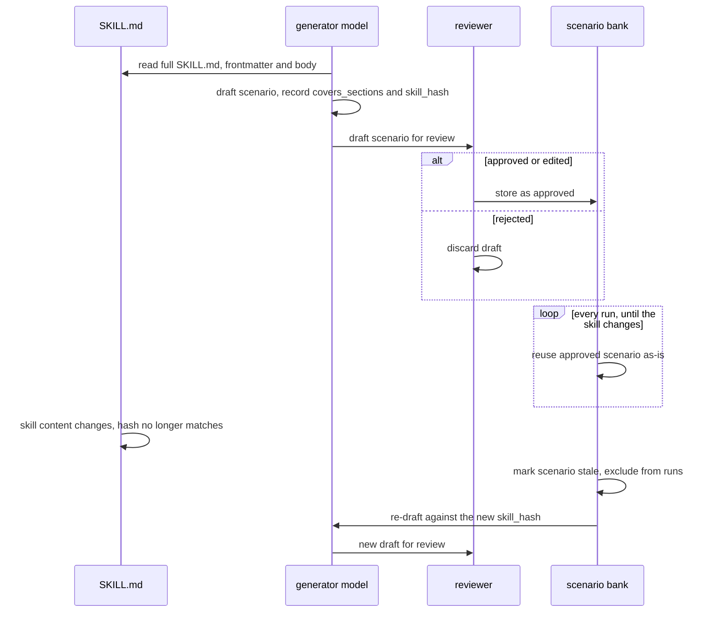
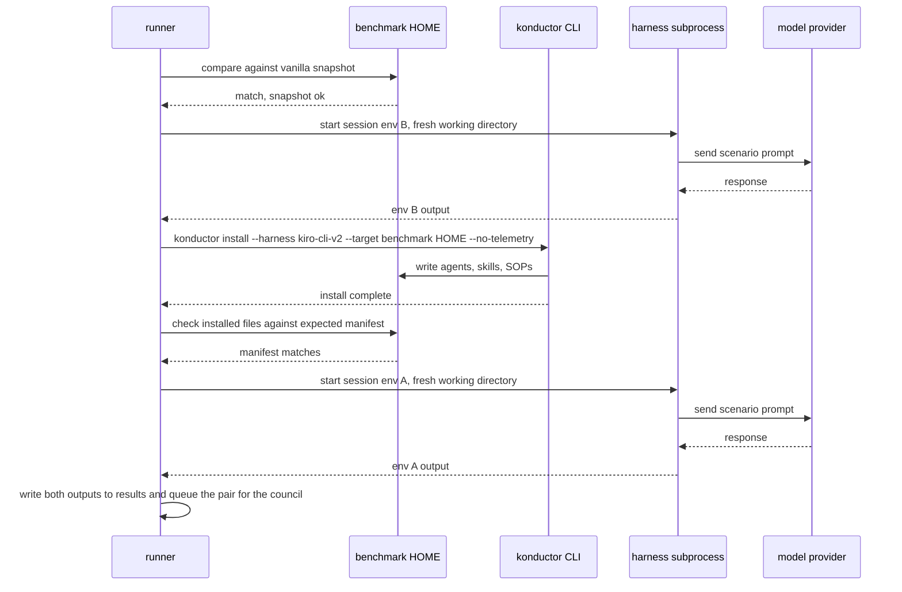
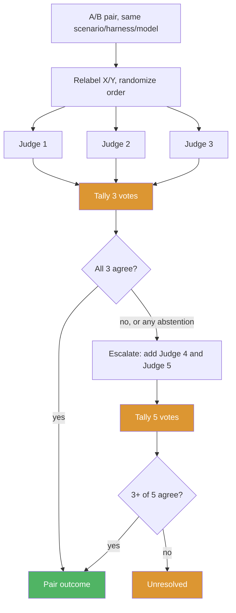
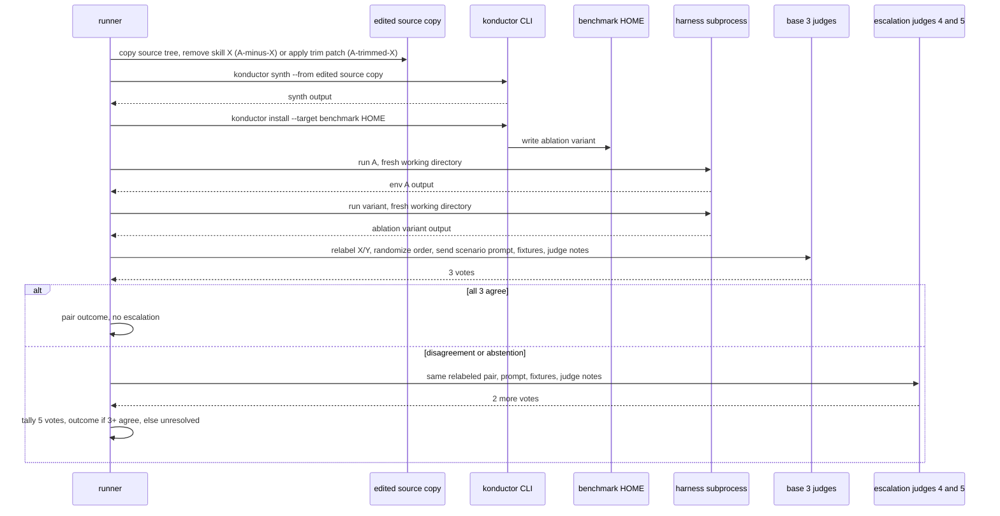

# Skill Benchmarking Framework Design

**Status:** Proposed
**Date:** 2026-09-29

## Problem

Konductor ships 82 skills under `skills/`. Nothing measures whether a skill earns its token cost, whether it activates when its own description says it should, or whether another skill already covers the same ground.

An existing harness lives under `tests/`: `scripts/benchmark.js` at the repo root, `tests/judges/claude-code-agent-runner.js`, `tests/registry.json`, and per-agent scenario sets in `tests/asdlc-*/`. It runs one subject model against hand-written scenarios and checks whether an agent passes them. It does not compare against a baseline and cannot attribute a result to one skill. This design replaces it rather than extending it: `tests/registry.json` has one record per scenario with a pass/fail field and no environment axis, so it has nowhere to hold a second environment's output, a pair verdict, or an ablation variant's identity. The run matrix, the two-stage screen-then-ablation structure, and the council judging need all three, so bolting them onto the existing schema would leave two incompatible formats side by side.

## Goals and Non-Goals

**Goals**

- Decide, per skill, whether to keep, prune, or trim it, backed by quality evidence rather than a description read.
- Cover more than one harness (Kiro CLI, Claude Code) and more than one model per harness, since a skill's effect can vary by both.
- Separate "does the whole Konductor stack help" from "does this one skill help," since the first cannot answer the second.
- Build the benchmark framework itself. None exists today: this project delivers the scenario generator, the environment runner, the council judge, and the report and plan renderers (see [Implementation Plan](#implementation-plan)).
- Build a reviewed scenario bank with test prompts and input fixtures for every skill, plus the prompt templates the generator and judges use.
- Treat skill coverage as more important than run cost. Cost is controlled through `repeats.ablation`, the models configured per harness, and `budget.max_runs`, never by dropping a scenario from a skill's coverage set. A candidate whose coverage set did not fully run is held at needs human review rather than decided on partial evidence; see [Run Cost](#run-cost) and [Verdict rules](#verdict-rules).

**Non-Goals**

- Running continuously or per commit. The framework runs on a configured cadence, not on every change.
- Weighting verdicts by real usage or invocation telemetry. Scenario evidence only, for now.

## Requirements

**Functional**

- Generate draft scenarios for every skill, review them once, and reuse the approved set on every run. A run needs no manual curation; a new or changed skill needs one review.
- Run a screening stage that compares a full Konductor environment against a vanilla baseline, per scenario, harness, and model.
- Select candidates from the screen using a fixed set of rules.
- Run an ablation stage for each candidate that isolates that one skill's effect.
- Judge every A/B pair blind and pairwise with a council of `council.size` (default 3) judges; on ablation, the deciding stage, escalate to `council.escalate_to` (default 5) judges when the base three disagree.
- Render a human-readable report and a plan a person can act on.

**Constraints**

- The corpus to benchmark is a parameter, `corpus_path`, defaulting to `skills/`.
- The model list per harness is config: `models.kiro` and `models.claude`, each defaulting to at least two models.
- Cadence is a `--frequency` flag, defaulting to monthly. A scheduled pipeline job invokes the runner with this flag on that cadence; a person can also invoke it manually between scheduled runs.
- Scenario counts are config: `scenarios.core`, defaulting to 3, is the core set size; `scenarios.min_coverage`, defaulting to 5, is the floor on the coverage set size. There is no upper cap on the coverage set.
- Council size is config: `council.size`, defaulting to 3, and `council.escalate_to`, defaulting to 5. Setting both to the same value gives a fixed-size council.
- A budget cap, `budget.max_runs`, bounds total runs per invocation and is the only limit on how large a coverage set can grow.
- Claude Code's model provider is config: `providers.claude`, either `bedrock` (default) or `anthropic`. Each council judge's provider is config too (see [Model access and credentials](#model-access-and-credentials)).

**Non-Functional**

- The rendered report follows the `humanize-writing` skill's conventions: no filler, no hedge words, no promotional language.

## Solution Overview


Two stages exist because they answer different questions. The screen compares the full Konductor stack (env A) against a vanilla harness with no Konductor install (env B). A difference there says the stack as a whole helps or does not, but env A and env B differ in the orchestrator agent and every skill at once, so a screen result cannot be pinned on one skill. Its only job is to narrow 82 skills down to a candidate list. The ablation stage then removes or trims one candidate at a time from a copy of env A and compares that copy against unmodified env A. Each ablation scenario invokes the specialist agent that owns the candidate skill directly (`k-architect` for `threat-modeling`, `k-developer` for `backend-development`, and so on), never the top-level `konductor` orchestrator, so the run does not depend on the orchestrator's own delegation choice: removing the skill cannot change which agent the scenario reaches, only what that named agent does with it. Before a pair counts as evidence, the runner checks the env A run's session log for a skill-load event naming the candidate skill (see [Open Questions](#open-questions) on log reliability); a run where the skill never loaded is excluded rather than counted as a "not worse" result. That combination, a fixed target agent plus a load check, is what isolates one skill's effect, and isolating that effect is what makes ablation, not the screen, the stage that decides prune, trim, or keep.

## How It Works

### Scenario generation

A scenario is more than a prompt. Many skills need something to work on: `code-review` needs a diff, `dynamodb-validation` needs a table design, `threat-modeling` needs a system description. Without that input, env A and env B both produce generic answers and the comparison says nothing. Each scenario therefore carries three parts:

- **Prompt.** The user request, written the way a developer would actually ask.
- **Fixtures.** Input files the run starts with, copied into the fresh working directory: a small repo, a diff, a design doc, a CloudFormation template. Fixtures live in a shared library under `benchmarking/fixtures/` so several skills can reuse one realistic project.
- **Judge notes.** What a strong answer covers for this task, drafted from a plain description of the task before the generator consults the skill's body, then reconciled against the skill's stated capabilities so nothing the task actually needs is missing. Judges see these notes alongside the two outputs. Drafting task-first, skill-second guards against the notes silently encoding the skill's own section headings and preferred structure as the definition of a good answer, which would score "looks like this skill's output" rather than "solves the task well." Judge notes go through the same review step as scenarios (see [Scenario generation](#scenario-generation)), reviewed as a distinct artifact alongside the scenario it belongs to. The goal is notes that describe the task, not the skill, so a vanilla output that covers the same points gets full credit.

Every skill gets two scenario sets, built at different times for different purposes:

- **Core set.** `scenarios.core` (default 3) scenarios: the skill's stated trigger, one realistic variation, and one near-miss. This set exists for every skill from the start and is what the screen runs against.
- **Coverage set.** Drafted only once a skill becomes a candidate (see [Verdict rules](#verdict-rules)). The generator first enumerates the skill's distinct capabilities from its body, modes, major sections, edge cases it calls out, then drafts one scenario per capability, plus one or two near-miss scenarios. The coverage set has a floor of `scenarios.min_coverage` (default 5) and no upper cap: a skill with more distinct capabilities gets more scenarios. When a skill has fewer distinct capabilities than the floor, the generator fills the remainder with additional realistic variations of an existing capability rather than inventing capabilities that are not there, so the floor never produces a scenario testing something the skill does not claim to do. The coverage set includes the core set rather than duplicating it. Ablation runs against the full coverage set, since deciding a skill's fate needs evidence against everything it claims to do, not just its headline trigger.

A near-miss scenario is a request that sounds related to the skill but that the skill should not act on. If the skill activates and changes its answer anyway, that is evidence of a skill that loads and adds token cost without helping the scenario it was tested on.

Scenarios are built in three steps:

1. **Draft.** A generator model reads the skill's full `SKILL.md`, frontmatter and body. For the core set, it drafts `scenarios.core` (default 3) scenarios using the templates in `benchmarking/prompts/generate-scenario.md`: one scenario that matches the skill's stated trigger, one realistic variation, and one near-miss. For the coverage set, drafted only for candidates, it first lists the skill's distinct capabilities (modes, major sections, edge cases called out in the body), then drafts one scenario per capability plus one or two near-miss scenarios. If that leaves fewer scenarios than `scenarios.min_coverage`, it drafts additional realistic variations of an existing capability, never a scenario for a capability the skill does not have, until the floor is met. Where two skills cover related ground (for example `dynamodb-design` and `dynamodb-validation`), it also drafts a shared overlap scenario marked `kind: overlap`, which feeds candidate rule (c). Each drafted scenario records which of the skill's `SKILL.md` sections it exercises, in `covers_sections`.
2. **Review.** A person approves, edits, or rejects each draft once, including the scenario's judge notes as part of that same review: a note that reads as skill-shaped rather than task-shaped is edited or rejected alongside the scenario it belongs to. Approved scenarios move into the scenario bank at `benchmarking/scenarios/bank/<skill>/`, which is checked in and versioned like any other source.
3. **Reuse.** Every run uses the approved bank as-is. Each bank entry records the content hash of the skill version it was written against. When a skill's hash changes, its scenarios are marked stale: they are excluded from runs and re-drafted for review, not scored against a skill they no longer describe.

Review burden stays manageable because the two sets are reviewed on different schedules. Core sets are reviewed once, up front, for every skill: 82 skills x 3 core scenarios each is 246 scenarios to review before Phase 6's full rollout. Coverage sets are drafted and reviewed only when a skill first becomes a candidate; after that initial review, only a changed skill's coverage set needs re-review.

The generator is never the only author. A scenario written purely from a skill's own text risks testing the skill against itself, and the review step is where a person catches prompts that only the skill could answer.

The sequence below traces one scenario's lifecycle: drafted, reviewed once, reused from the bank on every run, then marked stale and re-drafted when the skill it targets changes.



### Environments

Environments are states of one dedicated **benchmark HOME** per harness, toggled with the real `konductor install` and `konductor uninstall` commands. The benchmark HOME is never the developer's own HOME. It is created once, mode `0700`, and the harness is logged in there once. The design assumes that login persists across every toggle, on the reasoning that `uninstall` removes only the files its manifest tracks, but this is not verified against real Kiro CLI behavior (see [Open Questions](#open-questions)). If it turns out login does not survive a toggle, every env A or ablation-variant cycle on Kiro CLI needs a fresh login step, which changes the cost model in [Run Cost](#run-cost) (a login step per cycle instead of once per benchmark HOME) but not the run ordering or hygiene guarantees below, since a repeated login does not reintroduce any file the vanilla snapshot would catch. Each harness needs its own benchmark HOME because an install target is locked to one `--harness` value.

- **Env B (vanilla).** The benchmark HOME with no Konductor install, invoked through the harness's own default agent.
- **Env A (konductor).** The same HOME after `konductor install --harness <kiro-cli-v2|claude> --target <bench-home> --no-telemetry`, invoked through the `konductor` agent.
- **Ablation variants.** The runner copies the source tree to a temp directory and edits the copy. For `A-minus-X` it removes skill X and every reference to X in agent specs. For `A-trimmed-X` it applies the trim patch to X's `SKILL.md`. It then runs `konductor synth --from <tmp-src>` and installs that output into the benchmark HOME the same way as env A. An ablation run invokes the specialist agent that owns skill X directly (for example `k-architect` for `threat-modeling`), on both the unmodified-A side and the variant side of the pair, instead of the top-level `konductor` orchestrator: a scenario aimed at a named agent reaches that agent's skill set regardless of how `konductor` would have routed it, so removing or trimming X cannot change which agent runs the scenario. If synth fails on the edited copy, the candidate goes to needs human review. The temp source copy is deleted after the variant's runs finish.

**Vanilla snapshot.** Right after the one-time login, the runner records a manifest of the benchmark HOME: every path with its content hash, excluding the harness's own session history and cache directories. After every `uninstall`, the runner compares the HOME against that snapshot. Any leftover or missing file stops further runs on that benchmark HOME and marks the stage `partial`. Before every env A or variant run, it checks the installed files match the expected install manifest. No agents, skills, steering, or SOP files outside those two sets are allowed. This also catches content copied in from a developer's own `~/.kiro` or `~/.claude`.

The excluded session-history and cache directories are excluded by design, not verified clean: a harness's model-response cache, a local index cache, or an MCP server's state directory can persist across a toggle without appearing in any manifest mismatch. If such a cache carries content from one environment into the next on the same benchmark HOME, it biases results toward whichever environment ran first on that HOME. See **Run ordering** below for the mitigation this risk drives, and [Open Questions](#open-questions) for the exact cache paths still needing confirmation.

**Run ordering.** Runs are grouped by environment state so each state is installed once per harness: within one benchmark HOME shard, the runner randomizes whether env B or env A runs first (then installs and runs the other), rather than always running env B before env A, so a cache effect from the cache-exclusion risk above cannot systematically favor either side across shards. Each ablation variant still gets its own install, run, and uninstall cycle, in an order randomized the same way relative to unmodified env A within its shard. One benchmark HOME runs sequentially. For parallelism the runner shards cells across several benchmark HOMEs per harness, each with its own one-time login and snapshot.

**Per-run hygiene.** Every run starts a new session (no resume or continue flags) in a fresh, empty working directory. That keeps repo-level files such as `AGENTS.md` or `.konductor/memory/` out of the comparison, and stops one run's memory writes from reaching the next.

**Telemetry.** Benchmark installs pass `--no-telemetry`, and the runner sets `KONDUCTOR_TELEMETRY=off`, so thousands of install and uninstall cycles never reach Konductor's usage metrics.

Credentials follow the rules in [Model access and credentials](#model-access-and-credentials).

Trim variants are proposed by an LLM or a human as a patch stored alongside the ablation run. The council judges the outputs the patch produces, never the patch text itself.

The sequence below shows one screen cell (one scenario, harness, and model) on one benchmark HOME, covering both environments per the run ordering above. It shows env B running first, as one possible ordering: a vanilla-snapshot check, the env B run, install, a manifest check, then the env A run. On a different shard the randomized order reverses this, running env A first and then installing and running env B, with the same steps in between.



### Model access and credentials

Three callers need model access, and each gets its own credentials.

| Caller | Provider | Credential | How it is supplied |
|---|---|---|---|
| Claude Code, env A and env B | `providers.claude: bedrock` (default) | Short-lived AWS credentials from a dedicated subject role | Environment variables on the harness subprocess: `CLAUDE_CODE_USE_BEDROCK=1`, `AWS_REGION`, the temporary AWS keys, and the Bedrock model ID from `models.claude` |
| Claude Code, env A and env B | `providers.claude: anthropic` | Anthropic API key | `ANTHROPIC_API_KEY` on the harness subprocess, with the model from `models.claude` |
| Kiro CLI, env A and env B | Kiro's own backend | The Kiro CLI login | Assumed done once in each benchmark HOME and kept across install and uninstall toggles; not yet verified (see [Open Questions](#open-questions)) |
| Council judges | Per judge in `council.judges[]`: `bedrock` (default) or `anthropic` | Short-lived AWS credentials from a separate judge role, or an Anthropic API key | Held by the runner process only |

Rules:

- **Least privilege on Bedrock.** The subject role and the judge role each allow only `bedrock:InvokeModel` and `bedrock:InvokeModelWithResponseStream` on the model and inference-profile ARNs listed in config. The runner never copies a developer's `~/.aws` into a benchmark HOME.
- **Environment variables, not files.** Subject credentials reach the harness as subprocess environment variables, so nothing is written into a benchmark HOME that a transcript or artifact could capture. The Kiro CLI login is the exception: it lives in the benchmark HOME, which is why that HOME is mode `0700` and excluded from every artifact.
- **Judge credentials never reach a subject.** A subject model can run tools and read its own environment. Judge credentials are therefore never set on a harness subprocess.
- **Same provider on both sides.** Every run record carries harness, provider, and the resolved model ID. A pair is valid only if both sides match on all three. Bedrock and the Anthropic API can serve different versions of a model, so the report states the provider for each harness/model cell and the runner never mixes providers within a pair.
- **Anthropic-only customers.** With `anthropic` as the only judge provider, every judge, including any escalation judges, is a Claude model and the council is single-family. See [Council judging](#council-judging) for how the report flags this.

### Run matrix

The screen runs the core set: `scenarios.core x harnesses x models x 2 environments`, per skill. The ablation stage runs the full coverage set, per candidate: `that skill's coverage scenarios x harnesses x models x repeats.ablation x {A, ablation variant}`. `repeats.screen` (default 1) and `repeats.ablation` (default 2) exist because model output is nondeterministic and a single sample should not decide a prune. `repeats.ablation` is lower than the scenario count is high: more distinct coverage scenarios catch more of a skill's behavior than more repeats of the same one.

### Council judging



For each pair, both outputs are relabeled X/Y in randomized order with no indication of which side produced which. Each judge returns a preference (X, Y, or no meaningful difference), a strength (slight, clear, strong), and rubric scores for correctness, completeness, adherence to the request, and actionable detail. Every judge gets the same instructions from `benchmarking/prompts/judge-pair.md`, plus the scenario's prompt, its fixtures, and its judge notes, so every judge grades against the same description of a good answer.

The council starts at `council.size` (default 3) judges. Whether a pair resolves at that size, and how a resolved pair escalates, differs by stage:

- **Screen pairs.** Three judges, no escalation. The pair outcome is the preference held by at least two of the three live votes. Fewer than two live votes, two live votes that disagree, or a one-one-one split all count as unresolved. The screen only narrows the candidate list, so it does not pay for escalation.
- **Ablation pairs.** This is the deciding stage, so it escalates rather than accepting a split verdict. A pair resolves at three judges only if all three live votes agree. Any disagreement among the three, or any abstention, triggers escalation: two more judges are added, for `council.escalate_to` (default 5) total. The outcome is then the preference held by at least three of the five live votes; if no preference reaches three, the pair is unresolved. Escalation judges receive the same scenario prompt, fixtures, and judge notes as the base three, and the same relabeled X/Y order, so all five judges grade the identical presentation.

Setting `council.size` and `council.escalate_to` to the same value gives a fixed-size council with no escalation step.

The sequence below traces one ablation pair for a candidate skill X, from the edited source copy through to a resolved outcome. It shows the pipeline that the flowchart above starts partway through: how the pair the flowchart judges gets built, and where the base three's disagreement triggers the two escalation judges.



The base three judges are mixed-family and must include Opus. There is no exclusion rule barring a judge from grading output from a model in its own family. Both sides of every pair come from the same subject model, so any self-preference bias a judge carries applies equally to both sides of the pair it is judging; blind relabeling removes the position and identity cues a biased judge would otherwise use. The report calls out judge-versus-subject family in its metrics appendix and flags any skill where same-family and cross-family judges disagree.

**Anthropic-only customers.** With `anthropic` as the only judge provider, every judge is a Claude model and the council is single-family, including through escalation. The run proceeds, and the report marks the council as single-family so readers can weigh the self-preference risk described above. A single-family council that also escalated (base three disagreed) is downgraded to needs human review rather than resolved from the five-judge vote: escalation already means the base three could not agree, and a single-family panel is the case where that disagreement is least trustworthy as the tie-breaker.

### Verdict rules

A skill's ablation verdict is a deterministic rule applied to its resolved pair outcomes; the council decides each pair, the rule aggregates across pairs for one skill. The aggregation splits pairs by `kind` (from the [scenario record](#scenario-record)): `own` and `overlap` pairs measure whether removing the skill hurts on the scenarios it is supposed to help with, and `near_miss` pairs measure whether the skill correctly stays silent. A near-miss pair is near-guaranteed to read as "not worse," since neither side should have used the skill in the first place, so folding it into the same ratio as `own`/`overlap` pairs would make Prune and Trim easier to reach without saying anything about whether the skill helps where it should fire. Both conditions below must hold; a near-miss failure (the skill did activate and changed the ablated side's output) blocks a Prune or Trim verdict even if the `own`/`overlap` ratio passes.

- **Prune.** Both hold: the ablated variant (`A-minus-X`) is not worse in at least `thresholds.no_regression` (config, default 0.9) of resolved `own`/`overlap` pairs, with no pair showing env A strongly better; and at least `thresholds.no_regression` of resolved `near_miss` pairs show no difference between env A and `A-minus-X` (the skill did not activate on either side).
- **Trim.** The same two-part rule, applied against `A-trimmed-X` instead of `A-minus-X`. A trim candidate is valid only for `SKILL.md` sections that some coverage-set scenario's `covers_sections` named, and that the ablation showed were not needed. A section no scenario covered is reported as untested, not as a trim candidate: absence of evidence that a section helps is not evidence that it does not.
- **Keep.** Neither rule is met.
- **Needs human review.** More than `thresholds.max_unresolved` (config, default 0.2) of the skill's pairs are unresolved or `run_failed`, the skill's coverage set did not finish running (see [Run Cost](#run-cost)), or any resolved pair was decided by a single-family council after escalation (see [Council judging](#council-judging)). Coverage always outranks cost: a skill in this state is never decided on the partial evidence it has.

These three defaults (`thresholds.no_regression` at 0.9, `thresholds.max_unresolved` at 0.2, and `thresholds.skill_tokens` at 2,000, used by candidate rule (d) below) are rationale-backed starting points, not measured values: they exist so the rule has a concrete boundary to review before Phase 4, and the Phase 1 pilot is expected to revise them once real pair outcomes exist to check them against.

A pair counts toward any of the ratios above only if the env A side's session log shows a skill-load event naming skill X; a run where the log shows no load is excluded rather than counted as "not worse," since an unloaded skill cannot have been isolated by the ablation (see [Open Questions](#open-questions) on how reliable that log evidence is per harness and model).

Within one candidate's coverage set, `repeats.ablation` (default 2) samples the same `(scenario, harness, model)` cell more than once. If a scenario's repeats resolve to different pair outcomes (for example, one repeat reads "not worse" and the other reads "env A better"), the runner does not fold both into the ratio as ordinary independent votes: it flags that scenario in the report as repeat-unstable, alongside its resolved outcomes, so a person can distinguish a scenario that is genuinely borderline from one where two judged repeats simply landed differently. Both repeats still count toward `thresholds.max_unresolved` and the Prune/Trim ratios; the flag is additional, not a substitute for aggregation.

Candidate selection into the ablation stage uses screen results, which are evaluated against the core set only, and is separate from this verdict rule. A skill becomes a candidate if any of the following fire on the screen:

- (a) The skill did not activate in env A on its own scenarios.
- (b) Env A is not better than env B on the skill's scenarios.
- (c) A different skill activated on the skill's scenarios (an overlap prompt fired the wrong skill, or two skills both fired).
- (d) The skill's size exceeds a configured token threshold, `thresholds.skill_tokens` (config, default 2,000 tokens for the rendered `SKILL.md` body), a trim candidate specifically.

Any single rule firing is enough to make a skill a candidate. Only ablation results, never screen results, feed plan actions.

## Run Cost

Screen runs = `skills x scenarios.core x harnesses x models_per_harness x 2 environments`. Screen judge calls = `pairs x council.size`, where a pair is one screen `(scenario, harness, model)` env A/env B comparison and the screen never escalates.

Illustrative example, not a target: 82 skills x 3 core scenarios = 246 scenarios. With 2 harnesses and 2 models per harness, that is 984 (scenario, harness, model) cells. Each cell runs in both environments, so 984 x 2 = 1,968 screen runs. Each cell is also one A/B pair, so 984 pairs x 3 judges = 2,952 screen judge calls.

Ablation runs = `candidates x that skill's coverage scenarios x harness-model cells x repeats.ablation x 2 (A and ablation variant)`. Ablation judge calls = `pairs x council.size`, plus 2 extra judges for every pair that escalates.

Illustrative example, not a target: 20 candidates x an average of 8 coverage scenarios = 160 scenarios. With 4 harness-model cells and `repeats.ablation` of 2, that is 160 x 4 x 2 = 1,280 pairs. Each pair runs against both sides (A and the ablation variant), so 1,280 x 2 = 2,560 ablation runs. Base judge calls are 1,280 pairs x 3 judges = 3,840. Assuming, illustratively, that 20 percent of pairs escalate: 1,280 x 0.20 = 256 pairs escalate, each adding 2 extra judges, so 256 x 2 = 512 escalation judge calls. Ablation judge calls total 3,840 + 512 = 4,352.

Combined illustrative totals: 1,968 + 2,560 = 4,528 runs, and 2,952 + 4,352 = 7,304 judge calls.

For comparison, a fixed five-judge council with no screen-stage saving on the same example would cost 984 x 5 + 1,280 x 5 = 4,920 + 6,400 = 11,320 judge calls, against this design's 7,304. The escalation rate assumed above, 20 percent, is illustrative only; the actual rate must be measured on the Phase 1 pilot before it is used to size a real run.

`budget.max_runs` caps total runs per invocation, defaulting to 6,000: enough to cover the combined illustrative total of 4,528 runs above with headroom for retries, without being large enough to let a single invocation run unbounded. On hit, the runner stops dispatching new runs, marks the current stage `partial`, and judges whatever finished. Any skill whose ablation is incomplete when the cap hits is held at needs human review rather than judged on partial evidence.

## Failure Handling

- A run against any environment gets one retry on timeout or crash; a second failure marks that run `run_failed` rather than omitting it.
- A failed `konductor install` or `uninstall`, or a vanilla-snapshot mismatch after uninstall, stops every remaining run on that benchmark HOME and marks the stage `partial`. The runner does not hand-delete leftover files; a person restores the HOME, since a silent cleanup would hide an uninstall bug.
- A council member that times out or returns an unparseable response is recorded as an abstention, not excluded from the pair's denominator. On an ablation pair, an abstention among the base three counts as a disagreement and triggers escalation the same as a split vote.
- A screen pair with fewer than two live votes, or with two live votes that disagree, is unresolved. An ablation pair that does not resolve at three judges and then fails to reach three of five after escalation is unresolved. Both are unresolved regardless of cause.
- A scenario whose source skill's content hash no longer matches at run time is excluded as `stale_snapshot` and regenerated on the next run.
- Each stage writes its own `status` (`ok`, `partial`, `failed`) and `duration_seconds` on completion.
- Process exit code is `0` for `ok` or `partial`, non-zero for `failed`.
- Each stage writes its output before the next stage starts, so a run is resumable from the last completed stage rather than restarting from scratch.
- `budget.max_runs` bounds cost, never coverage. When the cap stops a candidate's ablation before its coverage set finishes, that candidate goes to needs human review, the same outcome as an unresolved-pair ratio breach in [Verdict rules](#verdict-rules), and is never decided on the partial evidence it collected.

## Artifacts

### Directory layout

```
benchmarking/
├── prompts/
│   ├── generate-scenario.md         # generator templates
│   └── judge-pair.md                # judge rubric and instructions
├── fixtures/                        # shared input projects, diffs, docs
├── scenarios/
│   ├── bank/
│   │   └── <skill>/*.yaml           # reviewed, versioned scenarios
│   └── YYYY-MM/
│       ├── scenarios.json           # the bank entries used by this run
│       └── corpus-snapshot.json
├── results/
│   └── YYYY-MM/
│       ├── screen/
│       ├── ablation/
│       │   └── <skill-path-slug>/
│       └── council-votes.json
├── reports/
│   └── YYYY-MM-report.md
├── plans/
│   └── YYYY-MM-implementation.json
└── scripts/                         # the framework, built in Phases 1 to 5
    ├── generate-scenarios.*
    ├── run-screen.*
    ├── run-ablation.*
    ├── tally-council.*
    └── render-report.*
```

The framework under `scripts/` does not exist yet; the [Implementation Plan](#implementation-plan) builds it. `prompts/`, `fixtures/`, and `scenarios/bank/` are checked in. Run output under `results/`, `reports/`, and `plans/` is generated.

### Scenario record

| Field | Type | Meaning |
|---|---|---|
| `scenario_id` | string | stable ID, `<skill>-NNN` |
| `skill` | string | source skill path, or a list of paths for `overlap` |
| `set` | string | `core` or `coverage` |
| `kind` | string | `own` (single-skill scenario), `overlap` (shared across a skill cluster), or `near_miss` (should not trigger the skill) |
| `prompt` | string | the user request text |
| `fixtures` | list of paths | files under `benchmarking/fixtures/` copied into the run's working directory |
| `judge_notes` | string | what a strong answer to this task covers, shown to judges |
| `covers_sections` | list of strings | the `SKILL.md` headings this scenario exercises |
| `skill_hash` | string | content hash of the skill version the scenario was written against |
| `status` | string | `draft`, `approved`, or `stale`; runs use `approved` only |
| `reviewed_by` | string | who approved it |

### Report

```markdown
# Skill Benchmark Report: <Month Year>

## Summary
- Skills screened: N
- Candidates selected: N
- Recommended for pruning: N
- Recommended for trimming: N
- Needs human review: N

## Recommendations

### Prune: <skill-name>
- Screen candidate rule(s) fired: <a/b/c/d>
- Ablation evidence: N of M resolved pairs not-worse, 0 pairs strongly-better-A
- Coverage scenarios run: N
- Justification: <one paragraph>

### Trim: <skill-name>
- Affected lines: L<start>-L<end>
- Ablation evidence: N of M resolved pairs not-worse against the trimmed variant
- Coverage scenarios run: N
- Sections trimmed: <headings, each covered by a scenario and shown not needed>
- Sections untested: <headings no coverage scenario exercised, not claimed as safe to trim>
- Justification: <one paragraph>

## Needs Human Review
- <skill-name>: reason (unresolved-pair ratio, run_failed ratio, or incomplete ablation)

## Metrics Appendix
| Skill | Verdict | Core Scenarios | Coverage Scenarios | Screen A-vs-B | Ablation Pairs (resolved/unresolved) | Escalated Pairs | Token Delta (A vs B, per harness/model) | Same-Family vs Cross-Family Judge Agreement |
|---|---|---|---|---|---|---|---|---|

Any skill whose coverage-set scenario count exceeds `scenarios.review_flag` (config) is flagged here as a possible split candidate: a skill that broad usually covers ground better split into two.
```

### Implementation plan

The plan is prose, not JSON: one entry per ablation-confirmed prune or trim action, naming the skill path, the action, a reference to the trim patch where applicable, and a short evidence summary tying back to the ablation pairs that produced it. A candidate that never reached ablation, or that landed at needs human review, has no entry. Field-level schema for a machine-readable version is a Phase 5 deliverable, not fixed here.

Any consumer of this plan must default to dry-run and require explicit per-entry confirmation before applying a change. There is no auto-execution path in this design.

## Threat Model

This is a local batch tool with no external attacker surface beyond one real trust boundary.

**Assets:** `scenarios.json` and `corpus-snapshot.json`, raw screen and ablation results, `council-votes.json`, the rendered report, and the implementation plan.

**Trust boundaries.** The model-provider APIs (Amazon Bedrock, the Anthropic API, and Kiro's backend) are the untrusted boundary: every run and every council vote crosses into a third-party model, and the response text is untrusted content the framework does not control. Inside the local run, the harness subprocess is less trusted than the runner, because the subject model can execute tools there. The local run directory, from scenario generation through report rendering, is a trusted channel between stages, protected by corruption controls rather than an adversary model.

| Threat | Impact | Mitigation |
|--------|--------|------------|
| Prompt injection from a `SKILL.md` or from a subject model's own output, aimed at a judge | A skill author or a subject model's output steers a judge away from an accurate verdict | Both outputs are passed to judges as delimited data blocks with an explicit instruction to treat their content as data, not instructions; judging uses rubric scores, not free-form judge reasoning alone; a pair where either output contains judge-directed text is flagged in the report; every plan action still requires human confirmation regardless of vote outcome. Relabeling randomizes which side a judge sees as X or Y; it does not prevent injected text from being read by the judge in the first place. |
| Environment contamination (env B, an ablation copy, or env A itself carries files it should not) | The comparison for that run is invalid | The runner compares the benchmark HOME against the vanilla snapshot after every uninstall and against the expected install manifest before every env A or variant run; any mismatch stops that HOME's queue. Every run uses a fresh working directory and a new session, so no repo files or prior session state carry over |
| Subject credential exposure | A subject model reads its Bedrock credentials or API key through a tool call and they end up in a transcript or artifact | Credentials are short-lived and scoped to invoking the configured models only; they are passed as subprocess environment variables, not files; the benchmark HOME is mode `0700` and never included in an artifact; transcripts are scanned for credential patterns before being written under `results/`, and a match is redacted and flagged |
| Judge credential exposure | A subject model gains access to the judge role and can call judge models directly | Judge credentials live only in the runner process and are never set on a harness subprocess; the judge role is separate from the subject role |
| Overly broad AWS access | A developer's full `~/.aws` profile is used for runs | The runner uses dedicated subject and judge roles with `bedrock:InvokeModel` and `bedrock:InvokeModelWithResponseStream` on listed ARNs only, and never copies `~/.aws` into a benchmark HOME |
| Cost overrun | Unbounded spend on model calls | `budget.max_runs` caps total runs per invocation; on hit the stage is marked `partial` and dispatch stops |
| Accidental artifact corruption | A downstream stage reads a partial or malformed prior-stage file | Content hashes on the scenario snapshot, and a `status` field per stage, let a resumed run detect and skip a corrupted or incomplete prior stage instead of proceeding on bad data |
| Unsafe plan execution | An automated consumer applies a prune or trim without review | The plan format requires dry-run by default and explicit per-entry confirmation; there is no auto-execution path |

## Architecture Decision Records

### ADR-1: Three-judge council with escalation to five

#### Status

Accepted

#### Context

A single judge's verdict cannot express disagreement. Two reasonable judges can read the same pair and land on different sides; averaging that away hides the exact signal this framework needs to surface, and one judge's blind spot goes undetected. A fixed five-judge council catches that, but pays the full five-judge cost on every pair, including the pairs where three judges already agree and a fourth or fifth opinion would not change the outcome.

#### Decision

Every pair is judged blind and pairwise, starting with three council members, each voting independently with a stated preference and strength. On the screen, three judges are final: the pair outcome is the preference held by at least two of the three live votes, and the screen never escalates. On ablation, the deciding stage, a pair resolves at three only if all three agree; any disagreement or abstention escalates to five judges total, and the outcome becomes the preference held by at least three of the five. Verdicts aggregate per skill across its resolved pairs.

#### Alternatives Considered

| Option | Pros | Cons | Why Not Chosen |
|---|---|---|---|
| Single judge | Cheapest | Cannot capture disagreement; one judge's blind spots go undetected | Rejected: hides the disagreement signal the framework exists to surface |
| Fixed council of five | Surfaces disagreement; no single model's blind spot decides a skill's fate | Five times the judgment cost of one judge on every pair, even the ones three judges already agree on | Rejected as the default: pays the escalation cost on pairs that never needed it |
| Fixed council of three | Cheaper than five on every pair | A close 2-1 split on the deciding ablation stage gets treated the same as unanimous agreement, with no extra scrutiny | Rejected as the default for ablation: the deciding stage needs more evidence exactly when the three judges disagree |
| Three judges with escalation to five (chosen) | Cheap when three judges agree; automatically buys more evidence exactly on the pairs where they do not | Adds an escalation branch to the judging logic and to reporting | Not applicable, this is the chosen option |

#### Consequences

**Good:** Disagreement among the base three is visible and triggers escalation instead of being silently averaged into a single number. No single judge model can unilaterally decide a skill's fate, and the framework only pays for a fifth and fourth judge on the pairs that actually need them.

**Bad:** Judgment cost still reaches five times a single judge's on any pair that escalates. Accepted because the framework runs at a monthly-scale cadence, not per commit, and escalation is the exception rather than every pair.

**Neutral:** The report and plan both need an explicit unresolved and needs-human-review state, plus an escalated-pair count, rather than always producing a clean verdict.

### ADR-2: Screen with Konductor versus vanilla, decide with per-skill ablation

#### Status

Accepted

#### Context

Comparing the full Konductor stack against a vanilla baseline is cheap relative to testing every skill individually, but a screen result cannot be attributed to one skill: env A and env B differ in the orchestrator agent and all 82 skills at once. Deciding a prune or trim needs a result isolated to one skill.

#### Decision

Use the Konductor-versus-vanilla screen only to select candidates, via the four candidate rules. Decide each candidate's fate with a second, isolated ablation stage that compares unmodified env A against a copy with only that one skill removed or trimmed.

#### Alternatives Considered

| Option | Pros | Cons | Why Not Chosen |
|---|---|---|---|
| Screen, then per-candidate ablation (chosen) | Cheap first pass narrows scope; ablation isolates one skill for an actual decision | Two stages instead of one | Not applicable, this is the chosen option |
| Env A versus env B only, no ablation | Single stage, cheapest | Cannot attribute any result to one specific skill | Rejected: cannot answer the question the framework exists to answer |
| Description-derived pass or fail | No second environment needed at all | Circular: the scenario is generated from the description, so matching it back mostly checks the scenario generator, not the skill's real effect on output | Rejected: does not measure output quality |
| Leave-one-out ablation for all 82 skills up front | Directly isolates every skill's effect, no screen needed | Cost scales with the full skill count before any narrowing; prohibitively expensive at 82 skills across a harness/model matrix | Rejected as the primary path on cost; retained, but only for the already-narrowed candidate set from the screen |

#### Consequences

**Good:** The prune and trim verdicts are grounded in a result isolated to one skill, not a whole-stack comparison.

**Bad:** A skill can pass the screen's candidate rules yet still be worth keeping once ablation isolates it, so some ablation runs confirm a keep rather than a prune. This is the intended trade for correctness.

**Neutral:** The screen's per-skill signal is diagnostic input to candidate selection, not a verdict in its own right, so the report needs to state clearly which numbers come from which stage.

### ADR-3: Directory layout by lifecycle

#### Status

Accepted

#### Context

Scenario generation, screen and ablation results, and the two rendered output artifacts have different reuse needs. Scenarios can be reused across a re-score; results are tied to one run; reports and plans are the final, dated artifacts a person reads.

#### Decision

Three top-level directories, each keyed by `YYYY-MM/` where applicable: `scenarios/` for generator output, `results/` for screen and ablation output, and `reports/` plus `plans/` for the final artifacts, named by date rather than nested in a date directory.

#### Alternatives Considered

| Option | Pros | Cons | Why Not Chosen |
|---|---|---|---|
| Separate by lifecycle (chosen) | Scenarios reusable across a re-score without duplicating them | One more top-level directory to track | Not applicable, this is the chosen option |
| Single flat run directory with everything inside | Simpler at a glance | Re-judging the same scenario set (a new council member, retrying failed pairs) means duplicating scenarios or breaking the one-run-one-directory convention | Rejected: couples scenario reuse to result lifecycle for no benefit |
| No date partitioning, overwrite each period | Fewest files on disk | Loses the ability to compare a skill's verdict period over period, which is a reason to run this on a cadence at all | Rejected: destroys the trend signal the cadence exists to produce |

#### Consequences

**Good:** A scenario set can be re-judged (new council member, retried pairs) without regenerating it.

**Bad:** `corpus-snapshot.json` inside `scenarios/YYYY-MM/` has to independently track a content hash per skill, since `skills/` itself carries no date.

**Neutral:** Report and plan filenames carry the date instead of a directory; a minor convention to keep consistent going forward.

## Implementation Plan

| Phase | Scope | Depends on | Exit Criteria |
|---|---|---|---|
| Phase 0 | Remove the existing harness: the `tests/` subsets used only by it, `tests/judges/`, `tests/registry.json`, `scripts/benchmark.js` | None | Old harness files removed; no other package references them |
| Phase 1 | Scenario bank: generator and judge prompt templates, the shared fixture library, the draft generator, and the review workflow | None | A pilot set of 10 skills, chosen to span the skill categories, each has `scenarios.core` approved core-set scenarios with fixtures and judge notes |
| Phase 2 | Framework runner: benchmark HOME setup (one-time login, vanilla snapshot), install/uninstall toggling with snapshot checks, ablation variant synth from an edited source copy, provider config and credential handling, and the run matrix | Phase 1 | A screen run executes the pilot core-set scenarios for at least one harness x model cell in both environments, with snapshot checks passing, for both `providers.claude` values |
| Phase 3 | Council judging: the judge prompt, per-pair aggregation, the screen's live-vote and unresolved rules, and the ablation stage's escalation and unresolved rules | Phase 2 | The pilot screen produces pair outcomes, with correct unresolved handling for a synthetic one-one-one split, and a synthetic pilot ablation run correctly escalates a disagreeing three-judge pair to five and resolves it |
| Phase 4 | Candidate selection against the four rules; drafting and reviewing coverage-set scenarios for each pilot candidate; ablation runs for both prune and trim variants against the full coverage set | Phase 3 | At least one pilot candidate has an approved coverage set meeting the `scenarios.min_coverage` floor, and an ablation run against it executes for both `A-minus-X` and `A-trimmed-X`, producing a verdict via the deterministic rule |
| Phase 5 | Report and plan rendering, including the field-level plan schema | Phase 4 | A pilot report matches the report skeleton in this design; a generated plan defaults to dry-run and requires per-entry confirmation |
| Phase 6 | Full rollout: approved core-set scenarios for all 82 skills, and a `corpus_path` check | Phase 5 | A full screen run completes within `budget.max_runs`, and a run against a non-default `corpus_path` produces the same artifact shapes as a `skills/` run |

Phases 1 through 6 build the framework and the scenario bank; sizing each into task-level tickets happens in a later pass. The pilot keeps early runs cheap and lets the prompt templates, fixtures, and judge instructions be tuned on 10 skills before they are applied to all 82.

## Decision Requested

1. Approve deleting the existing harness (`tests/` subsets, `tests/judges/`, `tests/registry.json`, `scripts/benchmark.js`) as Phase 0, independent of when the rest of this design lands.
2. Approve this target design: a two-stage benchmark that screens Konductor against a vanilla baseline to select candidates, then decides each candidate's fate with an isolated ablation run judged by a council that starts at three judges and escalates to five on disagreement, producing a report and a human-confirmed implementation plan.

## Open Questions

- Where does Kiro CLI store its login, and does it survive `konductor uninstall` untouched? The design assumes yes, because uninstall removes only manifest-tracked files, but this is not verified.
- Which directories do Kiro CLI and Claude Code use for session history and caches? They are excluded from the vanilla snapshot, so the exact paths need confirming.
- Does `konductor uninstall` also honor the target's telemetry opt-out, or does the runner rely on `KONDUCTOR_TELEMETRY=off` alone?
- Should `providers.claude` also support other gateways customers use for Claude (for example Google Vertex AI), or only Bedrock and the Anthropic API?
- Is the Kiro CLI skill-load evidence in session logs reliable enough to use as candidate rule (a) and (c) evidence, and as the ablation-pair load check in [Verdict rules](#verdict-rules), or does it need a dedicated log level?
- What is the vanilla Kiro CLI installation's default agent name? Not asserted as fact in this design.
- Is the Claude Code `Skill` tool-call event reliable across every subject model in `models.claude`, or only some?
- Are trim variants written by an LLM, a human, or either, and does that choice affect how much a confirmed trim can be trusted?
- What are the default values for `thresholds.no_regression`, `thresholds.max_unresolved`, and the token-size threshold behind candidate rule (d)? This design now proposes 0.9, 0.2, and 2,000 tokens respectively (see [Verdict rules](#verdict-rules)) as rationale-backed starting points; whether they are the *right* values is still open until the Phase 1 pilot's real pair outcomes can check them.
- What is the default value for `budget.max_runs`, and does it vary by cadence? This design now proposes 6,000 (see [Run Cost](#run-cost)), sized against the illustrative 4,528-run example with retry headroom; whether that holds for a real corpus and cadence is still open.
- What default value should `scenarios.review_flag` use for flagging a skill's coverage set as a possible split candidate? No default is proposed in this design.
- Is a floor of 5 for `scenarios.min_coverage` right, or should it scale with a skill's actual capability count?
- The 20 percent ablation-pair escalation rate used in [Run Cost](#run-cost) is illustrative only. What is the real escalation rate, and does it justify the design's cost savings over a fixed five-judge council? This must be measured on the Phase 1 pilot before it is used to size a full run.
