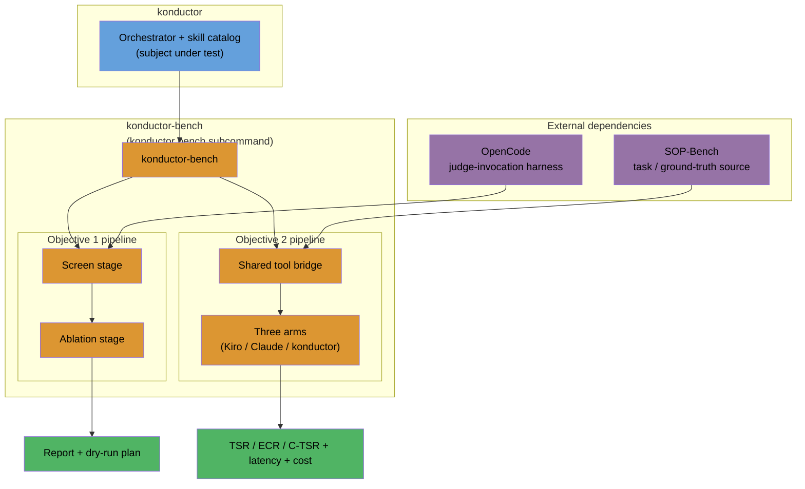
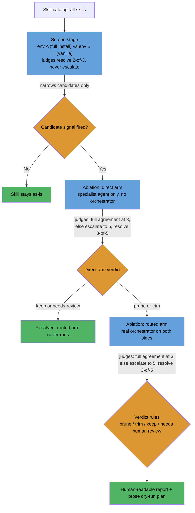
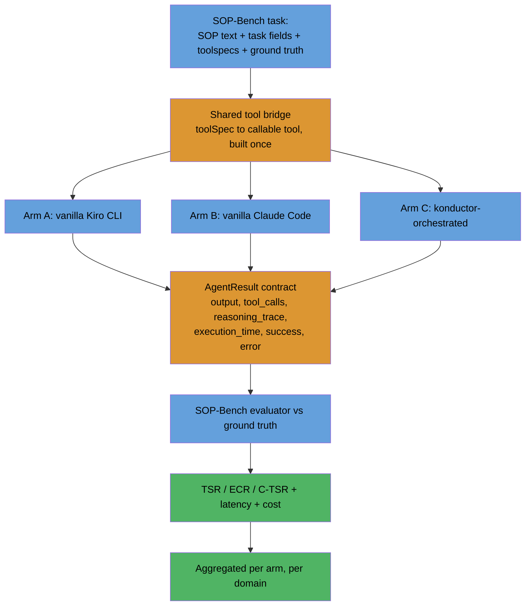
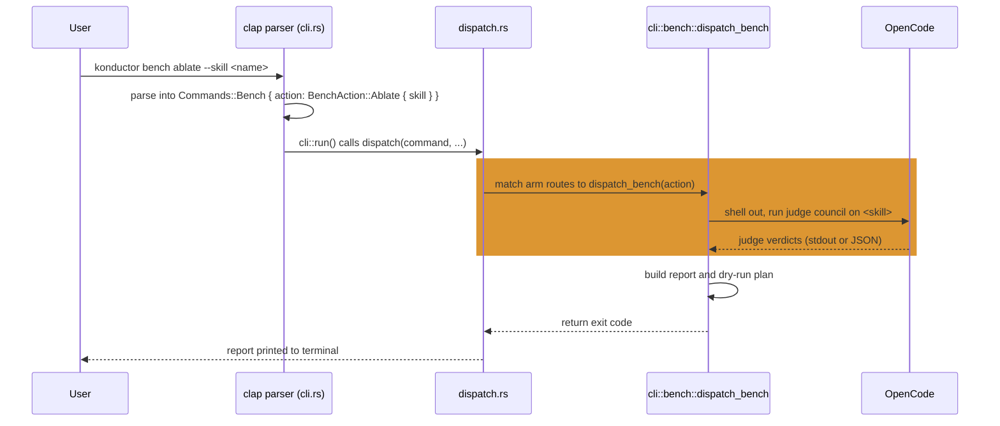

# Skill Benchmarking Design

## Problem

Konductor ships 82 skills under `skills/`, and nothing measures whether any one of them earns its token cost or duplicates another skill's coverage: deciding what to prune or trim today means reading descriptions, not evidence. Separately, konductor has no answer to a more basic question: does routing a task through its orchestrator and specialist agents actually outperform handing the same task to a vanilla Kiro CLI or vanilla Claude Code session with no konductor skills loaded at all. This design covers both: a decision framework for which skills to prune or trim, and a methodology for measuring whether the orchestration layer itself is worth it.

## Requirements

- Must measure, per skill, whether its token cost is earned by evidence rather than by reading its description (Objective 1).
- Must support cross-family judge independence, so no single model family's bias decides a skill's fate (Objective 1 judging).
- Must produce a prune, trim, or keep verdict backed by a direct-arm and routed-arm ablation, not a single-pass guess (Objective 1).
- Must produce an objective, ground-truth-anchored score comparison between konductor's orchestration and vanilla Kiro CLI and vanilla Claude Code sessions (Objective 2).
- Must ship as a runnable konductor component, under `konductor bench`, usable by any konductor user against their own install, not a one-off internal exercise. This requirement is fully met starting Implementation Plan Phase 4; Phases 1-3 validate the underlying mechanism outside the real CLI surface first, by deliberate sequencing, not as a gap.
- Must default every automated change to dry-run and no-auto-execution, requiring explicit human confirmation before anything touches disk.
- Must track cost and latency alongside correctness, since a correctness win alone is not a sufficient basis for a verdict.

## Solution Overview

Two independent mechanisms, not one system, so there is no single architecture diagram that covers both: each gets its own flow diagram below. Objective 1 is a screen-then-ablate pipeline that turns 82 skill descriptions into evidence-backed prune, trim, or keep verdicts, judged by an LLM council rather than a single model's opinion. Objective 2 is a three-arm comparison, scored against SOP-Bench's own ground truth, that answers whether konductor's orchestration actually beats a vanilla CLI session on real tasks. They share no code path and answer different questions; see "Relationship between the two objectives" below for exactly how they relate. Both ship as part of konductor itself, behind a `konductor bench` subcommand any konductor user can run against their own install, not as a one-off internal exercise run by a single team.

## Decision Requested

Approval to build and run both mechanisms: the screen-then-ablate skill audit, so skill prune/trim decisions stop being a read-and-guess exercise, and the SOP-Bench three-arm pilot, so konductor has a ground-truth-anchored, corroborating signal on a narrower question than a full tool-clutter-penalty claim: whether konductor's bundled orchestrator-plus-skill-catalog system beats a single-shot vanilla baseline, within the isolated-environment scope this design actually tests (see "The hypothesis" below for why this is narrower than the clutter-penalty claim the pilot cannot measure, and "Relationship between the two objectives" below for why this signal corroborates rather than settles the question on its own).

This ask carries two explicit caveats, and the approver should weigh both.

First, a tool-drop caveat on Objective 2's orchestration-value claim: Arm C's own invocation drops `Glob`, `Grep`, `WebSearch`, and `TodoWrite` from the running agent regardless of frontmatter. `Skill` and `Agent` (subagent delegation) are preserved and confirmed working: a verification run against this exact invocation, using a konductor-derived orchestrator agent-spec with both `Agent(...)` delegation and `Skill` declared among its tools, through this repository's own `tests/judges/claude-code-agent-runner.js:runClaudeTurn()` harness, produced a raw stream-json trace showing a real `Skill` tool-call followed by a real `Agent` tool-call and a confirmed subagent handback (see "The hypothesis" below for the full quoted tool-call shapes). This confirms dispatch-and-handback only, not full tool retention during real subagent work, since the test task required no tool use by the subagent itself; nor is the test agent-spec confirmed identical to Arm C's actual production invocation (see "The hypothesis" below and Open questions). Whether this gap materially affects the skills exercised in the pilot's chosen domains is an open assumption carried into this ask, not a confirmed finding (see Open questions).

Second, a methodology-transfer caveat: the design's core methodology, using SOP-Bench's single-agent benchmark design to judge a multi-agent orchestration layer's value-add, is a working hypothesis, not a validated methodology (see "The hypothesis" and "Relationship between the two objectives" below).

Third, a judge-reliability caveat on Objective 1's own ablation-resolution mechanism: 2 of the 3 base-panel judge seats, GPT-6 Astra and Claude Opus 5.5, are not yet reliability-tested on this specific harness (see "Judging" below); only Grok 4.7 has a confirmed reliability-check pass today, valid for its actual routing path through OpenCode's direct xAI provider access rather than Bedrock (see "Judging" below). Objective 1's ablation-resolution mechanism depends on all three base-panel seats passing that check before a run can lean on full-agreement resolution (see "Judging" and Implementation Plan Phase 1's exit criterion), and no verdict produced by that mechanism should be trusted until this is resolved.

Both mechanisms carry real API/Bedrock cost and need a separate go-ahead before any task actually runs; see "Minimal pilot" below for the specific items gated on that approval.

## Architecture



This is the one place showing how konductor, konductor-bench, and its two external dependencies fit together; the per-objective diagrams below go into the detail this one deliberately leaves out.

| Layer | Component | Depends on | Produces |
|---|---|---|---|
| Subject under test | konductor (orchestrator + skill catalog) | (none) | (none) |
| Dispatcher | konductor-bench, via `konductor bench` | konductor | (none) |
| Objective 1 pipeline | Screen stage, then Ablation stage | OpenCode (judge-invocation harness) | Report and dry-run plan |
| Objective 2 pipeline | Shared tool-bridge, then three arms | SOP-Bench (tasks and ground truth) | TSR, ECR, C-TSR, latency, cost per arm per domain |

## How It Works

### Objective 1: Skill prune/trim decisions



This mechanism has a limitation worth stating plainly: scenario-based ablation measures whether a skill performs its stated capabilities, not whether those capabilities are what users actually need day-to-day. A skill can score well here while rarely mattering in practice.

#### Screen stage

A cheap, whole-install comparison: the full konductor install (env A) against a vanilla harness with no konductor skills (env B), run across every skill's core scenarios. This is whole-stack, not skill-scoped. Env A and env B differ in every skill and the orchestrator at once, so a screen result can't be pinned on one skill's own content. The screen's only job is narrowing 82 skills down to a candidate list. It never makes a final prune, trim, or keep decision on its own.

A skill becomes a candidate if any of these fire:

- It didn't activate in env A on its own scenarios.
- Env A isn't better than env B on the skill's scenarios.
- Another skill activated instead of it (overlap).
- Its rendered `SKILL.md` exceeds a configured token threshold.

#### Ablation stage

Per-skill isolation, in two arms:

- **Direct arm.** Invokes the specialist agent that owns the skill (e.g. an architecture agent for `threat-modeling`), never the orchestrator. Removing the skill can't change which agent runs the scenario, only what that agent does with it.
- **Routed arm.** Invokes the real konductor orchestrator on both sides. It only runs if the direct arm's result is prune or trim. If the direct arm says keep, the routed arm never runs.

The direct arm runs first and resolves keep or needs-human-review on its own evidence. If it resolves to prune or trim, the routed arm checks whether that effect survives real routing, not just the specialist agent in isolation.

#### Judging

An LLM-judge council, not a single model. The base panel is 3 judges: Claude Opus 5.5, GPT-6 Astra, and Grok 4.7. On disagreement, the panel escalates to 5 by adding 2 more judges, chosen by rule, not from a fixed roster. Each escalation candidate must (a) come from a model family with no significant training lineage overlap with the models or skills under evaluation (a judge heavily distilled from one candidate's outputs inherits that candidate's stylistic bias and cannot judge it independently), and (b) pass a basic reliability check, defined as at least 5 of 5 trials on the same held-out prompt producing mutually consistent, independently parseable verdicts. "Consistent" here means the trials' final verdict label matches across all 5 trials, for example all five label the pair "prune" or all five label it "keep", not that the full rationale text matches word for word; rationale wording is expected to vary across trials even when the verdict label is stable. Each reliability-check trial runs at the judge model's lowest, most deterministic sampling setting available (temperature 0, or the model's closest equivalent), so the bar is meaningfully strict rather than accidentally trivial, every trial converging on one label by default regardless of real variance, or accidentally impossible, default sampling producing spurious disagreement, depending on an unstated default. Any trial that fails to parse, or whose verdict label disagrees with the other four, counts as a failure before a candidate joins the active panel. A candidate that fails the reliability check is excluded, not swapped in for an untested alternative by default. Panels composed partly of judges that share training lineage with a candidate system risk systematic bias toward that system, so panel composition is screened for both independence and reliability before judges are added, never assumed from a model's general capability. The two most likely candidates to satisfy that rule are Meta Llama 4 Maverick and Cohere Command R+, both independent lineage and both already named below as seat fallbacks, though naming them here does not pre-approve either: each still has to pass its own reliability check before actually joining the panel.

Verified directly: all three base-panel models, Claude Opus 5.5, GPT-6 Astra, and Grok 4.7, are available and authorized via Amazon Bedrock, with inference profiles active and no outstanding access-request step.

Each seat also carries its own fallback, so the panel degrades gracefully rather than blocking the whole pipeline when a primary model becomes unavailable or fails its reliability check. This tiering is deliberately thorough for the independence and reliability reasons already argued above, but a real minimal pilot should still start with just the primary 3 and only invoke a fallback on an actual failure, not pre-build every tier before running anything. Reliability and agreement rate are two different things, worth not conflating: a seat's reliability-check status (pass or fail, verified once) is separate from how often judges disagree and trigger escalation during real runs. Fallback activation rate specifically is unmeasured until the pilot actually runs (see "Open questions"); it should not be assumed near-certain just because two of the three primary seats aren't yet reliability-tested on this harness.

- **Anthropic seat.** Claude Opus 5.5 is primary, with its fallback staying within the same family (another Claude model). The concrete, falsifiable rule governing this seat: its vote is excluded from a pair's resolution (or down-weighted to non-deciding, resolved by the remaining seats) when the skill or scenario content under evaluation carries an `[origin:agent]`-style provenance tag, or equivalent authorship metadata already in use elsewhere in konductor, marking it as Claude-model-generated. The tag itself is applied by the skill/scenario generation pipeline at creation time, whenever the generating run used a Claude-model agent, the same provenance-tagging convention this project already applies elsewhere to agent-created memory and skill content. Absent such a tag, the content defaults to the full-voting-seat case and Claude Opus 5.5 votes normally. A same-family fallback is permitted on this seat specifically because that tag-based exclusion rule, not family diversity, is what controls same-system bias here, so a same-family fallback doesn't undermine the panel's independence property the way a fallback on either of the other two seats would. This exclusion rule is design intent, not yet an enforced mechanism: a checker that verifies tag presence and correctness on skill or scenario content is an explicit Implementation Plan Phase 1 deliverable (see Implementation Plan). Fail-closed rule for this gap: if that checker is not yet built, or not yet passing its own validation, the Anthropic seat defaults to EXCLUDED from voting entirely, not to the full-voting-seat case described above. This reverses the softer "apply manually" framing to the safer direction, since an unenforced manual rule is in practice indistinguishable from no exclusion rule at all. Once the checker is built and passing, the seat reverts to voting under the tag-based exclusion rule above.
- **Seat 2 (independent, non-Claude).** Grok 4.7 is primary, routed through OpenCode's direct xAI provider access, not through Bedrock. Verified directly: reliability-confirmed in prior work on that same direct-xAI path, so the existing reliability confirmation applies directly to Grok 4.7's actual inference path in this harness, with no residual Bedrock-path gap. Fallback: Meta Llama 4 Maverick 17B Instruct, independent lineage with zero AWS account or Marketplace friction, but not yet reliability-tested.
- **Seat 3 (independent, non-Claude).** GPT-6 Astra is primary and not yet reliability-tested on any path. Fallback: Cohere Command R+, independent lineage requiring a standard Marketplace subscription, also not yet reliability-tested. If both GPT-6 Astra and Command R+ are unavailable, the last-resort fallback is Amazon Nova Pro: zero account friction, but its 5K max-output-token ceiling is a real constraint for verbose judge rationales, and it is also not yet reliability-tested. If that ceiling truncates a judge rationale mid-output, the vote is treated as unresolved, not counted as a valid vote toward agreement: a truncated rationale cannot be scored as a clean decision either way.

Precondition for relying on full-agreement resolution: all three base-panel seats, not just Grok 4.7, must independently pass their own reliability check (the 5-of-5 bar defined above) before an ablation run depends on 3-of-3 agreement to resolve a pair. GPT-6 Astra and Claude Opus 5.5 are not yet reliability-tested on this harness; until they are, ablation runs should track reliability-check status per seat rather than assuming full-agreement resolution is meaningful. Every ablation run records which seats and model versions actually produced that run's own verdicts, together with each seat's reliability-check outcome, in a panel manifest (see "Output" below for the manifest's required fields).

Most seats route through Amazon Bedrock; Grok 4.7 is the deliberate, stated exception, routed through OpenCode's direct xAI access instead, specifically so its reliability confirmation matches its actual invocation path.

| Seat | Model | Actual routing path | Credential source | Notes |
|---|---|---|---|---|
| Anthropic (anchor) | Claude Opus 5.5 | Amazon Bedrock | AWS credentials with Bedrock access | Same-family fallback also via Bedrock |
| Seat 2 primary | Grok 4.7 | OpenCode's direct xAI provider access, not Bedrock | Separate xAI API credentials configured in OpenCode | Chosen deliberately for this seat so the existing reliability confirmation applies to the actual path used |
| Seat 2 fallback | Meta Llama 4 Maverick 17B Instruct | Amazon Bedrock | AWS credentials with Bedrock access | Zero Marketplace-subscribe friction |
| Seat 3 primary | GPT-6 Astra | Amazon Bedrock | AWS credentials with Bedrock access | |
| Seat 3 fallback 1 | Cohere Command R+ | Amazon Bedrock | AWS credentials with Bedrock access | Requires a standard Marketplace subscribe step |
| Seat 3 fallback 2 (last resort) | Amazon Nova Pro | Amazon Bedrock | AWS credentials with Bedrock access | Zero friction; 5K max-output-token ceiling noted elsewhere |

DeepSeek, Mistral Large 3, and the unverified-independence cluster (Qwen, Kimi/Moonshot, GLM/Z.AI, MiniMax) are excluded from every seat and from the escalation pool: DeepSeek is biased toward Claude. Verified directly: Mistral Large 3 failed its reliability check 3 of 3 times, with no newer Bedrock-listed version to substitute. The remaining four have unverified independence.

The panel's own independence rule rules out a harness that can only reach one model family. Raw Bedrock Converse calls, the original baseline, can't be assumed to reach every judge above either, since not every provider in the panel is necessarily available through Bedrock. The council instead runs on a single harness, OpenCode CLI, that reaches every required provider (Bedrock, plus direct xAI, OpenAI, and Anthropic access) from one place and runs headless with tool access on by default, so a judge can read scenario artifacts on demand instead of being limited to whatever fits in one upfront call. This applies to both the screen and ablation stages: splitting harnesses by stage would require the base panel's own models to be fully reachable through Bedrock alone, and that hasn't been confirmed, so the design doesn't assume it. One open item carries forward as a residual risk, not a settled fact: whether this harness's headless mode actually retains full tool access, versus just being documented to, is unconfirmed and needs a smoke test before this choice is relied on in production. (See the Appendix for the harness's exact headless invocation shape.)

OpenCode's judge harness sends scenario content, prompts, fixtures, and skill-under-test output, to direct third-party model APIs (xAI, OpenAI, Anthropic) outside Bedrock, since that is how the harness reaches those providers at all. The real constraint this creates: scenario fixtures must not contain customer data, credentials, or anything proprietary beyond what's already in konductor's own public skill content, because that content leaves konductor's system boundary the moment it is sent to a judge model. This is a stated data-handling boundary a real deployment must respect, not a solved compliance review, consistent with this design's existing "requires separate go-ahead" pattern for cost and credentials elsewhere. Enforcement point: before any Coverage scenario fixture is used in a real ablation run, it must have a corresponding `<fixture-id>.signoff.json` artifact on disk, carrying `reviewer`, `date`, `fixture-content-hash`, `confirms-no-customer-data`, `confirms-no-credentials`, and `confirms-no-proprietary-content` fields. `fixture-content-hash` is a hash of the fixture's actual content, computed and recorded by whoever signs off, at the moment of signoff. A pre-run checker script, built and tested as an Implementation Plan Phase 1 deliverable (see Implementation Plan), will verify that this file exists, that all three `confirms-*` fields are true, and that the fixture's current content hash matches the recorded `fixture-content-hash`, before that fixture's content is sent to a judge model; it is not a mechanism already functioning today. A fixture edited after signoff fails this check rather than silently passing on a stale approval. Fail-closed rule: if this checker is not yet built, or not yet passing its own validation, when Phase 1 concludes, no fixture may be sent to third-party judge APIs for that skill; the ablation stage cannot run until the checker is built and passing. Once built, that artifact's presence, with a matching content hash, is a required exit criterion for Implementation Plan Phase 1. The `reviewer` field itself is not currently bound to any authenticated identity system; it records a self-reported name or alias at signoff time, not a verified identity. This is a named, acknowledged limitation of the mechanism, not a solved problem, consistent with this document's existing pattern of honest Phase-deliverable framing.

Reasoning-effort tiers cap how much a call is allowed to reason, they don't multiply its cost. Judging is a comparison task, so it should run at a high effort tier for consistency; pushing past that to the top tier forces reasoning even on trivial sub-steps and raises cost with no reliability payoff, so top-tier settings should be avoided across the harness, not only here.

- The screen stage resolves on 2-of-3 agreement and never escalates. It's cheap and only narrows candidates, so a close vote there isn't worth the extra judgment cost.
- The ablation stage requires full agreement to resolve at 3 judges. Any disagreement or abstention escalates to the 2 additional judges, resolving on 3-of-5 agreement. If that still doesn't produce a majority, the pair is unresolved.

#### Scenarios

A scenario is a prompt plus fixtures plus judge notes, not just a prompt: `code-review` needs a diff to review, `threat-modeling` needs a system description. Judge notes are drafted blind, from a plain description of the task before the generator reads the skill's own body, then reconciled against what the skill claims to do. Drafting blind stops the notes from scoring "looks like this skill's output" over "actually solves the task."

Two scenario sets:

- **Core**: 3 scenarios (trigger, variation, near-miss), built for every skill up front. Runs against the screen.
- **Coverage**: a floor of 5, no cap, enumerating the skill's distinct capabilities, modes, and edge cases. Built only once a skill becomes a candidate. Runs against ablation.

Near-miss scenarios check that an unrelated skill doesn't fire when it shouldn't. They're borrowed from a neighboring skill's own approved trigger scenario where one exists, since a borrowed near-miss is already reviewed and is the confusion most likely to come up in real use. A skill with no neighbor gets no near-miss by default, and the report says "near-miss untested," not "well-scoped." Those are different claims, and conflating them would overstate confidence in a skill that was never actually checked for over-triggering.

Coverage-scenario generation can fail outright, not just run short, and "synth failed" in the Verdict rules table below means specifically one of three things: the generation step itself errors (the scenario-generation call throws or returns an error status), the generation step times out before producing any output, or the generation step returns output that fails to parse into the expected scenario-record schema (missing required fields, malformed JSON, or a shape the ablation stage downstream can't consume). Any of these leaves the skill with no usable Coverage set to ablate against, which is why the Verdict rules table treats it the same as an incomplete Coverage set.

#### Verdict rules

| Verdict | Condition |
|---|---|
| Prune | Ablated variant not worse in at least 90% of all own/overlap pairs attempted (an unresolved pair counts as a worst-case "not better than original" contribution to this ratio, never as excluded from the denominator); of the remaining up to 10%, none may be a clear loss for the ablated variant, only a marginal non-improvement, so a single clear loss blocks the prune regardless of the 90% figure; and the near-miss condition holds |
| Trim | Same bar, scoped to the specific sections a coverage scenario named and the direct arm showed unneeded |
| Keep | Neither bar is met |
| Needs human review | More than 20% of pairs are unresolved or failed, Coverage-scenario generation is incomplete or failed outright ("synth failed"; see "Scenarios" above for how Coverage scenarios are built), or there's a routing regression |

An unresolved pair does not, on its own, trigger the clear-loss veto in the Prune row above. "Unresolved" means the judge panel never reached a majority verdict on that pair, not that a judge majority actively and strongly preferred the original over the ablated variant; a pair that simply failed to resolve gives no basis for calling it a clear loss. An unresolved pair only contributes to the 90% ratio as a worst-case "not better than original" data point, per the Prune row's own denominator rule. Only a pair where a judge majority explicitly and strongly favored the original over the ablated variant counts as a clear loss and triggers the veto.

This "explicitly and strongly favored" bar is precise, not impressionistic. A pair counts as a clear loss only when the resolving judges reached full agreement that the original beat the ablated variant: full 3-of-3 agreement if the pair resolved at the base panel, or full 5-of-5 agreement if the pair escalated to 5 judges and resolved there. A pair that escalates and resolves on a 3-of-5 majority, not full 5-of-5 agreement, does not meet this bar: it counts toward the 90% ratio as an ordinary resolved pair, exactly like any other resolved pair, but a 3-of-5 majority-only resolve never triggers the clear-loss veto on its own.

Counting the denominator this way closes a gaming vector: scoring the 90% bar only against resolved pairs would reward pushing hard cases into the unresolved bucket to shrink the denominator, since an excluded pair can't drag the ratio down. Counting every attempted pair, with an unresolved one scored as a worst-case non-improvement, removes that incentive. This closes only that one gaming vector, the unresolved-pair-exclusion case, not gaming in general: a scenario author could still bias the Coverage set itself toward easy cases so every pair resolves favorably in the first place, and nothing in the denominator rule above catches that. Scenario-set representativeness is a separate, unaddressed concern (see Open questions).

A pair that never ran at all, a pre-execution skip from resource exhaustion such as a judge API rate limit or quota hit before the pair's prompt was even sent, is a different case from an unresolved pair and does not count toward the attempted-pairs denominator: it never reached judgment, unlike an unresolved pair that ran and produced disagreement. Track skipped pairs separately; if they accumulate past a visible threshold, that is a signal to retry the run, not a reason to let them quietly shrink the denominator.

The 20% unresolved-or-failed threshold above triggers human review for a single ablation run, but it doesn't on its own distinguish an occasional unresolved pair from a judging mechanism that is systemically broken. A separate, stated threshold for that distinction: if more than 30% of all pairs attempted land unresolved across a full ablation run, treat the panel composition itself as suspect and escalate to human review before trusting any verdict from that run, independent of whether any individual skill's own pairs cross the 20% line.

The direct and routed arms can also disagree with each other: both landing on prune, or both on trim, lets that action enter the plan. One saying prune and the other trim forces human review ("arm mismatch"). The routed arm coming back keep, or staying unresolved, after the direct arm already resolved to prune or trim also forces human review ("routing regression"). The routed arm is the final gate before anything reaches the plan. Agreement between the direct and routed arms is corroborating evidence, not proof of independence: both arms sit downstream of the same judge-council source of noise, so a shared judge-council quirk could make both arms agree for the wrong reason. Treat agreement as support for a verdict, not as self-confirming.

The "Needs human review" row's three trigger conditions each call for a different next action, not just a generic "a human looks at it": for the more-than-20%-unresolved-or-failed condition, the maintainer should re-run the affected pairs once judge availability recovers, since a transient outage or rate limit is the common cause, and only escalate further if the re-run still lands above 20%; for Coverage-scenario generation failing outright ("synth failed"; see "Scenarios" above), the maintainer should treat the skill as unablated and fix the generation step before retrying, not substitute a partial Coverage set or guess at a verdict; for a routing regression (the routed arm resolving keep, or staying unresolved, after the direct arm already resolved prune or trim), the maintainer should inspect why real orchestrator routing diverged from the isolated specialist-agent result before trusting either arm's verdict, since this usually points at an orchestrator-level issue the direct arm's isolated invocation can't see.

#### Output

A human-readable report, plus a prose implementation plan, not a JSON file, with one entry per ablation-confirmed prune or trim. Each report entry also carries a `usage-signal: measured | not measured` field, the same pattern as the near-miss label in the Scenarios section above: every verdict ships today labeled `not measured`, since no usage-telemetry mechanism exists yet to tell whether a skill's measured capability is also what users reach for day-to-day (see the capability-versus-usage-value limitation noted immediately after the diagram above, and Open questions). Any agent consuming the plan defaults to dry-run: it prints the proposed change without touching disk and requires explicit confirmation before it executes anything. There's no auto-execution path. A confirmed prune or trim action should itself be revertible after execution: keep the pruned or trimmed skill content recoverable, e.g. in version control, in case a later finding shows the verdict was wrong.

Every ablation run also persists a panel manifest recording, per judge seat: the exact model ID and version used for that seat, including whichever model actually filled an escalation slot if escalation occurred; that seat's provider and routing path (Bedrock, or direct xAI, OpenAI, or Anthropic access); the sampling settings used (temperature, or the model's closest determinism setting, per the reliability-check protocol in "Judging" above); and that run's own reliability-check outcome for that seat. A provider-side model update changes the panel manifest's recorded version for that seat. Trend comparisons across runs whose manifests record different versions should be treated as comparing against a changed fixture, not assumed directly comparable, the same way model-configuration drift could otherwise be mistaken for a real skill regression.

Each benchmark run is identified by a run ID of the form `<ISO-8601 UTC timestamp>-<short hash of that run's panel manifest and scenario-set version>`, generated when the run starts and included in that run's own output, panel manifest, and metrics. Cross-run trend comparisons key on this run ID, not on a calendar period: a human-readable summary covering a span of time, if one is produced, aggregates or selects specific canonical run IDs rather than serving as a run's own identity.

### Objective 2: Score comparison vs vanilla Kiro and vanilla Claude



#### The three arms

- **Arm A, vanilla Kiro CLI.** `kiro-cli chat --no-interactive --trust-all-tools` (optionally `--output-format stream-json`), with `KIRO_API_KEY` set. No konductor agent-spec or skills installed; only the benchmark's own narrow toolset is exposed. `--trust-all-tools` disables Kiro CLI's own approval gates entirely, the same blast radius as Arm B's `bypassPermissions` below: it must only run inside a disposable container, VM, or scratch directory, never against a real checkout or with real credentials. This needs a runnable precondition, not just a repeated prose mandate: Arm A's wrapper script must refuse to execute unless an explicit ephemeral-environment marker is present (e.g. a required `--sandbox-confirmed` flag, or a check that the working directory matches a designated scratch-directory path prefix). This is an Implementation Plan Phase 3 deliverable (see Implementation Plan). That launch-time check is a minimum floor, not full isolation: it confirms the session started in the right place, but it does nothing to stop an in-session absolute-path write outside that path, or an outbound network call, once the session is running. The disposable-container or VM option named above is the only option that closes that gap fully, and is the recommended mechanism wherever running it is actually feasible; the scratch-directory check is the fallback when it isn't.

- **Arm B, vanilla Claude Code.** `claude -p --permission-mode bypassPermissions`, with no konductor `--agent` flag and no konductor skills. Same narrow benchmark toolset as Arm A.
- **Arm C, konductor-orchestrated.** The real konductor orchestrator agent-spec, invoked headlessly (today, through Claude Code), routing live to specialist subagents and skills.

#### Shared prerequisite: the tool bridge

All three arms need one thing built first: a bridge that translates SOP-Bench's mock tools (its Bedrock `toolSpec` definitions, plus its `AgentResult` contract: `output`, `tool_calls` keyed `"tool"`, `reasoning_trace`, `execution_time`, `success`, `error`) into something each CLI's wrapper can actually call. This is one build, amortized across all three arms, not a separate cost per arm. (See the Appendix for the exact contract shape and the two tool-bridge options under consideration.)

#### What's net-new per arm

Arm B is cheap: it reuses konductor's existing, already-proven `tests/judges/claude-code-agent-runner.js` wrapper, just invoked with no agent and no skills attached. Arm A is real new engineering: no Kiro-equivalent wrapper exists today, Kiro CLI has no native turn cap the way Claude Code's single-turn `-p` mode does, so one has to be built from scratch, and parsing Kiro's `stream-json` output shape is unvalidated. Arm C's cost is a different shape entirely: a single SOP-Bench task can fan out into several subagent spawns (confirmed possible under Arm C's invocation; see Appendix "CLI invocations per arm" and "The hypothesis" for the verification run showing `Agent` is preserved), multiplying latency and cost against a single-shot vanilla call. That's a sampling-size constraint on Arm C by design, not a budget accident, so Arm C should run at a smaller sample than Arms A and B on purpose. That smaller sample still needs a floor, not just "smaller": at least 10-15 tasks per domain for Arm C, even at pilot scale, below which a result is too noisy to carry a verdict. This reduced power relative to Arms A and B is a stated, scoped limitation of the pilot phase, not a silent asymmetry; a wider Arm C sample is a later-phase consideration once pilot cost data makes a realistic budget trade-off possible.

#### The hypothesis

Per the SOP-Bench paper's own published ablation (arXiv:2506.08119, KDD 2026): padding a 6-tool kit with 20 irrelevant tools nearly halved task success rate, tool-clutter sensitivity. If a vanilla CLI were exposed to konductor's full tool and skill surface instead of just the benchmark's own toolset, that finding predicts a real clutter penalty. konductor's orchestrator is built to route each task to a narrower specialist tool subset specifically to avoid that clutter. The real question this comparison is after: does konductor's routing offset the clutter penalty a vanilla agent would suffer under the same broad surface, or does orchestration overhead (routing errors, multi-hop handoff loss) introduce its own penalty that cancels the benefit?

This is a deliberate scope boundary, not an open gap: Arms A and B run in isolated environments with no access to konductor's skill catalog at all, so they are never exposed to that broader surface by construction. No fourth arm and no dual-toolset-config variant are planned.

Given that isolation, the three-arm comparison measures something narrower than the clutter experiment as first framed. Arm C's orchestrator still has to navigate its own skill catalog to decide where to route a task, while Arms A and B never face that choice at all, since they only ever see the benchmark's own narrow toolset. What this contrasts is konductor's bundled orchestrator-plus-skill-catalog system against a narrow single-shot baseline: informative, but not a strict single-variable clutter test (the same broad surface, with and without routing). It is not equivalent to the originally-described clutter experiment, which remains untested by this design.

A further, narrower-than-first-assumed limitation sits inside Arm C itself. Its invocation (`claude --agent <name> -p ...`, see Appendix "CLI invocations per arm") drops `Glob`, `Grep`, `WebSearch`, and `TodoWrite` from the running agent regardless of what the agent's own frontmatter declares. A verification run against this exact invocation confirmed that `Skill` and `Agent` (subagent delegation) remain preserved and functional. The run used a konductor-derived orchestrator agent-spec, configured with both `Agent(...)` subagent delegation and `Skill` declared among its tools, invoked via the exact flag set through this repository's own `tests/judges/claude-code-agent-runner.js:runClaudeTurn()` harness. The raw stream-json output showed a `Skill` tool-call with input `{"skill": "test-coverage-analysis"}` (result: "Launching skill: test-coverage-analysis"), followed by an `Agent` tool-call whose input carried `"description": "Echo test to subagent"`, a `subagent_type` naming one of konductor's own specialist QA sub-agents (omitted here, since it names a package not part of this public repository), and `"prompt": "Reply with the exact literal text 'SUBAGENT_ECHO_OK' and do nothing else."`. The sequence continued `system/task_started` -> `task_updated{"status":"completed"}` -> `task_notification`, with the subagent's handback confirming the literal echo. This confirms dispatch-and-handback specifically: the orchestrator's own `Skill` and `Agent` tool-calls fire, and a dispatched subagent's handback completes. It does not confirm whether a dispatched subagent retains `Glob`, `Grep`, `WebSearch`, or `TodoWrite` once it begins real multi-step work, since the test task was a literal echo instruction requiring no tool use by the subagent itself; subagent-level tool retention during real routing work is untested (see Open questions). Separately, the agent-spec used for this verification run is described as "konductor-derived," not asserted to be identical to Arm C's actual production invocation; confirming that equivalence, or re-running this verification directly against Arm C's real agent-spec, remains an open item (see Open questions).

This finding and the OpenCode headless-tool-access item (see ADR-1's "Bad" consequence and "Judging" above) are disclosed with the same honesty standard, not the same strength of evidence: each is labeled for exactly what it is, a specific, citable test with reproducible tool-call shapes for this `Skill`/`Agent` preservation finding, or an explicitly flagged unconfirmed assumption pending a smoke test for OpenCode's headless tool-access retention. Labeling each accurately is the consistency claim here; it is not a claim that the two have equally strong evidence behind them.

The remaining gap is real but narrow, and the impact falls on Arm C specifically, since Arm B's own definition (vanilla Claude Code against the benchmark's narrow toolset) never required those four tools in the first place: Objective 2 benchmarks a konductor missing four specific tools, not a konductor stripped of its ability to route or delegate. Closing this narrower gap, either by finding or building an invocation path that preserves the full tool surface, is still worth doing before Objective 2's results are read as a full-fidelity comparison, but it no longer threatens the orchestration-value claim in the Decision Requested the way an unavailable `Agent` tool would have (see "Open questions" for this item tracked as unresolved, and the Decision Requested's own caveat on this gap).

The transfer this whole comparison relies on, from SOP-Bench's own single-agent tool-calling benchmark to judging the value-add of an orchestration layer, is itself assumed, not proven. SOP-Bench was built to measure a single agent's tool-selection behavior under clutter, not multi-agent routing; treat this comparison's applicability to orchestration-layer value as a working hypothesis pending the pilot's own results, not a validated methodology.

#### Metrics

Track four numbers side by side, per arm, per domain: TSR (the headline number), ECR, and C-TSR, all three scored straight from SOP-Bench's own ground truth, plus wall-clock latency per task and dollar cost per task. Correctness alone isn't the question here: a TSR win at four times the cost is a different conclusion from a TSR win at parity.

These four metrics need an explicit decision rule connecting them to an actual verdict, not just side-by-side reporting. Unlike Objective 1, which already has prune/trim/keep thresholds, Objective 2 has had no verdict mechanism at all until now. An initial rule, stated plainly as a starting point to revise once real pilot data exists (see Implementation Plan Phase 5b): a TSR difference favors the leading arm only if that arm's cost-per-task and latency-per-task are both within 2x of the comparison baseline; otherwise report both results without a decisive verdict and flag for human judgment. This is a one-sided ceiling, not a symmetric band: the leading arm's cost and latency must not exceed 2x the baseline's, and an arm that is cheaper or faster than the baseline always passes this check, however much cheaper or faster it is.

No existing external reporting or results-visualization platform offers a clean drop-in standard for this data: each one is built around its own evaluation model, and none publishes a generalized schema that this metric set fits without adaptation. The four metrics should instead be emitted as a lightweight JSON shape: top-level `arms` and `domains` arrays, plus a `results` array of `{arm, domain, metrics: {tsr, ecr, c_tsr, latency_ms, cost_usd}, verdict, flag_reason}` objects. `verdict` is `"decisive"` or `"flagged"`, computed directly from the cost/latency decision rule stated above: `"flagged"` whenever either the cost-per-task or latency-per-task ratio against the comparison baseline exceeds the 2x ceiling, `"decisive"` otherwise. `flag_reason` is a computed string naming which metric(s) exceeded the ceiling and by how much, for example `"cost 2.75x baseline, latency 2.4x baseline"`; it is `null` when `verdict` is `"decisive"`. Both fields are pure arithmetic on numbers the pipeline already computes, so they need no new infrastructure beyond the decision rule already stated above. This shape sits structurally closest to Promptfoo's provider-keyed comparison output, with provider mapping to arm, and borrows lm-evaluation-harness's convention of keying per-task metrics by name. Both are open source and MIT-licensed, cited here as prior art rather than adopted as dependencies: the format borrows a convention from each, it does not take on either tool as a dependency. This schema has no versioning plan yet; it will need one once the shape changes across benchmark runs.

Objective 1's output (prune, trim, or keep verdicts plus a prose dry-run plan) stays bespoke, with no change: every candidate reporting platform considered is a quantitative metrics or leaderboard tool with no native concept of a decision-document output, so there was nothing to align Objective 1's output to.

#### Minimal pilot

Start with 1-2 of SOP-Bench's 14 real domains, not the 10 its README table advertises, picking the ones with the smallest toolsets: lowest clutter risk, cheapest tool bridge to build (`content_flagging` is a reasonable first pick). Picking the lowest-clutter domains is good engineering convenience, but it has a direct consequence worth stating plainly: this pilot cannot surface the clutter-penalty effect itself, since the domains chosen are exactly the ones least likely to exhibit it. What it validates is the harness and the routing-vs-single-shot comparison, not the clutter hypothesis described above. The same low-clutter choice cuts both ways for the comparison itself: a null result, no measurable difference between arms, in this pilot is genuinely ambiguous. It could mean orchestration-mediated routing has no benefit, or it could simply mean a low-clutter domain gives routing nothing to route around, suppressing any routing-benefit signal the same way it suppresses the clutter-penalty signal. Read the pilot's result as validating the harness and producing a first data point, not as a clean yes-or-no answer to the Decision Requested's own question, until a higher-clutter domain is tested. Run a small task sample, not a full domain and not the full 2,153-task corpus. The first pilot is genuinely two-arm, not three. Arm B and Arm C both already run on the proven Claude Code wrapper (`tests/judges/claude-code-agent-runner.js`): Arm C runs it with a konductor agent attached, Arm B runs the identical wrapper with no agent and no skills. Arm A is vanilla Kiro CLI by definition and cannot run on the Claude Code wrapper, so it is excluded from this first pilot, not merely deferred within it. Arm A joins once its own wrapper is built, which is sequenced after the two-arm pilot validates the harness and produces a usable signal: a two-then-three-arm phased rollout, not three arms sharing one wrapper.

Three things need a separate go-ahead before any of this runs: real API/Bedrock cost (every arm, every scenario), the tool-bridge build itself, and specifically the Kiro-wrapper build, which is sequenced after the Claude-only pilot rather than bundled into the initial approval.

## Relationship between the two objectives

The three-arm comparison is a legitimate sibling to Objective 1's screen stage. Both ask "does konductor help, compared to vanilla," and the three-arm comparison has a stronger ground-truth anchor than the judge-council approach, since SOP-Bench's TSR/ECR/C-TSR score against known-correct answers rather than a model's opinion of quality. But it answers a narrower question, and only a conditional one at that: per "The hypothesis" above, whether this comparison's own methodology transfers from SOP-Bench's single-agent tool-calling design to judging orchestration value at all is itself an unproven, working hypothesis, not a validated methodology. Read charitably, and pending that transfer holding up under real pilot results, it produces one whole-install signal: whether konductor's bundled orchestrator-plus-skill-catalog system beats a single-shot vanilla baseline, the same narrower claim stated in Decision Requested, not a settled verdict on orchestration's value in general. Objective 1's screen-and-ablation mechanism, by contrast, produces a per-skill candidate list on its own already-established mechanism: which specific skills to prune or trim. The three-arm comparison's signal can corroborate or sanity-check the screen stage's result once validated. It does not substitute for Objective 1's mechanism, and it shouldn't be forced into one. OpenCode and SOP-Bench are not alternative or competing tools either: OpenCode is Objective 1's judge-invocation harness, with no ground truth involved, and SOP-Bench is Objective 2's task and ground-truth source, with no LLM judging involved.

## Architecture Decision Records

### ADR-1: OpenCode as the judge-invocation harness

**Status:** Accepted

**Context:** The judge council spans Claude, GPT, and Grok family models, with Llama, Cohere, and Nova as fallbacks. No single harness reaches every provider the panel's independence rule requires.

**Decision:** We will use OpenCode CLI as the judge-invocation harness because it reaches Bedrock plus direct xAI, OpenAI, and Anthropic access from one place, runs headless with tool access on by default, and lets a judge read scenario artifacts on demand instead of being limited to a single upfront call.

**Alternatives Considered:**

| Option | Pros | Cons | Why Not Chosen |
|---|---|---|---|
| OpenCode CLI (chosen) | Reaches every panel provider from one harness; headless tool access | Headless tool-access retention is unconfirmed, pending a smoke test | (chosen; see Decision) |
| Raw Bedrock Converse calls | Simple, no extra tool to install | Can't be assumed to reach every judge, since not every panel provider is necessarily available through Bedrock | Fails the panel's own cross-provider independence requirement |
| Claude Code or Kiro CLI wrappers | Already built for Objective 2 | Each is scoped to a single model family's CLI, not a multi-provider judge harness | Wrong tool for a cross-family judging task |

**Consequences:**

**Good:** One harness serves both the screen and ablation stages, so splitting by stage was unnecessary.

**Bad:** Headless tool-access retention is an unconfirmed assumption carried as residual risk until the smoke test runs.

**Neutral:** OpenCode must be installed and configured by the user; it is not vendored or auto-installed by konductor. OpenCode's own direct-provider API keys (xAI, OpenAI, Anthropic) carry the same credential-hygiene requirement already stated for Bedrock credentials and SOP-Bench's `.env` file elsewhere in this design: never commit them, and scope them as narrowly as each provider allows.

### ADR-2: Bespoke JSON metrics schema over Promptfoo or lm-evaluation-harness

**Status:** Accepted

**Context:** Objective 2 needs to emit TSR, ECR, C-TSR, latency, and cost per arm per domain. No existing results-reporting platform publishes a generalized schema this metric set fits without adaptation.

**Decision:** We will emit a lightweight, bespoke JSON shape (`arms` and `domains` arrays, plus a `results` array of `{arm, domain, metrics}` objects) because no candidate platform's own schema fits without adaptation.

**Alternatives Considered:**

| Option | Pros | Cons | Why Not Chosen |
|---|---|---|---|
| Bespoke JSON (chosen) | Fits these five metrics exactly; borrows provider-keyed and per-task-metric-naming conventions from Promptfoo and lm-evaluation-harness | Needs its own versioning plan as the schema evolves | (chosen; see Decision) |
| Adopt Promptfoo as a dependency | Mature tool, provider-keyed comparison output | Built around its own evaluation model; TSR, ECR, and C-TSR don't map onto it cleanly | Adds a dependency for a format that still needs adaptation |
| Adopt lm-evaluation-harness as a dependency | Established per-task metric naming | Same adaptation problem, plus a dependency with its own release cadence | Same reason |

**Consequences:**

**Good:** No new dependency to track or version alongside konductor's own releases.

**Bad:** The schema has no versioning plan yet, which will matter once the shape changes across benchmark runs (see Metrics).

**Neutral:** Objective 1's report output stays prose, not metrics, and unaffected; no comparable platform exists for that output shape either.

### ADR-3: Judge-panel bias and reliability selection rule, with seat tiering

**Status:** Accepted

**Context:** A judge panel that shares training lineage with a system under test risks systematic bias toward that system. The panel also needs to degrade gracefully when a primary model becomes unavailable.

**Decision:** We will screen every judge-panel candidate for both training-lineage independence and a basic reliability check before it joins any seat, and give each seat its own fallback, plus a last-resort fallback on seat 3, so a single model's unavailability doesn't block the pipeline. The Anthropic seat (Claude Opus 5.5) carries an additional, falsifiable exclusion rule rather than a vague same-family carve-out: its vote is excluded, or down-weighted to non-deciding, when the content under evaluation carries an `[origin:agent]`-style provenance tag marking it as Claude-model-generated, applied by the skill/scenario generation pipeline at creation time, consistent with this project's existing provenance-tagging convention; absent such a tag, it votes as a full seat (see Judging). Verifying that tags are actually present and correct is an Implementation Plan Phase 1 deliverable to build, not a mechanism already functioning (see Judging and Implementation Plan).

**Alternatives Considered:**

| Option | Pros | Cons | Why Not Chosen |
|---|---|---|---|
| Independence and reliability screening with per-seat fallbacks (chosen) | Degrades gracefully; keeps bias risk explicit and checked, not assumed | More seats and fallbacks to track | (chosen; see Decision) |
| Fixed roster, no fallback | Simpler to reason about | A single unavailable model blocks the whole pipeline | Fails the panel's own graceful-degradation goal |
| Assume independence from general capability | No screening overhead | Lets a biased judge onto the panel undetected | Directly contradicts the panel's own independence rule |

**Consequences:**

**Good:** The panel keeps running even when a primary model fails its reliability check or goes unavailable.

**Bad:** The tiering is deliberately thorough for independence and reliability reasons; a minimal pilot should still start with the primary 3 only and add a fallback only on an actual failure (see Judging). The Anthropic seat's tag-based exclusion rule also depends on a tag-presence/correctness checker that is an Implementation Plan Phase 1 deliverable to build, not yet an active mechanism (see Judging and Implementation Plan).

**Neutral:** DeepSeek, Mistral Large 3, and the unverified-independence cluster are excluded from every seat and the escalation pool on the same screening basis.

### ADR-4: Check-and-instruct over auto-install for `konductor bench doctor`

**Status:** Accepted

**Context:** `konductor bench doctor` needs to tell a user whether OpenCode and a SOP-Bench checkout are present before any benchmark run.

**Decision:** We will have `doctor` check for both dependencies and report exactly what to install and how, never installing anything itself, because pulling and running third-party code or binaries without an explicit user action is its own trust boundary.

**Alternatives Considered:**

| Option | Pros | Cons | Why Not Chosen |
|---|---|---|---|
| Check-and-instruct (chosen) | No unapproved code or binaries ever run on the user's machine | User must install dependencies manually | (chosen; see Decision) |
| Opt-in automated install with explicit per-run confirmation | Lower friction than fully manual, while still keeping an explicit user action per install | Still runs third-party code via `doctor`, blurring the line between a check tool and an install tool | Considered but not chosen: adds mixed responsibilities to `doctor` for marginal friction savings over check-and-instruct |
| Auto-install missing dependencies | Lower setup friction | Pulls and runs third-party code or binaries without explicit user action | Crosses a trust boundary `doctor` is not meant to cross |

**Consequences:**

**Good:** No change to the user's environment happens without their own explicit install step.

**Bad:** Slightly higher setup friction than an auto-install path.

**Neutral:** Neither OpenCode's nor SOP-Bench's install is covered by konductor's own install flow.

## Open questions

- Do the 90% no-regression and 20% max-unresolved thresholds in Objective 1's verdict rules, along with the 30% systemic-failure-escalation threshold (see "Verdict rules") and Arm C's 10-15 task-per-domain sample floor (see "What's net-new per arm"), hold once checked against real pilot pair outcomes and real cost data, or are they only reasonable starting points? None of these four numbers should be used to make a real prune or trim decision, declare the judge panel itself compromised, or finalize Arm C's sample size in production until validated against real pilot data (see Implementation Plan Phase 5a for the verdict-rule thresholds, and Phase 5b for the sample-floor number).
- What's the real escalation rate for ablation council votes, meaning how often a 3-judge disagreement forces escalation to 5? That number is needed to size judge-call cost realistically; right now it's an unmeasured guess.
- What's the CI and test strategy for `konductor bench` itself? This is unaddressed here and needs its own follow-up.
- What happens if Seat 3's entire fallback chain is exhausted in the same ablation run, GPT-6 Astra, then Cohere Command R+, then Amazon Nova Pro, all three failing their reliability check or becoming unavailable at once? This scenario is not addressed anywhere above; the run presumably cannot resolve any pair requiring Seat 3's vote, but there is no stated rule for what happens then (degrade to a 2-judge panel, halt the run, or escalate directly to human review).
- Arm C's current invocation drops `Glob`, `Grep`, `WebSearch`, and `TodoWrite` from the running agent regardless of frontmatter (see "The hypothesis" above and the Appendix "CLI invocations per arm"); `Skill` and `Agent` (subagent delegation) are preserved and confirmed working, backed by the specific verification run cited in "The hypothesis" and the Decision Requested. Until the four dropped tools are restored, Objective 2 benchmarks a konductor missing those specific tools, not full production konductor. Whether this gap materially affects the skills exercised in the pilot's chosen domain remains unverified: no cross-check has been done confirming that `content_flagging` (the pilot's first pick, see "Minimal pilot"), or any other low-tool-count domain the pilot might pick, actually avoids needing `Glob`, `Grep`, `WebSearch`, or `TodoWrite` during real konductor-orchestrated routing. The actual artifact this check would need is not SOP-Bench's own `toolspecs.json`: that file describes the benchmark's own mock tools exposed to the agent under test, not konductor's internal orchestration tools, so it cannot answer this question either way. What is actually needed is identifying which konductor skill(s) the orchestrator would route a `content_flagging`-type task to, then checking whether those skills' own bodies rely on `Glob`, `Grep`, `WebSearch`, or `TodoWrite`; that specific check has not yet been done. The Decision Requested states this as an open assumption carried into the ask, not as independent confirmation; this bullet should not be read as resolving that assumption by citing the Decision Requested's own wording back at it. Closing the broader tool-drop gap is still worth doing before Objective 2's results are read as full-fidelity.
- The `Skill`/`Agent` preservation verification run (see "The hypothesis" above) is scoped more narrowly than a first read might suggest, in two specific ways. First, it confirms dispatch-and-handback only, that the orchestrator's own `Skill` and `Agent` tool-calls fire and a dispatched subagent's handback completes, not whether a dispatched subagent retains `Glob`, `Grep`, `WebSearch`, or `TodoWrite` once it begins real multi-step work; the test task was a literal echo instruction requiring no tool use by the subagent, so subagent-level tool retention during real routing work is untested. Second, the agent-spec used in that run is described as "konductor-derived," not asserted to be identical to Arm C's actual production invocation; confirming that equivalence, or re-running the verification directly against Arm C's real agent-spec, remains open.
- Arm C's definition bundles the orchestrator's routing decision together with the specialist skill content and subagent domain expertise it routes to; Arms A and B structurally never see that content at all, since they only ever face the benchmark's own narrow toolset. A win for Arm C therefore cannot be attributed specifically to routing versus simply having more domain-specific content available in the first place, and no arm or mechanism in the current design can separate those two explanations. This is why "The hypothesis" and Decision Requested now describe the treatment under test as konductor's bundled orchestrator-plus-skill-catalog system rather than routing alone: that broader framing is honestly scoped to what the pilot can actually attribute, but it does not close the gap. Closing it would require a fourth arm, a vanilla CLI with the relevant skill content injected directly, no orchestrator, no subagent delegation, which is not currently planned.
- Coverage-scenario authorship can bias a skill's own scenario set toward easy cases, inflating its prune, trim, or keep verdict independent of the denominator-counting fix in "Verdict rules." This is a distinct, currently unaddressed gaming vector and needs its own mitigation, such as scenario review by someone other than the scenario's author, before Objective 1's verdicts are trusted at scale.
- Objective 1's screen-and-ablation pipeline measures whether a skill performs its stated capabilities (see the capability-versus-usage-value limitation noted immediately after the Objective 1 diagram above), not whether users actually reach for it day-to-day; every verdict's `usage-signal` field (see "Output" above) ships `not measured` today. Whether and how a usage-frequency signal, such as skill-invocation telemetry from real konductor sessions, could be incorporated into the screen or ablation pipeline remains open; no mechanism for collecting or scoring that signal exists yet.
- Several items tracked in the Appendix are still unconfirmed or untested: OpenCode's headless tool-access retention, and reliability checks for Claude Opus 5.5, GPT-6 Astra, Amazon Nova Pro, Meta Llama 4 Maverick, and Cohere Command R+. They are tracked collectively here rather than only scattered through the Appendix.

## Appendix: Implementation Reference

This section holds detail an implementer needs; it is not required to understand the design above. It is confined here so the main body stays readable without it.

### CLI surface: `konductor bench` dispatch

konductor-rs parses arguments with `clap`'s derive macros. The top-level `Commands` enum lives in `src/cli.rs`, and dispatch runs through a deliberate, static `match` in `src/cli/dispatch.rs`, not a dynamic command registry. The codebase does have registry mechanisms, in `cli/install/registry.rs` and `cli/synth/registry.rs`, but those pick a harness strategy within one already-parsed command. They are not a mechanism for registering new top-level subcommands, and `bench` would not use them for that purpose either.

`bench` would follow the exact precedent of the existing `Config` command: `Commands::Config { action: ConfigAction }`, with `ConfigAction::{Get, Set, List}` as the nested subcommand. A `konductor bench` command adds `Commands::Bench { action: BenchAction }`, with `BenchAction::{Screen, Ablate, Compare, Doctor}` matching Objective 1's screen and ablate modes, Objective 2's compare mode, and the dependency preflight described above. This needs a new `pub(crate) mod bench;` line in `src/cli.rs` next to the other command modules, plus a new `src/cli/bench.rs` (or a `bench/` directory with one file per action, matching the `install/`/`synth/` layout already used for commands with enough per-mode logic to split out). None of these files exist yet; there is a pattern to follow, not a scaffold to extend.

Dispatch would follow the same per-command function convention already in the codebase: `dispatch_install_with` (defined in `install.rs`) and `dispatch_doctor_with` (defined in `doctor.rs`) each live in their own command's module and are called from a single arm in `dispatch.rs`. A `bench` dispatch function, `dispatch_bench` here, would sit in `cli/bench.rs` the same way.

One thing worth stating plainly: `bench` would be konductor-rs's first subcommand to shell out to a genuine external tool from production code. The only existing use of `std::process::Command` outside test code is the self-update path's own smoke test, which spawns the binary konductor just downloaded with `<path> --version` to confirm it runs. That is konductor checking its own output, not calling a separate third-party tool. `bench` shelling out to OpenCode for Objective 1's judging, or to a SOP-Bench Python checkout for Objective 2's comparison, is new ground for this codebase, not an extension of an established pattern. These are two separate, novel external-process integrations: OpenCode for Objective 1, and SOP-Bench (and, later, the Kiro CLI wrapper) for Objective 2. They can proceed in parallel; one is not a prerequisite for the other. But each needs its own narrow validation step before either is relied on, not a single combined validation that only exercises one of them.

A naming note for whoever builds this: `konductor bench doctor` and the existing top-level `konductor doctor` do not technically collide. clap scopes a nested subcommand under its own parent, so `bench doctor` and `doctor` parse as distinct commands. The repeated name is still worth flagging for a human reader, since skimming `--help` output invites confusing the two.



This shows the `ablate` path, the one that shells out to OpenCode. `compare` would differ only in which external process it talks to: `dispatch_bench` would shell out to a local SOP-Bench checkout instead of OpenCode, routed through the same match arm in `dispatch.rs`. `screen` calls OpenCode the same way `ablate` does; `doctor` has no external process to shell out to at all, since it only checks whether the dependencies are present.

Since this is `bench`'s first-ever production shell-out to an external process, the minimum failure-handling floor needs stating explicitly: every external call, to OpenCode or to a SOP-Bench checkout, carries a timeout, and on failure there is no silent partial result. A timed-out or failed external call fails that task cleanly and is recorded as a failed or unresolved pair, never a fabricated verdict or score. A call that already sent data it should not have is a distinct failure case from a timeout or a failed call, and needs its own callout: once scenario content has left konductor's system boundary to a judge model (see "Judging" and ADR-1), a later timeout or error on that same call does not undo the disclosure. The failure-handling floor above covers the call's success/failure outcome; it does not retroactively cover data that already crossed the boundary before the call failed.

## Installation and running benchmarks

konductor-bench shells out to two external dependencies it does not vendor or auto-install: OpenCode, for Objective 1's judge-invocation harness, and a local SOP-Bench checkout, for Objective 2's task and ground-truth source. Both must be installed and configured by the user before the corresponding objective can run; neither install is covered by konductor's own install flow.

### Preflight: `konductor bench doctor`

A `konductor bench doctor` subcommand checks for both dependencies before any benchmark run:

- Whether OpenCode is on `PATH` and has a configured model provider.
- Whether a SOP-Bench checkout, with its own Python environment, exists at a configured path.

Where something is missing, `doctor` reports exactly what to install and how, rather than installing anything itself. This check-and-instruct behavior is the settled design: `doctor` never auto-installs OpenCode or a SOP-Bench checkout, since pulling and running third-party code or binaries without an explicit user action is its own trust boundary.

### Installing the dependencies

**OpenCode.** Install via any of its supported channels: a prebuilt binary, Homebrew, Bun, pnpm, Docker, or npm. Configure Bedrock access with `AWS_BEARER_TOKEN_BEDROCK`, or fall back to the standard AWS credential chain. The recommended way to pin a model and provider is an `opencode.json` config file alongside the project.

**SOP-Bench.** There's no PyPI package. Install from source: `git clone` the repository, then run `pip install -e .` inside it. SOP-Bench needs its own `.env` file for AWS/Bedrock configuration, separate from konductor's own environment. That `.env` file must never be committed and should follow the same credential-hygiene practice as any other local secrets file.

### Example sessions (illustrative, not a finalized spec)

The sessions below show the shape of a `konductor bench` run, using the subcommand names already named in the CLI-surface section above. They are not a finalized flag or argument spec, the same framing as that section.

**Objective 1, screening the skill catalog:**

```
$ konductor bench doctor
OpenCode: found on PATH, Bedrock provider configured.
SOP-Bench: not needed for this objective.

$ konductor bench screen
Screening 82 skills against env A (full install) and env B (vanilla)...
14 skills flagged as candidates for ablation:
  - threat-modeling (env A not better than env B on 2/3 core scenarios)
  - cost-estimation (overlap: iam-policy-design activated instead)
  - ...
Run `konductor bench ablate --skill <name>` on a candidate to confirm.

$ konductor bench ablate --skill threat-modeling
Direct arm: 5 coverage scenarios, judge council resolving...
Direct arm verdict: trim (sections 3-4 unneeded)
Routed arm: confirming under real orchestrator routing...
Routed arm verdict: trim (confirmed)

Report written. Dry-run plan: 1 trim action.
Run with --execute to apply (requires confirmation).
```

**Objective 2, comparing konductor against vanilla CLIs:**

```
$ konductor bench doctor
OpenCode: not needed for this objective.
SOP-Bench: found at ~/sop-bench, Python environment active.

$ konductor bench compare --domain content_flagging --samples 10
Building tool bridge for content_flagging...
Running 10 tasks across 3 arms (Kiro, Claude, konductor)...

Domain: content_flagging (10 samples)
Arm        TSR    ECR    C-TSR  Latency (p50)  Cost/task
Kiro       60%    55%    50%    4.2s           $0.03
Claude     70%    65%    60%    3.8s           $0.04
konductor  80%    75%    70%    9.1s           $0.11
```

The metrics table above is a placeholder shape, not a measured result; the real report format isn't established yet.

### The `AgentResult` contract (Objective 2's shared tool bridge)

SOP-Bench's real plug-in contract is a `BaseAgent` subclass whose `execute(sop, task, tools)` returns an `AgentResult` dataclass instance, not a plain dict. The fields are `output: Any`, `tool_calls: List[Dict]` (each dict keyed `"tool"`, not `"tool_name"`), `reasoning_trace: Optional[str]`, `execution_time: float`, `success: bool = True`, `error: Optional[str] = None`. SOP-Bench's own evaluator does direct attribute access (`agent_result.success`, `.output`, `.tool_calls`, `.reasoning_trace`, `.error`); a dict has none of those attributes and raises on first access. Every wrapper built for any of the three arms must construct a real `AgentResult`.

`tools` passed into `execute()` is a `ToolManager` instance, not a plain list, exposing `.get_tool_specs()`, `.get_tool_spec(name)`, `.execute_tool(name, params)`, `.get_tool_names()`.

### CLI invocations per arm

- **Arm C (konductor-orchestrated) and Arm B (vanilla Claude Code).** Both reuse the same already-proven wrapper (`tests/judges/claude-code-agent-runner.js`), differing only in whether `--agent <name>` and konductor's skills are attached. The full invocation: `claude --agent <name> -p --output-format stream-json --input-format stream-json --permission-mode bypassPermissions [--model <id>]`, with the prompt written to stdin as a single stream-json line after a warmup grace period (to let any MCP servers finish connecting before the model's tool list is snapshotted). Arm B is the identical invocation with `--agent <name>` and the skill-loading step omitted. The response is parsed from the stream-json event stream: the final answer is `event.result` from the `type: "result"` event, falling back to concatenating `text` content blocks from `assistant` events.
  - A real constraint on Arm C's fidelity specifically: the dispatch-and-handback question is resolved with evidence; broader subagent-level tool retention during real work remains unconfirmed (see below). Framing this as a constraint on "both arms" overstates it: Arm B is vanilla Claude Code running against the benchmark's own narrow toolset by design (see "The three arms" above), so it never needed `Glob`, `Grep`, `WebSearch`, or `TodoWrite` in the first place; the practical impact of this invocation's tool drops falls on Arm C alone, since konductor's own skills can call those tools. A verification run against this exact invocation confirmed that `Skill` and `Agent` (subagent delegation) are both preserved and functional, using a konductor-derived orchestrator agent-spec configured with both `Agent(...)` delegation and `Skill` declared among its tools, invoked through this repository's own `tests/judges/claude-code-agent-runner.js:runClaudeTurn()` harness with the exact flag set above. The raw stream-json output showed a `Skill` tool-call with input `{"skill": "test-coverage-analysis"}` (result: "Launching skill: test-coverage-analysis"), followed by an `Agent` tool-call whose input carried `"description": "Echo test to subagent"`, a `subagent_type` naming one of konductor's own specialist QA sub-agents (omitted here, since it names a package not part of this public repository), and `"prompt": "Reply with the exact literal text 'SUBAGENT_ECHO_OK' and do nothing else."`. The sequence continued `system/task_started` -> `task_updated{"status":"completed"}` -> `task_notification`, with the subagent's handback confirming the literal echo (see "The hypothesis" above for the same evidence). This confirms dispatch-and-handback only: whether a dispatched subagent retains `Glob`, `Grep`, `WebSearch`, or `TodoWrite` once it begins real multi-step work is untested, since the test task was a literal echo requiring no subagent tool use; nor is the agent-spec used here confirmed identical to Arm C's actual production invocation (see "The hypothesis" above and Open questions). Only `Glob`, `Grep`, `WebSearch`, and `TodoWrite` are actually dropped from the running agent's tool set, regardless of the agent file's declared `tools:` frontmatter. Already-connected `mcp__*` tools remain present; a few MCP servers can show a transient pending status depending on connection-warmup timing, unrelated to the Skill/Agent result.
  - `--permission-mode bypassPermissions` disables Claude Code's approval prompts entirely; it must only run inside a disposable container, VM, or scratch directory, never against a real checkout or with real credentials. Same runnable precondition as Arm A: this wrapper must refuse to execute unless an explicit ephemeral-environment marker is present (a required `--sandbox-confirmed` flag, or a scratch-directory path check). This is an Implementation Plan Phase 2 deliverable, since this wrapper is already exercised there. See Arm A above for why this launch-time check is a floor, not full isolation, and why a disposable container or VM closes the remaining gap.
- **Arm A (vanilla Kiro CLI).** `kiro-cli chat --no-interactive --trust-all-tools [--output-format stream-json]`, with `KIRO_API_KEY` set. No wrapper exists for this arm yet; it is deferred in konductor's own roadmap as not yet implemented, with lower gate-fidelity than the Claude Code path (no structured JSON stream, no turn cap) and its own scoring-robustness work still needed.

### SOP-Bench benchmark-folder contract

Each benchmark folder under `src/amazon_sop_bench/benchmarks/data/<name>/` must carry `sop.txt` (the full SOP text, loaded verbatim), `tools.py` (a plain Python class, conventionally named `*Manager`, with a `process_tool_call(tool_name, parameters) -> dict` dispatcher), and `toolspecs.json` (a JSON array of Bedrock Converse API `toolSpec` objects: `{"toolSpec": {"name", "description", "inputSchema": {"json": <JSON-Schema>}}}`). Test data must be named `test_set_with_outputs.csv` or `test_set.csv`; a `data.csv` file, despite being documented elsewhere as the expected name, is never read by the actual discovery logic. `metadata.json` carries `name`, `output_columns`, and `input_columns`; the latter should always be set explicitly for a new benchmark, since omitting it passes the entire CSV row, including the ground-truth columns, to the agent as its task input.

### Tool bridge: the two options

Neither side has a working tool bridge today. Two options, in increasing fidelity:

- **Text-parsed loop (lower effort, lower fidelity).** The wrapper agent parses an intended tool call out of the model's text response using a convention it instructs the model to follow, calls the tool directly in Python, and starts a new CLI turn with the SOP, task, prior transcript, and the tool's result appended, repeating until a final answer appears. This duplicates logic SOP-Bench's own Bedrock-based agents already have, and loses native tool-call telemetry.
- **MCP bridge (higher effort, higher fidelity).** A small MCP server dynamically imports a benchmark's `tools.py` manager class and exposes each `toolspecs.json` entry as one MCP tool, copying its Bedrock `inputSchema.json` across as the MCP tool's `inputSchema` (both are plain JSON-Schema, so this is close to a direct copy). The CLI invocation would need `--mcp-config <generated.json>` added on top of the invocation above; this flag is not currently passed by konductor's own runner.

Default recommendation, scoped explicitly to the pilot: start with the text-parsed loop for Phases 2-3's minimal pilot. It needs no new MCP server infrastructure, which makes it the simpler starting point. The upgrade trigger is concrete, not open-ended: move to the MCP bridge once the pilot shows degraded `tool_calls` telemetry is actually a problem for SOP-Bench's evaluator, which does direct attribute access on that field (see "The `AgentResult` contract" above). If `tool_calls` comes back with fewer than half the number of calls the task's own ground truth expects, or empty when at least one call was expected, from the text-parsed loop, the evaluator should treat that run as a partial or degraded result, not fabricate a result to fill the gap. The MCP bridge stays the documented upgrade path once that trigger fires, not a someday nice-to-have.

### Judge harness invocation (Objective 1)

The judge council's OpenCode CLI harness is invoked headlessly as `opencode run --format json --auto`. Whether this headless mode actually retains full tool access, as opposed to just being documented to, is the smoke-test item carried in the Judging section above and is not yet confirmed.

### Detecting skill-load in Kiro CLI ablation runs

Verified directly, via real headless Kiro CLI sessions: `--output-format stream-json` has no dedicated skill-load event type. The stream carries only generic `agent_thought_chunk`, `agent_message_chunk`, `tool_call`, and `tool_call_update` event types.

Native skill loading surfaces as a generic `read` tool-call event whose path matches a `.../skills/<name>/SKILL.md` pattern, indistinguishable in type from any other file read. Detecting it requires path-glob matching against that pattern plus a skill-name-to-install-path map, not a native structured signal.

The one previously unambiguous signal, an explicit `SkillsTool` tool-call, is deprecated and scheduled for removal; Kiro's own tooling states this directly in-session. The same signal, or its absence, is recoverable after the fact from Kiro's persisted session transcripts, for cases where the live stream wasn't captured end-to-end.

Verdict: this is a workable heuristic, not a reliable purpose-built signal. It is weaker than Claude Code's dedicated `Skill` tool-call event: intent is ambiguous, since a path read does not necessarily mean the skill's guidance was actually followed, and multi-page reads need deduplication. The recommended path forward is to implement the path-glob heuristic now, since the underlying data genuinely exists and is recoverable, while separately pursuing a dedicated structured event upstream in Kiro CLI as the better long-term fix.

## Implementation Plan

No phase below begins without the separate go-ahead already required elsewhere in this design for real API/Bedrock cost, the tool-bridge build, and the Kiro-wrapper build specifically (see "Minimal pilot" above). This plan sequences the work; it does not itself authorize spending. Every exit criterion below is checked manually by whoever runs the phase, via the named script, artifact, or count: `konductor bench` has no CI pipeline yet to automate these checks (see Open questions), so until Phase 5b resolves that gap, each criterion is implementer-verified, not CI-gated.

| Phase | Goal | Depends on | Exit criterion |
|---|---|---|---|
| 1. Objective 1 pilot, minimal panel | Run the screen-then-ablate pipeline against a small number of skills (the initial cohort includes at least 5-6 skills, which at the Coverage-scenario floor of 5 per skill, see "Scenarios" above, yields at least 25-30 scenario pairs; even at the document's own routine 20% unresolved rate, see "Verdict rules" above, 25 attempted pairs nets to 20 resolved pairs, clearing the Phase 5a/5b gate at the stated floor, not just at its ceiling) using only the primary 3-judge panel (Claude Opus 5.5, Grok 4.7, GPT-6 Astra), with no fallback tier built yet. Before building the signoff and provenance checkers described below, run a one-day heuristic baseline against this same pilot cohort: score each pilot-cohort skill using the existing token-count threshold signal (see "Screen stage" above), plus one engineer hand-scoring the same skills against their Core scenarios, with no LLM judge involved. Once this phase's own judge-council verdicts for the same cohort are available, compare the heuristic scores against them. This comparison validates that two independent, subjective methods, a cheap heuristic and the judge council, converge on the same verdicts for the pilot cohort; it does not establish that either method's verdicts are objectively correct, since no independent ground-truth oracle exists for Objective 1 the way SOP-Bench's own ground-truth test cases provide one for Objective 2. Treat agreement here as a proportionality and cost-justification signal, not a correctness validation. If the heuristic and judge-council verdicts agree on at least two-thirds of the pilot cohort's skills, rounded down, with a minimum of 3 matched verdicts regardless of cohort size, that agreement validates building the full checker/judge-council apparatus as proportionate; if not, rescope toward heuristic triage, with the judge-council panel used only as a spot-check on skills the heuristic flags as disagreeing or ambiguous, rather than running the full panel on every skill. This heuristic baseline is cheap and reuses the pilot cohort already planned for this phase, so it runs before any further engineering effort goes into the checkers below; build and test the `<fixture-id>.signoff.json` pre-run checker script that gates fixture usage (see "Judging"); and build and test a checker that verifies `[origin:agent]`-style provenance-tag presence and correctness on skill/scenario content (see "Judging" and ADR-3), with both checkers built and passing their own validation before the first real ablation pair is attempted within this phase | None; runs independently of Phase 2 | An initial ablation cycle across the pilot's skill cohort reaches resolved prune, trim, or keep verdicts from the primary 3 judges alone, with zero fallback-tier invocations needed, and continues accumulating resolved pairs beyond this initial cycle rather than stopping once this cycle's own verdicts land (see the cumulative-pairs note following this table); the heuristic-baseline comparison against this cohort's judge-council verdicts has been run, with its outcome, either validating the full checker/judge-council build as proportionate or triggering the rescope to heuristic triage, recorded before Phase 1 is considered complete; all three base-panel seats have independently passed their own reliability check (5-of-5 consistent, parseable trials, see "Judging") before any run leans on full-agreement resolution; the signoff-checker script built in this phase confirms every Coverage scenario fixture used in these runs has a corresponding `<fixture-id>.signoff.json` artifact present, with all three `confirms-*` fields true and its `fixture-content-hash` matching the fixture's current content (see "Judging"); the provenance-tag checker built in this phase correctly flags a stated minimum of 5 known-tagged and 5 known-untagged test fixtures (fixtures the implementer running Phase 1 constructs by sampling known skill/scenario content from the existing catalog whose actual origin, Claude-model-generated or not, is independently known and recorded as ground truth for this validation, not drawn from unlabeled production content), with zero false positives or negatives, matching the rigor of the judge reliability-check bar, confirming it works before being relied on for real seat-exclusion decisions; and the OpenCode headless tool-access smoke test has passed. If the smoke test fails, the implementer running Phase 1 re-evaluates Objective 1's judge-harness choice within this same phase, not as a deferred follow-up, with Claude Code's own direct Bedrock Converse access (already in use for Arms B and C elsewhere in this design) as the fallback judge-invocation path to try first for at least the Anthropic seat, accepting the loss of on-demand artifact reading that OpenCode's headless mode provides; a decision on how to proceed is made before Phase 1 is considered complete |
| 2. Objective 2 pilot, two arms | Run the Minimal Pilot as corrected: Arm B and Arm C only, both on the proven Claude Code wrapper, against 1-2 low-tool-count SOP-Bench domains | None; runs independently of Phase 1 | The text-parsed tool bridge and the metrics JSON schema both produce output that validates against the schema's own shape (`arms`, `domains`, `results` arrays), with a non-null value for every one of the five metrics fields in every task's result object across the pilot's task sample; and the Arm B/C wrapper runs inside a disposable container or VM as the primary, binding isolation mechanism for every pilot run. Only when a container or VM is not feasible for a given pilot run may the wrapper fall back to refusing to execute without an explicit ephemeral-environment marker (e.g. `--sandbox-confirmed` or a scratch-directory path check); any run that uses this fallback must log it in that run's own output as a known, named limitation (isolation not fully closed), not treated as equivalent to the container/VM option |
| 3. Objective 2 third arm | Build the Kiro CLI wrapper and add Arm A to the comparison | Phase 2's two-arm pilot validates the harness and produces a usable signal | Arm A runs the same domain(s) as Phase 2 and emits the same metrics shape, with its stream-json skill-load heuristic in place; and the Arm A wrapper runs inside a disposable container or VM as the primary, binding isolation mechanism before executing, with the same scratch-directory/flag fallback and run-output logging rule as Phase 2 when a container or VM is not feasible for a given run |
| 4. CLI integration | Wire `konductor bench` into konductor-rs: `Commands::Bench { action: BenchAction }`, a new `cli/bench.rs` module, and `dispatch_bench` following the existing command convention | Phases 1 through 3 validate the underlying mechanics first. Phase 4 does not depend on Phase 5a's verdict-threshold validation completing: building and testing the `konductor bench` CLI dispatch mechanism (the clap enum, the `dispatch_bench` function, the subcommand plumbing) is an engineering task independent of whether the specific numeric thresholds (90%/20%/30%, and the 2x cost ceiling) have been validated against real pilot data. Those thresholds are a runtime configuration value the CLI reads, not a precondition for the CLI code existing or being tested. This is a planning dependency tracked manually by whoever sequences the work, since `konductor bench` has no CI gate to enforce phase ordering (see Open questions) | `konductor bench screen`, `ablate`, `compare`, and `doctor` dispatch to real pipeline logic, not stubs, through `dispatch_bench`; the clap enum/dispatch convention sketched in the Appendix may need rework once Phases 1-3's ad-hoc scripts are actually retrofitted into it, which is expected, not a blocker. If a real integration attempt into the existing `Commands` enum/clap dispatch pattern proves impractical and is abandoned during Phase 4, the fallback is adopted directly, not left open-ended: a standalone `konductor-bench` binary, invoked via a thin wrapper (the alternative this project's own earlier design history considered and deferred), at the explicit cost of a less unified single-binary CLI experience. Phase 4 may ship with the current, unvalidated default thresholds (Objective 1's 90%/20%/30%, pending Phase 5a's validation, and Objective 2's 2x cost ceiling, pending Phase 5b's validation) clearly marked as provisional and pending validation; each phase's own validated thresholds become the new defaults once ready, without blocking Phase 4's own completion, the same explicit treatment Phase 1 already gives its own smoke-test contingency |
| 5a. Verdict-threshold validation | Check the 90% no-regression and 20% max-unresolved thresholds in Objective 1's verdict rules against real pilot pair outcomes, and revise them if the pilot data doesn't support them (see Open questions) | At least 20 resolved ablation pairs completed cumulatively from Phase 1's ongoing ablation work (accumulation continues continuously as Phase 1's own pipeline keeps running, independent of Objective 2's phase progress and not coupled to Phase 2 or Phase 3 reaching any particular milestone; see the cumulative-pairs note following this table). Phase 4 is excluded from this accounting window and from this dependency entirely: Phase 4 is CLI plumbing and does not itself generate ablation pairs, so Phase 5a does not wait on Phase 4's completion. This dependency is checked before Phase 5a's own work begins, not implicitly assumed satisfied by Phase 1 alone; it is the concrete minimum this item needs to act on rather than guess | The 90% and 20% thresholds are each either confirmed against the 20-plus-pair sample or replaced with revised values, with the result recorded in both Open Questions and this table |
| 5b. Hardening | Resolve the remaining still-open items (judge-escalation rate, Arm C's sample-floor adequacy, bench's own CI/test strategy, metrics-schema versioning, the Objective 2 cost/latency decision rule in "Metrics", and whether a usage-frequency signal could be incorporated into the screen/ablation pipeline) once real pilot data exists to act on them | At least 20 resolved ablation pairs completed cumulatively from Phase 1's ongoing ablation work (same cumulative accounting as Phase 5a's dependency: accumulation continues continuously as Phase 1's own pipeline keeps running, independent of Objective 2's phase progress, and also excludes Phase 4 since it is CLI plumbing and does not generate ablation pairs; see the cumulative-pairs note following this table), plus at least one full two-arm comparison run completed across Phase 2. Phase 5a's verdict-threshold validation is tracked separately above and is not part of this row's scope | Each remaining item in "Open questions" above is answered or explicitly revised, backed by measured pilot data rather than a guess |

Ablation-pair accumulation for Objective 1 is not frozen once Phase 1's own exit criterion is met: the screen-then-ablate pipeline keeps running against additional skills continuously from Phase 1 onward, accumulating resolved pairs toward the volume Phase 5a and Phase 5b need, independent of Objective 2's own phase progress; this accumulation has no actual dependency on Phase 2 or Phase 3 reaching any particular milestone, since Objective 1's pair count comes entirely from Phase 1's own ongoing pipeline. Phase 4 falls outside this accounting window and outside this whole dependency: it is CLI plumbing, wiring `konductor bench` into konductor-rs, and does not itself generate ablation pairs, so it proceeds and completes independently of this accumulation and of Phase 5a's threshold validation (see Phase 4's own Depends-on and Exit-criterion cells above). Phase 5a's and Phase 5b's "20 resolved ablation pairs" gate applies to this cumulative total from Phase 1's ongoing work, checked before either phase's own work begins, not implicitly satisfied the moment Phase 1 alone reaches its initial-cycle exit criterion.
