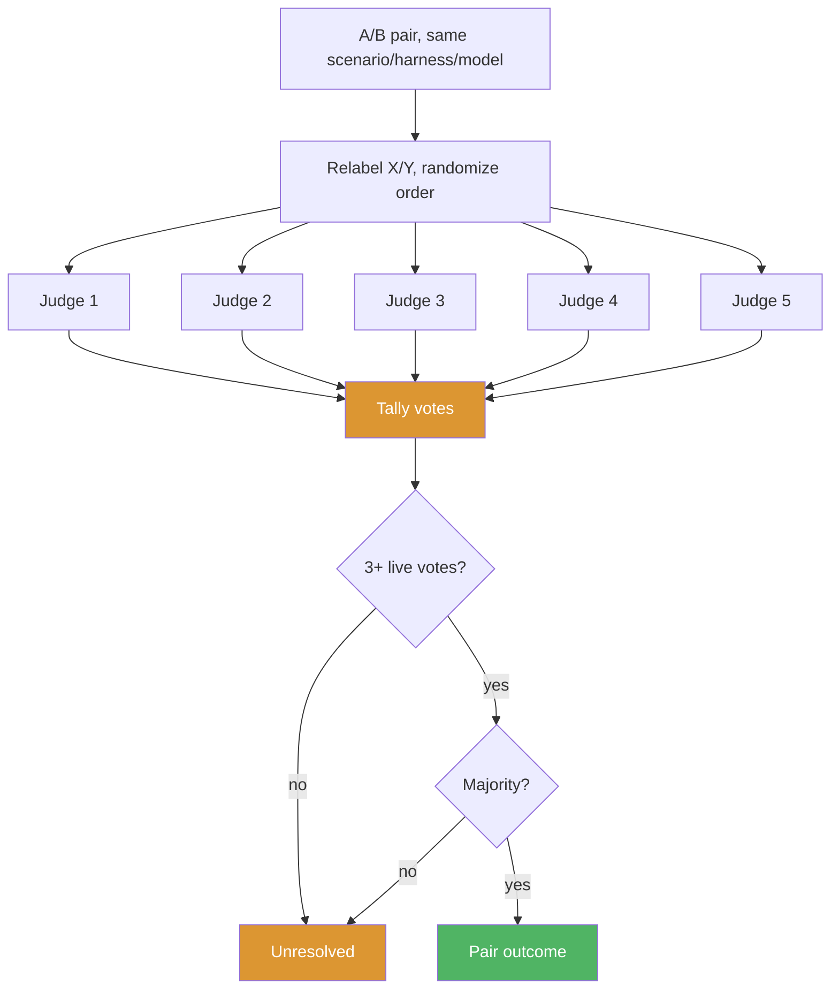

# Skill Benchmarking Framework Design

**Status:** Proposed
**Date:** 2026-09-29

## Problem

Konductor ships 82 skills under `skills/`. Nothing measures whether a skill earns its token cost, whether it activates when its own description says it should, or whether another skill already covers the same ground.

An existing harness lives under `tests/`: `scripts/benchmark.js` at the repo root, `tests/judges/claude-code-agent-runner.js`, `tests/registry.json`, and per-agent scenario sets in `tests/asdlc-*/`. It runs one subject model against hand-written scenarios and checks whether an agent passes them. It does not compare against a baseline and cannot attribute a result to one skill. This design replaces it rather than extending it: the run matrix, the two-stage screen-then-ablation structure, and the council judging are different enough that bolting them onto the existing schema would leave two incompatible formats side by side.

## Goals and Non-Goals

**Goals**

- Decide, per skill, whether to keep, prune, or trim it, backed by quality evidence rather than a description read.
- Cover more than one harness (Kiro CLI, Claude Code) and more than one model per harness, since a skill's effect can vary by both.
- Separate "does the whole Konductor stack help" from "does this one skill help," since the first cannot answer the second.

**Non-Goals**

- Writing the runner, judge, or renderer code. This design specifies behavior; implementation is a later phase.
- Authoring the actual scenario prompts. The design specifies how scenarios are generated, not their content.
- Running continuously or per commit. The framework runs on a configured cadence, not on every change.
- Weighting verdicts by real usage or invocation telemetry. Scenario evidence only, for now.

## Requirements

**Functional**

- Generate scenarios from the skill corpus with no manual curation per run.
- Run a screening stage that compares a full Konductor environment against a vanilla baseline, per scenario, harness, and model.
- Select candidates from the screen using a fixed set of rules.
- Run an ablation stage for each candidate that isolates that one skill's effect.
- Judge every A/B pair with a five-member council, blind and pairwise.
- Render a human-readable report and a plan a person can act on.

**Constraints**

- The corpus to benchmark is a parameter, `corpus_path`, defaulting to `skills/`.
- The model list per harness is config: `models.kiro` and `models.claude`, each defaulting to at least two models.
- Cadence is a `--frequency` flag, defaulting to monthly.
- Scenario count per skill is config: `scenarios.per_skill`, defaulting to 3.
- A budget cap, `budget.max_runs`, bounds total runs per invocation.

**Non-Functional**

- The rendered report follows the `humanize-writing` skill's conventions: no filler, no hedge words, no promotional language.

## Solution Overview


Two stages exist because they answer different questions. The screen compares the full Konductor stack (env A) against a vanilla harness with no Konductor install (env B). A difference there says the stack as a whole helps or does not, but env A and env B differ in the orchestrator agent and every skill at once, so a screen result cannot be pinned on one skill. Its only job is to narrow 82 skills down to a candidate list. The ablation stage then removes or trims one candidate at a time from a copy of env A and compares that copy against unmodified env A. That comparison isolates one skill, so it is the stage that actually decides prune, trim, or keep.

## How It Works

### Scenario generation

Every scenario traces back to one line in one skill's `SKILL.md`. `scenarios.per_skill` (default 3) prompts are generated per skill:

1. Parse `name`, `description`, and `tags` from the skill's frontmatter.
2. A trigger-clause description ("Use when X") becomes a first-person request built from X. A behavior-summary description ("Does X") becomes a synthesized request that would plausibly need X. Both use a template transform, not free generation, so the mapping from description line to prompt stays traceable.
3. Optionally, a shared overlap prompt is generated for a cluster of skills whose descriptions cover related ground (for example `dynamodb-design` and `dynamodb-validation`). An overlap prompt is marked `kind: overlap` in the scenario record and feeds candidate rule (c) below.

A content hash per skill is recorded alongside the generated scenarios. If a skill changes between generation and evaluation, its scenarios are marked stale and excluded from that run.

### Environments

- **Env A (konductor).** An isolated temp HOME, mode `0700`, with `konductor install --harness <kiro-cli-v2|claude> --target <tmpA>` applied, invoked through the `konductor` agent.
- **Env B (vanilla).** An isolated temp HOME with no Konductor install, invoked through the harness's own default agent.
- **Ablation variants.** `A-minus-X` is a temporary copy of env A with skill X removed, used for a prune test. `A-trimmed-X` is a temporary copy of env A with a trimmed `SKILL.md` variant for X applied, used for a trim test. Both are torn down after judging; neither is a third standing environment.

Before every run, the runner checks that the target HOME contains no agents, skills, steering, or SOP files beyond what that environment is supposed to have: none for env B, only the Konductor install for env A. This catches a developer's own `~/.kiro/skills` or `~/.kiro/steering` leaking into an otherwise isolated run.

Only the harness credential material needed to call the model is copied or linked into each HOME, identically for env A and env B, and removed at teardown. The exact per-harness mechanism is listed under Open Questions.

Trim variants are proposed by an LLM or a human as a patch stored alongside the ablation run. The council judges the outputs the patch produces, never the patch text itself.

### Run matrix

The screen runs `scenarios x harnesses x models x 2 environments`. The ablation stage runs, per candidate, `that skill's scenarios x harnesses x models x repeats.ablation x {A, ablation variant}`. `repeats.screen` (default 1) and `repeats.ablation` (default 3) exist because model output is nondeterministic and a single sample should not decide a prune.

### Council judging



For each pair, both outputs are relabeled X/Y in randomized order with no indication of which side produced which. Each of five judges returns a preference (X, Y, or no meaningful difference), a strength (slight, clear, strong), and rubric scores for correctness, completeness, adherence to the request, and actionable detail.

The pair outcome is the majority of live votes. A pair needs at least three live votes; fewer than that makes it unresolved. Five live votes can still fail to produce a majority: two X, two Y, and one no-difference is a three-way split with no side reaching three votes, so that pair is also unresolved, not a tie broken some other way.

The council is mixed-family and must include Opus. There is no exclusion rule barring a judge from grading output from a model in its own family. Both sides of every pair come from the same subject model, so any self-preference bias a judge carries applies equally to both sides of the pair it is judging; blind relabeling removes the position and identity cues a biased judge would otherwise use. The report calls out judge-versus-subject family in its metrics appendix and flags any skill where same-family and cross-family judges disagree.

### Verdict rules

A skill's ablation verdict is a deterministic rule applied to its resolved pair outcomes; the council decides each pair, the rule aggregates across pairs for one skill.

- **Prune.** The ablated variant (`A-minus-X`) is not worse in at least `thresholds.no_regression` (config, for example 0.9) of resolved pairs, and no pair shows env A strongly better.
- **Trim.** The same rule, applied against `A-trimmed-X` instead of `A-minus-X`.
- **Keep.** Neither rule is met.
- **Needs human review.** More than `thresholds.max_unresolved` (config) of the skill's pairs are unresolved or `run_failed`.

Candidate selection into the ablation stage uses screen results and is separate from this verdict rule. A skill becomes a candidate if any of the following fire on the screen:

- (a) The skill did not activate in env A on its own scenarios.
- (b) Env A is not better than env B on the skill's scenarios.
- (c) A different skill activated on the skill's scenarios (an overlap prompt fired the wrong skill, or two skills both fired).
- (d) The skill's size exceeds a configured token threshold (a trim candidate specifically).

Any single rule firing is enough to make a skill a candidate. Only ablation results, never screen results, feed plan actions.

## Run Cost

Screen runs = `skills x scenarios.per_skill x harnesses x models_per_harness x 2 environments`. Screen judge calls = `pairs x 5`, where a pair is one screen `(scenario, harness, model)` env A/env B comparison.

Illustrative example, not a target: 82 skills x 3 scenarios = 246 scenarios. With 2 harnesses and 2 models per harness, that is 984 (scenario, harness, model) cells. Each cell runs in both environments, so 984 x 2 = 1,968 screen runs. Each cell is also one A/B pair, so 984 pairs x 5 judges = 4,920 screen judge calls.

Ablation runs = `candidates x that skill's scenarios x harness-model cells x repeats.ablation x 2 (A and ablation variant)`. Ablation judge calls = `pairs x 5`.

Illustrative example, not a target: 20 candidates x 3 scenarios x 4 harness-model cells x 3 repeats = 720 pairs. That is 720 x 2 = 1,440 ablation runs, and 720 x 5 = 3,600 ablation judge calls.

Combined illustrative totals: 1,968 + 1,440 = 3,408 runs, and 4,920 + 3,600 = 8,520 judge calls.

`budget.max_runs` caps total runs per invocation. On hit, the runner stops dispatching new runs, marks the current stage `partial`, and judges whatever finished. Any skill whose ablation is incomplete when the cap hits is held at needs human review rather than judged on partial evidence.

## Failure Handling

- A run against any environment gets one retry on timeout or crash; a second failure marks that run `run_failed` rather than omitting it.
- A council member that times out or returns an unparseable response is recorded as an abstention, not excluded from the pair's denominator.
- A pair with fewer than three live votes is unresolved, regardless of cause.
- A scenario whose source skill's content hash no longer matches at run time is excluded as `stale_snapshot` and regenerated on the next run.
- Each stage writes its own `status` (`ok`, `partial`, `failed`) and `duration_seconds` on completion.
- Process exit code is `0` for `ok` or `partial`, non-zero for `failed`.
- Each stage writes its output before the next stage starts, so a run is resumable from the last completed stage rather than restarting from scratch.

## Artifacts

### Directory layout

```
benchmarking/
├── scenarios/
│   └── YYYY-MM/
│       ├── scenarios.json
│       └── corpus-snapshot.json
├── results/
│   └── YYYY-MM/
│       ├── screen/
│       ├── ablation/
│       │   └── <skill-path-slug>/
│       └── council-votes.json
├── reports/
│   └── YYYY-MM-report.md
├── plans/
│   └── YYYY-MM-implementation.json
└── scripts/
    ├── generate-scenarios.*
    ├── run-screen.*
    ├── run-ablation.*
    ├── tally-council.*
    └── render-report.*
```

`scripts/` are placeholders; no implementation ships with this design.

### Scenario record

| Field | Type | Meaning |
|---|---|---|
| `scenario_id` | string | `YYYY-MM-NNN`, unique per run |
| `skill` | string | source skill path |
| `prompt` | string | the generated user request text |
| `source_description_line` | string | the exact frontmatter line the prompt was derived from |
| `kind` | string | `own` (single-skill scenario) or `overlap` (shared across a skill cluster) |

### Report

```markdown
# Skill Benchmark Report: <Month Year>

## Summary
- Skills screened: N
- Candidates selected: N
- Recommended for pruning: N
- Recommended for trimming: N
- Needs human review: N

## Recommendations

### Prune: <skill-name>
- Screen candidate rule(s) fired: <a/b/c/d>
- Ablation evidence: N of M resolved pairs not-worse, 0 pairs strongly-better-A
- Justification: <one paragraph>

### Trim: <skill-name>
- Affected lines: L<start>-L<end>
- Ablation evidence: N of M resolved pairs not-worse against the trimmed variant
- Justification: <one paragraph>

## Needs Human Review
- <skill-name>: reason (unresolved-pair ratio, run_failed ratio, or incomplete ablation)

## Metrics Appendix
| Skill | Verdict | Screen A-vs-B | Ablation Pairs (resolved/unresolved) | Token Delta (A vs B, per harness/model) | Same-Family vs Cross-Family Judge Agreement |
|---|---|---|---|---|---|
```

### Implementation plan

The plan is prose, not JSON: one entry per ablation-confirmed prune or trim action, naming the skill path, the action, a reference to the trim patch where applicable, and a short evidence summary tying back to the ablation pairs that produced it. A candidate that never reached ablation, or that landed at needs human review, has no entry. Field-level schema for a machine-readable version is a Phase 1 deliverable, not fixed here.

Any consumer of this plan must default to dry-run and require explicit per-entry confirmation before applying a change. There is no auto-execution path in this design.

## Threat Model

This is a local batch tool with no external attacker surface beyond one real trust boundary.

**Assets:** `scenarios.json` and `corpus-snapshot.json`, raw screen and ablation results, `council-votes.json`, the rendered report, and the implementation plan.

**Trust boundaries.** The model-provider API is the only untrusted boundary: every run and every council vote crosses into a third-party model, and the response text is untrusted content the framework does not control. The local run directory, from scenario generation through report rendering, is a trusted channel between stages, protected by corruption controls rather than an adversary model.

| Threat | Impact | Mitigation |
|--------|--------|------------|
| Prompt injection from a `SKILL.md` or from a subject model's own output, aimed at a judge | A skill author or a subject model's output steers a judge away from an accurate verdict | Both outputs are passed to judges as delimited data blocks with an explicit instruction to treat their content as data, not instructions; judging uses rubric scores, not free-form judge reasoning alone; a pair where either output contains judge-directed text is flagged in the report; every plan action still requires human confirmation regardless of vote outcome. Relabeling randomizes which side a judge sees as X or Y; it does not prevent injected text from being read by the judge in the first place. |
| Environment contamination (env B, an ablation copy, or env A itself carries files it should not) | The comparison for that run is invalid | The runner checks each target HOME against the expected file set for its environment before every run and aborts a mismatched run as a setup failure |
| Credential exposure in temp HOMEs | Harness auth material leaks into a committed artifact | Temp HOMEs are mode `0700`, hold only the auth material needed to call the model, are deleted at teardown, and credential material is never written to any file under `results/`, `reports/`, or `plans/` |
| Cost overrun | Unbounded spend on model calls | `budget.max_runs` caps total runs per invocation; on hit the stage is marked `partial` and dispatch stops |
| Accidental artifact corruption | A downstream stage reads a partial or malformed prior-stage file | Content hashes on the scenario snapshot, and a `status` field per stage, let a resumed run detect and skip a corrupted or incomplete prior stage instead of proceeding on bad data |
| Unsafe plan execution | An automated consumer applies a prune or trim without review | The plan format requires dry-run by default and explicit per-entry confirmation; there is no auto-execution path |

## Architecture Decision Records

### ADR-1: Council of five judges over a single judge

#### Status

Accepted

#### Context

A single judge's verdict cannot express disagreement. Two reasonable judges can read the same pair and land on different sides; averaging that away hides the exact signal this framework needs to surface, and one judge's blind spot goes undetected.

#### Decision

Every pair is judged blind and pairwise by five council members, each voting independently with a stated preference and strength. A pair outcome requires a majority of live votes with at least three live votes; verdicts aggregate per skill across its pairs.

#### Alternatives Considered

| Option | Pros | Cons | Why Not Chosen |
|---|---|---|---|
| Council of five (chosen) | Surfaces disagreement; no single model's blind spot decides a skill's fate | Five times the judgment cost of one judge | Not applicable, this is the chosen option |
| Single-judge pass/fail | Cheapest | Cannot capture disagreement; one judge's blind spots go undetected | Rejected: hides the disagreement signal the framework exists to surface |
| Single-judge numeric score | Slightly richer than pass/fail | Two judges landing on the same number for different reasons looks like agreement when it is not | Rejected: same blind-spot risk, with a false sense of precision |

#### Consequences

**Good:** A three-way split with no majority is visible and reported as unresolved, not silently averaged into a single number. No single judge model can unilaterally decide a skill's fate.

**Bad:** Judgment cost is five times a single judge's. Accepted because the framework runs at a monthly-scale cadence, not per commit.

**Neutral:** The report and plan both need an explicit unresolved and needs-human-review state, rather than always producing a clean verdict.

### ADR-2: Screen with Konductor versus vanilla, decide with per-skill ablation

#### Status

Accepted

#### Context

Comparing the full Konductor stack against a vanilla baseline is cheap relative to testing every skill individually, but a screen result cannot be attributed to one skill: env A and env B differ in the orchestrator agent and all 82 skills at once. Deciding a prune or trim needs a result isolated to one skill.

#### Decision

Use the Konductor-versus-vanilla screen only to select candidates, via the four candidate rules. Decide each candidate's fate with a second, isolated ablation stage that compares unmodified env A against a copy with only that one skill removed or trimmed.

#### Alternatives Considered

| Option | Pros | Cons | Why Not Chosen |
|---|---|---|---|
| Screen, then per-candidate ablation (chosen) | Cheap first pass narrows scope; ablation isolates one skill for an actual decision | Two stages instead of one | Not applicable, this is the chosen option |
| Env A versus env B only, no ablation | Single stage, cheapest | Cannot attribute any result to one specific skill | Rejected: cannot answer the question the framework exists to answer |
| Description-derived pass or fail | No second environment needed at all | Circular: the scenario is generated from the description, so matching it back mostly checks the scenario generator, not the skill's real effect on output | Rejected: does not measure output quality |
| Leave-one-out ablation for all 82 skills up front | Directly isolates every skill's effect, no screen needed | Cost scales with the full skill count before any narrowing; prohibitively expensive at 82 skills across a harness/model matrix | Rejected as the primary path on cost; retained, but only for the already-narrowed candidate set from the screen |

#### Consequences

**Good:** The prune and trim verdicts are grounded in a result isolated to one skill, not a whole-stack comparison.

**Bad:** A skill can pass the screen's candidate rules yet still be worth keeping once ablation isolates it, so some ablation runs confirm a keep rather than a prune. This is the intended trade for correctness.

**Neutral:** The screen's per-skill signal is diagnostic input to candidate selection, not a verdict in its own right, so the report needs to state clearly which numbers come from which stage.

### ADR-3: Directory layout by lifecycle

#### Status

Accepted

#### Context

Scenario generation, screen and ablation results, and the two rendered output artifacts have different reuse needs. Scenarios can be reused across a re-score; results are tied to one run; reports and plans are the final, dated artifacts a person reads.

#### Decision

Three top-level directories, each keyed by `YYYY-MM/` where applicable: `scenarios/` for generator output, `results/` for screen and ablation output, and `reports/` plus `plans/` for the final artifacts, named by date rather than nested in a date directory.

#### Alternatives Considered

| Option | Pros | Cons | Why Not Chosen |
|---|---|---|---|
| Separate by lifecycle (chosen) | Scenarios reusable across a re-score without duplicating them | One more top-level directory to track | Not applicable, this is the chosen option |
| Single flat run directory with everything inside | Simpler at a glance | Re-judging the same scenario set (a new council member, retrying failed pairs) means duplicating scenarios or breaking the one-run-one-directory convention | Rejected: couples scenario reuse to result lifecycle for no benefit |
| No date partitioning, overwrite each period | Fewest files on disk | Loses the ability to compare a skill's verdict period over period, which is a reason to run this on a cadence at all | Rejected: destroys the trend signal the cadence exists to produce |

#### Consequences

**Good:** A scenario set can be re-judged (new council member, retried pairs) without regenerating it.

**Bad:** `corpus-snapshot.json` inside `scenarios/YYYY-MM/` has to independently track a content hash per skill, since `skills/` itself carries no date.

**Neutral:** Report and plan filenames carry the date instead of a directory; a minor convention to keep consistent going forward.

## Implementation Plan

| Phase | Scope | Depends on | Exit Criteria |
|---|---|---|---|
| Phase 0 | Remove the existing harness: the `tests/` subsets used only by it, `tests/judges/`, `tests/registry.json`, `scripts/benchmark.js` | None | Old harness files removed; no other package references them |
| Phase 1 | Environment provisioning for env A and env B, the isolation check, and the run matrix runner | Phase 0 | A screen run executes for at least one scenario x harness x model cell in both environments, with the isolation check passing before each run |
| Phase 2 | Council judging and per-pair aggregation, including the live-vote and unresolved rules | Phase 1 | A sample screen produces pair outcomes with correct unresolved handling for a synthetic 2/2/1 split |
| Phase 3 | Candidate selection against the four rules, and ablation runs for both prune and trim variants | Phase 2 | An ablation run executes against at least one candidate for both `A-minus-X` and `A-trimmed-X`, producing a verdict via the deterministic rule |
| Phase 4 | Report and plan rendering, including the field-level plan schema | Phase 3 | A generated report matches the report skeleton in this design; a generated plan defaults to dry-run and requires per-entry confirmation |
| Phase 5 | `corpus_path` parameterization check | Phase 4 | A run against a non-default `corpus_path` produces the same artifact shapes as a `skills/` run |

Phases 1 through 5 are scope only in this design; sizing each into task-level tickets happens in a later pass.

## Decision Requested

1. Approve deleting the existing harness (`tests/` subsets, `tests/judges/`, `tests/registry.json`, `scripts/benchmark.js`) as Phase 0, independent of when the rest of this design lands.
2. Approve this target design: a two-stage benchmark that screens Konductor against a vanilla baseline to select candidates, then decides each candidate's fate with an isolated ablation run judged by a five-member council, producing a report and a human-confirmed implementation plan.

## Open Questions

- What is the exact per-harness credential mechanism for populating an isolated temp HOME with only the auth material needed to call the model?
- Is the Kiro CLI skill-load evidence in session logs reliable enough to use as candidate rule (a) and (c) evidence, or does it need a dedicated log level?
- What is the vanilla Kiro CLI installation's default agent name? Not asserted as fact in this design.
- Is the Claude Code `Skill` tool-call event reliable across every subject model in `models.claude`, or only some?
- Are trim variants written by an LLM, a human, or either, and does that choice affect how much a confirmed trim can be trusted?
- What are the default values for `thresholds.no_regression`, `thresholds.max_unresolved`, `scenarios.per_skill`, and the token-size threshold behind candidate rule (d)?
- What is the default value for `budget.max_runs`, and does it vary by cadence?
