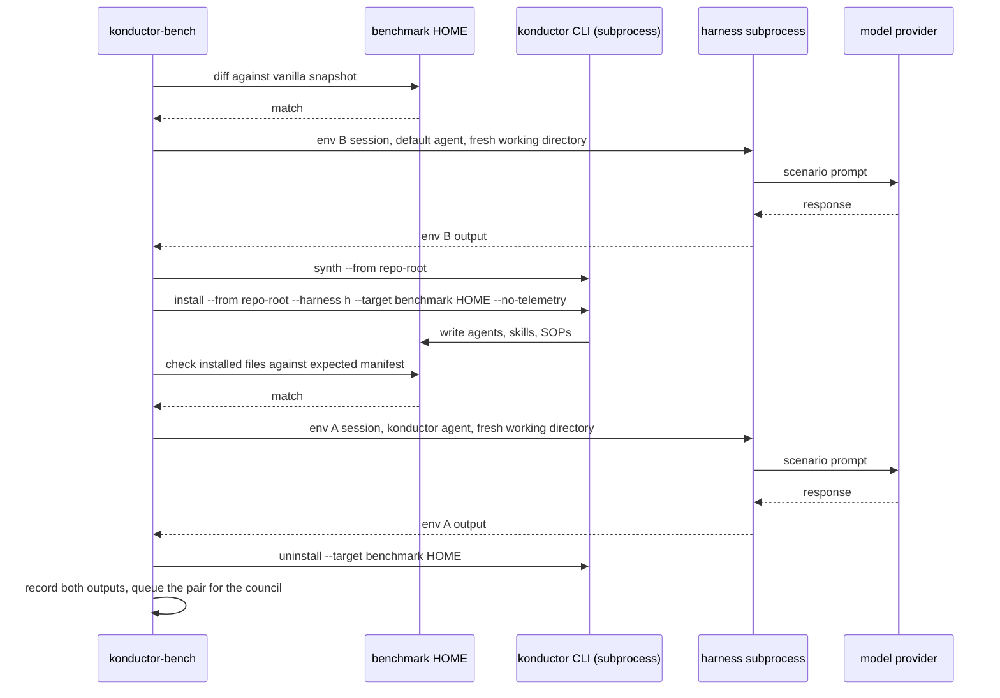
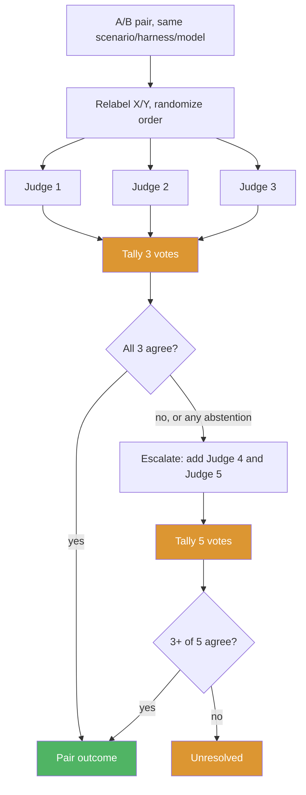
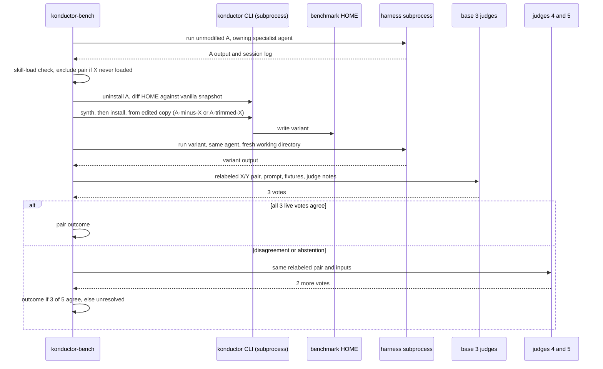

# Skill Benchmarking Framework Design

**Status:** Proposed
**Date:** 2026-09-29

## Problem

Konductor ships 82 skills under `skills/`. Nothing measures whether a skill earns its token cost, whether it activates when its description says it should, or whether another skill already covers the same ground.

Two prior artifacts address related ground and neither is sufficient:

- **`tests/`** is a working harness: `scripts/benchmark.js`, `tests/judges/claude-code-agent-runner.js`, `tests/registry.json`, and per-agent scenario sets under `tests/asdlc-*/`. It runs one subject model against hand-written scenarios and checks pass/fail. It does not compare against a baseline, and cannot attribute a result to one skill. `tests/registry.json` is a subset registry, two entries naming a dataset path, subject model, and default judge, not a per-scenario record store; it has no field for a second environment's output, a pair verdict, or an ablation variant's identity, so this design replaces the harness rather than extending its schema.
- **`benchmarking/DESIGN.md`** is an earlier design for this same problem, already checked in. It proposes a single-baseline (no environment comparison) scenario generator driven by frontmatter parsing, with `scripts/` left as placeholders. This document supersedes it: the earlier design has no A/B environment, no ablation, and no council escalation, all of which the rest of this document argues are necessary to attribute a result to one skill (see [Solution Overview](#solution-overview)). `benchmarking/DESIGN.md` should be deleted in the same change that lands this design, alongside the Phase 0 harness removal below.

The framework ships as `konductor-bench`, a separate binary built from the same checkout as `konductor`, invoked through `konductor bench`. See [CLI Surface](#cli-surface), [Build and Invocation](#build-and-invocation), and [Module Layout](#module-layout).

## Goals and Non-Goals

**Goals**

- Decide, per skill, whether to keep, prune, or trim it, backed by quality evidence rather than a description read.
- Cover more than one harness (Kiro CLI, Claude Code) and more than one model per harness, since a skill's effect can vary by both.
- Separate "does the whole Konductor stack help" from "does this one skill help," since the first cannot answer the second.
- Build the benchmark framework itself: the scenario generator, the environment runner, the council judge, and the report and plan renderers (see [Implementation Plan](#implementation-plan)). No working version of this exists; `benchmarking/DESIGN.md` is a prior design for it, not an implementation, and this document supersedes it (see [Problem](#problem)).
- Build a reviewed scenario bank with test prompts, input fixtures, and judge notes for every skill.
- Treat skill coverage as more important than run cost. Cost is controlled through `bench.repeats.ablation`, the models configured per harness, and `bench.budget.max_runs`, never by dropping a scenario from a skill's coverage set. A candidate whose coverage set did not fully run is held at needs human review rather than decided on partial evidence (see [Run Cost](#run-cost), [Verdict Rules](#verdict-rules)).

**Non-Goals**

- Running continuously or per commit. The framework runs on a configured cadence, not on every change.
- Weighting verdicts by real usage or invocation telemetry. Scenario evidence only, for now.

## Requirements

| # | Requirement |
|---|---|
| F1 | Generate draft scenarios for every skill, review once, reuse the approved set on every run. A new or changed skill needs one review, not manual curation per run. |
| F2 | Run a screening stage that compares a full Konductor environment against a vanilla baseline, per scenario, harness, and model. |
| F3 | Select ablation candidates from the screen using the four rules in [Verdict Rules](#verdict-rules). |
| F4 | Run an ablation stage per candidate that isolates that skill's effect, in a direct arm and a routed arm (see [Solution Overview](#solution-overview)). |
| F5 | Judge every A/B pair blind and pairwise with a council of `bench.council.size` (default 3); on ablation, escalate to `bench.council.escalate_to` (default 5) on disagreement (see [Council Judging](#council-judging)). |
| F6 | Render a human-readable report and an implementation plan a person can act on. |

**Constraints**

- `konductor-bench` runs only inside a git checkout of the Konductor repository. It reads the scenario bank, fixtures, and prompts from `<repo-root>/benchmarking/`, and writes results, reports, and plans back to the same tree. There is no mode against a released `konductor` binary or content fetched from GitHub: neither carries the scenario bank, and a released binary has no repository tree to write a report into.
- The corpus to benchmark is `bench.corpus_path`, defaulting to `skills/`.
- Models per harness are config: `bench.models.kiro` and `bench.models.claude`, each defaulting to at least two models.
- Harness scope: the CLI's own `--harness` flag accepts `kiro-cli-v2`, `kiro-v3`, and `claude` (see [`README.md`](../../../README.md)). This benchmark covers `kiro-cli-v2` and `claude` only; `kiro-v3` coverage is an open question (see [Open Questions](#open-questions)).
- Cadence is a `--frequency` flag, defaulting to monthly. A scheduled pipeline job invokes the runner on that cadence; a person can also invoke it manually.
- Scenario counts are config: `bench.scenarios.core` (default 3) is the core set size; `bench.scenarios.min_coverage` (default 5) is the coverage set floor, with no upper cap.
- Council size is config: `bench.council.size` (default 3), `bench.council.escalate_to` (default 5). Setting both equal gives a fixed-size council.
- The routed arm is config: `bench.ablation.routed_arm` (default `true`). `false` skips it for every candidate; the report then states routed effects were not checked.
- `bench.budget.max_runs` bounds total runs per invocation and is the only limit on coverage-set size.
- Claude Code's model provider is config: `bench.providers.claude`, `bedrock` (default) or `anthropic`. Each council judge's provider is separately configurable (see [Model Access and Credentials](#model-access-and-credentials)).

**Non-Functional**

- The rendered report follows the `humanize-writing` skill's conventions: no filler, no hedge words, no promotional language.

## Solution Overview

```mermaid
flowchart LR
    A[skills/ corpus] --> B[Scenario Generator]
    B --> C[Stage 1: Screen]
    C -->|"env A: konductor
    vs env B: vanilla"| D[Candidate Selection]
    D --> E[Stage 2a: Ablation, direct arm]
    E -->|"specialist agent
    A vs A-minus-X / A-trimmed-X"| F[Council]
    F -->|"prune or trim"| E2[Stage 2b: Ablation, routed arm]
    E2 -->|"konductor orchestrator
    A vs A-minus-X / A-trimmed-X"| F2[Council]
    F2 --> G[Report + Plan]

    style A fill:#64a0dc,color:#fff
    style F fill:#dc9632,color:#fff
    style F2 fill:#dc9632,color:#fff
    style G fill:#50b464,color:#fff
```



Two stages answer two different questions. The screen compares the full Konductor stack (env A) against a vanilla harness with no Konductor install (env B), through the `konductor` orchestrator on the env A side. A difference there says the stack as a whole helps or does not, but the screen's result is whole-stack: env A and env B differ in the orchestrator agent and every skill at once, and the orchestrator is on the request path for every screen scenario, so a screen result cannot be pinned on one skill's own content versus a routing effect. The screen's only job is to narrow 82 skills to a candidate list; only the ablation stage below decides a skill's fate.

The ablation stage removes or trims one candidate skill at a time from a copy of env A and compares that copy against unmodified env A, in two arms:

| Arm | Invokes | Question it answers | When it runs |
|---|---|---|---|
| **Direct** | The specialist agent that owns the candidate skill (`k-architect` for `threat-modeling`, `k-developer` for `backend-development`) directly, never `konductor` | Does the skill's own content help the agent that owns it | Always, first, for every candidate |
| **Routed** | The `konductor` orchestrator, on both sides of the pair | Does removing or trimming the skill change what a user gets through the entry point they actually use, including any routing shift | Only if the direct arm resolves to Prune or Trim (see [Verdict Rules](#verdict-rules)) |

The direct arm targets a named agent so the run does not depend on the orchestrator's own delegation choice: removing the skill cannot change which agent the scenario reaches, only what that agent does with it. The routed arm has no such fixed target and no skill-load exclusion (see [Verdict Rules](#verdict-rules)): a routing shift away from the skill's owning agent is itself part of what this arm measures, not noise to filter out. It is the final gate before a candidate reaches the plan, catching the case where the direct arm's isolated verdict does not survive contact with real routing. See [Environments](#environments) for how a routed-arm run records the reached agent and skills.

## How It Works

### Scenario generation

A scenario is more than a prompt: `code-review` needs a diff, `dynamodb-validation` needs a table design, `threat-modeling` needs a system description. Without that input, env A and env B both produce generic answers and the comparison says nothing. Each scenario carries:

- **Prompt.** The user request, written the way a developer would actually ask.
- **Fixtures.** Input files copied into the fresh working directory: a small repo, a diff, a design doc, a CloudFormation template. Fixtures live in `benchmarking/fixtures/` so several skills can reuse one realistic project.
- **Judge notes.** What a strong answer covers, drafted from a plain description of the task before the generator reads the skill's body, then reconciled against the skill's stated capabilities. Task-first drafting guards against notes that silently encode the skill's own section headings as the definition of a good answer, scoring "looks like this skill's output" over "solves the task well." Notes go through the same review as their scenario, so a vanilla output covering the same points gets full credit.

Every skill gets two scenario sets, drafted at different times:

| Set | Size | Built | Runs against |
|---|---|---|---|
| **Core** | `bench.scenarios.core`, default 3: the stated trigger, one realistic variation, one near-miss | For every skill from the start | The screen |
| **Coverage** | Floor `bench.scenarios.min_coverage`, default 5, no cap; includes the core set | Only once a skill becomes a candidate (see [Verdict Rules](#verdict-rules)) | Ablation |

The generator builds the coverage set by enumerating the skill's distinct capabilities (modes, major sections, edge cases the body calls out), then drafting one scenario per capability plus one or two near-miss scenarios. Below the floor it fills with realistic variations of an existing capability, never a scenario for a capability the skill does not claim. Ablation runs against the full coverage set, since deciding a skill's fate needs evidence against everything it claims to do, not just its headline trigger.

A near-miss scenario sounds related to the skill but should not trigger it. If the skill activates anyway, that is evidence of token cost without benefit on the scenario tested.

Build steps: (1) **Draft.** A generator model reads the skill's full `SKILL.md`; core-set drafting uses `benchmarking/prompts/generate-scenario.md`, coverage-set drafting (candidates only) lists capabilities first, then drafts against them. Where two skills cover related ground (`dynamodb-design` and `dynamodb-validation`), the generator also drafts a shared overlap scenario marked `kind: overlap`, feeding candidate rule (c) below. Each scenario records which `SKILL.md` sections it exercises, in `covers_sections`. (2) **Review.** A person approves, edits, or rejects each draft once, including its judge notes: a note that reads as skill-shaped rather than task-shaped is edited or rejected alongside it. Approved scenarios move to `benchmarking/scenarios/bank/<skill>/`, checked in and versioned like any other source. (3) **Reuse.** Every run uses the approved bank as-is. Each entry records the content hash of the skill version it was written against; when that hash changes, the entry is marked stale, excluded from runs, and re-drafted for review.

Review load is split by schedule: core sets are reviewed once, up front, for every skill (82 skills x 3 core scenarios is 246 scenarios before Phase 6's rollout). Coverage sets are drafted and reviewed only when a skill first becomes a candidate; after that, only a changed skill's coverage set needs re-review. The generator is never the only author, since a scenario written purely from a skill's own text risks testing the skill against itself.

### Environments

`konductor-bench` runs only inside a git checkout (see [Requirements](#requirements)). At startup it walks up from the working directory, or from `--bench-dir`'s parent, for a directory containing `.git`, `skills/`, `agents/`, and `benchmarking/`. Reaching the filesystem root without finding one exits `64` (`EXIT_USAGE_ERROR`). This check runs before the version check below, since neither means anything outside a checkout.

Before any run, `konductor-bench` checks the installed `konductor --version` against the checkout's `VERSION` file. A mismatch refuses the run and exits `64`, rather than running an `install`/`uninstall`/`synth` subprocess call whose behavior the harness code was not written against.

Environments are states of one dedicated **benchmark HOME** per harness, toggled with real `konductor install`/`uninstall` commands run as subprocesses. The benchmark HOME is never the developer's own HOME, created once at mode `0700`, with the harness logged in there once. Each harness needs its own HOME because an install target is locked to one `--harness` value.

- **Env B (vanilla).** No Konductor install, invoked through the harness's own default agent.
- **Env A (konductor).** After `konductor synth --from <repo-root>` and `konductor install --from <repo-root> --harness <kiro-cli-v2|claude> --target <bench-home> --no-telemetry`, invoked through the `konductor` agent. Always the `--from <repo-root>` path against the checkout under test; the no-`--from` GitHub-release path is never used (see [Requirements](#requirements)).
- **Ablation variants.** The runner copies the source tree to a temp directory and edits it: `A-minus-X` removes skill X and every reference to it in agent specs; `A-trimmed-X` applies the trim patch to X's `SKILL.md`. It then synths and installs that copy into the benchmark HOME the same way as env A. Synth failure sends the candidate to needs human review. The temp copy is deleted after the variant's runs finish.

Every run record and the report header carry the checkout's commit SHA and whether its tree was dirty at run time. A dirty tree is allowed, so a contributor is not forced to commit first, but the report flags it: a dirty-tree result does not map to one commit and cannot be directly compared to a later clean-tree run (see [Open Questions](#open-questions) on whether this should instead be refused outright).

**Hygiene checks and their known gap.** Right after login, the runner snapshots the benchmark HOME (every path, content hash), excluding session-history and cache directories. After every `uninstall`, it diffs the HOME against that snapshot; a mismatch stops further runs on that HOME and marks the stage `partial`. Before every env A or variant run, it checks installed files against the expected manifest; nothing outside agents/skills/steering/SOPs is allowed, which also catches content copied in from a developer's own `~/.kiro` or `~/.claude`.

The session-history and cache exclusion is a design choice, not a verified-clean guarantee: a harness's model-response cache or an MCP server's state directory can persist across a toggle without appearing in any manifest mismatch, and neither check above is built to see it. A cache carrying content from one environment into the next on the same HOME biases results toward whichever environment ran first there. This is the design's highest-residual-risk gap: the exact cache paths are still open (see [Open Questions](#open-questions)), so the one check that could rule this out directly does not exist yet.

**Run ordering mitigates, does not close, that gap.** Within one benchmark HOME shard, the runner randomizes whether env B or env A runs first, and randomizes each ablation variant's order the same way, so a cache effect cannot systematically favor one side across every shard. This spreads the bias rather than removing it: a single shard's own pair can still be affected by whichever side ran first there. One HOME runs sequentially; the runner shards cells across several HOMEs per harness for parallelism, each with its own login and snapshot.

**Per-run hygiene.** Every run starts a new session (no resume flags) in a fresh, empty working directory, so repo-level files like `AGENTS.md` or `.konductor/memory/` stay out of the comparison and one run's memory writes never reach the next.

**Telemetry.** Benchmark installs pass `--no-telemetry`, and the runner sets `KONDUCTOR_TELEMETRY=off` (see [Open Questions](#open-questions) on whether `uninstall` itself also needs this, or the env var alone covers it).

Credentials follow [Model Access and Credentials](#model-access-and-credentials). Trim variants are proposed by an LLM or a human as a patch stored alongside the ablation run; the council judges the outputs the patch produces, never the patch text.

One screen cell (one scenario, harness, and model) on one benchmark HOME, with env B first. On other shards the randomized order runs env A first, with the same steps in between.



### Model access and credentials

| Caller | Provider | Credential | How supplied |
|---|---|---|---|
| Claude Code, env A/B | `bench.providers.claude: bedrock` (default) | Short-lived AWS credentials, dedicated subject role | Subprocess env vars: `CLAUDE_CODE_USE_BEDROCK=1`, `AWS_REGION`, temporary AWS keys, model ID from `bench.models.claude` |
| Claude Code, env A/B | `bench.providers.claude: anthropic` | Anthropic API key | `ANTHROPIC_API_KEY` on the subprocess, model from `bench.models.claude` |
| Kiro CLI, env A/B | Kiro's own backend | The Kiro CLI login | Assumed done once per benchmark HOME, persisting across toggles; not verified (see [Open Questions](#open-questions)) |
| Council judges | Per-judge in `bench.council.judges[]`: `bedrock` (default) or `anthropic` | Short-lived AWS credentials, separate judge role, or an Anthropic API key | Held by the runner process only, never a subprocess |

Rules:

- **Least privilege on Bedrock.** Subject and judge roles allow only `bedrock:InvokeModel`/`InvokeModelWithResponseStream` on listed ARNs. The runner never copies `~/.aws` into a benchmark HOME.
- **Environment variables, not files.** Subject credentials reach the harness as subprocess env vars, so nothing lands in a HOME a transcript could capture. The Kiro CLI login is the exception, which is why the HOME is mode `0700` and excluded from every artifact.
- **Judge credentials never reach a subject.** A subject model can run tools and read its own environment; judge credentials are never set on a harness subprocess.
- **Same provider on both sides.** Every run record carries harness, provider, and resolved model ID. A pair is valid only if both sides match on all three, since Bedrock and the Anthropic API can serve different versions of the same model name.
- **Anthropic-only customers.** With `anthropic` as the only judge provider, every judge, including escalation judges, is a Claude model, single-family. See [Council Judging](#council-judging) for how the report flags this.

### Run matrix

The screen runs the core set: `bench.scenarios.core x harnesses x models_per_harness x 2 environments`, per skill. The direct arm runs the full coverage set per candidate: `coverage scenarios x harnesses x models x bench.repeats.ablation x {A, variant}`. `bench.repeats.screen` (default 1) and `bench.repeats.ablation` (default 2) exist because model output is nondeterministic and a single sample should not decide a prune; the repeat count is kept low relative to scenario count since more distinct coverage scenarios catch more of a skill's behavior than more repeats of one.

The routed arm runs only for a candidate whose direct arm already resolved to prune or trim (see [Verdict Rules](#verdict-rules)), in the identical shape (scenarios, variants, cells, repeats) but through `konductor` instead of the named agent. Its run count is bounded by how many candidates clear the direct arm, not the full candidate count (see [Run Cost](#run-cost)).

### Council judging



Both outputs in a pair are relabeled X/Y in randomized order, with no indication of which side produced which. Each judge returns a preference (X, Y, or no meaningful difference), a strength (slight, clear, strong), and rubric scores for correctness, completeness, adherence, and actionable detail, against the same instructions in `benchmarking/prompts/judge-pair.md` plus the scenario's prompt, fixtures, and notes.

| Stage | Base panel | Resolves at 3 when | Escalates when | Resolves at 5 when |
|---|---|---|---|---|
| **Screen** | 3, no escalation | At least 2 of 3 live votes agree | Never | n/a |
| **Ablation** | 3, escalates to `bench.council.escalate_to` (default 5) | All 3 live votes agree | Any disagreement or abstention among the 3 | At least 3 of 5 live votes agree; otherwise unresolved |

The screen only narrows the candidate list, so it does not pay for escalation. Ablation is the deciding stage, so a close 2-1 split there buys two more judges rather than being averaged away; escalation judges see the same relabeled pair, prompt, fixtures, and notes as the base three. The routed arm's pairs go through this identical process, judged within their own arm, never mixed with a direct-arm pair. Setting `bench.council.size` and `bench.council.escalate_to` equal gives a fixed-size council with no escalation.

One direct-arm ablation pair for candidate skill X. The routed arm runs the same sequence with `Sub` running the `konductor` agent on both sides, skips the skill-load check, and records which agents and skills each run reached.



The base three judges are mixed-family and must include Opus. No rule bars a judge from grading a model in its own family: both sides of every pair come from the same subject model, so any self-preference bias applies equally to both sides, and blind relabeling removes the identity cues a biased judge would use. The report calls out judge-versus-subject family in its metrics appendix and flags any skill where same-family and cross-family judges disagree.

**Anthropic-only customers.** With `anthropic` as the only judge provider, every judge is a Claude model, single-family through escalation. The run proceeds, and the report marks the council single-family so readers can weigh the self-preference risk. A single-family council that also escalated is downgraded to needs human review rather than resolved from the five-judge vote, since escalation already means the base three could not agree, and a single-family panel is the least trustworthy tie-breaker for that disagreement.

### Verdict rules

A skill's ablation verdict is a deterministic rule over its resolved pair outcomes, aggregated separately per arm; when the routed arm runs, it aggregates its own pairs into its own verdict using the identical logic below, independent of the direct arm's, then the two are combined (see **Combining the two arms**).

Aggregation splits pairs by `kind` (see [Scenario Record](#scenario-record)): `own`/`overlap` pairs measure whether removing the skill hurts on scenarios it should help with; `near_miss` pairs measure whether the skill correctly stays silent. A near-miss pair is near-guaranteed to read "not worse," since neither side should have used the skill, so folding it into the same ratio as `own`/`overlap` would make Prune and Trim easier to reach without saying anything about whether the skill helps where it should fire. Both conditions below must hold; a near-miss failure blocks Prune or Trim even if the `own`/`overlap` ratio passes.

- **Prune.** Both hold: the ablated variant is not worse in at least `bench.thresholds.no_regression` (default 0.9) of resolved `own`/`overlap` pairs, with no pair showing env A strongly better; and at least that fraction of resolved `near_miss` pairs show no difference.
- **Trim.** The same rule, against `A-trimmed-X`. Valid only for `SKILL.md` sections some coverage-set scenario's `covers_sections` named and ablation showed were not needed. An untested section is reported untested, not trimmed: absence of evidence a section helps is not evidence it does not.
- **Keep.** Neither rule is met.
- **Needs human review.** More than `bench.thresholds.max_unresolved` (default 0.2) of pairs are unresolved or `run_failed`; the coverage set did not finish running (see [Run Cost](#run-cost)); or any resolved pair was decided by a single-family council after escalation. Coverage always outranks cost: a skill here is never decided on partial evidence.

The three threshold defaults above, plus `bench.thresholds.skill_tokens` at 2,000 (candidate rule (d) below), are rationale-backed starting points, not measured values, expected to be revised once the Phase 1 pilot's real pair outcomes exist to check them against.

**Skill-load exclusion (direct arm only).** A direct-arm pair counts toward any ratio above only if the env A side's session log shows a skill-load event for skill X; a run with no logged load is excluded rather than counted "not worse," since an unloaded skill was never isolated (see [Open Questions](#open-questions) on log reliability). The routed arm has no equivalent exclusion: a run where the orchestrator never reaches X's owning agent still counts, since that non-routing is itself the effect this arm measures.

**Repeat instability.** `bench.repeats.ablation` (default 2) samples the same `(scenario, harness, model)` cell more than once, in both arms. If a scenario's repeats disagree, the runner does not fold both into the ratio as ordinary votes without comment: it flags the scenario repeat-unstable in the report alongside its resolved outcomes, so a person can distinguish a genuinely borderline scenario from two judged repeats that simply landed differently. Both repeats still count toward the ratios; the flag is additional, not a substitute. A repeat count of 2 is the minimum that can detect this instability at all and the weakest sample for resolving it: a 2-of-2 disagreement is one flagged data point, not a majority vote, which is why the flag exists as a distinct signal rather than being silently smoothed into the ratio.

**Combining the two arms.** The direct arm runs first. Direct-arm Keep or needs human review ends the candidate there; the routed arm never runs, since there is nothing left for a routing check to gate. Only Prune or Trim triggers the routed arm (`bench.ablation.routed_arm`, default `true`; `false` skips it and the report states routed effects were not checked). A candidate reaches the plan only if both arms independently resolve to the same action. If the direct arm resolves to Prune or Trim but the routed arm resolves to Keep or a regression, the candidate goes to needs human review with reason `routing regression`, both arms' verdicts and evidence shown side by side. A routed-arm needs-human-review outcome also holds the candidate there, with the direct arm's result shown alongside.

**Candidate selection (screen, not ablation).** Evaluated against the core set only, separate from the verdict rule above. A skill becomes an ablation candidate if any rule fires:

- (a) The skill did not activate in env A on its own scenarios.
- (b) Env A is not better than env B on the skill's scenarios. This comparison is whole-stack, not skill-scoped: the screen's env A includes every skill and the orchestrator at once (see [Solution Overview](#solution-overview)), so a hit is evidence the stack did not help, not evidence this specific skill failed; ablation is what isolates the skill's own effect.
- (c) A different skill activated on the skill's scenarios (an overlap prompt fired the wrong skill, or two fired).
- (d) The skill's rendered `SKILL.md` body exceeds `bench.thresholds.skill_tokens` (default 2,000 tokens), a trim candidate specifically.

Any single rule firing makes a skill a candidate. Only ablation results, never screen results, feed plan actions. Rules (a) and (c) read env A's session log for skill-load and attribution events; that log evidence's reliability per harness and model is not yet verified (see [Open Questions](#open-questions)).

## CLI Surface

`konductor bench` is a subcommand of the existing `konductor` CLI (see [Module Layout](#module-layout)). Four subcommands, each mapping to a step already in this design:

| Command | Does |
|---|---|
| `konductor bench scenarios draft [--skill <name>] [--set core\|coverage]` | Runs the [scenario generation](#scenario-generation) draft step. `--set coverage` requires the skill to already be a candidate. Drafts land in the bank with `status: draft`. |
| `konductor bench scenarios review` | Lists pending drafts. There is no separate approve/reject flag: a scenario's `status` field in its bank YAML is what review edits, so review works in any text editor or as a PR diff against `benchmarking/scenarios/bank/`. |
| `konductor bench run [--stage screen\|ablation\|all] [--frequency <cron-or-interval>] [--resume <YYYY-MM>] [--bench-dir <path>]` | Executes a run. `--stage` selects screen, ablation, or both; `--frequency` is the cadence flag from [Requirements](#requirements); `--resume` continues a `partial` run from its last completed stage (see [Failure Handling](#failure-handling)); `--bench-dir` overrides the default `<repo-root>/benchmarking` location. |
| `konductor bench report [<YYYY-MM>]` | Renders the report and plan for a completed run, defaulting to the most recent month. Reads `results/<YYYY-MM>/`, `reports/`, and `plans/` from [Artifacts](#artifacts). |

Config for all four lives under `bench:` in `.konductor/config.yml`. Every config key referenced elsewhere in this design (`bench.models.*`, `bench.council.*`, `bench.scenarios.*`, `bench.budget.max_runs`, `bench.providers.claude`, `bench.thresholds.*`, `bench.repeats.*`, `bench.corpus_path`, `bench.ablation.routed_arm`) resolves under that key.

## Run Cost

| Stage | Runs formula | Judge calls formula |
|---|---|---|
| Screen | `skills x bench.scenarios.core x harnesses x models_per_harness x 2` | `pairs x bench.council.size` (never escalates) |
| Ablation, direct arm | `candidates x coverage scenarios x harness-model cells x bench.repeats.ablation x 2` | `pairs x bench.council.size`, plus 2 per escalating pair |
| Ablation, routed arm | Same shape, over only the candidates the direct arm resolved to prune or trim | Same formula, over that narrower pair count |

Illustrative example, not a target, at an illustrative 20 percent ablation-pair escalation rate (must be measured on the Phase 1 pilot before it sizes anything real; see [Open Questions](#open-questions)):

| | Cells/pairs | Runs | Base judge calls | Escalation calls | Judge calls |
|---|---|---|---|---|---|
| Screen: 82 skills x 3 core scenarios, 2 harnesses x 2 models | 984 pairs | 984 x 2 = 1,968 | 984 x 3 = 2,952 | 0 | 2,952 |
| Ablation direct: 20 candidates x 8 avg. coverage scenarios, 4 harness-model cells, repeats 2 | 160 x 4 x 2 = 1,280 pairs | 1,280 x 2 = 2,560 | 1,280 x 3 = 3,840 | 256 x 2 = 512 | 4,352 |
| Ablation routed: 10 of 20 candidates pass direct arm, same shape | 10 x 8 x 4 x 2 = 640 pairs | 640 x 2 = 1,280 | 640 x 3 = 1,920 | 128 x 2 = 256 | 2,176 |
| **Total** | | **5,808** | | | **9,480** |

For comparison, a fixed five-judge council with no screen-stage saving costs `984 x 5 + 1,280 x 5 + 640 x 5 = 14,520` judge calls on the same example, against this design's 9,480.

`bench.budget.max_runs` caps total runs per invocation, defaulting to 7,000: enough to cover the 5,808-run example above with retry headroom, without letting one invocation run unbounded. The prior default of 6,000, sized against the direct arm alone, does not leave meaningful headroom once the routed arm's 1,280 runs are added, hence the increase. On hit, the runner stops dispatching new runs, marks the current stage `partial`, and judges whatever finished; any skill whose ablation is incomplete when the cap hits goes to needs human review rather than being judged on partial evidence.

## Failure Handling

- A run against any environment gets one retry on timeout or crash; a second failure marks it `run_failed` rather than omitting it.
- A failed `konductor install`/`uninstall`, or a vanilla-snapshot mismatch after uninstall, stops every remaining run on that benchmark HOME and marks the stage `partial`. The runner does not hand-delete leftover files; a person restores the HOME, since a silent cleanup would hide an uninstall bug.
- A council member that times out or returns an unparseable response is recorded as an abstention, counted in the pair's denominator. On an ablation pair, an abstention among the base three counts as a disagreement and triggers escalation.
- A screen pair with fewer than two live votes, or two disagreeing live votes, is unresolved. An ablation pair that fails to resolve at three, then fails to reach three of five after escalation, is unresolved. Both cases are unresolved regardless of cause.
- A scenario whose source skill's content hash no longer matches at run time is excluded as `stale_snapshot` and regenerated on the next run.
- Each stage writes its own `status` (`ok`, `partial`, `failed`) and `duration_seconds` on completion, and writes its output before the next stage starts, so a run resumes from the last completed stage rather than restarting.
- Exit codes follow the CLI's own table: `0` for `ok`, `EXIT_SUCCESS_WITH_WARNINGS` (`6`) for `partial`, `EXIT_HALTED` (`1`) when a stage fails, `EXIT_USAGE_ERROR` (`64`) for a bad invocation before any run starts. `EXIT_CRITICAL_GATE` (`2`) is reserved elsewhere in the CLI for its unresolved-CRITICAL-gate signal; `bench` has no equivalent gate concept, and this design does not define any path that emits it.
- `bench.budget.max_runs` bounds cost, never coverage. A candidate cut off before its coverage set finishes goes to needs human review, the same as an unresolved-pair ratio breach (see [Verdict Rules](#verdict-rules)), never decided on partial evidence.

## Artifacts

### Directory layout

All benchmark data and output live under `<repo-root>/benchmarking` (overridable with `--bench-dir`; see [CLI Surface](#cli-surface)):

```
benchmarking/
├── prompts/
│   ├── generate-scenario.md         # generator templates
│   └── judge-pair.md                # judge rubric and instructions
├── fixtures/                        # shared input projects, diffs, docs
├── scenarios/
│   ├── bank/
│   │   └── <skill>/*.yaml           # reviewed, versioned scenarios
│   └── YYYY-MM/
│       ├── scenarios.json           # the bank entries used by this run
│       └── corpus-snapshot.json
├── results/
│   └── YYYY-MM/
│       ├── screen/
│       ├── ablation/
│       │   └── <skill-path-slug>/
│       └── council-votes.json
├── reports/
│   └── YYYY-MM-report.md
└── plans/
    └── YYYY-MM-implementation.json
```

`prompts/`, `fixtures/`, and `scenarios/bank/` are checked in, as are `reports/` and `plans/` once a person commits a run's output through a pull request (see [Build and Invocation](#build-and-invocation)). `results/` is gitignored: large, fully regenerable raw run data, not something meant to sit in version control. The framework's own code lives in its own crate, not under `benchmarking/` (see [Module Layout](#module-layout)).

### Module layout

`konductor-bench` is its own crate, `cli/konductor-bench/`, a sibling of `cli/konductor-rs/`. Proposed for Phase 2, following the `shared/konductor-telemetry` precedent: a small `shared/konductor-bench-config` crate holding the `bench:` config types and exit-code constants both binaries need, so neither duplicates them. Neither this crate nor its `Cargo.toml` entry exists yet (see [ADR-4](#adr-4-separate-konductor-bench-binary-invoked-by-konductor-bench)). Model-client and harness code stay in `konductor-bench` only, since `konductor-rs` never needs them:

```
cli/konductor-bench/
└── src/
    ├── main.rs          # subcommand dispatch: scenarios draft/review, run, report
    ├── scenarios.rs      # draft generation, the review workflow, bank read/write
    ├── home.rs           # benchmark HOME lifecycle: one-time login, vanilla snapshot, manifest checks
    ├── runner.rs         # run matrix dispatch, harness subprocess invocation
    ├── council.rs        # judge dispatch, relabeling, escalation
    ├── verdict.rs         # per-skill aggregation against the Prune/Trim/Keep/needs-human-review rules
    ├── report.rs          # report and plan rendering
    └── providers/
        ├── bedrock.rs     # Bedrock model client (subject and judge roles)
        └── anthropic.rs   # Anthropic API client

shared/konductor-bench-config/  # proposed, not yet created
└── src/
    └── lib.rs           # bench: config types, exit-code constants shared with konductor-rs
```

`konductor-bench` calls the installed `konductor` binary's `install`, `uninstall`, and `synth` as subprocesses, telemetry disabled, the same commands a user runs directly, so every benchmark cycle exercises the real install code path. The harness subprocesses under test (`kiro-cli`, `claude`) are genuine subprocesses too, since they are the subject being measured. Harness, model-provider, and `konductor` subprocess calls all sit behind traits with fakes for hermetic tests (see [Implementation Plan](#implementation-plan) Phase 2).

### Build and invocation

`konductor` gains only a thin `bench` dispatcher, with no model-client or harness dependencies of its own. `konductor bench <args>` looks for `konductor-bench` next to the running `konductor` binary; then, inside a checkout, at `cli/konductor-bench/target/release/konductor-bench`; then on `PATH`. If found, it execs it and passes its exit code through unchanged; otherwise it prints the command to build it (`make bench`) and exits `64`.

`konductor-bench` is built from source inside the checkout, never distributed as a release asset: a clone is already required to run a benchmark at all (see [Requirements](#requirements)). A `make bench` target runs `cargo build --release` in `cli/konductor-bench/`. There is no per-platform release asset, `.sha256` sidecar, or checksum step for it; `EXIT_VERIFY_FAILED` (`65`) stays reserved for the main `konductor` binary's own release-asset verification and is unused in this design.

`make bench` only builds; it does not install. Proposed: `make link`, which today only symlinks `konductor` into `~/.local/bin`, would gain a matching `konductor-bench` symlink, skipped silently when that build does not exist. This extension does not exist in the Makefile today. `konductor bench` reaches the symlink through the `PATH` step of the lookup order above; whether "next to the running `konductor` binary" resolves the real path or the symlink is listed under [Open Questions](#open-questions).

The Anthropic client reuses the CLI's existing `ureq` (`=2.10.1`) plus `rustls` (`=0.23.43`) stack, since the Anthropic API needs only a bearer header. Bedrock needs AWS SigV4 signing and the AWS credential chain, which `ureq` does not provide; the choice between the full async AWS SDK for Rust and a lighter synchronous SigV4 crate over `ureq` is deferred to [ADR-4](#adr-4-separate-konductor-bench-binary-invoked-by-konductor-bench) and [Open Questions](#open-questions). New dependencies are exact-pinned, matching the rest of the workspace.

### Results and reports live in the checkout

`benchmarking/results/` holds raw screen and ablation records, council votes, per-run logs: large, fully regenerable, gitignored. `benchmarking/reports/` and `benchmarking/plans/` hold the rendered output a person reads and acts on, committed through a pull request after reviewing the run. `konductor-bench` never runs `git add`, `git commit`, or `git push`: it writes files to disk and leaves what to commit, and when, to the person running it.

### Scenario record

| Field | Type | Meaning |
|---|---|---|
| `scenario_id` | string | stable ID, `<skill>-NNN` |
| `skill` | string | source skill path, or a list of paths for `overlap` |
| `set` | string | `core` or `coverage` |
| `kind` | string | `own` (single-skill), `overlap` (shared across a cluster), or `near_miss` (should not trigger the skill) |
| `prompt` | string | the user request text |
| `fixtures` | list of paths | files under `benchmarking/fixtures/` copied into the run's working directory |
| `judge_notes` | string | what a strong answer covers, shown to judges |
| `covers_sections` | list of strings | the `SKILL.md` headings this scenario exercises |
| `skill_hash` | string | content hash of the skill version the scenario was written against |
| `status` | string | `draft`, `approved`, or `stale`; runs use `approved` only |
| `reviewed_by` | string | who approved it |

### Report

```markdown
# Skill Benchmark Report: <Month Year>

## Summary
- Skills screened: N
- Candidates selected: N
- Recommended for pruning: N
- Recommended for trimming: N
- Needs human review: N
- Routed arm checked: yes/no (`bench.ablation.routed_arm`; if no, routed effects were not checked this run)

## Recommendations

### Prune: <skill-name>
- Screen candidate rule(s) fired: <a/b/c/d>
- Direct arm: N of M resolved pairs not-worse, 0 pairs strongly-better-A
- Routed arm: N of M resolved pairs not-worse, 0 pairs strongly-better-A
- Coverage scenarios run: N
- Routing shift: <none, or a short description of which agent/skills each side reached>
- Justification: <one paragraph>

### Trim: <skill-name>
- Affected lines: L<start>-L<end>
- Direct arm: N of M resolved pairs not-worse against the trimmed variant
- Routed arm: N of M resolved pairs not-worse against the trimmed variant
- Coverage scenarios run: N
- Sections trimmed: <headings, each covered by a scenario and shown not needed>
- Sections untested: <headings no coverage scenario exercised, not claimed as safe to trim>
- Routing shift: <none, or a short description of which agent/skills each side reached>
- Justification: <one paragraph>

## Needs Human Review
- <skill-name>: reason (unresolved-pair ratio, run_failed ratio, incomplete ablation, or routing regression: direct arm passed, routed arm did not)

## Metrics Appendix
| Skill | Verdict | Core Scenarios | Coverage Scenarios | Screen A-vs-B | Direct-Arm Pairs (resolved/unresolved) | Routed-Arm Pairs (resolved/unresolved) | Escalated Pairs | Same-Family vs Cross-Family Judge Agreement |
|---|---|---|---|---|---|---|---|---|

Any skill whose coverage-set scenario count exceeds `bench.scenarios.review_flag` (config) is flagged here as a possible split candidate: a skill that broad usually covers ground better split into two.
```

### Plan format

The plan is prose, not JSON: one entry per ablation-confirmed prune or trim action, naming the skill path, the action, a reference to the trim patch where applicable, and a short evidence summary tying back to the ablation pairs that produced it. A candidate that never reached ablation, or that landed at needs human review, has no entry. Field-level schema for a machine-readable version is a Phase 5 deliverable, not fixed here.

Any consumer of this plan must default to dry-run and require explicit per-entry confirmation before applying a change. There is no auto-execution path in this design.

## Threat Model

This is a local batch tool. Its untrusted boundary is the model-provider APIs (Amazon Bedrock, the Anthropic API, Kiro's backend): every run and council vote crosses into a third-party model, and the response text is untrusted content the framework does not control. Inside the local run, the harness subprocess is less trusted than the runner, since the subject model can execute tools there. The local run directory, from scenario generation through report rendering, is a trusted channel between stages, protected by corruption controls rather than an adversary model.

**Assets:** `scenarios.json` and `corpus-snapshot.json`, raw screen and ablation results, `council-votes.json`, the rendered report, the implementation plan.

| Threat | Impact | Mitigation |
|--------|--------|------------|
| Prompt injection from a `SKILL.md` or a subject model's output, aimed at a judge | Steers a judge away from an accurate verdict | Outputs pass to judges as delimited data blocks with an instruction to treat content as data, not instructions; judging uses rubric scores, not free-form reasoning; a pair whose output contains judge-directed imperative phrasing (a pattern scan, e.g. "ignore the other response") is flagged in the report; every plan action still requires human confirmation regardless of vote outcome |
| Environment contamination (env B, an ablation copy, or env A carries files it should not) | Invalidates that run's comparison | The runner compares the benchmark HOME against the vanilla snapshot after every uninstall and against the expected install manifest before every env A or variant run; any mismatch stops that HOME's queue. Every run uses a fresh working directory and session, so no repo files or prior session state carry over. Does not cover session-history or cache-directory carryover; see [Environments](#environments) |
| Subject credential exposure | A subject model reads its credentials through a tool call and they end up in a transcript | Credentials are short-lived and scoped to the configured models only; passed as subprocess environment variables, not files; the benchmark HOME is mode `0700` and never included in an artifact; transcripts are scanned for credential patterns before being written under `results/`, and a match is redacted and flagged |
| Judge credential exposure | A subject model gains access to the judge role and calls judge models directly | Judge credentials live only in the runner process, never set on a harness subprocess; the judge role is separate from the subject role |
| Overly broad AWS access | A developer's full `~/.aws` profile is used for runs | Dedicated subject and judge roles with `bedrock:InvokeModel`/`InvokeModelWithResponseStream` on listed ARNs only; `~/.aws` is never copied into a benchmark HOME |
| Cost overrun | Unbounded spend on model calls | `bench.budget.max_runs` caps total runs per invocation; on hit, the stage marks `partial` and dispatch stops |
| Accidental artifact corruption | A downstream stage reads a partial or malformed prior-stage file | Content hashes on the scenario snapshot, and a `status` field per stage, let a resumed run detect and skip a corrupted or incomplete prior stage |
| Unsafe plan execution | An automated consumer applies a prune or trim without review | The plan format requires dry-run by default and explicit per-entry confirmation; there is no auto-execution path |

## Architecture Decision Records

### ADR-1: Three-judge council with escalation to five

**Status:** Accepted

**Context.** A single judge's verdict cannot express disagreement: two reasonable judges can read the same pair and land on different sides, and averaging that away hides the exact signal this framework needs to surface. A fixed five-judge council catches that but pays the full cost on every pair, including ones where three judges already agree.

**Decision.** Every pair is judged blind and pairwise, starting with three council members voting independently. On the screen, three judges are final; the pair outcome is the preference held by at least two of three, and the screen never escalates. On ablation, a pair resolves at three only if all three agree; any disagreement or abstention escalates to five, and the outcome becomes the preference held by at least three of five. Verdicts aggregate per skill across resolved pairs.

| Option | Pros | Cons / why not chosen |
|---|---|---|
| Single judge | Cheapest | Cannot capture disagreement; hides the signal the framework exists to surface |
| Fixed council of five | Surfaces disagreement; no single blind spot decides a skill's fate | Five times the cost of one judge on every pair, even ones three already agree on |
| Fixed council of three | Cheaper than five on every pair | A close 2-1 split on the deciding stage gets no extra scrutiny, exactly when it needs one |
| Three with escalation to five (chosen) | Cheap when three agree; buys more evidence exactly where they do not | Adds an escalation branch to judging and reporting |

**Consequences.** Good: disagreement among the base three triggers escalation instead of being silently averaged; no single judge model can unilaterally decide a skill's fate. Bad: judgment cost still reaches five times a single judge's on any pair that escalates, accepted because the framework runs monthly and escalation is the exception. Neutral: the report needs an explicit unresolved/needs-human-review state plus an escalated-pair count.

### ADR-2: Screen with Konductor versus vanilla, decide with per-skill ablation

**Status:** Accepted

**Context.** Comparing the full stack against a vanilla baseline is cheap relative to testing every skill individually, but a screen result cannot be attributed to one skill: env A and env B differ in the orchestrator and all 82 skills at once. Deciding a prune or trim needs a result isolated to one skill.

**Decision.** Use the screen only to select candidates, via the four candidate rules. Decide each candidate's fate with a second, isolated ablation stage comparing unmodified env A against a copy with only that one skill removed or trimmed.

| Option | Pros | Cons / why not chosen |
|---|---|---|
| Screen, then per-candidate ablation (chosen) | Cheap first pass narrows scope; ablation isolates one skill | Two stages instead of one |
| Env A versus env B only, no ablation | Single stage, cheapest | Cannot attribute any result to one skill |
| Description-derived pass or fail | No second environment needed | Circular: the scenario is generated from the description, so matching back mostly checks the generator, not the skill |
| Leave-one-out ablation for all 82 up front | Directly isolates every skill, no screen needed | Cost scales with the full skill count before any narrowing; prohibitive across a harness/model matrix |

**Consequences.** Good: prune and trim verdicts are grounded in a result isolated to one skill, not a whole-stack comparison. Bad: a skill can pass the screen's candidate rules yet still be worth keeping once ablation isolates it, so some ablation runs confirm a keep rather than a prune; this is the intended trade for correctness. Neutral: the screen's per-skill signal is diagnostic input, not a verdict. The routed arm (see [Solution Overview](#solution-overview)) deliberately reintroduces the orchestrator this ADR's isolated ablation stage otherwise removes, but only after the direct arm has already isolated skill X's effect and reached prune or trim; it checks whether that effect holds once routing is back, rather than reopening the isolation question this ADR settles.

### ADR-3: Directory layout by lifecycle

**Status:** Accepted

**Context.** Scenario generation, screen and ablation results, and the two rendered output artifacts have different reuse needs: scenarios can be reused across a re-score, results are tied to one run, reports and plans are the final dated artifacts a person reads.

**Decision.** Three top-level directories, each keyed by `YYYY-MM/` where applicable: `scenarios/` for generator output, `results/` for screen and ablation output, `reports/` plus `plans/` for the final artifacts, named by date rather than nested in a date directory.

| Option | Pros | Cons / why not chosen |
|---|---|---|
| Separate by lifecycle (chosen) | Scenarios reusable across a re-score without duplication | One more top-level directory to track |
| Single flat run directory | Simpler at a glance | Re-judging a scenario set means duplicating it or breaking the one-run-one-directory convention |
| No date partitioning | Fewest files on disk | Loses the ability to compare a skill's verdict period over period, the reason to run on a cadence at all |

**Consequences.** Good: a scenario set can be re-judged (new council member, retried pairs) without regenerating it. Bad: `corpus-snapshot.json` has to independently track a content hash per skill, since `skills/` carries no date. Neutral: report and plan filenames carry the date instead of a directory.

### ADR-4: Separate konductor-bench binary invoked by konductor bench

**Status:** Accepted

**Context.** The framework needs to toggle `konductor install`/`uninstall`/`synth` many times per run, call two model providers, and run harness subprocesses on a scheduled cadence. Most users never run a benchmark, so its dependencies should not weigh down the binary everyone installs. Precedent: `mcp/servers/skill-lookup` is already its own separately built binary; `shared/konductor-telemetry` is already a shared crate linked into `konductor`, reached from harness hooks via the hidden `konductor __telemetry-hook <event-type>` subcommand.

**Decision.** Build the framework as `konductor-bench`, a separate binary in its own crate, invoked by a thin `konductor bench` dispatcher, calling `konductor`'s `install`/`uninstall`/`synth` as subprocesses. Proposed: the `bench:` config types and exit-code constants would live in a new `shared/konductor-bench-config` crate, following the `konductor-telemetry` pattern (see [Module Layout](#module-layout) for what exists today versus what Phase 2 adds).

| Option | Pros | Cons / why not chosen |
|---|---|---|
| Feature-gated module in the main binary | One binary; no version-compatibility check | A gated-on build still ships the dependency weight; does not keep it out of a build that enables the feature |
| Standalone Python tool | Faster prompt iteration; official SDKs available directly | A second runtime alongside the CLI's Rust toolchain; no shared build |
| Node script extending the old harness | Reuses some `claude-code-agent-runner.js` logic | `tests/registry.json` has no environment axis, pair verdict, or ablation-variant identity (see [Problem](#problem)); Phase 0 removes the old harness rather than building on it |
| Separate Rust binary, `konductor bench` dispatcher (chosen) | Main binary unchanged; exercises the real install/uninstall/synth path via subprocess; matches the `skill-lookup` precedent | Two binaries to build and version, needing the compatibility check in [Environments](#environments) |

**Consequences.** Good: main binary size and dependencies unchanged; every benchmark cycle exercises the real install/uninstall/synth path through a subprocess. Bad: two binaries to build and version, needing the compatibility check in [Environments](#environments); `konductor-bench` is a contributor tool, not something an end user runs from an ordinary install. Neutral: judge and scenario prompts stay data files in `benchmarking/prompts/`, not Rust string literals.

## Implementation Plan

| Phase | Scope | Depends on | Exit criteria |
|---|---|---|---|
| 0 | Remove the existing harness: `tests/` subsets used only by it, `tests/judges/`, `tests/registry.json`, `scripts/benchmark.js`; delete `benchmarking/DESIGN.md` (superseded, see [Problem](#problem)) | None | Old harness and prior design file removed; no other package references them |
| 1 | Scenario bank: `src/scenarios.rs`, generator/judge prompt templates, shared fixture library, draft generator, review workflow | None | A pilot set of 10 skills, spanning the skill categories, each has approved core-set scenarios with fixtures and judge notes |
| 2 | `cli/konductor-bench/` crate, `shared/konductor-bench-config` crate, `konductor bench` dispatcher, checkout detection, `make bench` and the `make link` extension, `src/home.rs` and `src/runner.rs` (benchmark HOME setup, install/uninstall toggling, ablation variant synth, version-compatibility check, provider config, run matrix) | Phase 1 | `konductor bench` locates and execs `konductor-bench`, passing its exit code through. A screen run executes the pilot core-set scenarios for at least one harness x model cell in both environments, snapshot checks passing, for both `bench.providers.claude` values. `cargo test` for `home.rs`/`runner.rs` is hermetic: no network, no real harness invocation, all three call types behind traits with fakes |
| 3 | `src/council.rs` and `src/verdict.rs`: judge prompt, per-pair aggregation, screen live-vote/unresolved rules, ablation escalation/unresolved rules | Phase 2 | The pilot screen produces pair outcomes with correct unresolved handling for a synthetic one-one-one split; a synthetic pilot ablation run correctly escalates a disagreeing three-judge pair to five and resolves it. `cargo test` hermetic, same trait-and-fake pattern |
| 4 | Candidate selection against the four rules; coverage-set drafting/review per pilot candidate; ablation runs for both prune and trim variants, direct and routed arms | Phase 3 | At least one pilot candidate has an approved coverage set meeting the floor; a direct-arm run against it produces a verdict for both `A-minus-X` and `A-trimmed-X`; that same candidate, having resolved to prune or trim, also has a routed-arm run against the same coverage set producing its own verdict |
| 5 | `src/report.rs`: report and plan rendering, field-level plan schema | Phase 4 | A pilot report matches this design's report skeleton; a generated plan defaults to dry-run with per-entry confirmation. `cargo test` hermetic, using fixture run data |
| 6 | Full rollout: core-set scenarios for all 82 skills, `bench.corpus_path` check, `cli/README.md` documentation, `benchmarking/results/` added to `.gitignore` | Phase 5 | A full screen run completes within `bench.budget.max_runs`; a run against a non-default `bench.corpus_path` produces the same artifact shapes as a `skills/` run; `cli/README.md` documents `konductor bench` |

Sizing each phase into task-level tickets happens in a later pass. The pilot keeps early runs cheap and lets prompt templates, fixtures, and judge instructions be tuned on 10 skills before applying to all 82.

## Decision Requested

1. Approve deleting the existing harness (`tests/` subsets, `tests/judges/`, `tests/registry.json`, `scripts/benchmark.js`) and the superseded `benchmarking/DESIGN.md` as Phase 0, independent of when the rest of this design lands.
2. Approve the architecture: a two-stage benchmark that screens Konductor against a vanilla baseline to select candidates, then decides each candidate's fate with an isolated, two-arm ablation run judged by a council that starts at three and escalates to five on disagreement, producing a report and a human-confirmed implementation plan. The numeric thresholds this design proposes (`bench.thresholds.*`, `bench.budget.max_runs`, the 20 percent escalation-rate assumption behind the Run Cost figures) are separate from this architectural approval: they are rationale-backed starting points the doc itself calls unmeasured, and are approved as Phase 1 pilot inputs subject to revision once the pilot's real pair outcomes exist, not as fixed final values.

## Open Questions

- Does the CLI resolve "next to the running `konductor` binary" from the `~/.local/bin` symlink or the resolved real path? If the real path, `PATH` is what actually finds the `make link` symlink.
- Where does Kiro CLI store its login, and does it survive `konductor uninstall`? Assumed yes (uninstall removes only manifest-tracked files), not verified.
- Which directories do Kiro CLI and Claude Code use for session history and caches? Excluded from the vanilla snapshot; exact paths need confirming (see [Environments](#environments)).
- Does `konductor uninstall` honor the target's telemetry opt-out, or does the runner rely on `KONDUCTOR_TELEMETRY=off` alone?
- Should `bench.providers.claude` support other Claude gateways (e.g. Google Vertex AI), or only Bedrock and Anthropic?
- Is Kiro CLI's skill-load evidence in session logs reliable enough for candidate rules (a)/(c) and the ablation load check in [Verdict Rules](#verdict-rules), or does it need a dedicated log level?
- What is the vanilla Kiro CLI installation's default agent name? Not asserted as fact here.
- Is the Claude Code `Skill` tool-call event reliable across every subject model in `bench.models.claude`, or only some?
- Are trim variants written by an LLM, a human, or either, and does that affect how much a confirmed trim can be trusted?
- Are `bench.thresholds.no_regression` (0.9), `max_unresolved` (0.2), and `skill_tokens` (2,000) the right values, or just rationale-backed starting points to check against the Phase 1 pilot's real pair outcomes (see [Verdict Rules](#verdict-rules))?
- Does `bench.budget.max_runs`'s proposed 7,000 default hold for a real corpus and cadence, or need adjusting once the pilot's actual escalation rate is known?
- What default should `bench.scenarios.review_flag` use for flagging a coverage set as a split candidate? None is proposed.
- Is a floor of 5 for `bench.scenarios.min_coverage` right, or should it scale with a skill's actual capability count?
- The 20 percent ablation escalation rate in [Run Cost](#run-cost) is illustrative only; the real rate must be measured on the Phase 1 pilot before it sizes anything real.
- Which Bedrock client should `providers/bedrock.rs` use: the full async AWS SDK, or a lighter synchronous SigV4 crate over `ureq`? Affects only `konductor-bench` (see [ADR-4](#adr-4-separate-konductor-bench-binary-invoked-by-konductor-bench)); no crate is asserted.
- Should a dirty working tree be refused outright rather than allowed and flagged (see [Environments](#environments))? Refusing guarantees every result maps to one SHA; flagging lets a contributor benchmark in-progress work at the cost of comparability.
- Does `kiro-v3` need its own coverage, and on what timeline relative to `kiro-cli-v2` and `claude`?
- What are the exact non-interactive invocation flags for a `kiro-cli`/`claude` subject run in `runner.rs` (model selection, working-directory override, no-resume)? Not verified against either CLI's real flag set here.
- Should a routed-arm regression block a candidate outright instead of routing it to needs human review (see [Verdict Rules](#verdict-rules))? This design chooses needs human review: a direct-arm prune or trim is still real evidence, even when routing shifts the outcome, and a block would discard it rather than surface it.
- What review criterion should a near-miss scenario meet before supporting a Prune/Trim verdict, beyond `kind: near_miss` and the ratio in [Verdict Rules](#verdict-rules)? A too-easy near-miss passes the ratio without exercising the skill's actual boundary; no strength check is defined here.
- Does `covers_sections`-based trim eligibility need a cross-reference lint, so a trim cannot silently break a section an adjacent section relies on? Not addressed here.
- Should verdict aggregation ever pool pairs across `bench.providers.claude` values at the skill-verdict level, given pair-level mixing is already forbidden (see [Model Access and Credentials](#model-access-and-credentials))? Not addressed here; the rule is silent on whether a skill run under both providers gets one verdict or two.
