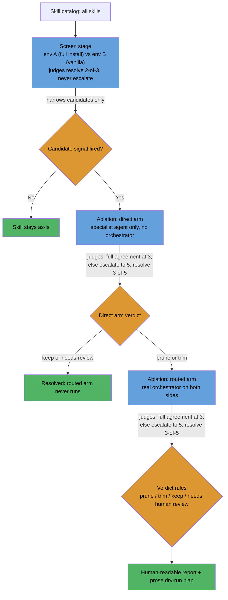
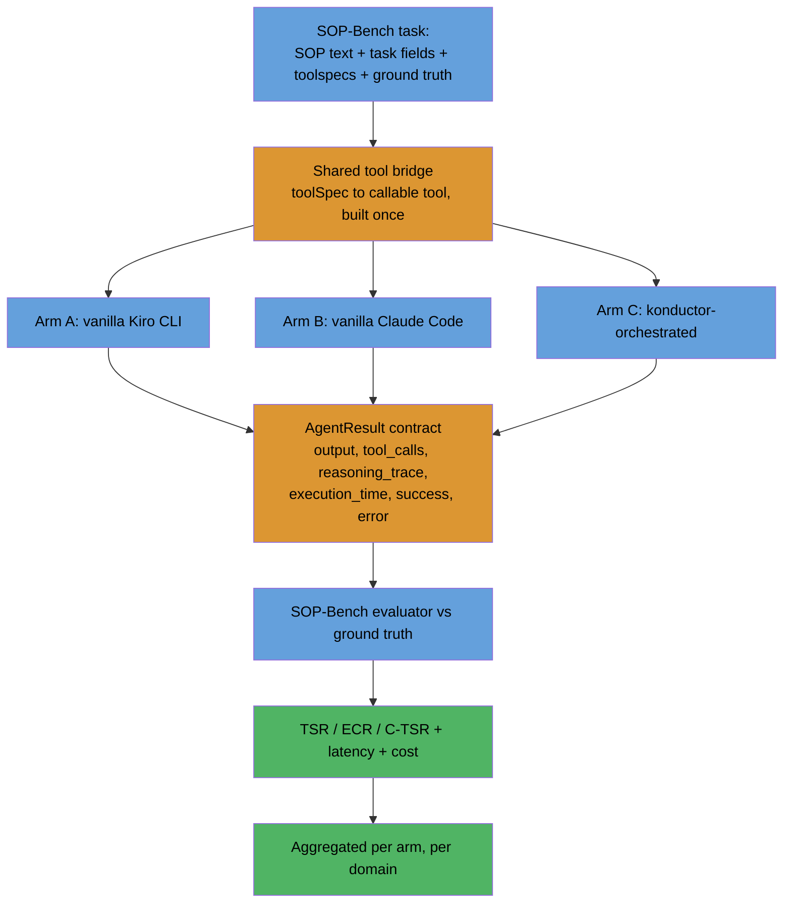

# Skill Benchmarking Design

## Problem

Konductor ships 82 skills under `skills/`, and nothing measures whether any one of them earns its token cost or duplicates another skill's coverage: deciding what to prune or trim today means reading descriptions, not evidence. Separately, konductor has no answer to a more basic question: does routing a task through its orchestrator and specialist agents actually outperform handing the same task to a vanilla Kiro CLI or vanilla Claude Code session with no konductor skills loaded at all. This design covers both: a decision framework for which skills to prune or trim, and a methodology for measuring whether the orchestration layer itself is worth it.

## Solution Overview

Two independent mechanisms, not one system, so there is no single architecture diagram that covers both: each gets its own flow diagram below. Objective 1 is a screen-then-ablate pipeline that turns 82 skill descriptions into evidence-backed prune, trim, or keep verdicts, judged by an LLM council rather than a single model's opinion. Objective 2 is a three-arm comparison, scored against SOP-Bench's own ground truth, that answers whether konductor's orchestration actually beats a vanilla CLI session on real tasks. They share no code path and answer different questions; see "Relationship between the two objectives" below for exactly how they relate. Both ship as part of konductor itself, behind a `konductor bench` subcommand any konductor user can run against their own install, not as a one-off internal exercise run by a single team.

## Decision Requested

Approval to build and run both mechanisms: the screen-then-ablate skill audit, so skill prune/trim decisions stop being a read-and-guess exercise, and the SOP-Bench three-arm pilot, so konductor's orchestration claim has a ground-truth-anchored answer instead of an assumption. Both carry real API/Bedrock cost and need a separate go-ahead before any task actually runs; see "Minimal pilot" below for the specific items gated on that approval.

## How It Works

### Objective 1: Skill prune/trim decisions

This mechanism has a limitation worth stating plainly: scenario-based ablation measures whether a skill performs its stated capabilities, not whether those capabilities are what users actually need day-to-day. A skill can score well here while rarely mattering in practice.

#### Screen stage

A cheap, whole-install comparison: the full konductor install (env A) against a vanilla harness with no konductor skills (env B), run across every skill's core scenarios. This is whole-stack, not skill-scoped. Env A and env B differ in every skill and the orchestrator at once, so a screen result can't be pinned on one skill's own content. The screen's only job is narrowing 82 skills down to a candidate list. It never makes a final prune, trim, or keep decision on its own.

A skill becomes a candidate if any of these fire:

- It didn't activate in env A on its own scenarios.
- Env A isn't better than env B on the skill's scenarios.
- Another skill activated instead of it (overlap).
- Its rendered `SKILL.md` exceeds a configured token threshold.

#### Ablation stage

Per-skill isolation, in two arms:

- **Direct arm.** Invokes the specialist agent that owns the skill (e.g. an architecture agent for `threat-modeling`), never the orchestrator. Removing the skill can't change which agent runs the scenario, only what that agent does with it.
- **Routed arm.** Invokes the real konductor orchestrator on both sides. It only runs if the direct arm's result is prune or trim. If the direct arm says keep, the routed arm never runs.

The direct arm runs first and resolves keep or needs-human-review on its own evidence. If it resolves to prune or trim, the routed arm checks whether that effect survives real routing, not just the specialist agent in isolation.

#### Judging

An LLM-judge council, not a single model. The base panel is 3 judges: Claude Opus 5.5, GPT-6 Astra, and Grok 4.7. On disagreement, the panel escalates to 5 by adding 2 more judges, chosen by rule, not from a fixed roster. Each escalation candidate must (a) come from a model family with no significant training lineage overlap with the models or skills under evaluation (a judge heavily distilled from one candidate's outputs inherits that candidate's stylistic bias and cannot judge it independently), and (b) pass a basic reliability check (consistent, parseable output across repeated trials) before joining the active panel. A candidate that fails the reliability check is excluded, not swapped in for an untested alternative by default. Panels composed partly of judges that share training lineage with a candidate system risk systematic bias toward that system, so panel composition is screened for both independence and reliability before judges are added, never assumed from a model's general capability.

The panel's own independence rule rules out a harness that can only reach one model family. Raw Bedrock Converse calls, the original baseline, can't be assumed to reach every judge above either, since not every provider in the panel is necessarily available through Bedrock. The council instead runs on a single harness, OpenCode CLI, that reaches every required provider (Bedrock, plus direct xAI, OpenAI, and Anthropic access) from one place and runs headless with tool access on by default, so a judge can read scenario artifacts on demand instead of being limited to whatever fits in one upfront call. This applies to both the screen and ablation stages: splitting harnesses by stage would require the base panel's own models to be fully reachable through Bedrock alone, and that hasn't been confirmed, so the design doesn't assume it. One open item carries forward as a residual risk, not a settled fact: whether this harness's headless mode actually retains full tool access, versus just being documented to, is unconfirmed and needs a smoke test before this choice is relied on in production. (See the Appendix for the harness's exact headless invocation shape.)

Reasoning-effort tiers cap how much a call is allowed to reason, they don't multiply its cost. Judging is a comparison task, so it should run at a high effort tier for consistency; pushing past that to the top tier forces reasoning even on trivial sub-steps and raises cost with no reliability payoff, so top-tier settings should be avoided across the harness, not only here.

- The screen stage resolves on 2-of-3 agreement and never escalates. It's cheap and only narrows candidates, so a close vote there isn't worth the extra judgment cost.
- The ablation stage requires full agreement to resolve at 3 judges. Any disagreement or abstention escalates to the 2 additional judges, resolving on 3-of-5 agreement. If that still doesn't produce a majority, the pair is unresolved.

#### Scenarios

A scenario is a prompt plus fixtures plus judge notes, not just a prompt: `code-review` needs a diff to review, `threat-modeling` needs a system description. Judge notes are drafted blind, from a plain description of the task before the generator reads the skill's own body, then reconciled against what the skill claims to do. Drafting blind stops the notes from scoring "looks like this skill's output" over "actually solves the task."

Two scenario sets:

- **Core**: 3 scenarios (trigger, variation, near-miss), built for every skill up front. Runs against the screen.
- **Coverage**: a floor of 5, no cap, enumerating the skill's distinct capabilities, modes, and edge cases. Built only once a skill becomes a candidate. Runs against ablation.

Near-miss scenarios check that an unrelated skill doesn't fire when it shouldn't. They're borrowed from a neighboring skill's own approved trigger scenario where one exists, since a borrowed near-miss is already reviewed and is the confusion most likely to come up in real use. A skill with no neighbor gets no near-miss by default, and the report says "near-miss untested," not "well-scoped." Those are different claims, and conflating them would overstate confidence in a skill that was never actually checked for over-triggering.

#### Verdict rules

| Verdict | Condition |
|---|---|
| Prune | Ablated variant not worse in at least 90% of resolved own/overlap pairs, no pair strongly favors the original, and the near-miss condition holds |
| Trim | Same bar, scoped to the specific sections a coverage scenario named and the direct arm showed unneeded |
| Keep | Neither bar is met |
| Needs human review | More than 20% of pairs are unresolved or failed, coverage is incomplete, synth failed, or there's a routing regression |

The direct and routed arms can also disagree with each other: both landing on prune, or both on trim, lets that action enter the plan. One saying prune and the other trim forces human review ("arm mismatch"). The routed arm coming back keep, or staying unresolved, after the direct arm already resolved to prune or trim also forces human review ("routing regression"). The routed arm is the final gate before anything reaches the plan.

#### Output

A human-readable report, plus a prose implementation plan, not a JSON file, with one entry per ablation-confirmed prune or trim. Any agent consuming the plan defaults to dry-run: it prints the proposed change without touching disk and requires explicit confirmation before it executes anything. There's no auto-execution path.

### Objective 2: Score comparison vs vanilla Kiro and vanilla Claude

#### The three arms

- **Arm A, vanilla Kiro CLI.** `kiro-cli chat --no-interactive --trust-all-tools` (optionally `--output-format stream-json`), with `KIRO_API_KEY` set. No konductor agent-spec or skills installed; only the benchmark's own narrow toolset is exposed.
- **Arm B, vanilla Claude Code.** `claude -p --permission-mode bypassPermissions`, with no konductor `--agent` flag and no konductor skills. Same narrow benchmark toolset as Arm A.
- **Arm C, konductor-orchestrated.** The real konductor orchestrator agent-spec, invoked headlessly (today, through Claude Code), routing live to specialist subagents and skills.

#### Shared prerequisite: the tool bridge

All three arms need one thing built first: a bridge that translates SOP-Bench's mock tools (its Bedrock `toolSpec` definitions, plus its `AgentResult` contract: `output`, `tool_calls` keyed `"tool"`, `reasoning_trace`, `execution_time`, `success`, `error`) into something each CLI's wrapper can actually call. This is one build, amortized across all three arms, not a separate cost per arm. (See the Appendix for the exact contract shape and the two tool-bridge options under consideration.)

#### What's net-new per arm

Arm B is cheap: it reuses konductor's existing, already-proven `tests/judges/claude-code-agent-runner.js` wrapper, just invoked with no agent and no skills attached. Arm A is real new engineering: no Kiro-equivalent wrapper exists today, Kiro CLI has no native turn cap the way Claude Code's single-turn `-p` mode does, so one has to be built from scratch, and parsing Kiro's `stream-json` output shape is unvalidated. Arm C's cost is a different shape entirely: a single SOP-Bench task can fan out into several subagent spawns, multiplying latency and cost against a single-shot vanilla call. That's a sampling-size constraint on Arm C by design, not a budget accident, so Arm C should run at a smaller sample than Arms A and B on purpose.

#### The hypothesis

SOP-Bench's own published finding is that padding a 6-tool kit with 20 irrelevant tools nearly halved task success rate: tool-clutter sensitivity. If a vanilla CLI were exposed to konductor's full tool and skill surface instead of just the benchmark's own toolset, that finding predicts a real clutter penalty. konductor's orchestrator is built to route each task to a narrower specialist tool subset specifically to avoid that clutter. The real question this comparison is after: does konductor's routing offset the clutter penalty a vanilla agent would suffer under the same broad surface, or does orchestration overhead (routing errors, multi-hop handoff loss) introduce its own penalty that cancels the benefit?

There's a gap in the three-arm design as stated: Arms A and B above use only the benchmark's own narrow toolset, not konductor's full tool and skill surface. Actually measuring the clutter-penalty side of this hypothesis needs either a fourth condition (a vanilla CLI exposed to konductor's full tool surface) or running Arms A and B under both toolset configurations. That's a design gap still to resolve, not something the current three arms already settle.

#### Metrics

Track four numbers side by side, per arm, per domain: TSR (the headline number), ECR, and C-TSR, all three scored straight from SOP-Bench's own ground truth, plus wall-clock latency per task and dollar cost per task. Correctness alone isn't the question here: a TSR win at four times the cost is a different conclusion from a TSR win at parity.

#### Minimal pilot

Start with 1-2 of SOP-Bench's 14 real domains, not the 10 its README table advertises, picking the ones with the smallest toolsets: lowest clutter risk, cheapest tool bridge to build (`content_flagging` is a reasonable first pick). Run a small task sample, not a full domain and not the full 2,153-task corpus. Use the Claude Code wrapper for all three arms at first. Arm C already runs on it, and Arm B is just the same wrapper pointed at no agent and no skills. Defer building the Kiro wrapper (Arm A) until the Claude-only pilot validates the harness and produces a usable signal.

Three things need a separate go-ahead before any of this runs: real API/Bedrock cost (every arm, every scenario), the tool-bridge build itself, and specifically the Kiro-wrapper build, which is sequenced after the Claude-only pilot rather than bundled into the initial approval.

## Relationship between the two objectives

The three-arm comparison is a legitimate sibling to Objective 1's screen stage. Both ask "does konductor help, compared to vanilla," and the three-arm comparison has a stronger ground-truth anchor than the judge-council approach, since SOP-Bench's TSR/ECR/C-TSR score against known-correct answers rather than a model's opinion of quality. But it answers a different question. It produces one whole-install verdict: does orchestration add value at all. Objective 1's screen-and-ablation mechanism produces a per-skill candidate list: which specific skills to prune or trim. The three-arm comparison can corroborate or sanity-check the screen stage's result. It does not substitute for Objective 1's mechanism, and it shouldn't be forced into one.

## Open questions

- Does testing the clutter-penalty half of Objective 2's hypothesis need a fourth arm (a vanilla CLI exposed to konductor's full tool and skill surface), or running Arms A and B under both toolset configurations? Neither is built into the current three-arm design.
- Is Kiro CLI's session-log signal reliable enough to tell whether a skill actually loaded during a direct-arm ablation run, or does the skill-load check in Objective 1 need a dedicated log level first?
- Do the 90% no-regression and 20% max-unresolved thresholds in Objective 1's verdict rules hold once checked against real pilot pair outcomes, or are they only reasonable starting points?
- What's the real escalation rate for ablation council votes, meaning how often a 3-judge disagreement forces escalation to 5? That number is needed to size judge-call cost realistically; right now it's an unmeasured guess.
- If judging ever moves from ad-hoc comparative scoring to a known-good-answer or fixed-rubric model, where should that reference data live so a candidate agent's own tool or search access can't retrieve it?
- Should the benchmark runner's output format align with an existing external reporting or results-visualization platform, rather than building bespoke reporting from scratch?

## Appendix: Implementation Reference

This section holds detail an implementer needs; it is not required to understand the design above. It is confined here so the main body stays readable without it.

### CLI surface: `konductor bench` dispatch

Both mechanisms are intended to ship behind a thin `konductor bench` command that dispatches to the benchmarking logic, the same way `konductor` already dispatches to its other subcommands. Objective 1's two stages map to subcommand modes `konductor bench screen` and `konductor bench ablate`; Objective 2's three-arm comparison maps to `konductor bench compare`. This is the intended CLI shape only, not a flag or argument spec; that level of detail isn't established yet.

### The `AgentResult` contract (Objective 2's shared tool bridge)

SOP-Bench's real plug-in contract is a `BaseAgent` subclass whose `execute(sop, task, tools)` returns an `AgentResult` dataclass instance, not a plain dict. The fields are `output: Any`, `tool_calls: List[Dict]` (each dict keyed `"tool"`, not `"tool_name"`), `reasoning_trace: Optional[str]`, `execution_time: float`, `success: bool = True`, `error: Optional[str] = None`. SOP-Bench's own evaluator does direct attribute access (`agent_result.success`, `.output`, `.tool_calls`, `.reasoning_trace`, `.error`); a dict has none of those attributes and raises on first access. Every wrapper built for any of the three arms must construct a real `AgentResult`.

`tools` passed into `execute()` is a `ToolManager` instance, not a plain list, exposing `.get_tool_specs()`, `.get_tool_spec(name)`, `.execute_tool(name, params)`, `.get_tool_names()`.

### CLI invocations per arm

- **Arm C (konductor-orchestrated) and Arm B (vanilla Claude Code).** Both reuse the same already-proven wrapper (`tests/judges/claude-code-agent-runner.js`), differing only in whether `--agent <name>` and konductor's skills are attached. The full invocation: `claude --agent <name> -p --output-format stream-json --input-format stream-json --permission-mode bypassPermissions [--model <id>]`, with the prompt written to stdin as a single stream-json line after a warmup grace period (to let any MCP servers finish connecting before the model's tool list is snapshotted). Arm B is the identical invocation with `--agent <name>` and the skill-loading step omitted. The response is parsed from the stream-json event stream: the final answer is `event.result` from the `type: "result"` event, falling back to concatenating `text` content blocks from `assistant` events.
  - A real constraint on both arms' fidelity: a top-level `claude --agent <name> -p ...` session has been empirically observed to expose only `Read, Write, Edit, Bash, WebFetch` to the model at runtime regardless of the agent file's declared `tools:` frontmatter. `Glob`, `Grep`, `WebSearch`, `TodoWrite`, and any `mcp__*` tool are silently dropped even when declared. No MCP wiring exists in this harness today, so an MCP-shaped tool bridge (see below) would need that gap closed first.
  - `--permission-mode bypassPermissions` disables Claude Code's approval prompts entirely; it must only run inside a disposable container, VM, or scratch directory, never against a real checkout or with real credentials.
- **Arm A (vanilla Kiro CLI).** `kiro-cli chat --no-interactive --trust-all-tools [--output-format stream-json]`, with `KIRO_API_KEY` set. No wrapper exists for this arm yet; it is deferred in konductor's own roadmap as not yet implemented, with lower gate-fidelity than the Claude Code path (no structured JSON stream, no turn cap) and its own scoring-robustness work still needed.

### SOP-Bench benchmark-folder contract

Each benchmark folder under `src/amazon_sop_bench/benchmarks/data/<name>/` must carry `sop.txt` (the full SOP text, loaded verbatim), `tools.py` (a plain Python class, conventionally named `*Manager`, with a `process_tool_call(tool_name, parameters) -> dict` dispatcher), and `toolspecs.json` (a JSON array of Bedrock Converse API `toolSpec` objects: `{"toolSpec": {"name", "description", "inputSchema": {"json": <JSON-Schema>}}}`). Test data must be named `test_set_with_outputs.csv` or `test_set.csv`; a `data.csv` file, despite being documented elsewhere as the expected name, is never read by the actual discovery logic. `metadata.json` carries `name`, `output_columns`, and `input_columns`; the latter should always be set explicitly for a new benchmark, since omitting it passes the entire CSV row, including the ground-truth columns, to the agent as its task input.

### Tool bridge: the two options

Neither side has a working tool bridge today. Two options, in increasing fidelity:

- **Text-parsed loop (lower effort, lower fidelity).** The wrapper agent parses an intended tool call out of the model's text response using a convention it instructs the model to follow, calls the tool directly in Python, and starts a new CLI turn with the SOP, task, prior transcript, and the tool's result appended, repeating until a final answer appears. This duplicates logic SOP-Bench's own Bedrock-based agents already have, and loses native tool-call telemetry.
- **MCP bridge (higher effort, higher fidelity).** A small MCP server dynamically imports a benchmark's `tools.py` manager class and exposes each `toolspecs.json` entry as one MCP tool, copying its Bedrock `inputSchema.json` across as the MCP tool's `inputSchema` (both are plain JSON-Schema, so this is close to a direct copy). The CLI invocation would need `--mcp-config <generated.json>` added on top of the invocation above; this flag is not currently passed by konductor's own runner.

### Judge harness invocation (Objective 1)

The judge council's OpenCode CLI harness is invoked headlessly as `opencode run --format json --auto`. Whether this headless mode actually retains full tool access, as opposed to just being documented to, is the smoke-test item carried in the Judging section above and is not yet confirmed.
