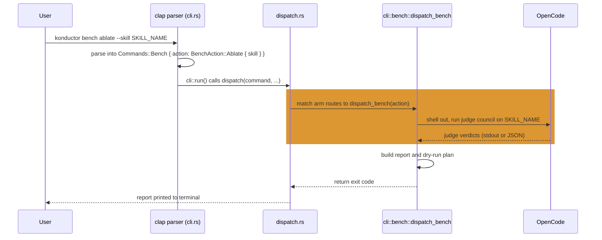

# Implementation Plan

Back to [index.md](./index.md).

## Table of Contents

- [Phases](#phases)
- [CLI Surface and Dispatch](#cli-surface-and-dispatch)
- [Example Sessions](#example-sessions)
- [`konductor bench doctor`](#konductor-bench-doctor)
- [Installation](#installation)
- [Isolation and Sandbox Requirements](#isolation-and-sandbox-requirements)
- [Testing and CI](#testing-and-ci)
- [Cost Approval Gate](#cost-approval-gate)
- [Appendix: Contracts](#appendix-contracts)

No phase below begins without the separate go-ahead already required for real API/Bedrock cost, the
tool-bridge build, and the Kiro-wrapper build specifically; see [Cost Approval
Gate](#cost-approval-gate) for the full requirement. `konductor bench` has no CI pipeline yet to
automate phase-exit checks (see [index.md Open Questions](./index.md#open-questions)), so until
Phase 5b resolves that gap, each exit criterion is implementer-verified, not CI-gated.

## Phases

| Phase | Goal | Depends on | Exit criterion |
| --- | --- | --- | --- |
| 1. Objective 1 pilot, minimal panel | Screen-then-ablate against a pilot cohort (5-6 skills, 25-30+ pairs at the Coverage floor of 5), primary 3-judge panel only. Build the signoff checker, the provenance-tag checker ([detail](./benchmark-protocol.md#data-handling)), and the trace normalizer ([detail](./benchmark-protocol.md#trace-normalization-layer)) early: Phase 2's Arm C tool-availability check depends on the normalizer too | None; independent of Phase 2 | Ablation cycle resolves from the primary 3 judges alone, zero fallback invocations, pairs keep accumulating (see note below). Heuristic-baseline gate (below) has run and is recorded. All 3 base-panel seats pass their reliability check. Signoff and provenance checkers each validated at 5-accept/5-reject, zero false positives or negatives. OpenCode's headless smoke test passed, or the harness choice was re-evaluated within this phase (see note below) |
| 2. Objective 2 pilot, two arms | Verify or patch `input_columns` in the pilot domain's `metadata.json` ([detail](#sop-bench-benchmark-folder-contract)). Run Arm B and Arm C only, on the proven Claude Code wrapper, against 1-2 low-tool-count domains | Trace normalizer, built in Phase 1 (required for Arm C's tool-availability check; see [benchmark-protocol.md's Trace Normalization Layer](./benchmark-protocol.md#trace-normalization-layer)); otherwise independent of Phase 1 | Tool bridge and metrics schema validate: `tool_calls` meets the Tool Bridge section's own degraded threshold (fewer than half the ground truth's expected call count, or empty when at least one call was expected, is flagged as degraded, not fabricated; see [benchmark-protocol.md's Tool Bridge](./benchmark-protocol.md#tool-bridge)), and `schema_version` is present. Each arm's wrapper enforces its tool allowlist, refusing to run if the resolved tool list exceeds it ([detail](#isolation-and-sandbox-requirements)); a low-privilege-user fallback run logs itself as a known limitation. An isolated arm run is confirmed to authenticate successfully under `--setting-sources ""` ([detail](#isolation-and-sandbox-requirements)). `Skill` and `Agent` delegation are confirmed functional under the allowlist. Negative checks pass at top level and inside an `Agent`-spawned subagent: a disallowed Bash call, a disallowed write, and a disallowed network call each fail to produce their on-disk marker file, checked directly rather than taken from the model's own report. `input_columns` verified or patched before the first task |
| 3. Objective 2 third arm | Build the Kiro CLI wrapper; add Arm A | Phase 2's pilot validates the harness | Arm A emits the same metrics shape with its skill-load heuristic in place ([detail](#kiro-skill-load-detection)); same tool-allowlist-or-fallback rule as Phase 2, confirmed using `--trust-tools`. The same negative checks as Phase 2 (disallowed Bash, write, and network calls each fail, verified by an absent on-disk marker file) are confirmed under Kiro's `--no-interactive` refusal behavior. The Kiro wrapper has its own test coverage ([detail](#testing-and-ci)) |
| 4. CLI integration | Wire `konductor bench` into konductor-rs ([detail](#cli-surface-and-dispatch)) | Phases 1-3 validate the mechanics first. Not dependent on Phase 5a: the thresholds are runtime config the CLI reads, not a precondition for the CLI existing | `screen`, `ablate`, `compare`, `doctor` dispatch to real logic, not stubs. Fallback if CLI integration proves impractical: a standalone `konductor-bench` binary via a thin wrapper. May ship with provisional 90%/20%/30% and 2x-ceiling defaults pending Phase 5a/5b |
| 5a. Verdict-threshold validation | Check 90%, 20%, 30% against real pilot outcomes; revise if unsupported | 20+ resolved pairs accumulated from Phase 1 (see note below), checked before this phase begins. Phase 4 excluded: it generates no pairs | Each threshold confirmed or replaced, recorded in index.md Open Questions and this table |
| 5b. Hardening | Resolve remaining open items: escalation rate, Arm C's sample floor, CI/test strategy, schema versioning, the cost/latency decision rule | 20+ resolved pairs accumulated (same accounting as 5a), plus one full two-arm run from Phase 2. 5a tracked separately | Each item in [index.md Open Questions](./index.md#open-questions) is answered or revised, backed by measured data |

### The heuristic-baseline gate (Phase 1)

Before building the signoff and provenance checkers, Phase 1 runs a one-day heuristic baseline
against its own pilot cohort: scoring each skill with the existing token-count threshold signal plus
one engineer hand-scoring the same skills against their Core scenarios, no LLM judge involved.
Comparing that baseline against this phase's own judge-council verdicts for the same cohort is a
proportionality and cost-justification check, not a correctness check, since no independent
ground-truth oracle exists for Objective 1 the way SOP-Bench provides one for Objective 2. If the
heuristic and judge-council verdicts agree on at least two-thirds of the cohort, rounded down, with
a minimum of 3 matched verdicts regardless of cohort size, that agreement validates building the
full checker/judge-council apparatus as proportionate. If not, rescope toward heuristic triage,
using the judge-council panel only as a spot-check on skills the heuristic flags as disagreeing or
ambiguous.

### If the OpenCode smoke test fails (Phase 1)

If the OpenCode headless tool-access smoke test fails, Objective 1's judge-harness choice is
re-evaluated within this same phase, not deferred to a later follow-up. The first thing to try is
Claude Code's own direct Bedrock Converse access, already in use for Arms B and C, for at least the
Anthropic seat, accepting the loss of on-demand artifact reading that OpenCode provides. A decision
on how to proceed is recorded before Phase 1 is considered complete.

### Margin on the pilot-cohort pair count (Phase 1)

The cohort's 25-30+ pairs floor has little room to spare. At the document's own routine 20%
unresolved rate (see [benchmark-protocol.md's Verdict Rules and
Thresholds](./benchmark-protocol.md#verdict-rules-and-thresholds)), 25 attempted pairs nets to 20
resolved pairs, exactly the floor Phase 5a and Phase 5b require below, with no margin to spare. Pair
accumulation continuing past Phase 1 (see [Ablation-pair accumulation](#ablation-pair-accumulation)
below) is what mitigates this, not a buffer built into the cohort size itself.

### Ablation-pair accumulation

Ablation-pair accumulation for Objective 1 is not frozen once Phase 1's own exit criterion is met:
the screen-then-ablate pipeline keeps running against additional skills continuously from Phase 1
onward, independent of Objective 2's own phase progress. This accumulation has no dependency on
Phase 2 or Phase 3 reaching any particular milestone, since Objective 1's pair count comes entirely
from Phase 1's own ongoing pipeline. Phase 4 falls outside this accounting window entirely: it is
CLI plumbing and generates no ablation pairs, so it proceeds and completes independently of this
accumulation and of Phase 5a's threshold validation. Phase 5a's and Phase 5b's "20 resolved ablation
pairs" gate applies to this cumulative total, checked before either phase's own work begins, not
implicitly satisfied the moment Phase 1 alone reaches its initial-cycle exit criterion.

## CLI Surface and Dispatch

konductor-rs parses arguments with `clap`'s derive macros. The top-level `Commands` enum lives in
`src/cli.rs`, and dispatch runs through a deliberate, static `match` in `src/cli/dispatch.rs`, not a
dynamic command registry. The codebase's existing registry mechanisms (`cli/install/registry.rs`,
`cli/synth/registry.rs`) pick a harness strategy within one already-parsed command; they are not a
mechanism for registering new top-level subcommands, and `bench` would not use them for that
purpose.

`bench` follows the exact precedent of the existing `Config` command: `Commands::Bench { action:
BenchAction }`, with `BenchAction::{Screen, Ablate, Compare, Doctor}` matching Objective 1's screen
and ablate modes, Objective 2's compare mode, and the dependency preflight below. This needs a new
`pub(crate) mod bench;` line in `src/cli.rs`, plus a new `src/cli/bench.rs` (or a `bench/` directory
with one file per action, matching the `install/`/`synth/` layout). None of these files exist yet;
there is a pattern to follow, not a scaffold to extend.

Dispatch follows the same per-command function convention already in the codebase:
`dispatch_install_with` and `dispatch_doctor_with` each live in their own command's module and are
called from a single arm in `dispatch.rs`. `dispatch_bench` sits in `cli/bench.rs` the same way.

`bench` is konductor-rs's first subcommand to shell out to a genuine external tool from production
code. The only existing use of `std::process::Command` outside test code is the self-update path's
own smoke test, which spawns the binary konductor just downloaded to confirm it runs; that is
konductor checking its own output, not calling a third-party tool. `bench` shelling out to OpenCode
for Objective 1's judging, or to a SOP-Bench Python checkout for Objective 2's comparison, are two
separate, novel external-process integrations that can proceed in parallel, but each needs its own
narrow validation step, not a single combined validation that only exercises one.

`konductor bench doctor` and the existing top-level `konductor doctor` do not technically collide:
clap scopes a nested subcommand under its own parent. The repeated name is still worth flagging for
a human reader, since skimming `--help` output invites confusing the two.



This shows the `ablate` path, the one that shells out to OpenCode. `compare` differs only in which
external process it talks to: `dispatch_bench` shells out to a local SOP-Bench checkout instead,
routed through the same match arm. `screen` calls OpenCode the same way `ablate` does; `doctor` has
no external process to shell out to, since it only checks whether dependencies are present.

Every external call carries a timeout, and on failure there is no silent partial result: a timed-out
or failed call fails that task cleanly and is recorded as a failed or unresolved pair, never a
fabricated verdict. A call that already sent data it should not have is a distinct failure case:
once scenario content has left konductor's system boundary to a judge model (see
[benchmark-protocol.md's Data Handling](./benchmark-protocol.md#data-handling)), a later timeout or
error on that same call does not undo the disclosure.

## Example Sessions

*(Illustrative, not a finalized spec.)* The sessions below show the shape of a `konductor bench`
run, using the subcommand names already named in [CLI Surface and
Dispatch](#cli-surface-and-dispatch). They are not a finalized flag or argument spec. The screen
example illustrates full-scale usage against the complete 82-skill catalog once `konductor bench` is
built and CLI-integrated (see [Phases](#phases), Phase 4); the actual first pilot run is scoped to
the smaller cohort of at least 5-6 skills described in Phase 1.

**Objective 1, screening the skill catalog:**

```
$ konductor bench doctor
OpenCode: found on PATH, Bedrock provider configured.
SOP-Bench: not needed for this objective.
Run configuration: valid (no evaluator/arm mismatch detected).

$ konductor bench screen
Screening 82 skills against env A (full install) and env B (vanilla)...
14 skills flagged as candidates for ablation:
  - threat-modeling (env A not better than env B on 2/3 core scenarios)
  - cost-estimation (overlap: iam-policy-design activated instead)
  - ...
Run `konductor bench ablate --skill <name>` on a candidate to confirm.

$ konductor bench ablate --skill threat-modeling
Direct arm: 5 Coverage scenarios, judge council resolving...
Direct arm verdict: trim (sections 3-4 unneeded)
Routed arm: confirming under real orchestrator routing...
Routed arm verdict: trim (confirmed)

Report written. Dry-run plan: 1 trim action.
Run with --execute to apply (requires confirmation).
```

**Objective 2, comparing konductor against vanilla CLIs:**

```
$ konductor bench doctor
OpenCode: not needed for this objective.
SOP-Bench: found at ~/sop-bench, Python environment active.
Run configuration: valid (no evaluator/arm mismatch detected).

$ konductor bench compare --domain content_flagging --samples 10
Building tool bridge for content_flagging...
Running 10 tasks across 3 arms (Kiro, Claude, konductor)...

Domain: content_flagging (10 samples)
Arm        TSR    ECR    C-TSR  Latency (p50)  Cost/task
Kiro       60%    55%    50%    4.2s           $0.03
Claude     70%    65%    60%    3.8s           $0.04
konductor  80%    75%    70%    9.1s           $0.11
```

This three-arm shape is the post-Phase-3 target, once Arm A's Kiro wrapper is built; the actual first
pilot (see [benchmark-protocol.md's Minimal
pilot](./benchmark-protocol.md#minimal-pilot)) runs only Arm B and Arm C. The metrics table above is
a placeholder shape, not a measured result; the real report format isn't established yet.

## `konductor bench doctor`

A `konductor bench doctor` subcommand checks for both external dependencies before any benchmark
run:

- Whether OpenCode is on `PATH` and has a configured model provider.
- Whether a SOP-Bench checkout, with its own Python environment, exists at a configured path.

Where something is missing, `doctor` reports exactly what to install and how, rather than installing
anything itself (see
[ADR-4](./index.md#adr-4-check-and-instruct-over-auto-install-for-konductor-bench-doctor)).

`doctor` also validates run configuration before any task executes, failing fast on a mismatch
rather than letting a mid-run error surface it: for example, an evaluator that needs a session trace
paired with a source arm that cannot produce one (adopted from Strands Evals SDK's own precondition
checks), or an arm's resolved tool list carrying a tool outside that arm's own allowlist (see
[Isolation and Sandbox Requirements](#isolation-and-sandbox-requirements)). This check runs
alongside the dependency checks above, as part of the same preflight; it is a fail-fast convenience,
not the enforcement boundary. Each arm wrapper's own refusal to execute remains the binding check,
since `doctor` runs before a task is dispatched and cannot stop a wrapper invoked directly outside
it.

## Installation

konductor-bench shells out to two external dependencies it does not vendor or auto-install:
OpenCode, for Objective 1's judge-invocation harness, and a local SOP-Bench checkout, for Objective
2's task and ground-truth source. Both must be installed and configured by the user; neither install
is covered by konductor's own install flow.

**OpenCode.** Install via any of its supported channels: a prebuilt binary, Homebrew, Bun, pnpm,
Docker, or npm. Configure Bedrock access with `AWS_BEARER_TOKEN_BEDROCK`, or fall back to the
standard AWS credential chain. The recommended way to pin a model and provider is an `opencode.json`
config file alongside the project.

**SOP-Bench.** There is no PyPI package. Install from source: `git clone` the repository, then run
`pip install -e .` inside it. SOP-Bench needs its own `.env` file for AWS/Bedrock configuration,
separate from konductor's own environment (see Credential hygiene below).

**Credential hygiene.** Three distinct credential sources are in play across these two dependencies:
AWS credentials for Bedrock access, OpenCode's own direct-provider API keys (xAI, OpenAI, Anthropic)
for the seats routed outside Bedrock, and SOP-Bench's own `.env` file above. All three carry the same
requirement: never commit them, and scope them as narrowly as each provider allows.

## Isolation and Sandbox Requirements

Each arm restricts its agent to an explicit tool allowlist rather than disabling its CLI's approval
gates entirely: the SOP-Bench tool-bridge tools, plus, for Arm C only, the tools konductor needs to
orchestrate (`Skill`, `Agent` subagent delegation, and read-only tools such as `Read`, `Glob`,
`Grep`). No arm's allowlist includes Bash, a file-write tool, or a network tool. SOP-Bench tasks only
need the benchmark's own mock tools, so removing shell and write access removes what a container
would otherwise have contained.

### Verified mechanics (headless test runs)

Two rounds of headless tests confirm how each CLI's isolation flags actually behave:

- **`--allowedTools` only auto-approves; it does not restrict.** A local user setting (for example a
  `defaultMode: auto` permission setting) can override it, letting a non-allowed Bash call run
  anyway. `--tools <list>` is the flag that actually removes built-in tools from the available set.
- **A subagent spawned through the `Agent` tool inherits the parent's `--tools` set.** In the test
  run, the subagent held only the parent's tools and made no Bash call.
- **MCP tools are unaffected by `--tools` and `--allowedTools`.** `--strict-mcp-config` with no
  extra `--mcp-config` reduces the MCP tool set to zero, so each arm passes its own `--mcp-config`
  naming only the SOP-Bench bridge.
- **`--setting-sources ""` isolates the run from local settings.**
- **`--permission-mode manual` hangs a headless run until timeout.** Never use it.
- **Kiro CLI's `--trust-tools=<list>` auto-approves exactly the listed tools.** Under
  `--no-interactive`, any other tool is refused with an explicit error ("tool permission approval is
  not supported in non-interactive mode") and the run exits normally: this mechanism fails closed,
  and no separate tool-removal flag exists or is needed. `--trust-tools` is a real, documented flag
  on this CLI (confirmed via `kiro-cli chat --help`). Run Kiro with an agent configuration that has
  no MCP servers except the bridge.
- A model-side safety classifier produced false-positive refusals on harmless "write a file via a
  subagent" test prompts during these runs. This is a risk to account for when phrasing the Phase 2
  and Phase 3 negative tests below, not evidence of an isolation gap.

### Required invocation pattern

**Claude Code (Arms B and C):** `--tools <list> --allowedTools <same list> --setting-sources ""
--strict-mcp-config --mcp-config <bridge-only config>`, plus the authentication re-supply below where
needed, in place of `--permission-mode bypassPermissions`. Arm B's list is the bridge tools only;
Arm C's list is the bridge tools plus `Skill`, `Agent`, `Read`, `Glob`, `Grep`.

**Kiro CLI (Arm A):** `kiro-cli chat --no-interactive --trust-tools=<bridge-tool-names>`, naming only
the bridge tools, in place of `--trust-all-tools`, run with an agent configuration that has no MCP
servers except the bridge.

**Authentication.** Claude Code on Bedrock authenticates through the standard AWS credential chain:
environment variables (`AWS_PROFILE`, `AWS_REGION`, or
`AWS_ACCESS_KEY_ID`/`AWS_SECRET_ACCESS_KEY`/`AWS_SESSION_TOKEN`, with Claude Code's own Bedrock mode
enabled via its environment variable) or the AWS config/credentials files. Environment variables are
not a settings source, so `--setting-sources ""` does not remove them; this is the documented
mechanism for authenticating an isolated arm run, not yet exercised in the headless test runs above.
For a setup that keeps authentication in user settings instead, re-supply only the authentication
setting via `--settings '<json>'`. Phase 2's exit criterion includes a check that an isolated arm run
actually authenticates (see [Phases](#phases)).

This needs a runnable precondition, not just a repeated prose mandate: each arm's wrapper script
must refuse to execute unless the agent's resolved tool list is a subset of that arm's own
allowlist, checked before the session starts. This is a Phase 2 deliverable for Arm B/C's wrapper
and a Phase 3 deliverable for Arm A's wrapper.

### Run environment

Every arm runs in a fresh, per-run scratch working directory, deleted after the run completes.

**Residual: read tools are not path-confined.** Arm C's `Read`, `Glob`, and `Grep` grant can reach
any file the invoking user can read, including credential files; a scratch working directory does
not change what these tools can see outside it. Mitigation: prefer short-lived credentials passed
through environment variables over credential files on disk, since Arm C has no Bash to read the
process environment, only Read/Glob/Grep to read files on disk. Run arms under an account with no
readable credential files beyond what the CLI's own authentication needs. How to achieve that for a
CLI whose authentication mechanism itself requires locally readable credential material remains an
open question (see [index.md Open Questions](./index.md#open-questions)).

### Fallback: low-privilege OS user

When an arm genuinely needs Bash or write access that its allowlist withholds (for example a
konductor skill that shells out), run that arm as a fallback under:

- a dedicated OS user with no secrets in its home directory;
- a scratch directory created for that run and removed afterward;
- an environment cleared of credentials except what the CLI's own authentication needs;
- the run logged as having used the fallback.

A low-privilege OS user alone does not restrict network egress. Network restriction needs a
container or network namespace on top of it, which remains optional hardening, not a requirement for
any arm (see [index.md's ADR-6](./index.md#adr-6-per-arm-tool-allowlists-instead-of-a-mandatory-container-or-vm)).

## Testing and CI

Each benchmark case runs against a fresh agent instance in a parallel execution pool, with no state
shared between cases (adopted from Strands Harness Optimizer): one case's tool calls, transcript, or
failures never leak into another case running alongside it.

Short of a CI pipeline, each phase's own deliverables still need direct test coverage before that
phase's exit criterion is met:

- **Phases 1 and 2:** the trace normalizer needs fixture tests per CLI (Claude, Kiro, OpenCode),
  driven from captured event streams for each, so a change to the normalizer's parsing logic is
  caught before it silently breaks skill-load detection or metrics.
- **Phase 1:** the signoff checker and the provenance-tag checker each need their own validation
  tests, already named in Phase 1's exit criterion as "5-accept/5-reject, zero false positives or
  negatives" ([detail](#phases)); those tests are the checker's own test suite, not a separate CI
  concern.
- **Phase 3:** the Kiro CLI wrapper needs its own tests covering `--trust-tools` allowlist
  enforcement (a disallowed tool call is refused, not silently dropped), the `--no-interactive`
  refusal error path, and the skill-load path-heuristic detection ([detail](#kiro-skill-load-detection)).
- **Phase 4:** `dispatch_bench`'s argument parsing and match-arm dispatch need unit tests covering
  each `BenchAction` variant (`Screen`, `Ablate`, `Compare`, `Doctor`), the same way the existing
  `install`/`synth` dispatch code is tested.

Wiring these into an actual CI pipeline, and automating the phase-exit checks above, stays Phase 5b's
own open item (see [index.md Open Questions](./index.md#open-questions)); this plan does not resolve
that gap.

## Cost Approval Gate

Four things need a separate go-ahead before any of this runs: real API/Bedrock cost (every arm,
every scenario), the tool-bridge build itself, specifically the Kiro-wrapper build, which is
sequenced after the Claude-only pilot rather than bundled into the initial approval, and data sent to
third-party judge APIs, gated by fixture signoff (see [benchmark-protocol.md's Data
Handling](./benchmark-protocol.md#data-handling)). No phase in [Phases](#phases) begins without this
go-ahead already in place; this plan sequences the work, it does not itself authorize spending.

## Appendix: Contracts

### The `AgentResult` contract

SOP-Bench's real plug-in contract is a `BaseAgent` subclass whose `execute(sop, task, tools)`
returns an `AgentResult` dataclass instance, not a plain dict. The fields: `output: Any`,
`tool_calls: List[Dict]` (each dict keyed `"tool"`, not `"tool_name"`), `reasoning_trace:
Optional[str]`, `execution_time: float`, `success: bool = True`, `error: Optional[str] = None`.
SOP-Bench's own evaluator does direct attribute access (`agent_result.success`, `.output`,
`.tool_calls`, `.reasoning_trace`, `.error`); a dict has none of those attributes and raises on
first access. Every wrapper built for any of the three arms must construct a real `AgentResult`.

Verified against the upstream repo: `tools` passed into `execute()` is typed as `List[Dict[str,
Any]]`, a plain list of dicts, one per `toolspecs.json` entry; no `ToolManager` class exists in the
actual SOP-Bench repository. This is distinct from the per-benchmark `tools.py` dispatcher class
below, which happens to share the word "Manager" in its own conventional name: `execute()`'s `tools`
parameter is a plain list of dicts with no manager object involved.

### SOP-Bench benchmark-folder contract

Each benchmark folder under `src/amazon_sop_bench/benchmarks/data/<name>/` must carry:

| File | Contents |
| --- | --- |
| `sop.txt` | The full SOP text, loaded verbatim |
| `tools.py` | A plain Python class, conventionally named `*Manager`, with a `process_tool_call(tool_name, parameters) -> dict` dispatcher |
| `toolspecs.json` | A JSON array of Bedrock Converse API `toolSpec` objects: `{"toolSpec": {"name", "description", "inputSchema": {"json": <JSON-Schema>}}}` |
| `test_set_with_outputs.csv` or `test_set.csv` | Test data; a `data.csv` file, despite being documented elsewhere as the expected name, is never read by the actual discovery logic |
| `metadata.json` | Carries `name`, `output_columns`, and `input_columns` |

`input_columns` should always be set explicitly for a new benchmark: omitting it passes the entire
CSV row, including the ground-truth columns, to the agent as its task input. This is the exact gap
Phase 2's own exit criterion checks for `content_flagging`, whose `metadata.json` has no
`input_columns` field today (see [Phases](#phases)).

### CLI invocations per arm

**Arm C (konductor-orchestrated) and Arm B (vanilla Claude Code).** Both reuse the same
already-proven wrapper (`tests/judges/claude-code-agent-runner.js`), differing only in whether
`--agent <name>` and konductor's skills are attached. The full invocation: `claude --agent <name> -p
--output-format stream-json --input-format stream-json --allowedTools
"<bridge-tool-names>,Skill,Agent,Read,Glob,Grep" [--model <id>]`, with the prompt written to stdin
as a single stream-json line after a warmup grace period (to let any MCP servers finish connecting
before the model's tool list is snapshotted). Arm B is the identical invocation with `--agent
<name>`, the skill-loading step, and the `Skill`/`Agent`/`Read`/`Glob`/`Grep` allowlist entries all
omitted, since Arm B never routes or delegates and only needs the bridge tools. The response is
parsed from the stream-json event stream: the final answer is `event.result` from the `type:
"result"` event, falling back to concatenating `text` content blocks from `assistant` events.

Arm C's allowlist carries the SOP-Bench bridge tools plus `Skill`, `Agent` (subagent delegation),
and read-only tools (`Read`, `Glob`, `Grep`); it excludes `WebSearch`, `TodoWrite`, Bash, any
file-write tool, and any network tool, regardless of what the agent file's declared `tools:`
frontmatter lists. MCP tools are scoped separately: `--strict-mcp-config` plus a `--mcp-config`
naming only the SOP-Bench bridge reduces the MCP tool set to exactly that bridge, with no other
`mcp__*` tool reachable regardless of connection-warmup timing.

Headless test runs confirm that a subagent spawned through the `Agent` tool inherits the parent's
`--tools` set exactly: the dispatched subagent held only the parent's allowlisted tools and made no
Bash call, confirming that `Skill` and `Agent` delegation both survive under
`--tools`/`--allowedTools` through at least one level of subagent dispatch. Write and Edit tool
access inside a spawned subagent was not separately exercised in these runs (see [index.md Open
Questions](./index.md#open-questions)).

`--tools` is the flag that actually narrows Claude Code's available tool set; `--allowedTools` only
auto-approves within whatever `--tools` already grants, so both are required together (see
[Isolation and Sandbox Requirements](#isolation-and-sandbox-requirements) for the full invocation
pattern and the launch-time precondition this wrapper must enforce).

**Arm A (vanilla Kiro CLI).** `kiro-cli chat --no-interactive --trust-tools=<bridge-tool-names>
[--output-format stream-json]`, with `KIRO_API_KEY` set. `--trust-tools` is `kiro-cli chat`'s own
documented flag for trusting only a named set of tools (confirmed via `kiro-cli chat --help`), used
here in place of `--trust-all-tools` to keep Arm A on the same bridge-tools-only allowlist as Arms B
and C. No wrapper exists for this arm yet; it is deferred in konductor's own roadmap, with lower
gate-fidelity than the Claude Code path (no structured JSON stream, no turn cap) and its own
scoring-robustness work still needed.

### Judge harness invocation

The judge council's OpenCode CLI harness is invoked headlessly as `opencode run --format json
--auto`. Whether this headless mode actually retains full tool access, as opposed to just being
documented to, is the smoke-test item carried in [benchmark-protocol.md's Judge
Panel](./benchmark-protocol.md#judge-panel) and is not yet confirmed.

### Kiro skill-load detection

Verified directly, via real headless Kiro CLI sessions: `--output-format stream-json` has no
dedicated skill-load event type. The stream carries only generic `agent_thought_chunk`,
`agent_message_chunk`, `tool_call`, and `tool_call_update` event types.

Native skill loading surfaces as a generic `read` tool-call event whose path matches a
`.../skills/<name>/SKILL.md` pattern, indistinguishable in type from any other file read. Detecting
it requires path-glob matching against that pattern plus a skill-name-to-install-path map, not a
native structured signal.

An explicit `SkillsTool` tool-call would be an unambiguous signal, but it is deprecated and
scheduled for removal; Kiro's own tooling states this directly in-session. The same signal, or its
absence, is recoverable after the fact from Kiro's persisted session transcripts, for cases where
the live stream wasn't captured end-to-end.

This is a workable heuristic, not a reliable purpose-built signal: it is weaker than Claude Code's
dedicated `Skill` tool-call event, since a path read does not necessarily mean the skill's guidance
was actually followed, and multi-page reads need deduplication. The recommended path forward is to
implement the path-glob heuristic now as one rule inside the trace normalizer (see
[benchmark-protocol.md's Trace Normalization
Layer](./benchmark-protocol.md#trace-normalization-layer)), while separately pursuing a dedicated
structured event upstream in Kiro CLI as the better long-term fix.
