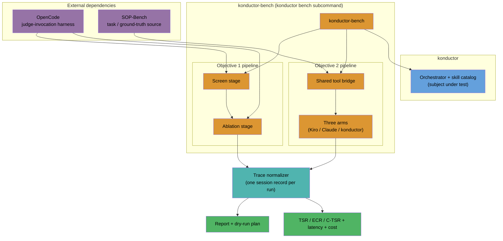
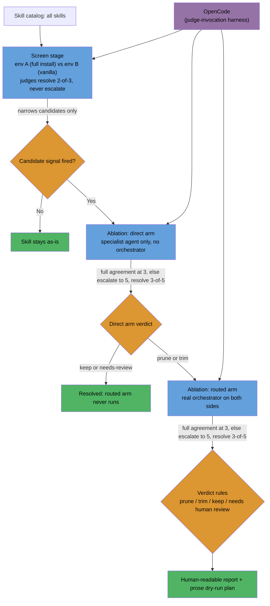
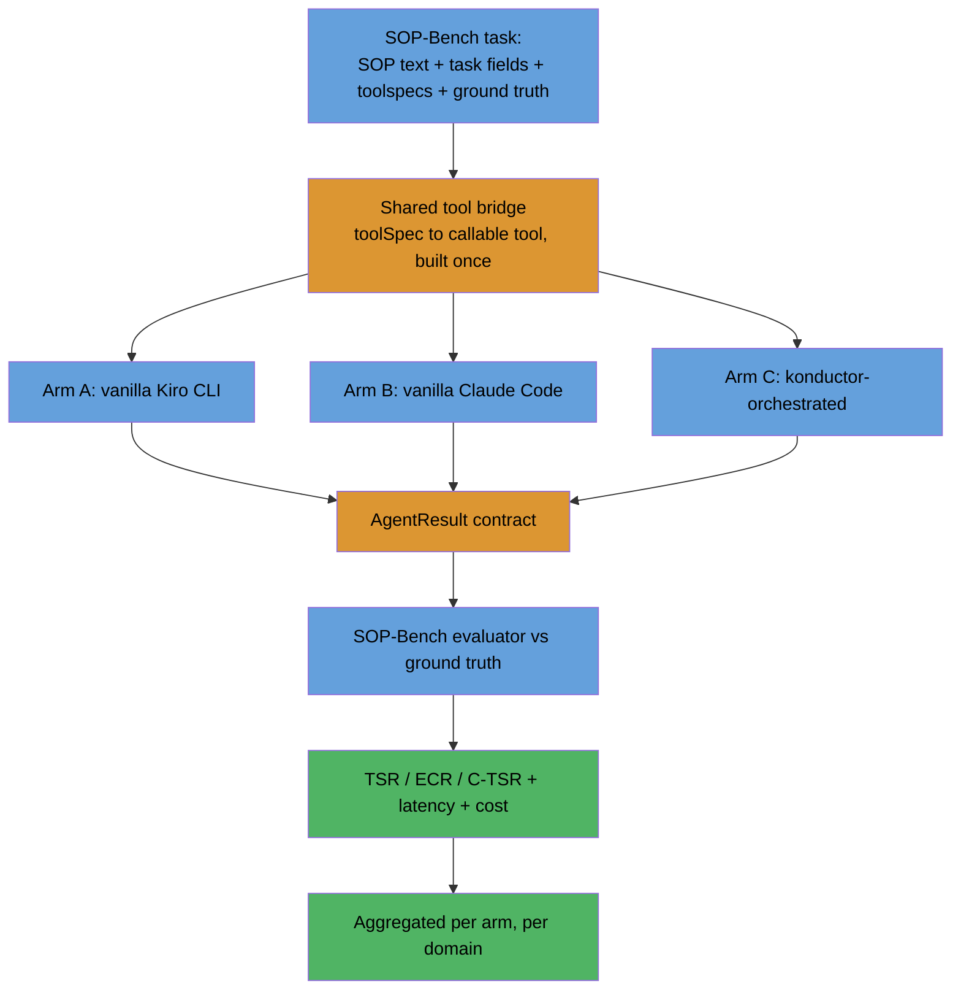

# Skill Benchmarking: Decision Document

A reviewer can approve or reject from this file alone. Implementation detail lives in the two companion docs.

## Table of Contents

[Problem](#problem) | [Requirements](#requirements) | [Solution Overview](#solution-overview) | [Decision Requested](#decision-requested) | [Architecture](#architecture) | [How It Works](#how-it-works) | [Relationship Between the Two Objectives](#relationship-between-the-two-objectives) | [Prior Art and Lessons](#prior-art-and-lessons) | [Architecture Decision Records](#architecture-decision-records) | [Open Questions](#open-questions)

**[benchmark-protocol.md](./benchmark-protocol.md):** Scenarios, Judge Panel, Verdict Rules and Thresholds, Data Handling, Trace Normalization Layer, Run ID and Panel Manifest, Objective 2's Three Arms, Tool Bridge, Metrics and Output Shape.

**[implementation-plan.md](./implementation-plan.md):** Phases, CLI Surface and Dispatch, `konductor bench doctor`, Installation, Isolation and Sandbox Requirements, Testing and CI, Cost Approval Gate, Appendix: Contracts.

## Problem

Konductor ships 82 skills under `skills/`, and nothing measures whether any one of them earns its token cost or duplicates another skill's coverage: deciding what to prune or trim today means reading descriptions, not evidence. Separately, konductor has no answer to a more basic question: does konductor's bundled orchestrator-plus-skill-catalog system actually outperform handing the same task to a vanilla Kiro CLI or vanilla Claude Code session with no konductor skills loaded at all. This design covers both: a decision framework for which skills to prune or trim, and a methodology for measuring whether the orchestration layer itself is worth it.

## Requirements

- Measure, per skill, whether its token cost is earned by evidence rather than by reading its description (Objective 1).
- Support cross-family judge independence, so no single model family's bias decides a skill's fate (Objective 1 judging).
- Produce a prune, trim, or keep verdict backed by a direct-arm and routed-arm ablation, not a single-pass guess (Objective 1).
- Produce an objective, ground-truth-anchored score comparison between konductor's bundled orchestrator-plus-skill-catalog system and vanilla Kiro CLI and vanilla Claude Code sessions (Objective 2).
- Ship as a runnable konductor component under `konductor bench`, usable against any user's own install. CLI integration lands in Phase 4, after Phases 1-3 validate the screen, ablate, and compare mechanics directly ([detail](./implementation-plan.md#phases)).
- Default every automated change to dry-run and no-auto-execution, requiring explicit human confirmation before anything touches disk.
- Track cost and latency alongside correctness, since a correctness win alone is not a sufficient basis for a verdict.

## Solution Overview

Objective 1 is a screen-then-ablate pipeline that turns 82 skill descriptions into evidence-backed prune, trim, or keep verdicts, judged by an LLM council rather than a single model's opinion. Objective 2 is a three-arm comparison, scored against SOP-Bench's own ground truth, that answers whether konductor's bundled orchestrator-plus-skill-catalog system actually beats a vanilla CLI session on real tasks. The two objectives answer different questions with independent measurement and scoring logic, and they share infrastructure: the `konductor bench` dispatcher, the trace normalizer, isolation, and the panel/run manifest (see [Relationship Between the Two Objectives](#relationship-between-the-two-objectives)). Both ship behind one `konductor bench` subcommand any konductor user can run against their own install, rather than two separate tools _(See ADR-5)_.

## Decision Requested

Approve a phased benchmark program that:

- produces evidence before a skill is pruned or trimmed;
- runs a first pilot that is two-arm only (Arms B and C; Arm A follows in Phase 3) and scopes Phase 1's Objective 1 cohort to 5-6 skills ([detail](./implementation-plan.md#phases));
- compares konductor with narrow vanilla baselines without claiming a general finding that irrelevant tools degrade task success (the "clutter" effect SOP-Bench reports; [detail](./benchmark-protocol.md#the-hypothesis-and-its-confound));
- acknowledges the Arm C routing-vs-content confound: a pilot win cannot be attributed to routing alone ([detail](./benchmark-protocol.md#the-hypothesis-and-its-confound));
- keeps skill actions dry-run by default and requires explicit confirmation;
- requires separate approval before real API/Bedrock cost (every arm, every scenario), the tool-bridge build, the Kiro-wrapper build, or third-party data transfer ([detail](./implementation-plan.md#cost-approval-gate)).

Approval is conditional on these pilot gates:

| Gate | Required before use |
| --- | --- |
| Objective 1 judges | Reliability checks and cross-family independence screening pass; panel manifest records the outcome per seat ([detail](./benchmark-protocol.md#run-id-and-panel-manifest)) |
| Third-party judge calls | Fixture content hash matches its signed approval artifact ([detail](./benchmark-protocol.md#data-handling)) |
| Arm tool allowlists | Each arm's agent is restricted to an explicit tool allowlist (the SOP-Bench bridge tools, plus `Skill`/`Agent`/read-only tools for Arm C); no Bash, file-write, or network tool in any arm, except for a logged low-privilege-user fallback run ([detail](./implementation-plan.md#isolation-and-sandbox-requirements)) |
| Skill mutation | Complete panel manifest, dry run, and explicit human confirmation ([detail](./benchmark-protocol.md#output)) |

## Architecture

| Layer | Component | Depends on | Produces |
| --- | --- | --- | --- |
| Subject under test | konductor (orchestrator + skill catalog) | (none) | (none) |
| Dispatcher | konductor-bench, via `konductor bench` | konductor | Benchmark runs for both pipelines |
| Objective 1 pipeline | Screen stage, then Ablation stage | OpenCode | Report and dry-run plan |
| Objective 2 pipeline | Shared tool bridge, then three arms | SOP-Bench | TSR, ECR, C-TSR, latency, cost per arm per domain |
| Trace normalizer | One normalizer per CLI (Kiro, Claude, OpenCode) | CLI session output from each arm | A common typed-step record consumed by skill-load detection, per-turn judging, the panel manifest, and metrics |

Each CLI emits its own step-by-step event stream. The trace normalizer converts every stream into one common session record so the rest of the pipeline reads one shape regardless of which CLI produced it. See [Trace Normalization Layer](./benchmark-protocol.md#trace-normalization-layer) for the record shape and per-CLI mapping.

## How It Works

### Objective 1: Skill Prune/Trim Decisions

Both stages are judged by a model council, not one model's opinion. This mechanism has a real limitation: it measures whether a skill performs its stated capabilities, not whether those capabilities are what users actually need day to day. See [Scenarios](./benchmark-protocol.md#scenarios), [Judge Panel](./benchmark-protocol.md#judge-panel), and [Verdict Rules and Thresholds](./benchmark-protocol.md#verdict-rules-and-thresholds) for how a pair resolves to a verdict.

### Objective 2: Orchestration vs. Vanilla CLIs

All three arms produce the same `AgentResult` shape, scored by SOP-Bench's own evaluator against known-correct answers, not a model's opinion. The comparison answers a narrower question than a general "does konductor help" claim: it benchmarks konductor's bundled orchestrator-plus-skill-catalog system against a narrow single-shot baseline, both arms isolated so neither is ever exposed to konductor's broader tool surface. See [Objective 2: The Three Arms](./benchmark-protocol.md#objective-2-the-three-arms) and [Metrics and Output Shape](./benchmark-protocol.md#metrics-and-output-shape) for the arms, the sample floor, and the decision rule.

## Relationship Between the Two Objectives

The three-arm comparison is a legitimate sibling to Objective 1's screen stage: both ask whether konductor helps compared to vanilla. It has a stronger ground-truth anchor, since SOP-Bench scores against known-correct answers rather than a model's opinion, but it answers a narrower, conditional question. Whether its own methodology even transfers from SOP-Bench's single-agent tool-calling design to judging orchestration value at all is itself an unproven working hypothesis (see [Open Questions](#open-questions)).

Once that transfer holds up, it produces one whole-install signal: whether konductor's bundled orchestrator-plus-skill-catalog system beats a single-shot vanilla baseline. Objective 1's screen-and-ablation mechanism already produces a per-skill candidate list on its own. The three-arm signal can corroborate or sanity-check that list once validated, but does not substitute for it.

OpenCode and SOP-Bench are not competing tools: OpenCode is Objective 1's judge-invocation harness with no ground truth involved, and SOP-Bench is Objective 2's task and ground-truth source with no LLM judging involved.

## Prior Art and Lessons

| Source | Adopted | Not used, and why |
| --- | --- | --- |
| Strands Evals SDK | The three-level judgment taxonomy (final output, single turn, whole session) and a deterministic skill-loaded evaluator, in [Judge Panel](./benchmark-protocol.md#judge-panel); the turn- and session-level checks themselves are built here, since the SDK's own evaluators at those levels only work against Strands agents | See [full evaluation](./benchmark-protocol.md#prior-art-evaluated) |
| Strands Harness Optimizer | Skill-as-a-diff, lazy skill-body loading, and contrastive samples, in [Scenarios](./benchmark-protocol.md#scenarios) and [Verdict Rules](./benchmark-protocol.md#verdict-rules-and-thresholds); the adapter boundary separating what an arm is from how it's invoked, in [Objective 2: The Three Arms](./benchmark-protocol.md#objective-2-the-three-arms); the parallel fresh-instance execution pool, in [implementation-plan.md's Testing and CI](./implementation-plan.md#testing-and-ci) | Not used for Objective 1 ablation evidence; see [full evaluation](./benchmark-protocol.md#prior-art-evaluated) |
| Strands benchmark-harnesses | Retry-or-flag on empty submission in [Verdict Rules](./benchmark-protocol.md#verdict-rules-and-thresholds); its Docker/local environment abstraction serves as the interface for the optional container/network-namespace hardening in [Isolation](./implementation-plan.md#isolation-and-sandbox-requirements), rather than the primary isolation mechanism (per-arm tool allowlists) | Wrong shape; see [full evaluation](./benchmark-protocol.md#prior-art-evaluated) |
| Strands Decider | None adopted; a per-verdict confidence signal (for example, vote margin or judge agreement level) remains an untested candidate that would become a fifth [Needs-human-review](./benchmark-protocol.md#needs-human-review-dispositions) trigger if adopted, tracked in [Open Questions](#open-questions) | Not used for judging: a single small classifier for routing has no multi-model mechanism; see [full evaluation](./benchmark-protocol.md#prior-art-evaluated) |
| Promptfoo, lm-evaluation-harness | Conventions borrowed as prior art; the schema is bespoke (see [ADR-2](#adr-2-bespoke-json-metrics-schema-over-promptfoo-or-lm-evaluation-harness)) | Each is built around its own evaluation model; neither offers a schema for N arms by M metrics by K domains without adaptation |

Each candidate was evaluated against this design's own needs, not adopted wholesale; see [benchmark-protocol.md's Prior Art Evaluated](./benchmark-protocol.md#prior-art-evaluated) for the detail behind each entry.

## Architecture Decision Records

### ADR-1: OpenCode as the judge-invocation harness

**Status:** Accepted, pending the Phase 1 smoke test.

**Context:** the judge council spans Claude, GPT, and Grok family models, with Llama, Cohere, and Nova as fallbacks; no single harness reaches every provider the panel's independence rule requires.

**Decision:** use OpenCode CLI, because it reaches Bedrock plus direct xAI, OpenAI, and Anthropic access from one place, is expected to run headless with tool access on by default pending the Phase 1 smoke test (see [Open Questions](#open-questions)), and lets a judge read scenario artifacts on demand.

| Option | Why not chosen |
| --- | --- |
| OpenCode CLI (chosen) | Chosen; see Decision above |
| Raw Bedrock Converse calls | Not every panel provider is necessarily reachable through Bedrock |
| Claude Code or Kiro CLI wrappers | Each is scoped to one model family's CLI |
| Bespoke multi-provider judge client | More work than OpenCode for no additional capability |

**Consequences.**

Good: one harness serves both the screen and ablation stages.

Bad: headless tool-access retention is unconfirmed, pending a smoke test (see [Open Questions](#open-questions)); if that smoke test fails, the fallback is Claude Code's own direct Bedrock Converse access, already in use for Arms B and C, for at least the Anthropic seat (see [implementation-plan.md's Phase 1 contingency](./implementation-plan.md#if-the-opencode-smoke-test-fails-phase-1)).

Neutral: OpenCode is user-installed, not vendored by konductor (see [implementation-plan.md's Installation](./implementation-plan.md#installation)).

### ADR-2: Bespoke JSON metrics schema over Promptfoo or lm-evaluation-harness

**Status:** Accepted.

**Context:** Objective 2 needs to emit TSR, ECR, C-TSR, latency, and cost per arm per domain; neither Promptfoo nor lm-evaluation-harness publishes a schema this fits without adaptation.

**Decision:** emit a lightweight, bespoke JSON shape.

| Option | Why not chosen |
| --- | --- |
| Bespoke JSON (chosen) | Chosen; see Decision above |
| Adopt Promptfoo as a dependency | Built around its own evaluation model; offers no schema for N arms by M metrics by K domains without adaptation |
| Adopt lm-evaluation-harness as a dependency | Same gap, plus its own release cadence to track |

**Consequences.**

Good: no new dependency to track.

Bad: no full versioning policy yet, though `schema_version` is required from Phase 2 as an interim safeguard (see [benchmark-protocol.md's Metrics and Output Shape](./benchmark-protocol.md#metrics-and-output-shape)).

Neutral: Objective 1's report output stays prose, unaffected.

### ADR-3: Judge-panel bias and reliability selection rule, with seat tiering

**Status:** Accepted.

**Context:** a judge panel sharing training lineage with a system under test risks systematic bias; the panel also needs to degrade gracefully when a primary model is unavailable.

**Decision:** screen every candidate for training-lineage independence and a reliability check before any seat, with a per-seat fallback. The Anthropic seat carries a falsifiable, tag-based exclusion rule rather than a vague same-family carve-out (see [Judge Panel](./benchmark-protocol.md#judge-panel)).

| Option | Why not chosen |
| --- | --- |
| Independence/reliability screening with fallbacks (chosen) | Chosen; see Decision above |
| Fixed roster, no fallback | A single unavailable model blocks the whole pipeline |
| Assume independence from general capability | Lets a biased judge onto the panel undetected |

**Consequences.**

Good: the panel keeps running when a primary model fails its check.

Bad: the Anthropic seat's tag rule screens content-authorship lineage only, not execution-substrate lineage, a residual bias risk detailed in [benchmark-protocol.md's Anthropic seat exclusion rule](./benchmark-protocol.md#the-anthropic-seats-exclusion-rule).

Neutral: DeepSeek, Mistral Large 3, and an unverified-independence cluster are excluded from every seat on the same screening basis.

### ADR-4: Check-and-instruct over auto-install for `konductor bench doctor`

**Status:** Accepted.

**Context:** `konductor bench doctor` needs to tell a user whether OpenCode and a SOP-Bench checkout are present before any benchmark run.

**Decision:** `doctor` checks for both and reports what to install and how, never installing anything itself, because pulling third-party code without an explicit user action is its own trust boundary (see [`konductor bench doctor`](./implementation-plan.md#konductor-bench-doctor)).

| Option | Why not chosen |
| --- | --- |
| Check-and-instruct (chosen) | Chosen; see Decision above |
| Opt-in automated install with per-run confirmation | `doctor` would still download and execute third-party code on the user's behalf; keeping install a separate, user-run step keeps that trust decision outside the benchmark tool |
| Auto-install missing dependencies | Pulls and runs third-party code with no explicit user action |

**Consequences.**

Good: no change to a user's environment without their own explicit install step.

Bad: slightly higher setup friction than auto-install.

Neutral: neither dependency's install is covered by konductor's own install flow (see [implementation-plan.md's Installation](./implementation-plan.md#installation)).

### ADR-5: One `konductor bench` subcommand with a shared trace normalizer, not two separate tools

**Status:** Accepted.

**Context:** Objective 1 and Objective 2 answer different questions, but both need to shell out to CLI sessions and parse their event streams into a comparable record; building each independently would duplicate that normalization logic and sign konductor users up for two different tools to learn.

**Decision:** ship both objectives under one `konductor bench` subcommand, routed through a single dispatcher, with a shared trace normalizer converting every CLI's event stream into one common session record for both pipelines to consume.

| Option | Why not chosen |
| --- | --- |
| One subcommand, shared trace normalizer (chosen) | Chosen; see Decision above |
| Two separate subcommands or binaries | Duplicates CLI-invocation and dispatch logic for no benefit, since both objectives already need the same shell-out machinery |
| No shared normalizer; each objective parses its own CLI output | Duplicates per-CLI event-stream parsing in two places and risks the two parsers drifting out of sync as CLI output formats change |
| A standalone `konductor-bench` binary | Available as Phase 4's own fallback if CLI integration into konductor-rs proves impractical, not the primary approach |

**Consequences.**

Good: one dispatcher and one normalizer serve both objectives, so a CLI output-format change is fixed once, not twice.

Bad: the two objectives are more tightly coupled at the infrastructure layer, so a normalizer bug can affect both pipelines at once.

Neutral: the standalone-binary fallback (see [implementation-plan.md's Phases](./implementation-plan.md#phases), Phase 4) stays available without requiring a design change if CLI integration proves impractical.

### ADR-6: Per-arm tool allowlists instead of a mandatory container or VM

**Status:** Accepted.

**Context:** each arm needs an isolation boundary strong enough to keep a benchmark run from touching the host filesystem, network, or credentials beyond what the task needs, without adding a container or VM build to every arm's invocation.

**Decision:** restrict each arm's agent to an explicit tool allowlist (`--tools`/`--allowedTools` for Claude Code, `--trust-tools` for Kiro CLI), confirmed by headless test runs to actually narrow the available tool set rather than merely gating approval prompts (see [implementation-plan.md's Isolation and Sandbox Requirements](./implementation-plan.md#isolation-and-sandbox-requirements)).

| Option | Why not chosen |
| --- | --- |
| Per-arm tool allowlist (chosen) | Chosen; see Decision above |
| Mandatory container or VM for every arm | Adds a build and maintenance burden to every arm's invocation for isolation the tool allowlist already provides |
| Low-privilege OS user as the primary mechanism | Confines filesystem and credential blast radius but doesn't remove a tool from the model's available set the way an allowlist does; kept as the fallback, not the default |
| Scratch directory only, no tool restriction | Leaves Bash, write, and network tools reachable; doesn't address the isolation requirement at all |

**Consequences.**

Good: no container or VM build required for the default path; test-confirmed that `--tools` genuinely removes tools from the available set, not just from auto-approval.

Bad: Arm C's `Read`/`Glob`/`Grep` grant is not path-confined and can read any file the invoking user can read, including credential files; authentication for an isolated arm run needs its own re-supply step when a CLI's auth lives in user settings that `--setting-sources ""` would otherwise drop (see [implementation-plan.md's Isolation and Sandbox Requirements](./implementation-plan.md#isolation-and-sandbox-requirements)).

Neutral: a disposable container or network namespace remains available as optional hardening on top of the allowlist.

## Open Questions

- Do the 90% no-regression, 20% max-unresolved, and 30% systemic-failure thresholds, and Arm C's 10-15 task sample floor, hold against real pilot data? None should drive a real decision until validated (Implementation Plan Phases 5a/5b).
- What is the real escalation rate for ablation council votes, needed to size judge-call cost? Currently an unmeasured guess.
- What is the CI/test strategy for `konductor bench` itself? Unaddressed, needs its own follow-up.
- What happens if Seat 3's entire fallback chain (GPT-6 Astra, Cohere Command R+, Amazon Nova Pro) is exhausted in the same run? No stated rule exists.
- Arm C's allowlist excludes `WebSearch` and `TodoWrite`; whether this gap affects the pilot's chosen domain is unverified, since no check has confirmed which skills a `content_flagging`-type task routes to or whether their bodies need those tools.
- Whether Write or Edit tool access inside an `Agent`-spawned subagent inherits the same restriction confirmed for Read/Glob/Grep and for the no-Bash-call result has not been separately tested; only read-tier tool behavior was exercised in the headless verification runs.
- How to run an isolated arm under an account with no readable credential files beyond what the CLI's own authentication needs, for a CLI whose authentication mechanism itself requires locally readable credential material, remains open.
- Whether konductor's skills used in the pilot domains need Bash or a file-write tool under Arm C is unverified; if any do, Arm C's tool allowlist changes what the comparison actually measures, and that must be recorded as a scoped limitation once found.
- The routing-vs-content confound (see [Decision Requested](#decision-requested)) remains open; closing it needs a fourth arm (a vanilla CLI with the relevant skill content injected directly, no orchestrator), not currently planned.
- Coverage-scenario authorship can bias a skill's own scenario set toward easy cases, inflating its verdict independent of the denominator-counting fix. Needs its own mitigation, such as review by someone other than the author.
- Whether a usage-frequency signal, such as skill-invocation telemetry, could be incorporated into the pipeline to inform the `usage-signal` field (see [benchmark-protocol.md's Output](./benchmark-protocol.md#output)) remains open.
- Whether the normalized trace record (see [Trace Normalization Layer](./benchmark-protocol.md#trace-normalization-layer)) can be shaped to match the Strands Evals SDK's own session format closely enough to reuse its trace-level evaluators is untested.
- Whether a per-verdict confidence signal (for example, vote margin or judge agreement level) should become a fifth [Needs-human-review](./benchmark-protocol.md#needs-human-review-dispositions) trigger (a candidate idea from Strands Decider, see [Prior Art and Lessons](#prior-art-and-lessons)) remains an untested candidate, with no signal, threshold, or calibration defined yet.
- OpenCode's headless tool-access retention, and reliability checks for Claude Opus 5.5, GPT-6 Astra, Amazon Nova Pro, Meta Llama 4 Maverick, and Cohere Command R+, are all still unconfirmed or untested.
