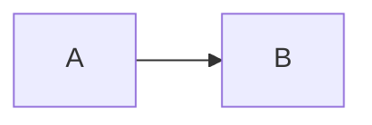

# Design: stock holds

## Problem statement

## Proposed architecture

```mermaid
flowchart LR
  A --> B
```

## Design details

## Data model

## API

## Alternatives considered

## Decision and consequences
