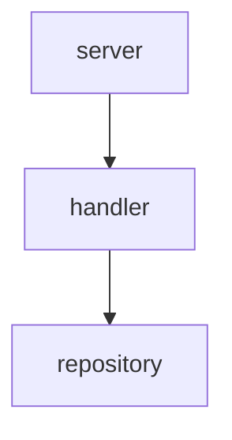
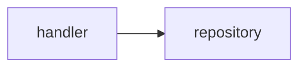

## Executive Summary
## Architecture

```mermaid
graph TD
 server --> handler --> repository
```

```mermaid
graph LR
 handler --> repository
```
## SOLID
## Technical Debt
lost update, fallback token, stack, reorder
## Recommendations
P0 injection. P1. P2.
