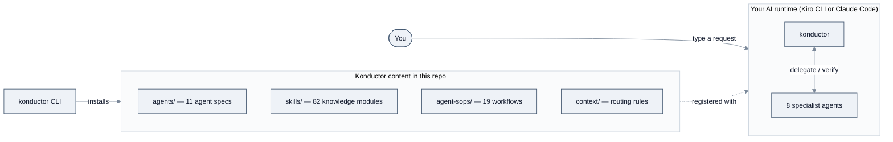

<!-- SPDX-License-Identifier: Apache-2.0 -->

# Konductor User Guide

A complete guide to Konductor — the AI agent framework that automates the software development
lifecycle (SDLC).

---

## Table of contents

**Start here**

1. [What is Konductor?](#what-is-konductor)
2. [How to use this guide](#how-to-use-this-guide)
3. [Core concepts](concepts.md) — agents, skills, SOPs, runtimes, and how they fit together
4. [Prerequisites](prerequisites.md) — software, accounts, platforms
5. [Quick Start](quick-start.md) — from download to a working agent team in five steps

**Task guides**

6. [Task guides index](tasks/README.md)
   - [Install for Kiro CLI](tasks/install-kiro-cli.md)
   - [Install for Claude Code](tasks/install-claude-code.md)
   - [Initialize a project](tasks/initialize-a-project.md)
   - [Diagnose problems](tasks/diagnose-problems.md)
   - [Update an installation](tasks/update.md)
   - [Uninstall](tasks/uninstall.md)

**Use cases and workflows**

7. [Use cases](use-cases/README.md) — four end-to-end walkthroughs with worked examples
   - [Understand a codebase](use-cases/understand-a-codebase.md)
   - [Design a system](use-cases/design-a-system.md)
   - [Plan and verify work](use-cases/plan-and-verify-work.md)
   - [Review code and tests](use-cases/review-code-and-tests.md)
8. [SOP workflows](sop-workflows/README.md) — all 19 SOPs, with flowcharts
   - [Planning, analysis, and verification](sop-workflows/planning-and-analysis.md)
   - [Design](sop-workflows/design.md)
   - [Code review and cleanup](sop-workflows/code-review.md)
   - [Testing, codebase analysis, and specs](sop-workflows/testing-and-specs.md)
   - [Orchestration and orientation](sop-workflows/orchestration.md)

**Reference**

9. [Agents reference](agents.md) — all 11 agents, and what each one can access
10. [Skills catalog](skills.md) — all 82 skills, grouped, with when to use each
11. [CLI reference](reference.md) — command table, flags, config schema, exit codes, repository layout
12. [Troubleshooting](troubleshooting.md) — symptom → cause → fix
13. [FAQ](faq.md)
14. [Glossary](glossary.md)
15. [Getting help](getting-help.md)
16. [Appendix: contributing and customizing](appendix/contributing.md) — change agent behaviour, build the CLI from source

---

## What is Konductor

Konductor is a **coordinated team of AI agents that automates software development work**,
plus a **command-line utility** for installing, configuring, and diagnosing that team.

An *AI agent*, here, is a configured AI assistant: a system prompt that gives it a role, a
list of tools it is allowed to use, and a body of reference knowledge it can pull in on
demand. Konductor ships 11 of them. Each has a specialty — one writes requirements, one
designs systems, one implements code, one plans test coverage — and they hand work to each
other through a fixed delegation format.

### The problem it solves

Most AI coding assistants are one agent in one conversation doing one task. You are the
integration layer: you carry the requirements to the design conversation, the design to the
implementation conversation, and you remember to ask for tests. Nothing checks anyone's work
but you.

Konductor replaces that manual relay. You talk to one agent — **`konductor`**, a multi-agent
orchestrator — and it
routes each piece of work to the specialist that owns it, verifies what comes back against
stated criteria, and re-delegates when a check fails. The routing rules and the verification
gates are plain files, so the behaviour is inspectable and editable rather than implicit in a prompt.

### Key benefits

| Benefit | What it means concretely |
| --- | --- |
| No infrastructure | Agents are configuration files — JSON specs and Markdown. There is no server, database, or cloud resource to run. Your existing Kiro or Claude Code installation executes them. |
| Specialists, not a generalist | 11 agents with scoped tools and 82 on-demand knowledge modules, instead of one agent that must hold everything at once. |
| Work is checked, not just produced | Agents apply a maker-checker pass to their own output, and the orchestrator verifies handoffs before moving on. |
| Repeatable workflows | 19 SOPs encode multi-step procedures (design review, code review, test-coverage review) as explicit numbered steps with `MUST`/`MUST NOT` constraints. |
| Editable behaviour | Routing rules, delegation format, and quality gates are Markdown files. You can read and change them — see [Contributing and customizing](appendix/contributing.md). |

### What Konductor is *not*

Being explicit here saves real confusion:

- **The CLI does not run SDLC workflows.** `konductor` installs, configures, and diagnoses. The
  workflows are driven by the *agents*, inside your Kiro CLI or Claude Code session. There is no
  `konductor review` or `konductor design` — see the [CLI reference](reference.md).
- **It is not an AI model or a chat interface.** Konductor supplies no model of its own. It
  configures a runtime you already have.
- **It is not an autonomous, unsupervised system.** Several SOPs stop and require your
  explicit confirmation before continuing, and one is strictly read-only by design.

### A note on names

**Konductor** is the name of the project, and of its parent orchestrator agent. The
specialists are named `k-*` — `k-developer`, `k-architect`, and so on — and the two
orchestrator variants are `konductor-mux-orchestrator` and `konductor-cmux-orchestrator`.
The same names are used on both runtimes: `kiro-cli chat --agent k-developer` and
`claude --agent k-developer` address the same agent.

---

## How to use this guide

This guide serves three kinds of reader. Find yourself below and follow that row.

| If you are… | Read, in this order | Skip |
| --- | --- | --- |
| **New to this** — you may not have used an AI agent or a command-line tool before | [Core concepts](concepts.md) → [Prerequisites](prerequisites.md) → [Quick Start](quick-start.md) → [Glossary](glossary.md) whenever a word is unfamiliar | The reference pages and the CLI task guides |
| **An everyday user** — you want to get a specific thing done | [Use cases](use-cases/README.md) for end-to-end walkthroughs, [Task guides](tasks/README.md) for setup, [Troubleshooting](troubleshooting.md) when something breaks | Core concepts, if the vocabulary is already familiar |
| **An advanced user** — you want the complete contract | [Agents reference](agents.md), [Skills catalog](skills.md), [SOP workflows](sop-workflows/README.md), and [CLI reference](reference.md) | Quick Start and the concepts sections |
| **A contributor** — you want to change how Konductor behaves | [Contributing and customizing](appendix/contributing.md) | The task guides |

Conventions used throughout:

- Shell commands appear in `bash` blocks, **one command per block**, so you can copy each
  one without editing it.
- Expected output appears in a separate `text` block immediately after the command.
- Placeholders you must replace look like `<your-project-path>` and are always called out.

### Reading the diagrams

Every diagram uses the same four node colours, so a shape's meaning is consistent across the guide.
Colour is always redundant — the label says the same thing — so nothing depends on distinguishing
hues.

| Appearance | Means |
| --- | --- |
| Blue-grey fill, slate border | An ordinary step the agent performs on its own |
| Amber fill, brown border | **You are involved** — the workflow asks you something and waits |
| Pink fill, crimson border | A stop, a block, or a refusal |
| Green fill, green border | Success or a terminal "done" state |
| Grey fill, dashed border | Skipped, de-emphasised, or a dry-run exit |

Diamonds are decisions the agent resolves itself; rectangles are actions. The palette was checked
for colour-vision separation and text contrast rather than picked by eye.

---

## Quick orientation diagram

*How the pieces relate: the CLI installs the content, the content configures your runtime, and you
talk to the orchestrator.*

---

Copyright Amazon.com, Inc. or its affiliates. All Rights Reserved.
Licensed under the Apache License, Version 2.0.
