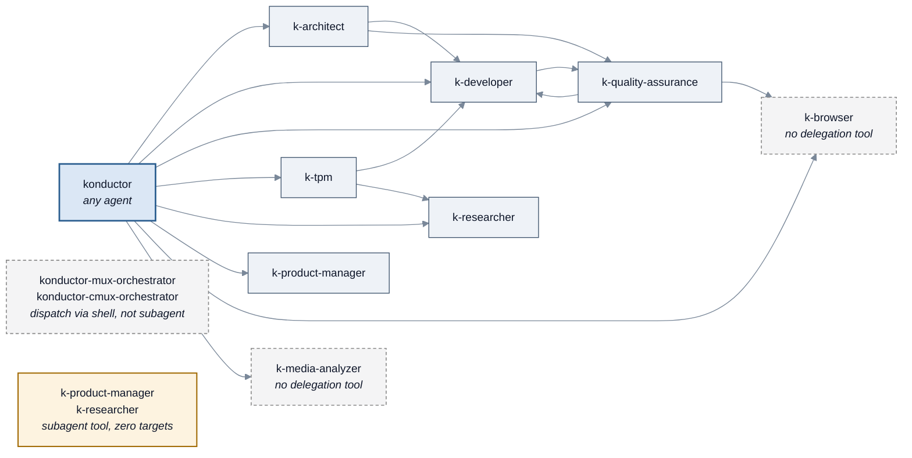

<!-- SPDX-License-Identifier: Apache-2.0 -->

# Agents reference

[← Back to guide index](README.md)

All **11 agents** the package ships: what each one does, what it can access, which SOPs it can
run, and who it is allowed to delegate to.

Everything on this page was read out of `agents/*.agent-spec.json` — the tool lists, the
`allowedTools` arrays, the `subagent` target lists, the declared skills and SOPs, and the MCP
registry entries.

---

## Contents

- [At a glance](#at-a-glance)
- [What each agent can do to your machine](#what-each-agent-can-do-to-your-machine)
- [Who can delegate to whom](#who-can-delegate-to-whom)
- [The three orchestrators](#the-three-orchestrators)
- [The eight specialists](#the-eight-specialists)
- [Runtime differences that matter](#runtime-differences-that-matter)

---

## At a glance

| Agent | Role | Model | Skills | SOPs | MCP |
| --- | --- | --- | --- | --- | --- |
| `konductor` | Coordinator. Delegates everything, implements nothing. | `claude-sonnet-5` | 13 | 10 | — |
| `konductor-mux-orchestrator` | Same, dispatching into tmux/zellij panes. | `claude-sonnet-5` | 10 | 9 | — |
| `konductor-cmux-orchestrator` | Same, dispatching into cmux surfaces. | `claude-sonnet-5` | 10 | 9 | — |
| `k-product-manager` | Requirements, user stories, decision research. | `claude-sonnet-5` | 16 | 0 | — |
| `k-architect` | System designs, APIs, data models, threat models. | `claude-sonnet-5` | **38** | 4 | `aws-mcp` |
| `k-developer` | Implementation, code review, git, builds. | `claude-sonnet-5` | 27 | 4 | `aws-mcp` |
| `k-quality-assurance` | Test coverage, E2E strategy, security tests. | `claude-sonnet-5` | 12 | 1 | — |
| `k-tpm` | Program plans, status, risk, estimation. | `claude-sonnet-5` | 14 | 0 | — |
| `k-researcher` | External documentation and web research. | `claude-sonnet-5` | 8 | 0 | — |
| `k-browser` | Browser automation via Playwright. | `claude-sonnet-5` | 4 | 0 | `playwright-mcp` |
| `k-media-analyzer` | Interprets PDFs, images, diagrams. | `claude-sonnet-5` | 1 | 0 | — |

A few things stand out and are worth knowing before you pick an agent:

- **Every agent runs the same model** (`claude-sonnet-5`). Agents differ by what they
  carry, not by what powers them.
- **`k-architect` carries by far the most skills** — **38 of the 82** in the library, close
  to half. Design work routed anywhere else comes back thinner.
- **`konductor`'s skill count is runtime-dependent.** Twelve of its thirteen skills load on
  both runtimes; `claude-teams-behavior` is declared only in the spec's
  `clientConfig.claudeCli` block, so Kiro CLI sees 12. Every other agent loads the same
  set on both.
- **Five agents declare zero SOPs**: `k-product-manager`, `k-tpm`, `k-researcher`,
  `k-browser`, and `k-media-analyzer`. They are skill-driven — you ask for an outcome and
  they apply the relevant skills, rather than following a scripted procedure.

Only the three orchestrators declare a context file
(`context/k-orchestrator-routing-rules.md`), which is what makes them behave as dispatchers.

---

## What each agent can do to your machine

This is the table to check before you let an agent loose on a repository. "Write" means the
agent can create or modify files; "Shell" means it can run commands.

Read the two runtimes differently, because they draw the line in different places:

- **Kiro CLI** has two lists. `tools` is what the agent is *allowed to use* — reaching for
  anything in it prompts you for permission. `allowedTools` is the subset that is
  **pre-approved**, so it runs with no prompt. Every agent in the package declares `@builtin`
  in `tools`, and `@builtin` includes `fs_write` and `shell`. So **no agent is incapable of
  writing or running commands in Kiro CLI** — the difference between agents is whether it
  happens silently or stops to ask you.
- **Claude Code** has one list. `clientConfig.claudeCli.tools` is the ceiling: a tool that is
  not in it cannot be used at all. Whether a granted tool prompts is then decided by *your*
  `~/.claude/settings.json`, which sorts tool calls into `allow`, `ask`, and `deny`. That file
  is yours, not the package's, so the same agent can be silent on one machine and
  ask-before-everything on another.

| Agent | Kiro CLI: write | Kiro CLI: shell | Claude Code: write | Claude Code: shell |
| --- | --- | --- | --- | --- |
| `konductor` | asks | asks | **granted** | **granted** |
| `konductor-mux-orchestrator` | asks | **pre-approved** | **granted** | **granted** |
| `konductor-cmux-orchestrator` | asks | **pre-approved** | **granted** | **granted** |
| `k-product-manager` | **pre-approved** | asks | **granted** | **granted** |
| `k-architect` | **pre-approved** | **pre-approved** | **granted** | **granted** |
| `k-developer` | **pre-approved** | **pre-approved** | **granted** | **granted** |
| `k-quality-assurance` | **pre-approved** | **pre-approved** | **granted** | **granted** |
| `k-tpm` | **pre-approved** | asks | **granted** | **granted** |
| `k-researcher` | asks | asks | not granted | not granted |
| `k-browser` | asks | asks | **granted** | **granted** |
| `k-media-analyzer` | asks | asks | **granted** | **granted** |

Read as: "asks" means the capability is in `clientConfig.kiroCli.tools` via `@builtin` but not
in `allowedTools`, so Kiro CLI prompts you each time. "pre-approved" means `allowedTools`
names `fs_write` or `shell`. Claude Code values come from `clientConfig.claudeCli.tools`
(`Write`/`Edit`, `Bash`) — the ceiling, not the prompting behaviour.

Three observations that are not obvious and do affect what you should trust:

1. **No orchestrator is locked down in Claude Code, and none is incapable in Kiro CLI
   either.** All three declare `Write` and `Bash` in `clientConfig.claudeCli.tools`. In Kiro
   CLI `konductor` pre-approves nothing but `fs_read`, and the two multiplexer variants
   pre-approve shell — which is a *prompting* difference, not a capability one. If you are
   relying on "the orchestrator only delegates, it never touches my repository", what actually
   holds that line is the routing rule in
   [`context/k-orchestrator-routing-rules.md`](#the-three-orchestrators) plus your own answer
   to the prompt — not the tool configuration.
2. **`k-browser` and `k-media-analyzer` pre-approve reads only in Kiro CLI, and are granted
   write and shell outright in Claude Code.** If you expect a media analyser to be incapable
   of editing your repository, that expectation does not hold in either runtime — in Kiro CLI
   it will ask first, and in Claude Code it depends on your `settings.json`.
3. **`k-product-manager` and `k-tpm` pre-approve writes but not shell in Kiro CLI**, and are
   granted both in Claude Code.

The pattern behind 1–3: **Kiro CLI pre-approves narrowly and Claude Code grants broadly.**
Every agent except `k-researcher` is granted write and shell in Claude Code, whatever its
Kiro CLI configuration says.

`k-researcher` is the only agent — specialist or orchestrator — with no write or shell tool in
Claude Code at all, which makes it the safe default for exploratory work there. In Kiro CLI it
pre-approves `fs_read` alone, so anything beyond reading stops to ask you.

> **Delegation does not narrow permissions in Claude Code.** A subagent runs inside its
> parent's permission context, so the parent has to hold a tool for the subagent to use it —
> and a `deny` you set on the parent covers everything it dispatches.

---

## Who can delegate to whom

Delegation is not open. In Kiro CLI it is governed by each agent's
`toolsSettings.subagent.availableAgents`; in Claude Code by whether the agent has an
`Agent(...)` tool at all.

*Kiro CLI delegation graph. Claude Code differs — see the table below.*

| Agent | Kiro CLI can spawn | Claude Code can spawn |
| --- | --- | --- |
| `konductor` | the 8 specialists (an explicit allowlist, not "anything") | the same 8, via `Agent(...)`, plus `SendMessage` |
| `k-architect` | `k-developer`, `k-quality-assurance` | `k-developer`, `k-quality-assurance`, via `Agent(...)` |
| `k-developer` | `k-quality-assurance` | **nothing** |
| `k-quality-assurance` | `k-developer`, `k-browser` | `k-developer`, `k-browser`, via `Agent(...)` |
| `k-tpm` | `k-developer`, `k-researcher` | **nothing** |
| `k-product-manager` | has the tool, **zero targets** | **nothing** |
| `k-researcher` | has the tool, **zero targets** | **nothing** |
| `konductor-mux-orchestrator` | no `subagent` tool — dispatches via shell scripts | dispatches via shell |
| `konductor-cmux-orchestrator` | no `subagent` tool — dispatches via shell scripts | dispatches via shell |
| `k-browser` | no delegation | **nothing** |
| `k-media-analyzer` | no delegation | **nothing** |

### Why this matters: a real consequence

`k-code-review-workflow` step 6 says to *"spawn `k-architect` in adversarial mode"*. That SOP
is declared only by `k-developer` — which **cannot spawn `k-architect` in either runtime**:

- In Kiro CLI, `k-developer`'s targets are `["k-quality-assurance"]`. The architect is not on
  that list.
- In Claude Code, `k-developer` has no `Agent(...)` tool at all.

The SOP anticipates this — *"You MUST skip this step if no adversarial CR-review capability is
available"* — so it degrades quietly rather than erroring. **In practice step 6 always no-ops,
and you get standard review only.**

Routing the request through `konductor` does **not** fix it: the orchestrator does not
declare `k-code-review-workflow`, so it delegates the whole SOP to the developer, who then hits
the same wall. The reliable workaround is to run
[`k-adversarial-pull-request-review`](sop-workflows/code-review.md#k-adversarial-pull-request-review)
yourself against `k-architect`, which owns it.

### The two multiplexer orchestrators do not use subagents at all

`konductor-mux-orchestrator` and `konductor-cmux-orchestrator` have **no `subagent` tool and no
`Agent(...)` tool**. Their Kiro CLI tools are `["@builtin", "read", "shell", "todo"]`, and shell
is how they work: their `mux-dispatch` / `cmux-dispatch` skills ship shell scripts that open a
pane or surface per specialist, run the runtime's CLI inside it, and poll for a `.done` marker
file under `/tmp/konductor-mux/` or `/tmp/konductor-cmux/`.

That is why they are granted shell in Kiro CLI while the plain orchestrator is not. In Claude
Code the distinction disappears — all three declare `Bash` there.

---

## The three orchestrators

All three load `context/k-orchestrator-routing-rules.md` at session start, which is what makes
them behave as dispatchers rather than implementers. Treat that as intent, not enforcement: it
is a prompt rule, and the tool configuration does not back it up in either runtime. Kiro CLI
pre-approves reads only, so a mutating call stops to ask you rather than being refused, and
Claude Code grants all three `Write` and `Bash` outright.

### `konductor`

The default entry point, and the one to use unless you have a specific reason not to.

| | |
| --- | --- |
| **Model** | `claude-sonnet-5` |
| **SOPs** (10) | `kiro-spec-workflow`, `k-delegate`, `k-plan`, `k-context-gathering`, `k-verify`, `k-light-ui-testing`, `k-comprehensive-search`, `k-full-sdlc`, `k-e2e-test-generation`, `about-konductor` |
| **Skills** (13) | `constraints`, `delegation-protocol`, `agents-md-authoring`, `claude-teams-behavior`, `pre-planning-analysis`, `socratic-elicitation`, `deliberation-panel`, `verification`, `persistent-memory`, `workspace-skills`, `sdlc-navigator`, `sop-state-management`, `about-konductor` — `claude-teams-behavior` is Claude Code only, so Kiro CLI loads 12 |
| **Kiro CLI tools** | `@builtin`, `subagent`; `allowedTools` is `fs_read` **only** |
| **Claude Code tools** | `Workflow`, `WebFetch`, `WebSearch`, `TodoWrite`, `Agent(...)` over the 8 specialists, `SendMessage`, `Read`, `Glob`, `Grep`, `Bash`, `Write`, `Skill` |
| **Can mutate?** | In Claude Code, yes — it declares `Bash` and `Write`. In Kiro CLI it can too, but nothing beyond reading is pre-approved: `allowedTools` is `fs_read` alone, so every write or command stops to ask you |

It is the agent with the widest delegation reach — an explicit allowlist of all eight
specialists — and the only one that declares
`k-delegate` (the SOP that builds the 7-section delegation prompt).

### `konductor-mux-orchestrator` and `konductor-cmux-orchestrator`

| | |
| --- | --- |
| **SOPs** (9) | `kiro-spec-workflow`, `k-plan`, `k-context-gathering`, `k-verify`, `k-comprehensive-search`, `k-full-sdlc`, `k-e2e-test-generation`, `k-light-ui-testing`, `about-konductor` — `konductor`'s ten, minus `k-delegate` |
| **Skills** (10) | `constraints`, `delegation-protocol`, `sdlc-navigator`, `git-merge`, `pre-planning-analysis`, `socratic-elicitation`, `verification`, `sop-state-management`, `about-konductor`, plus `mux-dispatch` or `cmux-dispatch` |
| **Kiro CLI tools** | `@builtin`, `read`, `shell`, `todo`; `allowedTools` is `fs_read`, `shell` |
| **Claude Code tools** | `Workflow`, `TodoWrite`, `Read`, `Bash`, `Grep`, `Glob`, `Write`, `Skill` |
| **Can mutate?** | In Kiro CLI, shell is **pre-approved** — needed for pane dispatch — and writes ask first. In Claude Code, **both** are granted: they declare `Write` as well as `Bash` |

Pick one when you want to watch each specialist work in its own pane rather than as a background
subagent. `konductor-mux-orchestrator` auto-detects tmux versus zellij from environment variables.
They are also the only two agents that declare `git-merge`.

---

## The eight specialists

### `k-architect`

The most capable agent in the package, on the strongest model.

| | |
| --- | --- |
| **Model** | `claude-sonnet-5` — the same model every agent runs |
| **SOPs** (4) | `k-design-doc-creation`, `k-existing-design-review`, `k-principal-engineer-design-review`, `k-adversarial-pull-request-review` |
| **Skills** | **38** — the largest share of any agent. See [Architecture and design](skills.md#architecture-and-design), [Design quality gates](skills.md#design-quality-gates), [API and data modelling](skills.md#api-and-data-modelling) |
| **MCP** | `aws-mcp` — launched via `uvx mcp-proxy-for-aws@latest`; `allowedTools` grants five tools: documentation search, documentation read, skill retrieval, region list, and regional availability |
| **Can mutate?** | Write and shell in both runtimes — pre-approved in Kiro CLI, granted in Claude Code |
| **Can delegate to** | `k-developer`, `k-quality-assurance` — in both runtimes |

Owns both design SOPs *and* the adversarial pull-request review. Its system prompt applies a
maker-checker pass to every artifact and presents findings as CRITICAL → IMPORTANT → SUGGESTION
followed by `Fix these issues? [y/n]`.

### `k-developer`

| | |
| --- | --- |
| **SOPs** | `k-code-cleanup`, `k-pre-cr-critique`, `k-codebase-analysis`, `k-code-review-workflow` |
| **Skills** | 27 — backend and frontend development and review, `infra-validation`, `code-review`, `git-workflow`, `asdlc-code-simplifier`, `design-impact-review`, `find-aws-skills`, `security-remediation`, the three `adversarial-code-review-pass-*` skills, `verification`, and others |
| **MCP** | `aws-mcp`, same as the architect |
| **Can mutate?** | Write and shell in both runtimes — pre-approved in Kiro CLI, granted in Claude Code |
| **Can delegate to** | `k-quality-assurance` (Kiro CLI only) |

The workhorse. Everything the orchestrator cannot do itself — file writes, git, shell, builds —
lands here. It owns the only source-modifying SOP, `k-code-cleanup`.

### `k-quality-assurance`

| | |
| --- | --- |
| **SOPs** | `k-test-coverage-review` |
| **Skills** | 12 — `test-coverage-analysis`, `e2e-test-strategy`, `cypress-test-implementation`, `playwright-test-implementation`, `security-test-generation`, `dom-inspection`, `ui-text-validation`, and others |
| **Can mutate?** | Write and shell in both runtimes — pre-approved in Kiro CLI, granted in Claude Code |
| **Can delegate to** | `k-developer`, `k-browser` — in both runtimes |

### `k-product-manager`

| | |
| --- | --- |
| **SOPs** | **none** — skill-driven |
| **Skills** | 16 — `user-story-writing`, `requirements-extraction`, `decision-research`, `sprint-planning`, `asana-sprint-planning`, `task-decomposition`, `legacy-to-agentic-estimate`, `humanize-writing`, `deliberation-panel`, `kiro-requirements-generation`, and others |
| **Can mutate?** | Write pre-approved in Kiro CLI and granted in Claude Code; shell asks first in Kiro CLI and is granted in Claude Code |
| **Can delegate to** | nothing — has the `subagent` tool with an empty target list |

Because it declares no SOPs there is no scripted procedure to invoke. Ask for the outcome — user
stories, a requirements summary, a sprint plan — and it applies the relevant skill.

### `k-tpm`

| | |
| --- | --- |
| **SOPs** | **none** — skill-driven |
| **Skills** | 14 — `program-planning`, `status-reporting`, `risk-management`, `program-decision-docs`, `plan-review`, `legacy-to-agentic-estimate`, `sprint-planning`, and others |
| **Can mutate?** | Write pre-approved in Kiro CLI and granted in Claude Code; shell asks first in Kiro CLI and is granted in Claude Code |
| **Can delegate to** | `k-developer`, `k-researcher` (Kiro CLI only) |

Owns `legacy-to-agentic-estimate` and its `convert_estimates.py` script, which is why
`k-plan` step 5 delegates the Agentic Projection here.

### `k-researcher`

| | |
| --- | --- |
| **SOPs** | **none** — skill-driven |
| **Skills** | 8 — `external-research`, `sdlc-navigator`, `document-formats`, `deliberation-panel`, `socratic-elicitation`, `persistent-memory`, `workspace-skills`, `constraints` |
| **Kiro CLI tools** | `@builtin`, `subagent`; `allowedTools` is `fs_read` only |
| **Claude Code tools** | `WebFetch`, `WebSearch`, `TodoWrite`, `Read`, `Skill` — the narrowest tool list of any agent, and the only one with no write or shell tool |
| **Can mutate?** | **Not in Claude Code** — no write or shell tool is granted at all. In Kiro CLI it pre-approves `fs_read` only, so anything more asks first |
| **Can delegate to** | nothing — `subagent` tool with an empty target list |

The only specialist that cannot modify anything in either runtime, which makes it the safest
agent to point at unfamiliar code. `k-context-gathering` step 1 spawns one or two of these in parallel.

Optional Slack search is opt-in — see
[docs/guides/slack-integration.md](../guides/slack-integration.md).

### `k-browser`

| | |
| --- | --- |
| **SOPs** | **none** |
| **Skills** | 4 — `constraints`, `sdlc-navigator`, `app-discovery`, `dom-inspection` |
| **MCP** | `playwright-mcp` (`@playwright/mcp@latest`). Kiro CLI `allowedTools` enumerates 13 specific browser tools — snapshot, screenshot, console messages, network requests, tabs, navigate, navigate back, wait for, click, type, select option, press key, close |
| **Can mutate?** | Pre-approved for reads only in Kiro CLI, so writes and commands ask first; **write and shell granted in Claude Code** |

Needs the browser binary: `npx playwright install chromium`. Note the Kiro CLI tool list is an
explicit allowlist — it cannot, for example, upload files or evaluate arbitrary JavaScript.

### `k-media-analyzer`

| | |
| --- | --- |
| **SOPs** | **none** |
| **Skills** | 1 — `constraints` only |
| **Kiro CLI tools** | `@builtin`; `allowedTools` is `fs_read`, `web_fetch` |
| **Can mutate?** | Pre-approved for reads only in Kiro CLI, so writes and commands ask first; **write and shell granted in Claude Code** |

The leanest agent in the package. Its capability is the model's ability to interpret PDFs,
images, and diagrams — not a skill library. Point it at a file and ask a question about it.

---

## Runtime differences that matter

| Difference | Kiro CLI | Claude Code |
| --- | --- | --- |
| Agent name | `konductor` | `konductor` |
| Cross-agent delegation | 7 agents have `subagent`, 5 with real targets | `konductor`, `k-architect`, and `k-quality-assurance` hold `Agent(...)` |
| MCP servers | declared and launched from `dependencies.mcpRegistry` | requested via tool globs (`mcp__aws-mcp__*`); you configure the server yourself |
| Tool naming | `fs_read`, `fs_write`, `shell` | `Read`, `Write`, `Edit`, `Bash` |
| Permission model | two lists: `tools` grants with a prompt, `allowedTools` pre-approves | one list: `clientConfig.claudeCli.tools` is the ceiling, and your `settings.json` decides what prompts |
| `k-browser` / `k-media-analyzer` | reads pre-approved; writes and shell ask first | write and shell granted |
| `k-product-manager` / `k-tpm` | shell asks first | shell granted |
| Skills resolution | through the bundled `skill-lookup` MCP server. Skills install to `.konductor/skills/`, deliberately outside the `.kiro/skills/` tree Kiro CLI scans, and the agent reaches them through that server | native Claude Code skills: `clientConfig.claudeCli.skills` names the set, and each body installs to `.claude/skills/<name>/SKILL.md` |
| Extra setup | none | agent-teams env var **and** a permissions allowlist |

The delegation row is the one that changes behaviour most: a workflow that relies on one
specialist handing off to another may work in Kiro CLI and not in Claude Code — `k-developer`
and `k-tpm` have Kiro targets but no `Agent(...)` tool at all.

---

## Related

- [Skills catalog](skills.md) — all 82 skills, and which agents declare each
- [SOP workflows](sop-workflows/README.md) — the 19 procedures and which agent owns each
- [Core concepts → agent](concepts.md#agent) — what an agent is
- [Install for Kiro CLI](tasks/install-kiro-cli.md) · [Install for Claude Code](tasks/install-claude-code.md)

---

[← Skills catalog](skills.md) · [Back to guide index](README.md) · [Next: Use cases →](use-cases/README.md)
