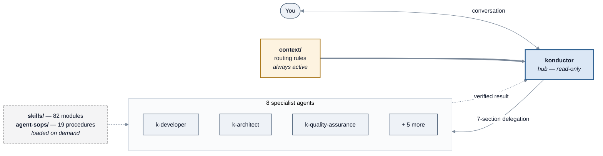

<!-- SPDX-License-Identifier: Apache-2.0 -->

# Core concepts

[← Back to guide index](README.md)

This section defines every term Konductor uses. It assumes only that you can open a
terminal and type a command. Each concept gets one short section; every term is defined the
first time it appears.

---

## Contents

- [Runtime](#runtime)
- [Agent](#agent)
- [Agent spec](#agent-spec)
- [Skill](#skill)
- [SOP](#sop-standard-operating-procedure)
- [Context file](#context-file)
- [Orchestrator and delegation](#orchestrator-and-delegation)
- [Maker-checker](#maker-checker)
- [Konductor CLI](#konductor-cli)
- [How it all fits together](#how-it-all-fits-together)

---

## Runtime

A **runtime** is the program that actually runs an AI agent on your machine. Konductor does
not include one — it configures one you already have:

| Runtime | What it is | Install with |
| --- | --- | --- |
| **Kiro CLI** | Amazon's command-line AI assistant, invoked as `kiro-cli` | `--harness kiro-cli-v2` |
| **Kiro IDE** | Amazon's AI editor | `--harness kiro-v3` |
| **Claude Code** | Anthropic's command-line AI assistant, invoked as `claude` | `--harness claude` |

**Kiro CLI and Kiro IDE are one harness or two depending on the Kiro version.** In Kiro v2 the
CLI and the IDE are separate products: `kiro-cli-v2` installs CLI-only content and does not work
in the IDE at all. In Kiro v3 they are unified into a single product, so the one `kiro-v3` harness
covers both — there is no separate CLI-versus-IDE choice to make.

Konductor ships each agent with per-runtime settings, so the same agent behaves correctly in
any of them. In `agents/*.agent-spec.json` these live under `clientConfig.kiroCli` and
`clientConfig.claudeCli`. The two differ in real ways — for example, the Kiro CLI
configuration for `k-architect` lists tools as `["@builtin", "subagent", "@aws-mcp"]`,
while the Claude Code configuration lists `["Read", "Write", "Edit", "Bash", "Glob", "Grep",
"WebFetch", "WebSearch", "TodoWrite", "mcp__aws-mcp__*"]`.

## Agent

An **agent** is a configured AI assistant with a job. Concretely, it is three things bundled
together:

1. A **system prompt** — instructions establishing its role, workflow, and guardrails.
2. A **tool allowlist** — exactly which actions it may take (read files, write files, run
   shell commands, search the web).
3. **Dependencies** — the skills, SOPs, and context files it can draw on.

Konductor ships 11. Three are orchestrators (coordinators); eight are specialists.

| Agent | What it does |
| --- | --- |
| `konductor` | The main entry point. Coordinates everything, delegates all work, never implements directly. |
| `konductor-mux-orchestrator` | Same coordination, but dispatches specialists into parallel tmux or zellij terminal panes. |
| `konductor-cmux-orchestrator` | Same coordination, but dispatches specialists into parallel cmux surfaces. |
| `k-product-manager` | User stories, requirements, decision research, sprint planning. |
| `k-architect` | System designs, API models, data models, threat models, design review. |
| `k-developer` | Task breakdown, backend/frontend implementation, code review, git operations, builds. |
| `k-quality-assurance` | Test-coverage analysis, E2E test strategy, security test generation, UI text validation. |
| `k-researcher` | External documentation and web research. |
| `k-tpm` | Program plans, status reports, risk tracking, effort estimation. |
| `k-browser` | Browser automation via Playwright — navigation, forms, screenshots, E2E runs. |
| `k-media-analyzer` | Interprets PDFs, images, and diagrams. |

For each agent's model, tools, write and shell access, declared skills and SOPs, and delegation
targets, see the [Agents reference](agents.md).

## Agent spec

An **agent spec** is the JSON file that defines one agent, named
`agents/<agent-name>.agent-spec.json`. Its top-level shape:

```text
schemaVersion   "1"
name            e.g. "konductor"
config          description, model, systemPrompt
dependencies    agentSops, context, mcpRegistry, skills
clientConfig    kiroCli { tools, allowedTools, toolsSettings, hooks, resources }
                claudeCli { tools, skills }
```

You do not need to edit these to use Konductor. You do need to know they exist, because the
`dependencies.agentSops` list is what determines **which agent can run which SOP** — see
[SOP workflows](sop-workflows/README.md).

## Skill

A **skill** is a self-contained module of knowledge an agent loads *on demand*. At session
start only each skill's name and one-line description are in the agent's memory; the full
content loads when the agent decides it is relevant. This keeps the agent's working memory
free for your actual problem.

A skill lives at `skills/<name>/SKILL.md` and starts with YAML frontmatter:

```yaml
---
name: delegation-protocol
description: Use when spawning any subagent, deciding which agent should handle a piece of work, coordinating parallel or sequential agent execution, or handing off artifacts between agents. Defines the mandatory 8-field delegation prompt format, agent registry, and handoff patterns.
version: 1.4.0
tags: [skill, behavioral, orchestration, delegation, multi-agent]
---
```

Some skills also ship helper scripts alongside `SKILL.md` — for example
`skills/legacy-to-agentic-estimate/` contains `scripts/` and `evals/` directories.

**The package ships 82 skills** — 82 directories under `skills/`, each with a `SKILL.md`. All 82
are catalogued, grouped, with a when-to-use note each, in the [Skills catalog](skills.md).

## SOP (standard operating procedure)

A **SOP** — also called an agent script — is a written multi-step procedure an agent follows
to complete a complex task the same way every time. Where a skill is *knowledge* ("here is
how to think about threat models"), a SOP is *procedure* ("do step 1, then step 2, do not
proceed until X").

SOPs live at `agent-sops/<name>.sop.md` and share a consistent structure:

```text
# Title
## Overview      — what it does, when to use it
## Parameters    — required and optional inputs, with defaults
## Steps         — numbered steps, each with:
                   a description
                   **Constraints:** MUST / MUST NOT / SHOULD rules
                   **Expected Output:** what the step produces
## Quality Gate  — (some SOPs) the conditions for "done"
## Troubleshooting — (some SOPs)
```

The `MUST` / `MUST NOT` / `SHOULD` wording is deliberate — it follows RFC 2119, the internet
standards convention for requirement levels, so an agent can tell a hard rule from a
preference.

**The package ships 19 SOPs.** Eighteen are meant for you to invoke; `k-delegate` is
internal machinery the orchestrator uses to format its own delegations.

## Context file

A **context file** is Markdown loaded into an agent's memory *at session start* and kept
active for the whole session — unlike a skill, which loads on demand. Context files are for
rules that must never be missed.

There is one today: `context/k-orchestrator-routing-rules.md`, loaded by all three
orchestrators. It contains the capability-to-agent routing table and three `[CODE RED]`
rules, including this one:

> **NEVER MUTATE DIRECTLY — DELEGATE INSTEAD.** You are a read-only orchestrator. You NEVER
> directly execute mutating operations or shell commands.

That is why the orchestrator hands file edits and shell commands to `k-developer` rather
than doing them itself.

## Orchestrator and delegation

**`konductor`**, as the orchestrator, is a hub — though not an exclusive one. In Kiro CLI four
specialists can also spawn each other directly (`k-architect` → developer and QA;
`k-developer` → QA; `k-quality-assurance` → developer and browser; `k-tpm` → developer and
researcher), and in Claude Code `k-architect` and `k-quality-assurance` carry `Agent(...)` tools
of their own — see [Who can delegate to whom](agents.md#who-can-delegate-to-whom). In the common
case, though, every piece of work routes through `konductor`, which decides who owns it, hands it
over, and checks the result.

A **delegation** is not a casual instruction — it is a fixed 7-section format defined by the
`k-delegate` SOP and the `delegation-protocol` skill:

```text
1. TASK          — exactly one atomic action
2. EXPECTED OUTCOME — concrete, verifiable deliverables
3. REQUIRED SKILLS
4. REQUIRED TOOLS   — an explicit allowlist, to prevent tool sprawl
5. MUST DO          — exhaustive requirements, nothing implicit
6. MUST NOT DO      — prohibitions, including a response size limit
7. CONTEXT          — paths, patterns, directories to ignore
```

After the specialist returns, the orchestrator runs a verification checklist. If a check
fails, it re-delegates — **up to 2 fix cycles** (`k-delegate` step 8).

## Maker-checker

**Maker-checker** means the same agent that produces an artifact then evaluates it against
explicit criteria before showing it to you. It is a self-review pass with a rubric, not a
vibe check.

For example, `k-architect`'s system prompt instructs it: after generating a threat model,
apply the threat-modeling criteria; after creating a design document, apply the
`design-doc-guidelines` criteria. Findings are presented ordered **CRITICAL → IMPORTANT →
SUGGESTION**, followed by: `Fix these issues? [y/n]`.

## Konductor CLI

The **Konductor CLI** is a separate command-line program named `konductor`. It handles setup, content
build, lifecycle, and diagnostics for a Konductor-managed repository: `install`, `update`,
`uninstall`, `doctor`, `init`, `synth`, and `metrics`.

It does **not** run SDLC workflows. Running a workflow means talking to an agent, not typing a
`konductor` subcommand.

Full detail in the [CLI reference](reference.md).


---

## How it all fits together



*Hub-and-spoke: you talk only to `konductor`; routing rules are always active; skills
and SOPs load on demand.*

Reading the diagram in words:

1. You describe what you want to the `konductor` agent.
2. The always-active routing rules tell it which specialist owns that kind of work.
3. It writes a 7-section delegation and hands the work over.
4. The specialist loads whichever skills and SOPs the task needs, does the work, and applies
   its own maker-checker pass.
5. `konductor` verifies the result against the delegation's expected outcome — and
   re-delegates if it falls short, up to twice.

---

[← Back to guide index](README.md) · [Next: Prerequisites →](prerequisites.md)
