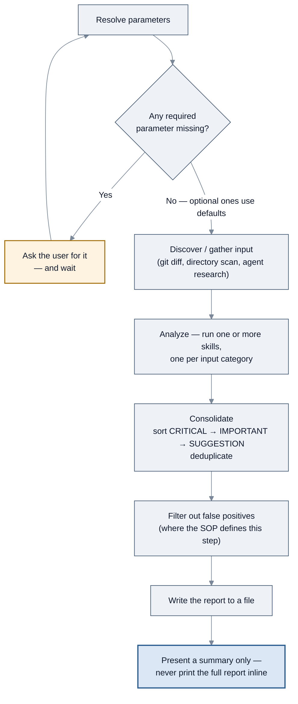
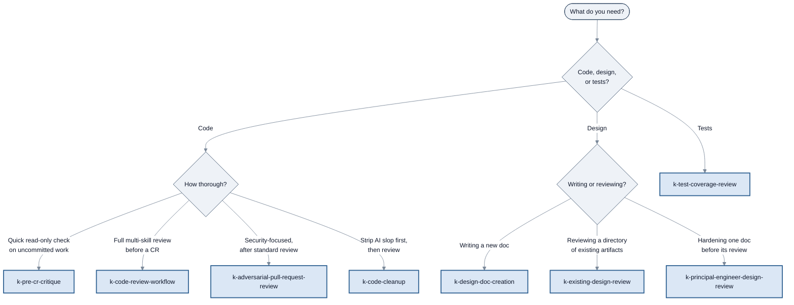

<!-- SPDX-License-Identifier: Apache-2.0 -->

# SOP workflows

[← Back to guide index](../README.md)

Konductor ships **19 SOPs** — written, numbered procedures an agent follows to complete a
complex task the same way every time. This section covers all 19: what each does, when you
would reach for it, how to invoke it, and a flowchart of its actual flow.

Every diagram here was derived by reading the SOP file it describes. Where a SOP has a decision
point, the diagram branches. Where it has more than about a dozen steps, minor steps are grouped
into a subgraph rather than drawn individually.

---

## Contents

- [The common shape](#the-common-shape) — read this once; it applies to nearly every SOP
- [All 19 SOPs at a glance](#all-19-sops-at-a-glance)
- [Which agent owns which SOP](#which-agent-owns-which-sop)
- [How to invoke a SOP](#how-to-invoke-a-sop)
- [Choosing between overlapping SOPs](#choosing-between-overlapping-sops)

Looking for an end-to-end walkthrough with a worked example rather than a per-SOP reference?
See [Use cases](../use-cases/README.md).

Detail pages:

- [Planning, analysis, and verification](planning-and-analysis.md) — `k-plan`, `k-context-gathering`, `k-verify`, `k-delegate`
- [Design](design.md) — `k-design-doc-creation`, `k-existing-design-review`, `k-principal-engineer-design-review`
- [Code review and cleanup](code-review.md) — `k-code-review-workflow`, `k-pre-cr-critique`, `k-adversarial-pull-request-review`, `k-code-cleanup`
- [Testing, codebase analysis, and specs](testing-and-specs.md) — `k-test-coverage-review`, `k-codebase-analysis`, `kiro-spec-workflow`, `k-e2e-test-generation`, `k-light-ui-testing`
- [Orchestration and orientation](orchestration.md) — `k-full-sdlc`, `k-comprehensive-search`, `about-konductor`

---

## The common shape

Most of the nineteen SOPs are variations on one pattern. Learning it once means you can predict
how any of them will behave.



*The shape shared by most SOPs: resolve → gather → analyze → consolidate → write file → summarize.*

Five conventions hold across nearly all of them:

1. **Required parameters are asked for; optional ones are not.** A SOP with a default will use
   it silently rather than interrupting you. `k-pre-cr-critique` states this outright: "You MUST
   NOT ask for parameters that have defaults."
2. **Findings use one severity vocabulary.** CRITICAL, IMPORTANT, SUGGESTION — sorted in that
   order. (Some SOPs use Critical / Important / Minor for the same three levels.)
3. **The report is a file, not a wall of text.** Almost every report-producing SOP says "You
   MUST NOT print the full report in your response — reference the file."
4. **Fix cycles are capped at 2.** `k-delegate` caps re-delegation at 2 cycles;
   `kiro-spec-workflow` caps revise-and-re-present at 2 cycles per document.
5. **Explicit confirmation gates are real stops.** Where a SOP asks `[y/n]`, it will not
   proceed without your answer.

The four SOPs that do *not* fit this shape are `k-plan` (produces a plan, not findings),
`k-verify` (runs build/test/lint and collects evidence), `k-delegate` (assembles a
delegation prompt), and `kiro-spec-workflow` (chains three skills with an approval gate each).

---

## All 19 SOPs at a glance

| SOP | What it does | Reach for it when | Detail |
| --- | --- | --- | --- |
| `k-plan` | Work breakdown with success criteria, dependencies, agent assignments, and a timeline | Before starting any non-trivial multi-step work | [→](planning-and-analysis.md#k-plan) |
| `k-context-gathering` | Pre-implementation context gathering across parallel research agents | Unfamiliar code, 3+ components, or after 2 failed debugging attempts | [→](planning-and-analysis.md#k-context-gathering) |
| `k-verify` | Build, test, lint, CDK checks, manual verification, and an evidence report | Before declaring anything done | [→](planning-and-analysis.md#k-verify) |
| `k-delegate` | Assembles the 7-section delegation prompt and verifies the result | Internal — the orchestrator uses this itself | [→](planning-and-analysis.md#k-delegate) |
| `k-design-doc-creation` | Five-phase authoring of a PE-ready design doc, with an adversarial review loop | You need to *write* a design document | [→](design.md#k-design-doc-creation) |
| `k-existing-design-review` | 10-dimension evaluation of existing design artifacts | You need to *review* design artifacts before implementation | [→](design.md#k-existing-design-review) |
| `k-code-review-workflow` | Multi-skill review across backend, frontend, and infra, with a consolidated report. Its step-6 adversarial pass [never fires](../agents.md#why-this-matters-a-real-consequence) | Before opening a code review on a branch | [→](code-review.md#k-code-review-workflow) |
| `k-pre-cr-critique` | Fast, strictly read-only critique across 6 dimensions | Quick sanity check on uncommitted work | [→](code-review.md#k-pre-cr-critique) |
| `k-adversarial-pull-request-review` | Security-focused review arguing *against* approval | After standard review, on anything security-sensitive | [→](code-review.md#k-adversarial-pull-request-review) |
| `k-code-cleanup` | Removes AI-generated slop from a diff, then re-reviews | Before submitting AI-assisted changes | [→](code-review.md#k-code-cleanup) |
| `k-test-coverage-review` | Gap analysis, E2E strategy, and a security test plan in sequence | After implementation, before release | [→](testing-and-specs.md#k-test-coverage-review) |
| `k-codebase-analysis` | Deep architecture, SOLID, patterns, and technical-debt assessment | Onboarding to unfamiliar code, or planning a refactor | [→](testing-and-specs.md#k-codebase-analysis) |
| `kiro-spec-workflow` | Chains three skills into a complete Kiro IDE spec | You want `requirements.md` + `design.md` + `tasks.md` | [→](testing-and-specs.md#kiro-spec-workflow) |
| `k-principal-engineer-design-review` | Slop gate, architecture-principles gate, then a bounded adversarial loop | A design doc is about to go to a human reviewer | [→](design.md#k-principal-engineer-design-review) |
| `k-e2e-test-generation` | Discovers a deployed app, then generates unit-test prompts or Cypress/Playwright specs | You have a running web app and want a test suite | [→](testing-and-specs.md#k-e2e-test-generation) |
| `k-light-ui-testing` | Writes test prompts for a live page and immediately executes them | Mid-development feedback, before a suite is worth building | [→](testing-and-specs.md#k-light-ui-testing) |
| `k-full-sdlc` | Twelve gated phases from intake to documentation, each delegated | You want something built end to end | [→](orchestration.md#k-full-sdlc) |
| `k-comprehensive-search` | Parallel codebase and documentation search, then synthesis | A question that deserves more than one search pass | [→](orchestration.md#k-comprehensive-search) |
| `about-konductor` | Runtime-aware orientation, answered from the live sources | "What is this, and what can I ask it?" | [→](orchestration.md#about-konductor) |

---

## Which agent owns which SOP

This matters more than it looks. **A SOP is only available in a session with an agent whose spec
declares it.** Ownership comes from `dependencies.agentSops.agentSopNames` in each
`agents/*.agent-spec.json` — verified below by reading all 11 specs.

| Agent | SOPs it declares |
| --- | --- |
| `konductor` | `kiro-spec-workflow`, `k-delegate`, `k-plan`, `k-context-gathering`, `k-verify`, `k-light-ui-testing`, `k-comprehensive-search`, `k-full-sdlc`, `k-e2e-test-generation`, `about-konductor` |
| `konductor-mux-orchestrator` | `kiro-spec-workflow`, `k-plan`, `k-context-gathering`, `k-verify`, `k-comprehensive-search`, `k-full-sdlc`, `k-e2e-test-generation`, `k-light-ui-testing`, `about-konductor` |
| `konductor-cmux-orchestrator` | `kiro-spec-workflow`, `k-plan`, `k-context-gathering`, `k-verify`, `k-comprehensive-search`, `k-full-sdlc`, `k-e2e-test-generation`, `k-light-ui-testing`, `about-konductor` |
| `k-architect` | `k-design-doc-creation`, `k-existing-design-review`, `k-principal-engineer-design-review`, `k-adversarial-pull-request-review` |
| `k-developer` | `k-code-cleanup`, `k-pre-cr-critique`, `k-codebase-analysis`, `k-code-review-workflow` |
| `k-quality-assurance` | `k-test-coverage-review` |
| `k-product-manager`, `k-researcher`, `k-tpm`, `k-browser`, `k-media-analyzer` | none |

Two things worth noticing:

- **`k-code-review-workflow` is declared by one agent only** — `k-developer`. It used to be
  declared by `k-quality-assurance` as well, until that registration was removed as unusable:
  step 6 of the SOP spawns `k-architect`, which QA cannot reach.
- **The two multiplexer orchestrators do not declare `k-delegate`**, unlike the primary
  orchestrator. They dispatch through their `mux-dispatch` / `cmux-dispatch` skills instead.

Practical consequence: if you start a session directly with `k-product-manager` and ask for
a code review workflow, the SOP is not loaded there. Start with `konductor` and let it route —
that is the form this guide uses throughout, and it is the one that does not require you to know
who owns what.

---

## How to invoke a SOP

### The reliable way: ask `konductor`

```bash
kiro-cli chat --agent konductor
```

Then ask in plain language, naming the SOP:

```text
Run the k-code-review-workflow SOP against my current branch.
```

`konductor`'s routing rules send code review to `k-developer`, which declares that SOP. This
works regardless of how SOPs are registered as commands in your runtime, which is why every
invocation example in this guide starts here.

You can also just describe the outcome and let it choose:

```text
I need to review my changes before opening a CR.
```

Two mechanisms are behind that, and it is worth knowing which one you are using. Eight SOPs sit
in `konductor`'s own SOP trigger table, so a matching request selects the SOP directly:
`kiro-spec-workflow`, `k-plan`, `k-context-gathering`, `k-verify`, `k-comprehensive-search`,
`k-full-sdlc`, `k-e2e-test-generation`, and `k-light-ui-testing`. For the rest, the request falls
through to the capability routing table and `konductor` delegates to the specialist that declares
the SOP — which is why naming the SOP in your request is worth doing either way.

### Starting a specialist directly

A specialist is not hidden — `kiro-cli chat --agent k-architect` opens a session with it, and the
SOPs it declares are loaded there. Prefer `konductor` anyway: it is the only entry point that
verifies a handoff before moving on, and a specialist started directly cannot route work it does
not own. Reach for the direct form when you are deliberately scoping a session to one agent, and
treat it as the exception.

```bash
kiro-cli chat --agent k-architect
```

```text
Create a design document for a service that ingests IoT sensor events.
```

`k-design-doc-creation`'s own overview says it is invoked when the engineer asks to create or
write a design document — phrasings like "Design a system for X" or "I need a design doc for Y"
are enough.

### As a slash-style command

The top-level `README.md` documents the user-facing SOPs as being "available as
slash-command-style workflows (`/prompts` in Kiro CLI; native commands in Claude Code)". This
guide reports that as documented rather than verified — confirming it requires an installed
runtime session, which was outside what could be checked from the repository. If your runtime
offers the SOPs as commands, use them; if not, the two approaches above always work.

### Supplying parameters

Every SOP declares required and optional parameters. You can supply them up front or let the
SOP ask:

```text
Run k-test-coverage-review with source_dir=src/ and test_dir=test/
```

If you omit a required parameter, the SOP asks for it and waits. If you omit an optional one, it
uses the documented default without asking. Each detail page lists the parameters and defaults.

---

## Choosing between overlapping SOPs

Four SOPs review code and three handle design documents. Picking the wrong one wastes a lot of
time, so here is the decision:



*Picking the right SOP for the job.*

The distinctions in words:

| Pair | The difference |
| --- | --- |
| `k-pre-cr-critique` vs `k-code-review-workflow` | The critic is faster, scoped to local changes, and **strictly read-only** — it never modifies files, commits, or runs builds. `k-code-review-workflow` runs the full multi-skill review across categorized files and produces a verdict. |
| `k-code-review-workflow` vs `k-adversarial-pull-request-review` | The adversarial SOP is explicitly **not a replacement** for standard review — it runs *after*, targeting what style and quality reviewers miss: information disclosure, data integrity, and schema gaps. |
| `k-design-doc-creation` vs `k-existing-design-review` | Creation is for authoring new documents. Review is for evaluating existing artifacts, and its own header marks it **deprecated for design doc review** in favor of `k-design-doc-creation` for new docs. |
| `k-e2e-test-generation` vs `k-light-ui-testing` | Both drive a real browser against a deployed page. `k-e2e-test-generation` produces a durable suite (or prompt files) and commits it. `k-light-ui-testing` writes prompts and **runs them immediately**, for feedback during development before a suite is worth building. |
| `k-full-sdlc` vs running phases yourself | `k-full-sdlc` chains the phase SOPs with shared state, a fix-cycle budget, and per-feature isolation. Run a phase's SOP directly when you want that phase alone. |
| `k-existing-design-review` vs `k-principal-engineer-design-review` | The first evaluates a *directory* of design artifacts across 10 dimensions. The second hardens a *single document* against the review it is about to get. |
| `k-context-gathering` vs `k-codebase-analysis` | `k-context-gathering` is a pre-task research step feeding straight into implementation. `k-codebase-analysis` produces a standalone deep-dive reference document with SOLID evaluation, pattern identification, and debt scoring. |

---

[← Task guides](../tasks/README.md) · [Next: Planning, analysis, and verification →](planning-and-analysis.md)
