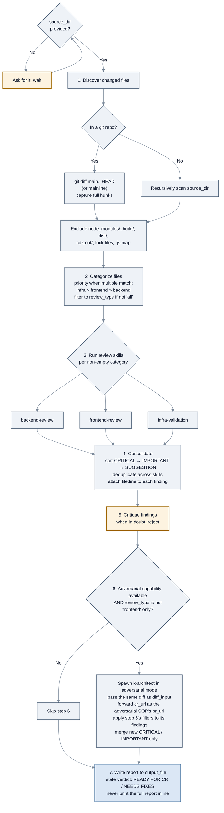
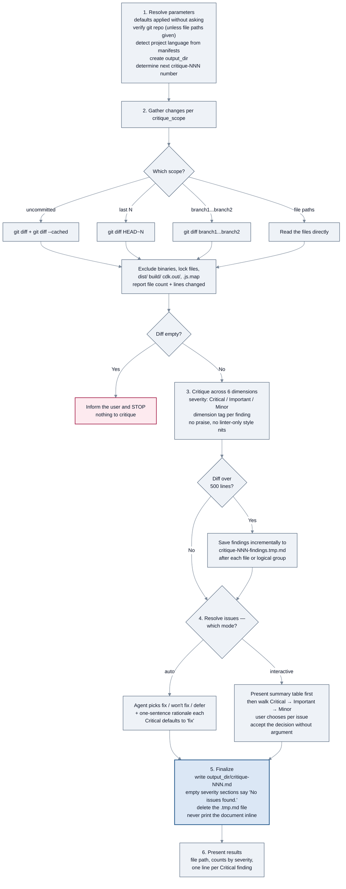
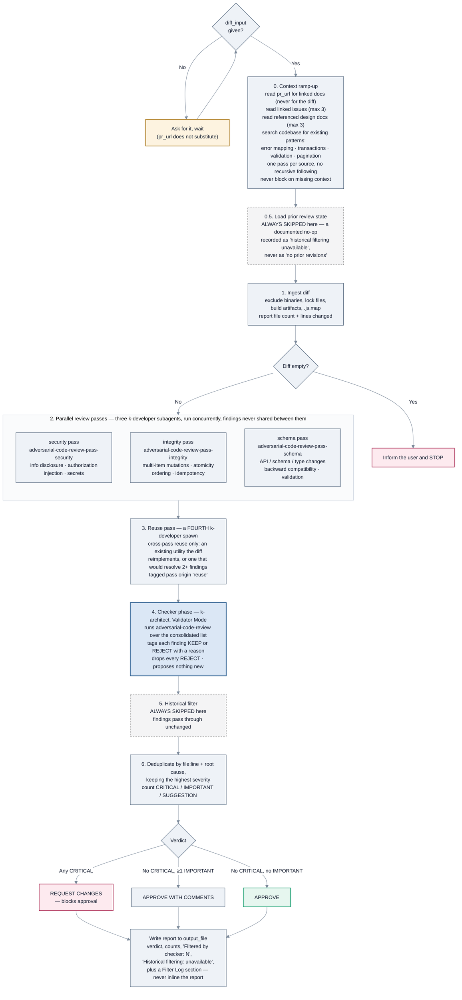
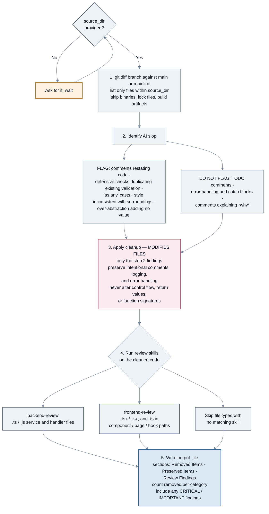

<!-- SPDX-License-Identifier: Apache-2.0 -->

# SOPs: code review and cleanup

[← SOP workflows](README.md) · [Guide index](../README.md)

Four SOPs that examine code changes. They are not interchangeable — see
[choosing between them](README.md#choosing-between-overlapping-sops) if you are unsure which one
you want.

| SOP | Source file | Declared by | Modifies files? |
| --- | --- | --- | --- |
| [`k-code-review-workflow`](#k-code-review-workflow) | `agent-sops/k-code-review-workflow.sop.md` | `k-developer` | No — writes a report only |
| [`k-pre-cr-critique`](#k-pre-cr-critique) | `agent-sops/k-pre-cr-critique.sop.md` | `k-developer` | **No — strictly read-only** |
| [`k-adversarial-pull-request-review`](#k-adversarial-pull-request-review) | `agent-sops/k-adversarial-pull-request-review.sop.md` | `k-architect` | No — writes a report only |
| [`k-code-cleanup`](#k-code-cleanup) | `agent-sops/k-code-cleanup.sop.md` | `k-developer` | **Yes — it edits your code** |

---

## `k-code-review-workflow`

### What it does

Discovers changed files, sorts them into backend / frontend / infra, runs the matching review
skill on each category, consolidates and deduplicates the findings, filters false positives,
optionally adds an adversarial pass, and writes one prioritized report.

### When to invoke it

Before opening a code review on a branch — this is the standard full review.

### How to invoke it

```bash
kiro-cli chat --agent konductor
```

```text
Run the k-code-review-workflow SOP against my current branch.
```

The orchestrator routes this to `k-developer`, the only agent that declares it.

### Parameters

| Parameter | Required | Default |
| --- | --- | --- |
| `source_dir` | **Yes** | — |
| `review_type` | No | `all` — or `backend`, `frontend`, `infra` |
| `output_file` | No | `code-review-report.md` |
| `cr_url` | No | none — forwarded to the adversarial step **as that SOP's `pr_url`**. Passing it through under its own name leaves `pr_url` unset and the review degrades to diff-only |

### Flow



*`k-code-review-workflow`: categorize, review per category, then filter hard before reporting.*

### File categorization rules

| Category | Matches |
| --- | --- |
| **Backend** | `.ts` / `.js` in paths matching `**/handler*`, `**/service*`, `**/repository*`, `**/lambda*`, `**/util*`, `**/middleware*` |
| **Frontend** | `.tsx` / `.jsx` files, and `.ts` files in `**/component*`, `**/page*`, `**/hook*` |
| **Infra** | `.ts` files in `**/cdk*`, `**/stack*`, `**/construct*`, `**/infra*` |

A file matching more than one category is assigned by priority: **infra > frontend > backend**.

### The false-positive filter

Step 5's stance is explicit: *when in doubt, reject — false positives erode trust.* A finding is
rejected if it:

- praises correct code
- speculates about code it has not seen
- flags a style-only issue
- duplicates something a linter already reported in this workflow
- gives a vague suggestion with no concrete fix
- references code that does not match the actual diff

A surviving finding must state the problem, why it matters, and a concrete fix.

### What you get

`code-review-report.md` (or your `output_file`) with a date, file counts by category, a summary
line of `CRITICAL: N | IMPORTANT: N | SUGGESTION: N`, numbered issue sections with `file:line`
references, and a verdict of **READY FOR CR** or **NEEDS FIXES**.

### Things to know

- **The diff, not just the file list, is the input.** Step 1 captures full hunks; the changed-file
  list is derived from them.
- **The adversarial step never actually fires.** Step 6 tells the agent to spawn
  `k-architect`, but its one owning agent cannot: in Kiro CLI `k-developer`'s
  `subagent.availableAgents` is `["k-quality-assurance"]`, which does not include the architect,
  and in Claude Code it has no `Agent(...)` tool at all.
  The SOP degrades quietly by design (*"You MUST skip this step if no adversarial CR-review
  capability is available"*), so you get standard review only. Routing through the orchestrator does
  not help — it does not declare this SOP. Run
  [`k-adversarial-pull-request-review`](#k-adversarial-pull-request-review) against `k-architect`
  separately instead. See
  [Agents reference](../agents.md#why-this-matters-a-real-consequence).
- **The adversarial step is also skipped for frontend-only reviews** by design, because it targets
  backend and infra gaps.
- **The adversarial step never re-reports** anything already in the consolidated list.
- **This SOP does not fix anything.** It produces a report.

---

## `k-pre-cr-critique`

### What it does

A fast, focused critique of local changes across six dimensions, producing a numbered critique
document with a resolution recorded per issue.

### When to invoke it

Before creating a CR, after finishing a feature, or for a quick sanity check on uncommitted work.

### How to invoke it

```bash
kiro-cli chat --agent konductor
```

```text
Run the k-pre-cr-critique SOP on my uncommitted changes.
```

### Parameters

None are required — every parameter has a default, and the SOP explicitly must not ask for
parameters that have defaults.

| Parameter | Default | Accepts |
| --- | --- | --- |
| `critique_scope` | uncommitted changes | `uncommitted`, `last N`, `branch1...branch2`, or specific file/directory paths |
| `output_dir` | `.agents/scratchpad` | any directory |
| `mode` | `auto` | `auto` or `interactive` |
| `focus_areas` | none | comma-separated, e.g. `"error handling, security, concurrency"` |

### Flow



*`k-pre-cr-critique`: four scope options, two resolution modes, one numbered output file.*

### The six dimensions

Every finding is tagged with one:

1. **Correctness** — logic accuracy, edge cases, bugs, null handling, race conditions, integration correctness
2. **Performance** — algorithmic complexity, memory usage, N+1 queries, scalability
3. **Security** — vulnerabilities, input validation, injection risks, secrets exposure, auth gaps
4. **Maintainability** — clarity, naming, documentation, duplication, complexity
5. **Architecture** — design patterns, separation of concerns, coupling, backwards compatibility
6. **Testing** — whether tests exist and adequately cover the changed code (static analysis only)

### What you get

`.agents/scratchpad/critique-NNN.md` (or your `output_dir`), numbered so successive runs do not
overwrite each other. It contains an executive summary, a severity count table, and per-issue
sections with file path, code snippet, problem, suggested resolution, and a **Decision** of
`fix` / `won't fix` / `defer` with rationale.

### Things to know

- **It is strictly read-only.** The SOP states this three times: it never modifies source files,
  creates commits, or runs builds or tests. If issues are marked `fix`, the SOP reminds you that
  you must apply them yourself.
- **It will not offer to fix things.** Step 6 forbids offering to apply fixes, run builds, or
  create commits.
- **No praise.** The SOP forbids positive observations and "looks good" comments — only
  actionable problems.
- **`focus_areas` reorders, it does not filter.** All six dimensions are still analyzed; focus
  areas surface first.
- **It has its own troubleshooting section** covering an empty diff despite changed files (check
  `git stash list` or untracked files), a diff too large for context (narrow the scope), findings
  referencing code outside the diff (tighten the scope), and minor findings drowning out real
  problems (use `focus_areas`).

---

## `k-adversarial-pull-request-review`

### What it does

Reviews a diff from the stance of a security-focused architect arguing **against** approval,
across four passes, then issues a verdict.

### When to invoke it

**After** standard review, on anything security-sensitive. The SOP is explicit that it is not a
replacement for standard review — it catches what style and quality reviewers miss: information
disclosure, data integrity failures, and schema/validation gaps.

**Only `k-architect` declares this SOP** — `k-developer` and the three orchestrators do not, so
none of them invokes it directly. `k-architect` acts as the coordinator: it spawns the generator
subagents and then runs the checker phase itself, which is what keeps generator and checker
independent.

### How to invoke it

```bash
kiro-cli chat --agent konductor
```

```text
Run the k-adversarial-pull-request-review SOP on the diff for my current branch.
```

### Parameters

| Parameter | Required | Default |
| --- | --- | --- |
| `diff_input` | **Yes, always** | — git diff output, file paths, or raw PR diff content |
| `pr_url` | No | none — **context only**. Step 0 uses it to read linked issues and design docs; it never derives the diff |
| `output_file` | No | `adversarial-review-report.md` |

You must always supply `diff_input`. **`pr_url` is not a substitute**: the SOP states that diff
auto-fetch from a URL is unsupported — `k-architect` has no tool that resolves a pull-request URL
to its diff — so it asks for `diff_input` even when `pr_url` is present. The SOP will not ask for
`output_file`.

### Flow



*`k-adversarial-pull-request-review`: a coordinator, three parallel generator subagents, a fourth
for reuse, then a checker phase the coordinator runs itself. Two steps are permanent no-ops here.*

### The quality gate

**Any CRITICAL finding forces REQUEST CHANGES**, regardless of the IMPORTANT or SUGGESTION
counts.

### Things to know

- **It checks for existing utilities before flagging a missing one.** Across all three technical
  passes the instruction is the same: if an error-mapping layer, transaction helper, or shared
  validator already exists, flag *bypassing* it rather than its absence.
- **It will not duplicate standard review.** Formatting, naming, and import order are explicitly
  out of scope.
- **Single-item writes are not flagged** as requiring transactions.
- **Validation issues in test files are not flagged.**
- **Context ramp-up is bounded.** Max 3 linked issues, max 3 referenced design docs, one pass per
  source, no recursive link following — and missing context never blocks the review.
- **Generator and checker are different agents, deliberately.** Steps 2 and 3 spawn `k-developer`
  four times; step 4 is `k-architect` running `adversarial-code-review` in Validator Mode on the
  result. The coordinator never generates a finding, which is what lets it judge them — and it is
  why the SOP forbids the checker from proposing anything new. It is a filter, not a second review.
- **Two steps never run here.** Step 0.5 (load prior review state) and step 5 (historical filter)
  are **permanent no-ops on this package** — `historical-issues-registry` is abstract and
  `k-architect` has no tool that can read a pull request's prior comment threads. The SOP is
  emphatic that this be reported as *"historical filtering unavailable"* and never as *"no prior
  revisions"*: the first means not checked, the second would claim nothing was found.
- **The report records what the checker removed.** `output_file` carries `Filtered by checker: N`,
  the historical-filtering note, and a `## Filter Log` section — so a rejected finding is visible
  rather than silently absent.

---

## `k-code-cleanup`

### What it does

Diffs your branch against main, identifies AI-generated slop, **removes it**, then runs the
appropriate review skills on the cleaned result.

### When to invoke it

Before submitting AI-assisted changes for review.

> **This SOP modifies your code.** It is the only SOP on this page that does. Commit or stash
> your work first so you can inspect exactly what it changed.

### How to invoke it

```bash
kiro-cli chat --agent konductor
```

```text
Run the k-code-cleanup SOP. source_dir: src/
```

### Parameters

| Parameter | Required | Default |
| --- | --- | --- |
| `source_dir` | **Yes** | — |
| `branch` | No | current branch |
| `output_file` | No | `cleanup-report.md` |

### Flow



*`k-code-cleanup`: the only SOP here that edits your files — step 3 is highlighted for that reason.*

### What it removes vs preserves

| Removed | Preserved |
| --- | --- |
| Comments that merely restate the code | `TODO` comments |
| Defensive checks duplicating existing validation | Error handling and catch blocks |
| `as any` casts | Comments explaining *why* (business rationale) |
| Style inconsistent with surrounding code | Logging |
| Over-abstraction — wrappers adding no value | |

### What you get

Modified files, shown as before/after diffs, plus `cleanup-report.md` with Removed Items,
Preserved Items, and Review Findings sections.

### Things to know

- **No logic or behavior changes.** Step 2 forbids changing logic; step 3 forbids altering
  control flow, return values, or function signatures. Only the step 2 findings are touched.
- **It only cleans files inside `source_dir`** that appear in the diff.
- **Review your diff afterwards.** `git diff` before committing is the right habit — the SOP
  presents before/after diffs, but the changes are already applied.

---

[← Design](design.md) · [Next: Testing, codebase analysis, and specs →](testing-and-specs.md)
