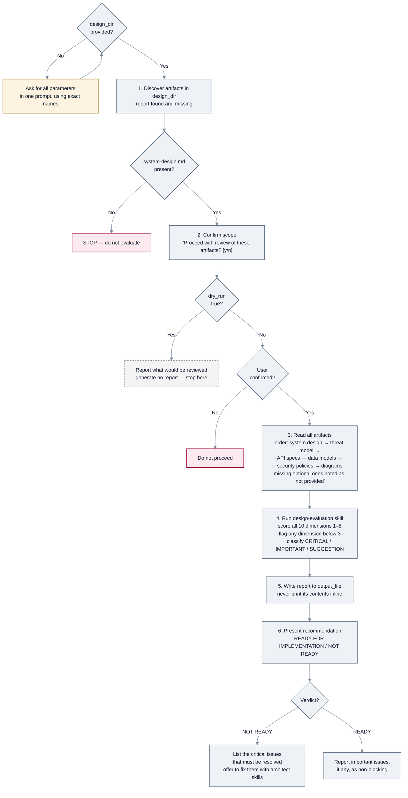
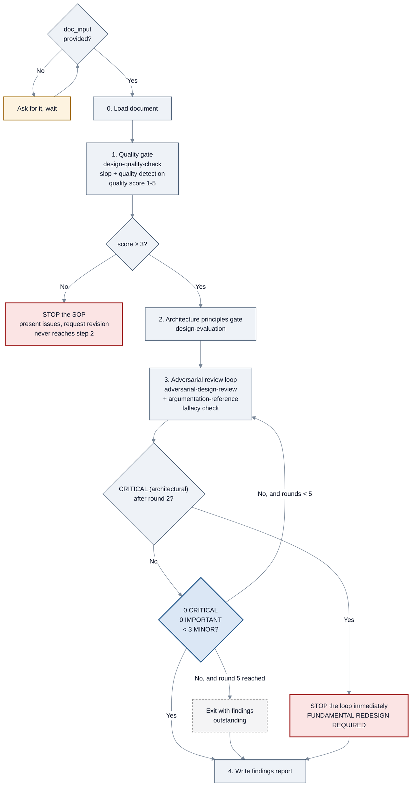

<!-- SPDX-License-Identifier: Apache-2.0 -->

# SOPs: design

[← SOP workflows](README.md) · [Guide index](../README.md)

Three SOPs, all declared by `k-architect`. One authors a design document, one evaluates
design artifacts that already exist, and one runs a pre-submission gate on a document that is
about to go to a human reviewer.

| SOP | Source file | Use it to |
| --- | --- | --- |
| [`k-design-doc-creation`](#k-design-doc-creation) | `agent-sops/k-design-doc-creation.sop.md` | **Write** a new design document |
| [`k-existing-design-review`](#k-existing-design-review) | `agent-sops/k-existing-design-review.sop.md` | **Review** existing design artifacts |
| [`k-principal-engineer-design-review`](#k-principal-engineer-design-review) | `agent-sops/k-principal-engineer-design-review.sop.md` | **Gate** a design doc before a Principal Engineer sees it |

> `k-existing-design-review`'s own header marks it **deprecated for design doc review**: use
> `k-design-doc-creation` when authoring new documents. It remains the right tool for reviewing a
> directory of already-produced artifacts before implementation.

---

## `k-design-doc-creation`

### What it does

Five phases producing a design document ready for principal engineer review: Socratic
requirements elicitation, outside-in drafting with Mermaid diagrams and inline ADRs, automated
quality gates, an adversarial review loop, and a final confidence-scored artifact.

### When to invoke it

When you need to create or write a design document. The SOP names the triggering phrasings:
"Design a system for X", "I need a design doc for Y".

### How to invoke it

```bash
kiro-cli chat --agent konductor
```

```text
Design a system for ingesting IoT sensor events and alerting on anomalies.
```

Or through the orchestrator, which routes design work to `k-architect`:

```bash
kiro-cli chat --agent konductor
```

### Parameters

| Parameter | Required | Default |
| --- | --- | --- |
| `topic` | **Yes** | — free-form description, user stories, or a problem statement |
| `output_path` | No | `docs/design/<slugified-topic>.md` |
| `elicitation_depth` | No | `standard` — `quick` (5 questions), `standard` (10), `deep` (15) |

The SOP will ask once for `topic` if missing and wait. It will **not** ask for `output_path` or
`elicitation_depth` — it uses the defaults and proceeds.

You can skip Phase 1 entirely by saying "skip elicitation" or "I have clear requirements".

### Flow



```mermaid
%%{init:{'theme':'base','themeVariables':{'fontSize':'14px','primaryColor':'#eef2f7','primaryTextColor':'#0f172a','primaryBorderColor':'#40556e','lineColor':'#7a8899','textColor':'#0f172a','edgeLabelBackground':'#ffffff','clusterBkg':'#fafbfc','clusterBorder':'#c9d2dc'}}}%%
flowchart TD
    P{"topic<br/>provided?"} -->|No| Ask["Ask once, wait"]
    Ask --> P
    P -->|Yes| Skip{"Said 'skip elicitation'<br/>or 'I have clear<br/>requirements'?"}

    Skip -->|Yes| P2
    Skip -->|No| P1["Phase 1 — Requirements elicitation<br/>socratic-elicitation skill, Mode A<br/>questions one at a time, answer-driven<br/>dimensions: PM · SDE · TPM · Security · Ops<br/>cap = elicitation_depth (5/10/15)"]

    P1 --> P1G{"Requirements Summary produced<br/>AND confirmed, or early-exit<br/>signal given?"}
    P1G -->|No| P1
    P1G -->|Yes| P2

    P2["Phase 2 — Draft generation<br/>design-doc-guidelines structure:<br/>Problem → Requirements → Solution Overview<br/>→ How It Works → Implementation Details<br/>→ Implementation Plan<br/>Mermaid diagrams before prose<br/>inline ADR per significant decision"]

    P2 --> P2G{"Maker-checker pass:<br/>zero CRITICAL findings?"}
    P2G -->|No| P2Fix["Fix CRITICAL findings, re-run"]
    P2Fix --> P2G
    P2G -->|Yes| P3

    subgraph P3["Phase 3 — Quality gates (no user interaction)"]
        direction TB
        Q1["doc-accuracy-analyzer<br/>verify claims vs codebase<br/>flag INCORRECT / UNVERIFIED inline"]
        Q2["aws-service-validator<br/>check every AWS claim via aws-mcp<br/>CONFIRMED / UNVERIFIED / INCORRECT<br/>report → docs/design/&lt;name&gt;-aws-validation.md"]
        Q3["trade-off-evaluator<br/>score 1–5: cost, latency, complexity,<br/>scalability, operability<br/>report → docs/design/&lt;name&gt;-tradeoffs.md"]
        Q4["adr-generator<br/>verify Phase 2 ADRs are embedded<br/>enrich only — do not regenerate"]
        Q1 --> Q2 --> Q3 --> Q4
    end

    P3 --> P4Start{"Adversarial-review<br/>subagent available?"}
    P4Start -->|"Yes — Path A"| PA["Delegate the full doc to it:<br/>challenge every decision, trade-off,<br/>and AWS service choice"]
    P4Start -->|"No — Path B"| PB["Adversarial self-review<br/>CRITICAL (architectural) ·<br/>CRITICAL (factual) ·<br/>IMPORTANT · MINOR"]

    PA --> Loop
    PB --> Loop

    Loop["Phase 4 loop — up to 5 rounds<br/>apply corrections, then re-run the<br/>design-doc-guidelines maker-checker"]
    Loop --> R2{"After round 2:<br/>any CRITICAL (architectural)?"}
    R2 -->|Yes| Halt["STOP the loop immediately<br/>present to engineer:<br/>redesign or override?"]
    R2 -->|No| Exit{"0 CRITICAL, 0 IMPORTANT,<br/>fewer than 3 MINOR?"}
    Exit -->|Yes| P5
    Exit -->|"No, rounds remain"| Loop
    Exit -->|"No, 5 rounds used"| Manual["Present remaining issues<br/>for manual resolution"]
    Halt --> P5
    Manual --> P5

    P5["Phase 5 — Final output<br/>apply all Phase 3+4 corrections<br/>design-evaluation confidence score<br/>= average of 10 dimensions (1–5 each)<br/>write to output_path<br/>reference the path, never inline the doc"]

    class Ask gate
    class Halt stop
    class P5 focus

    classDef gate fill:#fdf3e0,stroke:#a06800,stroke-width:1.5px,color:#0f172a;
    classDef stop fill:#fdeaef,stroke:#a1123f,stroke-width:1.5px,color:#0f172a;
    classDef focus fill:#dbe7f5,stroke:#2a5d8f,stroke-width:2px,color:#0f172a;
```

*`k-design-doc-creation`: five phases, with Path A / Path B on adversarial review and a hard
circuit-breaker after round 2.*

### The quality gate

The SOP will not present the document as ready for principal engineer review unless **all four**
hold:

| Check | Threshold |
| --- | --- |
| `design-doc-guidelines` maker-checker | 0 CRITICAL findings |
| `doc-accuracy-analyzer` | 0 INCORRECT findings — UNVERIFIED is acceptable with callouts |
| Adversarial review | 0 CRITICAL, 0 IMPORTANT, fewer than 3 MINOR |
| `design-evaluation` confidence score | ≥ 3.0 average across all sections |

If any condition fails, it presents the remaining issues and asks: `Fix these before
submission? [y/n]`.

### What you get

| File | Contents |
| --- | --- |
| `<output_path>` | The design document — outside-in structure, Mermaid diagrams, inline ADRs |
| `docs/design/<name>-aws-validation.md` | The AWS claim validation report |
| `docs/design/<name>-tradeoffs.md` | The full trade-off report |

Plus a spoken summary: the output path, the confidence score with any section scoring below 3,
and a one-line note on remaining open issues.

### Things to know

- **Phase 3 never asks you anything.** It is fully automated by design.
- **Unverified claims do not block.** Both `doc-accuracy-analyzer` and `aws-service-validator`
  mark UNVERIFIED claims with a `> ⚠️` callout and proceed. Only INCORRECT findings are treated
  as blocking.
- **Findings are never silently dropped.** Every Phase 4 finding must either be fixed or
  explicitly recorded as "engineer override".
- **Diagrams come before prose.** Phase 2 requires generating the Mermaid diagram for each major
  section before writing that section's text.
- **The document is never printed inline.** Phase 5 requires referencing the file path.

---

## `k-existing-design-review`

### What it does

Collects the design artifacts in a directory — system design, threat model, API specs, data
models, security policies, architecture diagrams — and evaluates them across 10 dimensions with
a numeric score each.

### When to invoke it

After all design artifacts are complete and before implementation starts. For *authoring* a new
document, use [`k-design-doc-creation`](#k-design-doc-creation) instead.

### How to invoke it

```bash
kiro-cli chat --agent konductor
```

```text
Run the k-existing-design-review SOP. design_dir: design-architecture/outputs/
```

### Parameters

| Parameter | Required | Default |
| --- | --- | --- |
| `design_dir` | **Yes** | — |
| `output_file` | No | `design-review-report.md` |
| `dry_run` | No | `false` |

If a required parameter is missing, the SOP asks for **all** parameters in a single prompt,
using their exact names.

### Flow



*`k-existing-design-review`: a required artifact, a confirmation gate, and a dry-run exit.*

### Artifacts it looks for

| Artifact | Filename patterns checked | Criticality |
| --- | --- | --- |
| System architecture | `system-design.md` | **Required** — evaluation cannot proceed without it |
| Threat model | `threat-model.md` | Critical — warned if missing |
| API specifications | `smithy-model/` or `api-specs/` | Optional |
| Data models | `dynamodb-*.md` or `data-model.md` | Optional |
| Security policies | `security-policy*.md` or `iam-policies.md` | Optional |
| Architecture diagrams | `*.drawio.xml` or `architecture-diagram*` | Optional |

### The 10 dimensions

Each scored 1–5; anything below 3 is flagged for revision.

1. Template adherence and completeness
2. Scalability and performance
3. Security and threat coverage
4. Maintainability and code quality
5. Resilience and fault tolerance
6. Testability
7. Operational readiness
8. Cost optimization
9. API design quality
10. Data model quality

### What you get

`design-review-report.md` (or your `output_file`) containing an executive summary, a dimension
score table, CRITICAL / IMPORTANT / SUGGESTION sections, and a recommendation of **READY FOR
IMPLEMENTATION** or **NOT READY**. The SOP reports the file location and the recommendation but
does not print the report body.

### Things to know

- **`system-design.md` is a hard requirement.** Without it the SOP stops rather than producing a
  partial evaluation. If you do not have one, the SOP's own troubleshooting section suggests
  generating it first with `k-architect` and the `system-design-patterns` skill.
- **The confirmation gate is real.** It will not proceed without an explicit answer.
- **`dry_run: true` stops at step 2** and reports what would be reviewed.
- **Only IMPORTANT issues is still READY.** The SOP's troubleshooting states a design with only
  IMPORTANT issues remains ready for implementation.
- **A missing threat model degrades rather than blocks.** The review proceeds with a note that
  the security and threat coverage dimension will be limited.

---

## `k-principal-engineer-design-review`

### What it does

Runs a pre-submission quality gate on a design document *before* it goes to a Principal Engineer.
It combines slop detection, an architecture-principles evaluation, and an adversarial review loop,
so the most common human review comments are already resolved by the time a person opens the
document.

### When to invoke it

When a design document is finished and about to be sent for human review. Where
`k-design-doc-creation` produces the document and `k-existing-design-review` assesses a whole
directory of design artifacts, this one hardens a single document against the review it is about
to receive.

### How to invoke it

```bash
kiro-cli chat --agent konductor
```

```text
Run the k-principal-engineer-design-review SOP. doc_input: docs/design/rate-limiting.md
```

### Parameters

| Parameter | Required | Default |
| --- | --- | --- |
| `doc_input` | **Yes** | — a path to the design document, or the document content itself |
| `output_file` | No | `<doc-name>-principal-engineer-review.md` beside the input doc, or `docs/design/principal-engineer-review.md` when invoked without a path |

### Flow



*`k-principal-engineer-design-review`: two gates, then a bounded adversarial loop.*

### What you get

A findings report at `output_file` covering the slop/quality gate, the architecture-principles
evaluation, and every adversarial round, with findings ordered CRITICAL → IMPORTANT → MINOR —
headed by a **verdict**: `PE-READY`, `REVISIONS NEEDED`, or `FUNDAMENTAL REDESIGN REQUIRED`.
The SOP reports the file path rather than printing the report.

### Things to know

- **Step 1 is a hard gate.** The quality score is 1–5, and a score below 3 **stops the SOP
  outright** — it presents the issues and asks for a revision rather than proceeding to step 2.
- **The adversarial loop is bounded at 5 rounds.** It exits early when 0 CRITICAL, 0 IMPORTANT,
  and fewer than 3 MINOR findings remain. Hitting round 5 without converging exits with the
  outstanding findings rather than looping forever.
- **One finding can end the loop early.** Any CRITICAL *architectural* finding still present
  after round 2 stops the loop immediately and forces the `FUNDAMENTAL REDESIGN REQUIRED`
  verdict. A CRITICAL *factual* finding does not — a wrong technical claim is correctable by
  revision, so it yields `REVISIONS NEEDED` instead.
- **Three skills do the work**: `design-quality-check` for the slop and quality gate,
  `design-evaluation` for architecture principles, and `adversarial-design-review` for the loop,
  with `argumentation-reference` checking the reasoning for fallacies.
- **It reviews one document, not a directory.** For a set of design artifacts — system design,
  threat model, API specs, data models — use [`k-existing-design-review`](#k-existing-design-review).

---

[← Planning, analysis, and verification](planning-and-analysis.md) · [Next: Code review and cleanup →](code-review.md)
