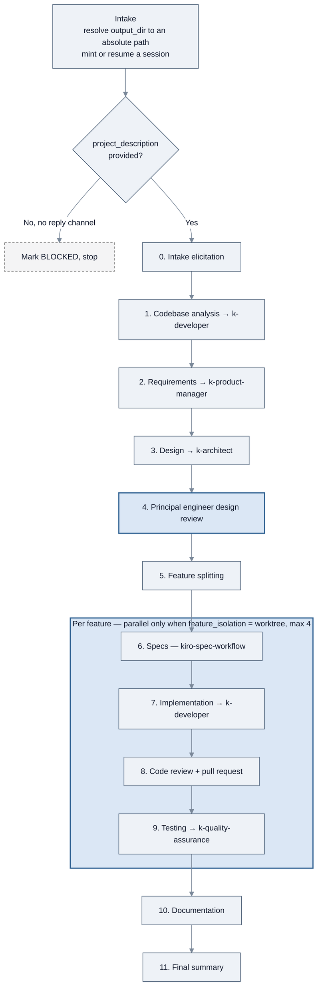
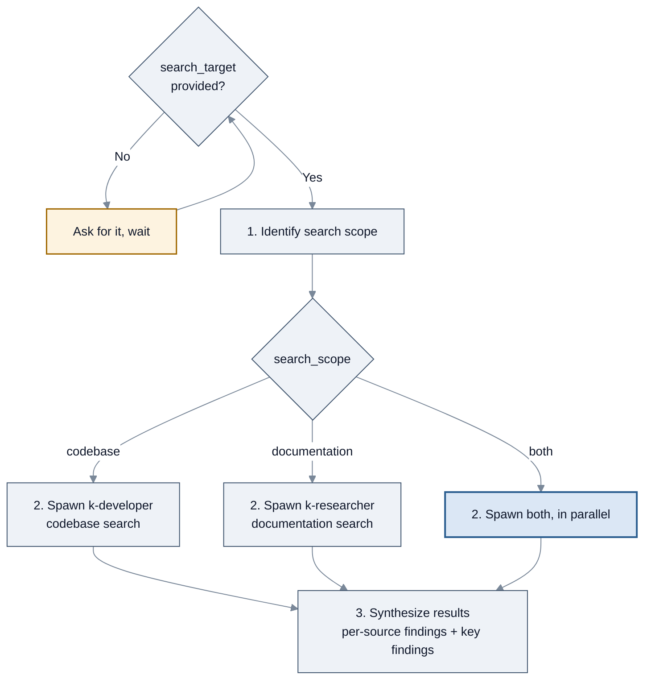
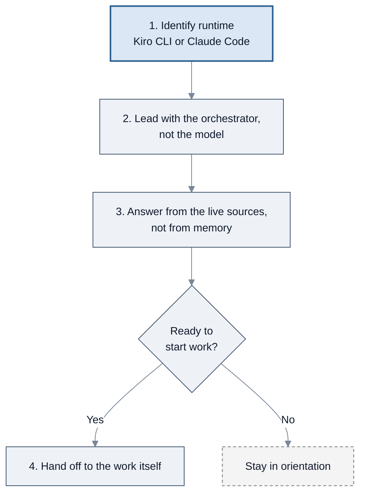

<!-- SPDX-License-Identifier: Apache-2.0 -->

# SOPs: orchestration and orientation

[← SOP workflows](README.md) · [Guide index](../README.md)

Three SOPs declared by all three orchestrators. They do not belong to one SDLC phase: one runs
the **whole** lifecycle, one is a research amplifier you can call from anywhere, and one exists
to orient a newcomer.

| SOP | Source file | Use it to |
| --- | --- | --- |
| [`k-full-sdlc`](#k-full-sdlc) | `agent-sops/k-full-sdlc.sop.md` | Take a project from idea to documented, tested code |
| [`k-comprehensive-search`](#k-comprehensive-search) | `agent-sops/k-comprehensive-search.sop.md` | Search the codebase and external docs, hard |
| [`about-konductor`](#about-konductor) | `agent-sops/about-konductor.sop.md` | Get oriented — what this is, how to install it, what to ask |

---

## `k-full-sdlc`

### What it does

Takes a project or feature through the full lifecycle in twelve gated phases: intake elicitation,
codebase analysis, requirements, design, principal-engineer design review, feature splitting,
per-feature specs, implementation, code review and pull request, testing, documentation, and a
final summary.

Each phase delegates to an existing SOP where one covers the work, or spawns a specialist agent
where none does. **Every phase is skippable and gated.**

### When to invoke it

When you want something built end to end — "build X", "take Y from requirements through tests".
For a single phase, run that phase's SOP directly instead.

### How to invoke it

```bash
kiro-cli chat --agent konductor
```

```text
Run the k-full-sdlc SOP. project_description: a URL shortener with per-user rate limits
```

### Parameters

| Parameter | Required | Default |
| --- | --- | --- |
| `project_description` | **Yes** | — |
| `codebase_path` | No | current directory — **a resumed run must pass this explicitly** |
| `skip_phases` | No | none — comma-separated phase names |
| `output_dir` | No | `.konductor/` — resolved to an absolute path at intake |
| `elicitation_depth` | No | `standard` (10 questions); also `quick` (5) or `deep` (15) |
| `max_fix_cycles` | No | `2` — shared per feature across steps 7, 8, and 9 |
| `deployed_url` | No | — required for step 9's functional and UI test passes |
| `credentials_file` | No | — forwarded to `k-e2e-test-generation` and `k-light-ui-testing` |
| `feature_isolation` | No | `branch`; only `worktree` allows parallel feature work |
| `reply_channel_available` | No | `true` — set `false` for a batch or CI run with no one to ask |

### Flow



*`k-full-sdlc`: twelve phases; steps 6–9 repeat per feature.*

### What you get

One subdirectory per phase under `output_dir` (default `.konductor/`), plus a session state file
under `output_dir/sessions/`. Implementation code is **not** written there — it follows the
project's own structure.

### Things to know

- **The orchestrator coordinates and never implements.** Every phase runs in a subagent, routed
  by task rather than by step number. A design fix goes back to step 3, a code fix to step 7, a
  documentation fix to step 10 — never to whoever is closest.
- **Fix cycles are a shared budget.** `max_fix_cycles` (default `2`) is per feature *for the whole
  run*: steps 7, 8, and 9 draw from one count, so a feature with sticky findings cannot churn.
  Step 10 has its own run-level counter, because documentation validation is project-wide.
- **Parallelism requires worktrees.** Features sharing one working directory run sequentially.
  With `feature_isolation: worktree`, up to four features run at once. Phases themselves are
  always sequential.
- **Resuming is a pause point, not an assumption.** An attended run reports the candidate session
  and waits for explicit confirmation before adopting it. A resumed run must pass `codebase_path`
  explicitly — leaving it at its default resolves a fresh value and silently mints a *new*
  session instead.
- **Unattended runs must pass `output_dir`.** With no reply channel, the SOP stops at intake
  rather than sharing the default directory with another project.
- **Every default is an opinion.** Ask for a different layout, extra README sections, or one pull
  request instead of per-feature, and the SOP follows the instruction and notes the deviation in
  step 11.

---

## `k-comprehensive-search`

### What it does

Activates "search mode" — it maximises search effort across the codebase and external
documentation by spawning parallel search agents and synthesising their findings.

### When to invoke it

Finding a pattern or implementation in a codebase, hunting for external documentation, locating a
specific file or configuration, or any research task that deserves more than one pass.

### How to invoke it

```bash
kiro-cli chat --agent konductor
```

```text
Run the k-comprehensive-search SOP. search_target: how retries are configured for the S3 client
```

### Parameters

| Parameter | Required | Default |
| --- | --- | --- |
| `search_target` | **Yes** | — a pattern, term, concept, or documentation topic |
| `search_scope` | No | `both`; also `codebase` or `documentation` |
| `project_root` | No | current directory |

### Flow



*`k-comprehensive-search`: scope, fan out, synthesize.*

### What you get

A **Search Results Summary** with a section per source — `k-developer` for the codebase,
`k-researcher` for documentation — followed by consolidated key findings.

### Things to know

- **It is a fan-out, not a grep.** The value is in running two specialists with different tools
  against the same question and reconciling what they return.
- **`search_scope: both` is the default** and spawns both agents in parallel.

---

## `about-konductor`

### What it does

Orients a new or lost user: what this package is, how to install the CLI, how to talk to the
orchestrator in plain language, and what it can take on.

### When to invoke it

When you would otherwise ask "what is this", "how do I install it", or "what can I ask it" — or
when you want a tour before starting real work.

### How to invoke it

```bash
kiro-cli chat --agent konductor
```

```text
Run the about-konductor SOP.
```

### Parameters

| Parameter | Required | Default |
| --- | --- | --- |
| `question` | No | none — a specific question such as "how do I install this". Omitted, you get the general orientation |

### Flow



*`about-konductor`: establish the runtime first, because the answer differs by runtime.*

### What you get

A spoken orientation rather than a file — scaled to your question if you asked one.

### Things to know

- **Step 1 is not a formality.** The two runtimes surface SOPs and skills differently — `/prompts`
  versus `/help`, `/<sop-name>` versus `/sop-<name>` — so the *answer itself* differs by runtime,
  not just the command used to start a session.
- **It reads the live sources.** Step 3 requires answering from what is actually installed rather
  than from a memorised description, which is what keeps this SOP correct as the package changes.
- **It is declared by all three orchestrators**, and is the one SOP whose output is a
  conversation rather than an artifact.

---

[← Testing, codebase analysis, and specs](testing-and-specs.md) · [SOP workflows](README.md) · [Next: Reference →](../reference.md)
