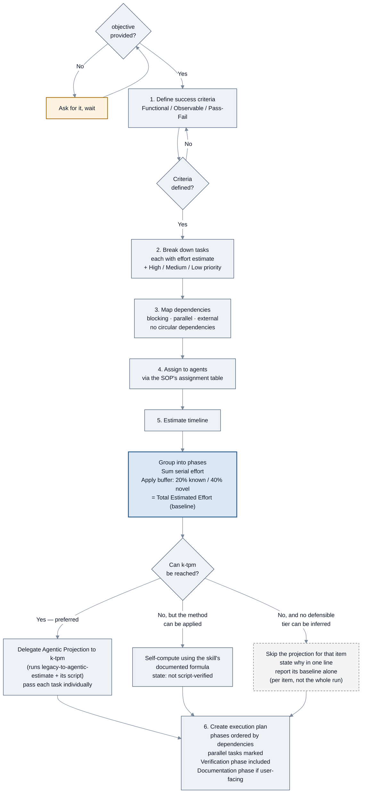
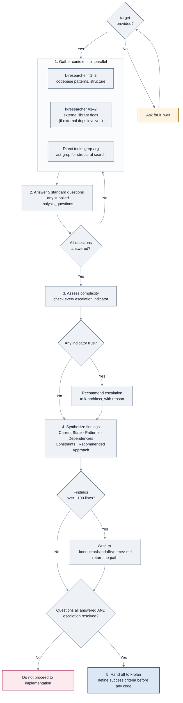
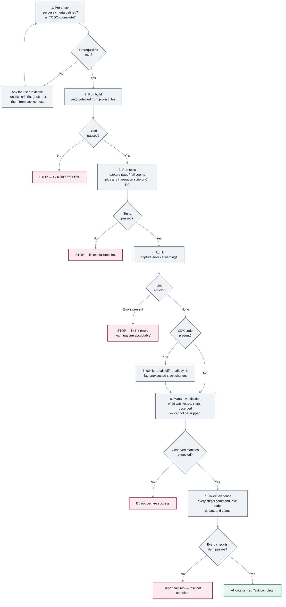
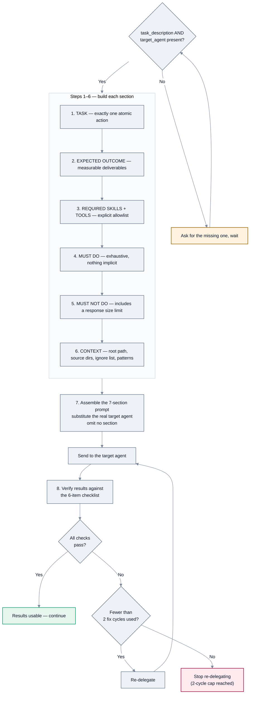

<!-- SPDX-License-Identifier: Apache-2.0 -->

# SOPs: planning, analysis, and verification

[← SOP workflows](README.md) · [Guide index](../README.md)

Four of the SOPs the orchestrators declare. Together they cover the front and back ends of a
piece of work: plan it, gather context for it, delegate it, and verify it is actually done.

| SOP | Source file | Declared by |
| --- | --- | --- |
| [`k-plan`](#k-plan) | `agent-sops/k-plan.sop.md` | all three orchestrators |
| [`k-context-gathering`](#k-context-gathering) | `agent-sops/k-context-gathering.sop.md` | all three orchestrators |
| [`k-verify`](#k-verify) | `agent-sops/k-verify.sop.md` | all three orchestrators |
| [`k-delegate`](#k-delegate) | `agent-sops/k-delegate.sop.md` | `konductor` only |

---

## `k-plan`

### What it does

Turns an objective into a work breakdown: measurable success criteria, prioritized tasks with
effort estimates, a dependency map, per-task agent assignments, a buffered timeline, and a
phased execution plan.

### When to invoke it

Multi-step tasks needing coordination, complex features needing structure, before starting any
non-trivial implementation, or when the scope itself needs clarification.

### How to invoke it

```bash
kiro-cli chat --agent konductor
```

```text
Run the k-plan SOP. objective: add rate limiting to the public API
```

### Parameters

| Parameter | Required | Default |
| --- | --- | --- |
| `objective` | **Yes** | — |
| `scope` | No | none — boundaries such as specific directories, services, or components |
| `constraints` | No | none — deadlines, technology restrictions, team availability |

### Flow



*`k-plan`: six steps, with a three-way fallback on the agentic estimate.*

### What you get

A success-criteria block, a prioritized task list, a dependency map, an agent assignment table,
a timeline table with a **Total Estimated Effort (baseline)**, and a phased execution plan.

Where the plan assigns agents, it uses the SOP's own table — for example codebase search and
external research to `k-researcher`, implementation and tests to `k-developer`,
architecture review to `k-architect`, media analysis to `k-media-analyzer`, plan review
and effort estimation to `k-tpm`.

### Things to know

- **The baseline is the commitment; the projection is not.** The SOP requires the buffered
  baseline to be presented as authoritative, and forbids presenting the Agentic Projection as
  the committed estimate.
- **The buffer has a floor.** 20% for well-understood work, 40% for novel or uncertain work.
  There is no zero-buffer tier.
- **The projection's precision is not real.** The SOP requires carrying the caveat that tier
  presets are uncalibrated defaults pending team telemetry, and instructs treating differences
  finer than about 15 minutes as noise. It also forbids narrowing or collapsing the low–high
  band to just the mid point.
- **A skipped projection is not a failure.** The SOP says so explicitly: the baseline is
  authoritative and complete without it.

---

## `k-context-gathering`

### What it does

Gathers comprehensive context before implementation begins — parallel research agents plus
direct tool searches — then answers a fixed set of questions, checks whether the work needs
architect escalation, and synthesizes findings into a structured summary.

### When to invoke it

Before implementing in unfamiliar code, for complex multi-system changes, when debugging after
2+ failed attempts, for architecture decisions, or to understand existing patterns.

### How to invoke it

```text
Run the k-context-gathering SOP. target: the authentication middleware
```

### Parameters

| Parameter | Required | Default |
| --- | --- | --- |
| `target` | **Yes** | — |
| `analysis_questions` | No | none — added to the five standard questions |
| `scope` | No | none — directories, services, or components to focus on |

### Flow



*`k-context-gathering`: parallel gathering, then two hard gates before implementation may begin.*

### The five standard questions

Always answered, plus anything you add:

1. How does the existing system work?
2. What patterns are currently used?
3. What dependencies are involved?
4. What are the integration points?
5. What tests exist?

### The escalation indicators

Any one of these triggers a recommendation to consult `k-architect`:

| Indicator | Action |
| --- | --- |
| Architecture decision required | Escalate |
| Multi-system coordination (3+ components) | Escalate |
| Debugging after 2+ failed fix attempts | Escalate |
| Security implications | Escalate |
| Simple implementation with clear patterns | Proceed |

### Things to know

- **Test files are never skipped** during context gathering — the SOP forbids it.
- **Large findings go to a file.** Over roughly 100 lines, the synthesis is written to
  `.konductor/handoff/<analysis-name>.md` and only the path is returned. Note this is a
  different `.konductor/` subdirectory from anything the CLI creates.
- **This SOP does not write code.** It ends by handing off to `k-plan`, or by recommending
  escalation with specific questions.
- **Execution context matters.** The SOP notes its steps run shell commands and may write files;
  an agent without those tools delegates them to specialists per its routing rules. This is why
  the read-only orchestrator can still run it.

---

## `k-verify`

### What it does

Runs the full verification battery — build, tests, lint, CDK checks where applicable, and
manual verification — then collects everything into one evidence report with a final checklist.

### When to invoke it

After completing implementation, before declaring any task done, when you ask for verification,
or after a bug fix to confirm the fix.

### How to invoke it

```text
Run the k-verify SOP. source_dir: src/
```

### Parameters

| Parameter | Required | Default |
| --- | --- | --- |
| `source_dir` | **Yes** | — |
| `success_criteria` | No | none — typically carried over from `k-plan` |
| `build_system` | No | auto-detect. One of `npm`, `cargo`, `go`, `python`, `gradle`, `maven` |

### Flow



*`k-verify`: a strict gate chain. Any failing step halts the sequence.*

### Build-system auto-detection

| Project file found | Build | Test | Lint |
| --- | --- | --- | --- |
| `package.json` | `npm run build` | `npm test` | `npm run lint` |
| `Cargo.toml` | `cargo build` | `cargo test` | `cargo clippy` |
| `go.mod` | `go build ./...` | `go test ./...` | `golangci-lint run` |
| `pyproject.toml` or `setup.py` | `python -m build` | `pytest` | `ruff check .` |
| `build.gradle.kts` or `build.gradle` | `gradle build` | `gradle test` | `gradle checkstyleMain`, or the project's configured plugin |
| `pom.xml` | `mvn compile` | `mvn test` | `mvn checkstyle:check`, or the project's configured plugin |

The SOP also requires preferring the project's wrapper or lockfile-indicated tool: `./gradlew`
over `gradle` when `gradlew` exists, `pnpm` or `yarn` over `npm` when `pnpm-lock.yaml` or
`yarn.lock` exists. For Gradle and Maven it requires inspecting the build configuration for a
configured lint plugin before choosing the lint command, since Java and Kotlin linting is
project-specific.

### Things to know

- **Lint warnings are acceptable; lint errors are not.** That distinction is explicit.
- **Manual verification cannot be skipped.** The SOP states automated tests alone are
  insufficient.
- **The final checklist is all-or-nothing.** Seven items: success criteria met, build passes,
  tests pass, lint passes, manual verification complete, no regressions, documentation updated
  if applicable. Any failure means the task is not complete.

---

## `k-delegate`

### What it does

Builds the 7-section delegation prompt the orchestrator sends to a specialist, then verifies
what comes back.

### When you would invoke it

Normally you would not. This is internal machinery — the orchestrator uses it on every
delegation. Reading it is still worthwhile, because it tells you exactly what the orchestrator
is sending on your behalf, and its 8-step structure explains the "up to 2 fix cycles" behavior
you will see in practice.

### Parameters

| Parameter | Required | Default |
| --- | --- | --- |
| `task_description` | **Yes** | — |
| `target_agent` | **Yes** | — e.g. `k-researcher`, `k-developer`, `k-media-analyzer`, `k-browser` |
| `context_paths` | No | none — relevant paths, directories, or URLs |
| `language` | No | auto-detect from project |

### Flow



*`k-delegate`: build all seven sections, send, verify, re-delegate up to twice.*

### The verification checklist

Every delegation result is checked against all six:

1. Did the agent complete the TASK?
2. Did it provide the EXPECTED OUTCOME?
3. Did it use only the REQUIRED TOOLS?
4. Did it follow the MUST DO requirements?
5. Did it avoid the MUST NOT DO prohibitions?
6. Are the results usable for next steps?

### Things to know

- **Every section is mandatory.** The SOP forbids omitting any of the seven.
- **The tool allowlist exists to prevent tool sprawl** — giving an agent only what the task
  needs.
- **A response size limit belongs in MUST NOT DO.** The SOP's example is "Do not return
  responses exceeding ~100 lines", alongside "do not return raw file contents or complete
  source code — summarize with file paths and key snippets".
- **It carries a language reference table** mapping eight concepts — source files, test files,
  HTTP client, dependency directory, package manager, config file, build command, test command —
  across Go, Java, Kotlin, Python, Swift, and TypeScript, so examples written in TypeScript can be
  adapted to whatever the project uses.

---

[← SOP workflows](README.md) · [Next: Design →](design.md)
