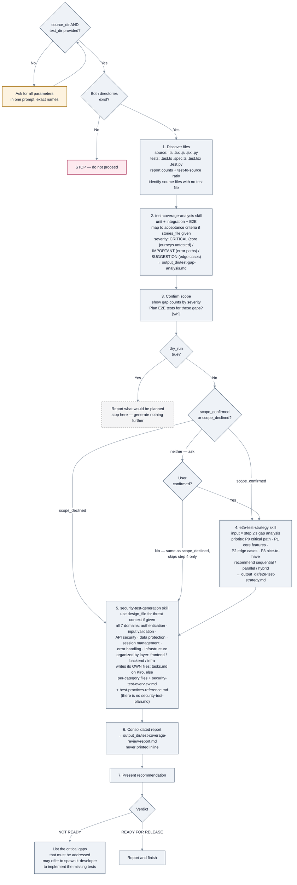
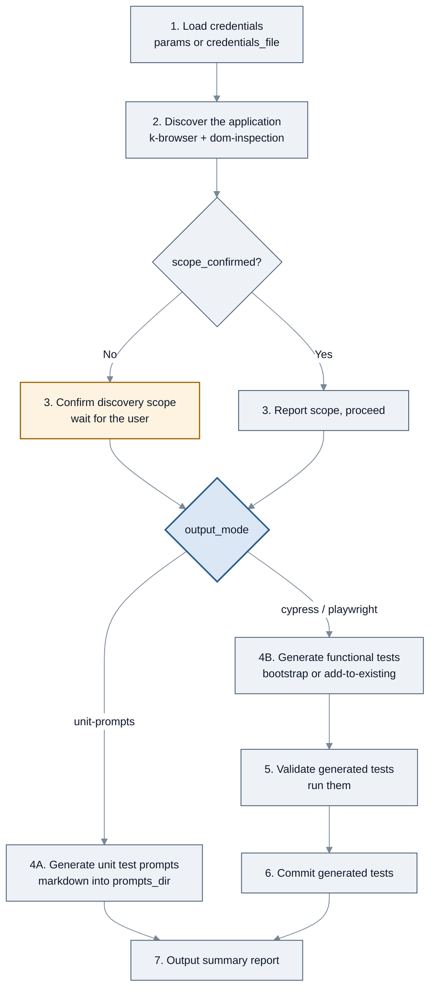
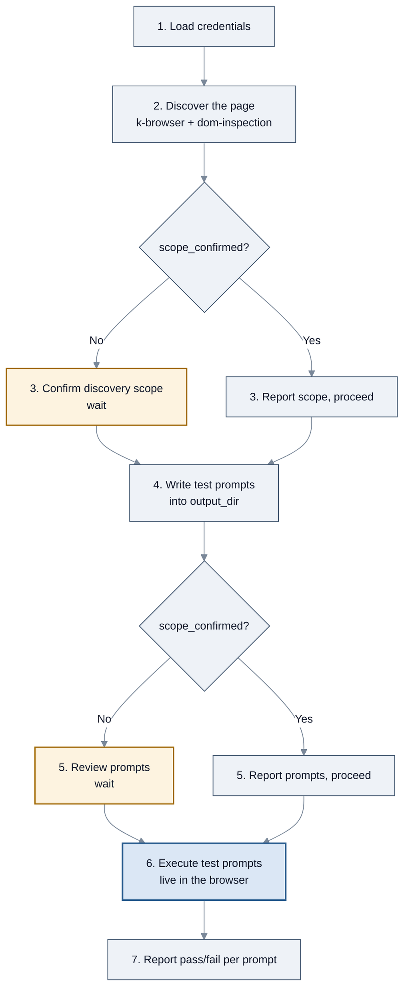

<!-- SPDX-License-Identifier: Apache-2.0 -->

# SOPs: testing, codebase analysis, and specs

[← SOP workflows](README.md) · [Guide index](../README.md)

Five SOPs: coverage and spec generation, plus the two browser-driven SOPs that test a
**deployed** page rather than source.

| SOP | Source file | Declared by |
| --- | --- | --- |
| [`k-test-coverage-review`](#k-test-coverage-review) | `agent-sops/k-test-coverage-review.sop.md` | `k-quality-assurance` |
| [`k-codebase-analysis`](#k-codebase-analysis) | `agent-sops/k-codebase-analysis.sop.md` | `k-developer` |
| [`kiro-spec-workflow`](#kiro-spec-workflow) | `agent-sops/kiro-spec-workflow.sop.md` | all three orchestrators |
| [`k-e2e-test-generation`](#k-e2e-test-generation) | `agent-sops/k-e2e-test-generation.sop.md` | all three orchestrators |
| [`k-light-ui-testing`](#k-light-ui-testing) | `agent-sops/k-light-ui-testing.sop.md` | all three orchestrators |

> The last two drive a real browser against a **running** application. They are not source-code
> test generators: point them at a URL, not a repository.

---

## `k-test-coverage-review`

### What it does

Runs three QA skills in sequence — coverage gap analysis, E2E test strategy, security test
generation — and writes three named files plus the security skill's own output, ending in a
READY / NOT READY release recommendation.

### When to invoke it

After implementation is complete and before release.

### How to invoke it

```bash
kiro-cli chat --agent konductor
```

```text
Run the k-test-coverage-review SOP. source_dir: src/  test_dir: test/
```

### Parameters

| Parameter | Required | Default |
| --- | --- | --- |
| `source_dir` | **Yes** | — e.g. `src/` |
| `test_dir` | **Yes** | — e.g. `test/` or `__tests__/` |
| `stories_file` | No | none — user stories or acceptance criteria, used to map tests to criteria |
| `design_file` | No | none — system design doc, used for security threat context |
| `output_dir` | No | `test-coverage-review/` |
| `dry_run` | No | `false` — takes precedence over both flags below and always stops at step 3 |
| `scope_confirmed` | No | `false` — set `true` when the caller has already authorized E2E planning. Step 3 then reports and proceeds without prompting, and downstream skills stop asking scope questions too. **A parallel or unattended caller must set this** — the prompt has no one to answer it |
| `scope_declined` | No | `false` — set `true` when the engineer was already asked and said no. Step 3 skips step 4 without asking again. **Mutually exclusive with `scope_confirmed`**; leaving both `false` is not the same as declining, and step 3 will ask again |

Missing required parameters are requested in a single prompt using their exact names.

### Flow



*`k-test-coverage-review`: three skills in sequence. Declining at the gate skips only the E2E
strategy step — the security pass, the report and the verdict still run.*

### What you get

Three named files in `test-coverage-review/` (or your `output_dir`), **plus whatever the security
skill writes** — so the total count varies by runtime:

| File | Contents |
| --- | --- |
| `test-gap-analysis.md` | Coverage analysis and gaps prioritized by severity |
| `e2e-test-strategy.md` | Prioritized P0–P3 test matrix and execution strategy |
| `test-coverage-review-report.md` | The consolidated summary and recommendation |
| *the security skill's own output* | `tasks.md` on Kiro; elsewhere per-category files plus `security-test-overview.md` and `best-practices-reference.md`. There is **no** `security-test-plan.md` — the SOP says not to expect one |

The consolidated report ends with **READY FOR RELEASE** or **NOT READY — reason**. It is
**NOT READY** on any of three triggers: critical gaps in the coverage analysis, critical gaps in
the security test plan, or a security test plan reported as `NOT EVALUATED`. A prioritized
"Next Steps" list follows.

### Things to know

- **Declining at step 3 skips one step, not the run.** A `no` is treated exactly as
  `scope_declined=true`: step 4 (E2E strategy) is skipped, and steps 5–7 still run, so you still
  get the security pass, the consolidated report, and a verdict.
- **A security plan can come back `NOT EVALUATED`.** In Kiro stub mode the security skill writes
  only `tasks.md` and defers the real test content to a human clicking "Start task" in the Kiro
  IDE. The SOP requires recording Critical and Important findings as `NOT EVALUATED` rather than
  `0`, *"so the report does not misrepresent an unevaluated pass as a clean one"* — and it treats
  that state as a critical gap, so the verdict is **NOT READY**, not READY.
- **Unattended callers must set `scope_confirmed`.** Step 3's prompt has no one to answer it
  otherwise, and the run stalls there.
- **`dry_run: true` stops at step 3** and reports what it would analyze, generating no files.
- **Non-existent directories abort the SOP.** Step 1 will not proceed if `source_dir` or
  `test_dir` is missing.
- **Supply `design_file` if you can.** The SOP's troubleshooting notes that without it, the
  security test generator infers services from code rather than from the actual architecture,
  and may reference services that do not exist.
- **CRITICAL gaps come first.** The troubleshooting section advises prioritizing core user
  journeys, then P0 E2E tests and authentication security tests; SUGGESTION-level gaps can be
  deferred.

---

## `k-codebase-analysis`

### What it does

A deep-dive architectural assessment written incrementally to one Markdown file: codebase map,
architecture, SOLID evaluation, design patterns, dependencies, code quality, security and
performance, and technical debt — each with Mermaid diagrams where structural.

### When to invoke it

Joining an unfamiliar codebase, before major refactoring, during an architecture review, or when
assessing technical debt.

This is **not** the same as [`k-context-gathering`](planning-and-analysis.md#k-context-gathering). The SOP
states the difference itself: `k-context-gathering` is pre-implementation context gathering across
research agents; this one produces a comprehensive standalone reference document.

### How to invoke it

```bash
kiro-cli chat --agent konductor
```

```text
Run the k-codebase-analysis SOP on this repository.
```

Or scope it to save time and context:

```text
Run k-codebase-analysis with focus_areas=architecture,dependencies
```

### Parameters

Every parameter is optional. The SOP must not prompt for optional parameters — it uses defaults
and proceeds.

| Parameter | Default | Accepts |
| --- | --- | --- |
| `codebase_path` | current directory | any path |
| `output_file` | `codebase-analysis.md` | any path |
| `focus_areas` | `all` | comma-separated: `architecture`, `solid`, `patterns`, `dependencies`, `security`, `performance`, `testing`, `debt`, or `all` |

### Flow



```mermaid
%%{init:{'theme':'base','themeVariables':{'fontSize':'14px','primaryColor':'#eef2f7','primaryTextColor':'#0f172a','primaryBorderColor':'#40556e','lineColor':'#7a8899','textColor':'#0f172a','edgeLabelBackground':'#ffffff','clusterBkg':'#fafbfc','clusterBorder':'#c9d2dc'}}}%%
flowchart TD
    S1["1. Resolve parameters<br/>resolve codebase_path to absolute<br/>verify it exists and has source files<br/>validate each focus_areas value<br/>create output_file with a header<br/>to enable incremental writes"]

    S1 --> G0{"Path exists and<br/>contains source files?"}
    G0 -->|No| Stop["STOP — do not proceed"]
    G0 -->|Yes| S2

    S2["2. Build codebase map<br/>directory tree · languages by extension count ·<br/>frameworks from manifests · entry points · build system<br/>MERMAID: module structure<br/>never traverse node_modules .git build dist target"]

    S2 --> Sel{"focus_areas<br/>= all?"}
    Sel -->|Yes| All["Run steps 3–9"]
    Sel -->|No| Some["Run only the mapped steps,<br/>skip the rest"]

    All --> Sections
    Some --> Sections

    subgraph Sections["Steps 3–9 — each appended to output_file"]
        direction TB
        S3["3. Architecture<br/>style · layer boundaries · dependency direction<br/>MERMAID: component dependency graph"]
        S4["4. SOLID — all five principles<br/>rating ✅ / ⚠️ / ❌ + a real code example each<br/>never fabricate examples"]
        S5["5. Design patterns<br/>creational · structural · behavioral<br/>+ architectural patterns<br/>never force-fit a pattern"]
        S6["6. Dependencies & integrations<br/>flag outdated deps, circular deps,<br/>undocumented API contracts<br/>MERMAID: integration diagram"]
        S7["7. Code quality<br/>error handling · logging · testing strategy<br/>static analysis only"]
        S8["8. Security & performance<br/>input validation · auth · hardcoded secrets ·<br/>N+1 queries · unbounded loops · pagination · caching"]
        S9["9. Technical debt<br/>TODO/FIXME/HACK/XXX · dead code · duplication ·<br/>missing abstractions · config drift · outdated patterns<br/>rated CRITICAL / IMPORTANT / SUGGESTION"]
        S3 --> S4 --> S5 --> S6 --> S7 --> S8 --> S9
    end

    Sections --> S10["10. Generate report<br/>Executive Summary in 3–5 sentences<br/>Recommendations prioritized P0 / P1 / P2<br/>include only the selected sections<br/>report path + top 3 recommendations<br/>never print the full report inline"]

    class Stop stop
    class S10 focus

    classDef stop fill:#fdeaef,stroke:#a1123f,stroke-width:1.5px,color:#0f172a;
    classDef focus fill:#dbe7f5,stroke:#2a5d8f,stroke-width:2px,color:#0f172a;
```

*`k-codebase-analysis`: ten steps, each appending to one file — the seven analysis sections
are grouped here for readability.*

### `focus_areas` to step mapping

Straight from the SOP's own table:

| `focus_areas` value | Step it runs |
| --- | --- |
| `architecture` | 3 — Architecture Analysis |
| `solid` | 4 — SOLID Principles Evaluation |
| `patterns` | 5 — Design Patterns Analysis |
| `dependencies` | 6 — Dependencies & Integrations |
| `testing` | 7 — Code Quality Assessment |
| `security` | 8 — Security & Performance |
| `performance` | 8 — Security & Performance |
| `debt` | 9 — Technical Debt Assessment |
| `all` | steps 2–9 |

Note `security` and `performance` both map to step 8, and `testing` maps to the Code Quality
step rather than a step of its own.

### What you get

`codebase-analysis.md` (or your `output_file`) with an executive summary, the analysis sections
you selected — three of them carrying Mermaid diagrams — and a P0/P1/P2 prioritized
recommendations list.

| Priority | Meaning |
| --- | --- |
| **P0** | Fix immediately — security issues, critical bugs, blocking debt |
| **P1** | Fix this quarter — architectural improvements, medium debt |
| **P2** | Fix when convenient — cosmetic, low-severity debt |

### Things to know

- **Writes are incremental.** The output file is created with a header at step 1 and appended to
  as each section completes, so a run interrupted by context limits still leaves usable output.
  That is also the SOP's recommended remedy for a large codebase: run one focus area at a time
  and let findings accumulate across runs.
- **No code is executed.** Steps 7 and 8 are static analysis only.
- **No fabricated examples.** Step 4 requires referencing only code actually found.
- **No force-fit patterns.** Step 5 requires reporting only patterns clearly present.
- **SOLID adapts to non-OOP codebases.** Per its troubleshooting section: Single Responsibility
  applies to modules and functions, Open/Closed to extension points, Dependency Inversion to
  module boundaries — and the analysis notes when a principle is less applicable.
- **Pattern detection is heuristic.** The SOP says so and asks you to verify against the file
  path reference when a pattern looks wrong.

---

## `kiro-spec-workflow`

### What it does

Chains three skills in sequence — `kiro-requirements-generation` →
`kiro-design-generation` → `kiro-task-generation` — to turn PM and design artifacts into a
complete Kiro IDE spec directory, then validates traceability across the three documents.

### When to invoke it

When you want a `.kiro/specs/<feature-name>/` directory containing `requirements.md`,
`design.md`, and `tasks.md` ready for execution.

### How to invoke it

```bash
kiro-cli chat --agent konductor
```

```text
Run the kiro-spec-workflow SOP for feature_name=user-authentication
```

You will need the three other required paths; the SOP will ask if you have not supplied them.

### Parameters

| Parameter | Required | Default |
| --- | --- | --- |
| `feature_name` | **Yes** | — kebab-case, e.g. `user-authentication` |
| `feature_scope_path` | **Yes** | — the feature-split file with this feature's scoped stories, components, and dependencies |
| `user_stories_path` | **Yes** | — the full user stories file from the `user-story-writing` skill |
| `design_artifacts_path` | **Yes** | — the design artifacts directory from the architect phase |
| `output_dir` | No | `.kiro/specs/{feature_name}/` |

### Flow



```mermaid
%%{init:{'theme':'base','themeVariables':{'fontSize':'14px','primaryColor':'#eef2f7','primaryTextColor':'#0f172a','primaryBorderColor':'#40556e','lineColor':'#7a8899','textColor':'#0f172a','edgeLabelBackground':'#ffffff','clusterBkg':'#fafbfc','clusterBorder':'#c9d2dc'}}}%%
flowchart TD
    S1["1. kiro-requirements-generation<br/>read feature scope → identify in-scope stories<br/>read user stories, filter to this feature<br/>create output_dir<br/>produce requirements.md with EARS criteria<br/>(WHEN / IF / WHILE … SHALL)"]

    S1 --> A1{"User approves<br/>requirements.md?"}
    A1 -->|"Changes requested"| R1{"Fewer than<br/>2 cycles used?"}
    R1 -->|Yes| Rev1["Revise and re-present"]
    Rev1 --> A1
    R1 -->|No| Cap1["2-cycle cap reached"]
    A1 -->|Approved| S2
    Cap1 --> S2

    S2["2. kiro-design-generation<br/>read requirements.md + design artifacts<br/>produce design.md with all 6 sections:<br/>Overview · Architecture · Components and Interfaces ·<br/>Data Models · Error Handling · Testing Strategy<br/>every requirement must be addressed"]

    S2 --> UI{"UI feature AND a<br/>UI-prototyping agent<br/>is available?"}
    UI -->|Yes| Mock["Spawn it with the HLD or PRD URL<br/>generate a Cloudscape mock UI<br/>present it alongside design.md"]
    UI -->|No| A2
    Mock --> A2

    A2{"User approves<br/>design.md?"}
    A2 -->|"Changes requested"| R2{"Fewer than<br/>2 cycles used?"}
    R2 -->|Yes| Rev2["Revise and re-present"]
    Rev2 --> A2
    R2 -->|No| Cap2["2-cycle cap reached"]
    A2 -->|Approved| S3
    Cap2 --> S3

    S3["3. kiro-task-generation<br/>read requirements.md + design.md<br/>produce tasks.md in Kiro IDE format:<br/>numbered checkboxes, max 2-level hierarchy,<br/>requirement references<br/>every requirement gets ≥1 task"]

    S3 --> A3{"User approves<br/>tasks.md?"}
    A3 -->|"Changes requested"| R3{"Fewer than<br/>2 cycles used?"}
    R3 -->|Yes| Rev3["Revise and re-present"]
    Rev3 --> A3
    R3 -->|No| Cap3["2-cycle cap reached"]
    A3 -->|Approved| S4
    Cap3 --> S4

    S4["4. Validate spec completeness<br/>all three files exist in output_dir<br/>every requirement addressed in design.md<br/>every requirement has ≥1 task<br/>present traceability summary:<br/>requirement → design section → task(s)"]

    class A1,A2,A3 gate
    class S4 focus

    classDef gate fill:#fdf3e0,stroke:#a06800,stroke-width:1.5px,color:#0f172a;
    classDef focus fill:#dbe7f5,stroke:#2a5d8f,stroke-width:2px,color:#0f172a;
```

*`kiro-spec-workflow`: three generation steps, each with its own approval gate and a 2-cycle
revision cap, then a traceability check.*

### What you get

```text
.kiro/specs/<feature-name>/
├── requirements.md   EARS-format acceptance criteria
├── design.md         six-section per-feature low-level design
└── tasks.md          Kiro IDE numbered task list with requirement references
```

Plus a traceability summary mapping each requirement to its design section and its task(s).

### Things to know

- **Three approval gates, not one.** Each document is presented for your approval before the next
  one is generated. This is the most interactive SOP in the package.
- **Revisions are capped at 2 cycles per document.**
- **EARS format** means the acceptance criteria use the WHEN / IF / WHILE … SHALL construction —
  a convention that keeps criteria testable.
- **Requirements are filtered by feature scope.** Step 1 reads `feature_scope_path` first, then
  includes only the user stories mapped to that feature.
- **UI features get an optional mock.** If the feature is UI-facing and a UI-prototyping agent is
  available, a Cloudscape mock is generated and presented alongside `design.md` so you can
  validate both before implementation.
- **The SOP notes it writes files**, so an agent without write tools delegates that to a
  specialist per its routing rules.

---

## `k-e2e-test-generation`

### What it does

Discovers a deployed web application through browser automation, then generates either structured
markdown **unit test prompts** or executable **Cypress / Playwright specs** — bootstrapping a new
test project or adding to an existing one.

### When to invoke it

When you have a deployed web app and want test coverage generated from what is actually live,
rather than from reading the source.

**Do not use it for** unit-testing source logic, API-only testing, or apps behind non-browser
authentication such as mTLS or client certificates.

### How to invoke it

```bash
kiro-cli chat --agent konductor
```

```text
Run the k-e2e-test-generation SOP. url: https://staging.example.com
output_mode: playwright  project_mode: bootstrap
```

### Parameters

| Parameter | Required | Default |
| --- | --- | --- |
| `url` | **Yes**, unless `credentials_file` supplies `test_url` | — |
| `output_mode` | **Yes** | one of `unit-prompts`, `cypress`, `playwright` |
| `project_mode` | **Yes** when `output_mode` is `cypress` or `playwright` | one of `bootstrap`, `add-to-existing` |
| `project_dir` | **Yes** when `project_mode` is `add-to-existing` | — |
| `username` / `password` | No | — the password is never logged or displayed |
| `credentials_file` | No | — a `.properties` file with `test_url`, `user_name`, `password` |
| `prompts_dir` | No | `{project_root}/tests/page/` (only used by `unit-prompts`) |
| `scope_confirmed` | No | `false` — set it `true` to skip the step 3 prompt; unattended callers **must** |

### Flow



*`k-e2e-test-generation`: discovery, a scope gate, then one of two generation branches.*

### What you get

With `unit-prompts`, markdown test-case files in `prompts_dir`. With `cypress` or `playwright`,
an executable spec suite that has been run once and committed, plus a summary report.

### Things to know

- **It uses Playwright's bundled Chromium**, not your system Chrome. That is deliberate: it
  avoids the "Browser is already in use" error when Chrome is already open on macOS.
- **`scope_confirmed` matters for automation.** Left at its default, step 3 stops and waits. Any
  parallel or unattended caller must set it `true`.
- **Only the two functional modes validate and commit.** `unit-prompts` writes prompt files and
  goes straight to the summary.

---

## `k-light-ui-testing`

### What it does

Discovers a deployed page, writes structured markdown test prompts for the features you describe,
then **executes those prompts live** in the browser and reports pass/fail for each one.

### When to invoke it

During development, when a page is not yet ready for full functional test generation. It gives
immediate feedback on what works without requiring a test framework or any scaffolding.

**Do not use it for** full Cypress/Playwright spec generation, CI wiring, or apps behind
non-browser authentication.

### How to invoke it

```bash
kiro-cli chat --agent konductor
```

```text
Run the k-light-ui-testing SOP. url: http://localhost:3000/settings
features: the notification toggles and the save button
```

### Parameters

| Parameter | Required | Default |
| --- | --- | --- |
| `url` | **Yes**, unless `credentials_file` supplies `test_url` | — |
| `features` | **Yes** | — free text describing the features or flows to test |
| `username` / `password` | No | — the password is never logged or displayed |
| `credentials_file` | No | — a `.properties` file with `test_url`, `user_name`, `password` |
| `output_dir` | No | `tests/page/` |
| `scope_confirmed` | No | `false` — when `true`, steps 3 and 5 report and proceed instead of prompting |

### Flow



*`k-light-ui-testing`: two confirmation gates, both governed by the same `scope_confirmed` flag.*

### What you get

Markdown test prompts in `output_dir` and a pass/fail result per prompt, produced by actually
driving the page.

### Things to know

- **Both SOPs run what they produce — differently.** `k-e2e-test-generation` builds a framework
  suite and runs it once in step 5 to validate it. This one writes plain-language prompts and
  executes them live against the page, reporting pass/fail per prompt, with no framework involved.
- **Two gates, one flag.** `scope_confirmed` governs both step 3 and step 5.
- **Same Chromium note applies**: Playwright's bundled browser, not system Chrome.

---

[← Code review and cleanup](code-review.md) · [SOP workflows](README.md) · [Next: Orchestration and orientation →](orchestration.md)
