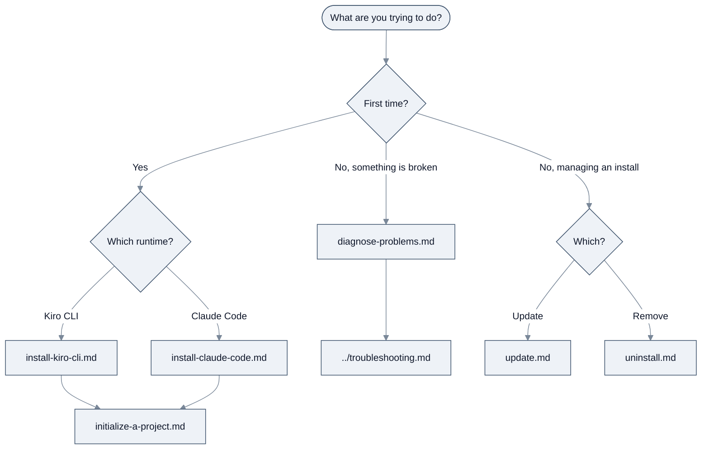

<!-- SPDX-License-Identifier: Apache-2.0 -->

# Task guides

[← Back to guide index](../README.md)

One page per real task. Each gives numbered steps, the expected output after each command, and a
checkpoint so you know whether it worked. Where behaviour differs between a fresh install and an
existing one, the page says so.

Looking to change how the agents behave, or build the CLI yourself? That is
[Contributing and customizing](../appendix/contributing.md).

| Task | What you get |
| --- | --- |
| [Install for Kiro CLI](install-kiro-cli.md) | The agent team registered with `kiro-cli` |
| [Install for Claude Code](install-claude-code.md) | The agent team registered with `claude`, including the two settings agent teams require |
| [Initialize a project](initialize-a-project.md) | A `.konductor/` directory with a starter config |
| [Diagnose problems](diagnose-problems.md) | `konductor doctor`, plus manual checks for behaviour it cannot see |
| [Update an installation](update.md) | The latest release, with your local modifications kept |
| [Uninstall](uninstall.md) | Konductor removed from your machine |

---

## Which task do I want?

*Routing to the right task guide.*

---

[← Back to guide index](../README.md)
