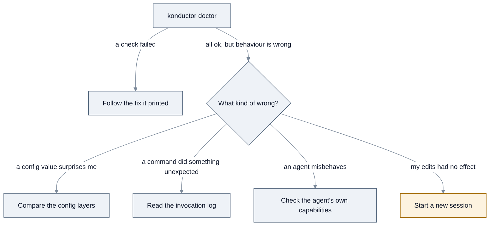

<!-- SPDX-License-Identifier: Apache-2.0 -->

# Diagnose problems

[← Task guides](README.md) · [Guide index](../README.md)

`konductor doctor` checks your installation and tells you what is wrong. Start there, then use the
manual checks below for anything it cannot see.

---

## Run `doctor` first

```bash
konductor doctor
```

A healthy installation:

```text
source             parsed, all cross-references resolve        ok
runtime            Kiro CLI detected                           ok
manifest           complete, no hash drift                     ok
config             .konductor/config.yml valid                 ok
container_runtime  docker found on PATH                      info
index_status       matches the manifest                        ok

All checks passed.
```

Exit code `0`.

A broken one names the check and what to do:

```text
source             agent k-developer references a missing skill   failed
    fix: add the skill under skills/, or remove the reference from the spec
runtime            no runtime detected at this target          failed
    fix: install Kiro CLI or Claude Code, or pass --target
manifest           4 files differ from their recorded hash       warn
    fix: run `konductor update --from <repo-root> --dry-run` to see which
config             .konductor/config.yml not found              info
    fix: optional. Run `konductor init` to create one.
container_runtime  none of docker/podman/nerdctl/finch on PATH  info
index_status       index says complete, manifest says partial    warn
    fix: re-run the install; it was interrupted between the two writes

2 checks failed.
```

Exit code `1`.

Statuses mean:

| Status | Meaning |
| --- | --- |
| `ok` | Nothing to do |
| `info` | Not a problem, but worth knowing — usually an optional thing you have not set up |
| `warn` | A hygiene issue, not a broken install — an unreadable manifest falling back, for example |
| `stale` | Installed content has drifted from the manifest — a hash mismatch or a missing file. Needs a re-install |
| `failed` | Will not work until you fix it |

### For a machine-readable report

```bash
konductor doctor --json
```

```text
{
  "command": "doctor",
  "ok": true,
  "warnings": false,
  "checks": [
    { "name": "source", "status": "ok", "summary": "..." },
    { "name": "runtime", "status": "ok", "summary": "..." },
    { "name": "manifest", "status": "ok", "summary": "..." },
    { "name": "config", "status": "ok", "summary": "..." },
    { "name": "container_runtime", "status": "info", "summary": "..." },
    { "name": "index_status", "status": "ok", "summary": "..." }
  ]
}
```

One object per run, with one entry in `checks` per check in the order above. A check that has
something to tell you also carries `remediation`, and `detail` when it has more than one line to
report. `ok` is `false` when any check came back `failed` or `stale`; `warnings` is `true` when any
came back `warn`, which `ok` deliberately ignores.

The exit code alone distinguishes the cases: failed checks exit `1`, a malformed invocation exits
`64`, and all-ok exits `0`. So `ok` and the exit code always agree — scan `checks` for the statuses
that are not `ok` to find what needs attention.

---

## Manual checks

For things `doctor` cannot see — mostly questions about *why* a value is what it is.



*`doctor` covers installation; the manual checks cover behaviour.*

### Which binary am I running?

```bash
which konductor
```

```text
/Users/you/.local/bin/konductor
```

Nothing printed means the binary is not on your `PATH`. If you both downloaded a release and built
from source, two programs named `konductor` may be installed and whichever comes first in `PATH`
wins.

```bash
konductor --version
```

```text
konductor 1.0.0
```

### Why is a config value what it is?

Three layers merge, and a forgotten user-level file is the usual surprise. Precedence is preset →
user → project, project winning.

Project layer:

```bash
cat .konductor/config.yml
```

User layer — this one applies to **every** project:

```bash
cat ~/.konductor/config.yml
```

`No such file or directory` means you have no user-level config, which is normal.

Any key absent from both files takes the CLI default listed in the
[CLI reference](../reference.md#configuration-file). If a value is not in your project file, the
user-level file is almost always the source.

### What did my recent commands actually do?

Every invocation appends one line to a log, including its real exit code.

```bash
tail -5 ~/.konductor/logs/konductor.log
```

```text
2026-08-13T20:13:52Z argv=["konductor", "install"] exit_code=0
2026-08-13T20:14:11Z argv=["konductor", "doctor"] exit_code=0
2026-08-13T20:15:02Z argv=["konductor", "synth"] exit_code=0
```

To find every failure:

```bash
grep -v "exit_code=0" ~/.konductor/logs/konductor.log
```

Notes on the log:

- The directory is mode `0700` and the file `0600` — owner-only, because argument vectors can contain
  paths you would rather not share.
- Logging is best-effort. If the log cannot be written the command still runs and its exit code is
  unaffected, so an empty log does not mean the CLI did not run.
- It grows without bound. Truncating is safe:

```bash
: > ~/.konductor/logs/konductor.log
```

### Why is an agent refusing, or doing the wrong thing?

Check what that agent can actually do. Capability differs by agent **and** by runtime — for example
`konductor` pre-approves nothing but reads in Kiro CLI, so its writes and commands ask first, while
in Claude Code both are granted outright; and `k-researcher` has no write or shell tool in Claude
Code at all. The full matrix is in
[Agents reference → what each agent can do to your machine](../agents.md#what-each-agent-can-do-to-your-machine).

Two behaviours that look like bugs and are not:

- The orchestrator delegating instead of acting. That is its design.
- A specialist declining a workflow. A SOP is only available to an agent that declares it — see
  [which agent owns which SOP](../sop-workflows/README.md#which-agent-owns-which-sop).

### My edits to an agent, skill, or SOP had no effect

All three are read at **session start**. Start a new session. If you changed the source tree, also
regenerate the runtime files:

```bash
konductor synth
```

See [Contributing and customizing](../appendix/contributing.md#validating-your-changes).

---

## What success looks like

- [ ] `konductor doctor` reports all checks ok and exits `0`.
- [ ] `which konductor` points at the binary you intend to use.
- [ ] `grep -v "exit_code=0" ~/.konductor/logs/konductor.log` shows no unexplained failures.

---

## Still stuck?

- [Troubleshooting](../troubleshooting.md) — specific symptoms in symptom → cause → fix form
- [FAQ](../faq.md)
- [Getting help](../getting-help.md)

---

[← Initialize a project](initialize-a-project.md) · [Next: Update →](update.md)
