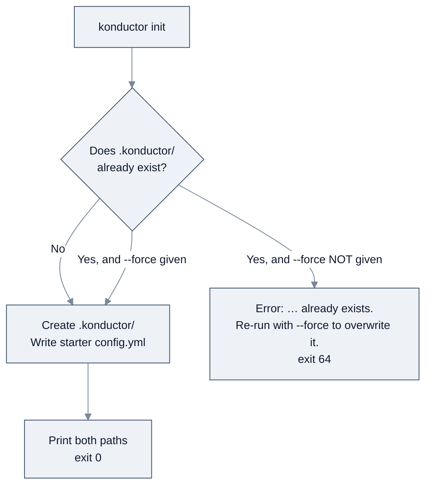

<!-- SPDX-License-Identifier: Apache-2.0 -->

# Initialize a project

[← Task guides](README.md) · [Guide index](../README.md)

Creates a `.konductor/` directory in your project with a starter `config.yml`. This is what
`konductor init` does — the whole of it.

**Prerequisite:** Konductor installed. See [Quick Start](../quick-start.md).

---

## What `init` actually creates

One directory containing one file:

```text
your-project/
└── .konductor/
    └── config.yml
```

That is the complete output. `init` does not touch git, does not install anything, and does not
contact the network.

---

## Steps

### 1. Go to your project

```bash
cd <your-project-path>
```

### 2. Initialize

```bash
konductor init
```

```text
Initialized Konductor project at /Users/you/your-project/.konductor
Wrote starter config: /Users/you/your-project/.konductor/config.yml
```

The paths are absolute and will reflect your own directory.

### 3. Confirm

```bash
ls .konductor
```

```text
config.yml
```

### 4. Look at what was written

```bash
cat .konductor/config.yml
```

The starter file is a **verbatim copy** of the CLI's defaults, comments included — so it documents
its own fields. The values are:

```text
version: 1

severities_source: severity-schema.yml
tiers_source: scope-table.yml

tier: minor

default_severity: MEDIUM

fail_on_severity_at_or_above: CRITICAL
```

Field meanings are in [CLI reference → configuration file](../reference.md#configuration-file).

---

## What success looks like

- [ ] `konductor init` printed two `Initialized…` / `Wrote starter config:` lines and exited `0`.
- [ ] `.konductor/config.yml` exists and is non-empty.
- [ ] `.konductor/config.yml` parses — `konductor doctor` reports `config` as `ok`.

Verify that last one:

```bash
cat .konductor/config.yml
```

```yaml
version: 1

severities_source: severity-schema.yml
tiers_source: scope-table.yml

tier: minor

default_severity: MEDIUM

fail_on_severity_at_or_above: CRITICAL
```

---

## Behavior differs by state

This is the one place where `init` will surprise you, so it is worth reading before you hit it.



*`init` refuses to clobber an existing `.konductor/` unless you pass `--force`.*

### Fresh directory

Succeeds as shown above.

### Existing `.konductor/`, no `--force`

```bash
konductor init
```

```text
Error: /Users/you/your-project/.konductor already exists. Re-run with --force to overwrite it.
```

Exit code `64`. Nothing was modified. This is a deliberate guard against destroying a config
you have edited.

### Existing `.konductor/`, with `--force`

```bash
konductor init --force
```

```text
Initialized Konductor project at /Users/you/your-project/.konductor
Wrote starter config: /Users/you/your-project/.konductor/config.yml
```

**This overwrites `config.yml` with the preset defaults.** Any values you had set are lost.
If you have customized the file, back it up first:

```bash
cp .konductor/config.yml .konductor/config.yml.bak
```

---

## The `--preset` flag

`init` accepts `--preset` with three allowed values: `solo`, `team`, `org`.

```bash
konductor init --preset solo --force
```

```text
Initialized Konductor project at /Users/you/your-project/.konductor
Wrote starter config: /Users/you/your-project/.konductor/config.yml
(preset 'solo' requested; all presets currently produce the same starter config)
```

The preset names describe how the project is worked on:

| Preset | For |
| --- | --- |
| `solo` | One person on the project |
| `team` | A single team sharing the repository |
| `org` | Multiple teams, where config should be consistent across them |

As the output says, all three currently scaffold the **same** starter config; per-preset
defaults are reserved for a future release. Passing the preset that fits costs nothing and
means the right defaults apply once they diverge.

An invalid preset is rejected as a usage error:

```bash
konductor init --preset enterprise
```

```text
error: invalid value 'enterprise' for '--preset <PRESET>'
  [possible values: solo, team, org]

For more information, try '--help'.
```

Exit code `64`.

---

## Should I commit `.konductor/` to git?

Both choices are defensible; the repository does not force either.

- **Commit it** if you want your whole team on the same tier and severity policy. The file is
  small, plain YAML, and reviewable.
- **Leave it out** if config should be per-developer. Note that a *user-level* config at
  `~/.konductor/config.yml` already exists for that purpose and takes lower precedence than
  the project file — see the [CLI reference](../reference.md#configuration-file).

Do note this repository's own `.gitignore` excludes `dist/` (the `synth` output) but says
nothing about `.konductor/`, so it is your call.

---

## Related

- [CLI reference → configuration file](../reference.md#configuration-file) — full schema and valid values
- [Troubleshooting](../troubleshooting.md)

---

[Next: Diagnose problems →](diagnose-problems.md)
