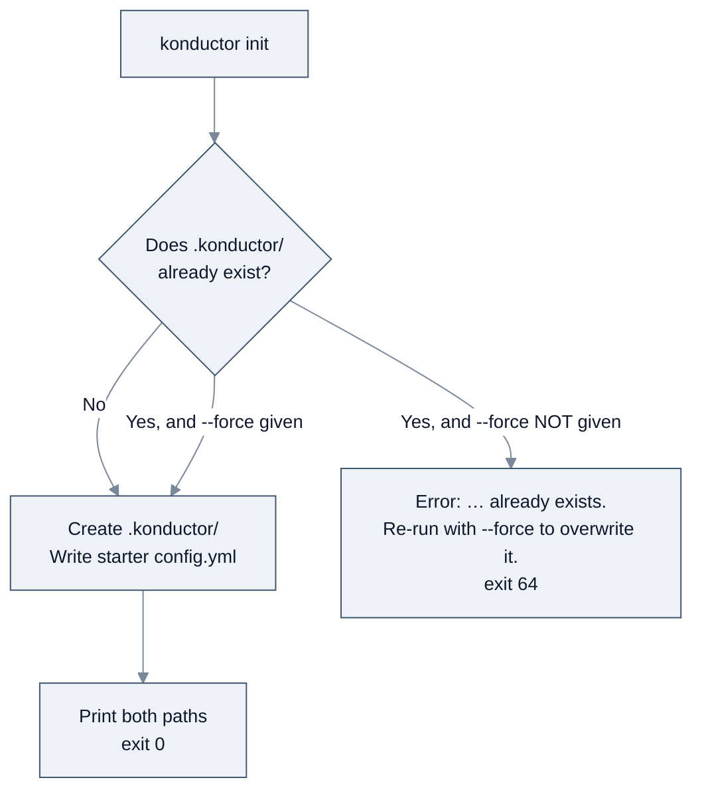

<!-- SPDX-License-Identifier: Apache-2.0 -->

# Initialize a project

[← Task guides](README.md) · [Guide index](../README.md)

Creates a `.konductor/` directory in your project with a starter `config.yml`. This is what
`konductor init` does — the whole of it.

`init` is not necessary. It only provides some configuration options; most work needs none of
them. Skip this page unless you want to opt out of telemetry for this project or set a config
value by hand.

**Prerequisite:** Konductor installed. See [Quick Start](../quick-start.md).

---

## What `init` actually creates

One directory containing one file:

```text
your-project/
└── .konductor/
    └── config.yml
```

That is the complete output. `init` does not touch git, does not install anything, and does not
contact the network.

---

## Steps

### 1. Go to your project

```bash
cd <your-project-path>
```

### 2. Initialize

```bash
konductor init
```

```text
Initialized Konductor project at /Users/you/your-project/.konductor
Wrote starter config: /Users/you/your-project/.konductor/config.yml
```

The paths are absolute and will reflect your own directory.

### 3. Confirm

```bash
ls .konductor
```

```text
config.yml
```

### 4. Look at what was written

```bash
cat .konductor/config.yml
```

```text
version: 1

telemetry:
  enabled: true
```

The only setting the CLI reads from this file is `telemetry.enabled` (and `telemetry.endpoint`
if you set it by hand). `version` identifies the file format. See
[CLI reference → configuration file](../reference.md#configuration-file).

---

## What success looks like

- [ ] `konductor init` printed two `Initialized…` / `Wrote starter config:` lines and exited `0`.
- [ ] `.konductor/config.yml` exists and is non-empty.
- [ ] `.konductor/config.yml` parses — `konductor doctor` reports `config` as `ok`.

Verify that last one:

```bash
cat .konductor/config.yml
```

```yaml
version: 1

telemetry:
  enabled: true
```

---

## Opting out of telemetry for this project

Set `telemetry.enabled` to `false`:

```yaml
version: 1

telemetry:
  enabled: false
```

This is the per-project opt-out. It applies only to this `.konductor/config.yml`. The value must
be the YAML boolean `false`; a file that fails to parse leaves telemetry on. See
[CLI reference → configuration file](../reference.md#configuration-file) for the other ways to
turn telemetry off.

---

## Behavior differs by state

This is the one place where `init` will surprise you, so it is worth reading before you hit it.


```mermaid
%%{init:{'theme':'base','themeVariables':{'fontSize':'14px','primaryColor':'#eef2f7','primaryTextColor':'#0f172a','primaryBorderColor':'#40556e','lineColor':'#7a8899','textColor':'#0f172a','edgeLabelBackground':'#ffffff','clusterBkg':'#fafbfc','clusterBorder':'#c9d2dc'}}}%%
flowchart TD
    Run["konductor init"] --> Check{"Does .konductor/<br/>already exist?"}
    Check -->|No| Create["Create .konductor/<br/>Write starter config.yml"]
    Create --> Ok["Print both paths<br/>exit 0"]
    Check -->|"Yes, and --force NOT given"| Refuse["Error: … already exists.<br/>Re-run with --force to overwrite it.<br/>exit 64"]
    Check -->|"Yes, and --force given"| Create
```

*`init` refuses to clobber an existing `.konductor/` unless you pass `--force`.*

### Fresh directory

Succeeds as shown above.

### Existing `.konductor/`, no `--force`

```bash
konductor init
```

```text
Error: /Users/you/your-project/.konductor already exists. Re-run with --force to overwrite it.
```

Exit code `64`. Nothing was modified. This is a deliberate guard against destroying a config
you have edited.

### Existing `.konductor/`, with `--force`

```bash
konductor init --force
```

```text
Initialized Konductor project at /Users/you/your-project/.konductor
Wrote starter config: /Users/you/your-project/.konductor/config.yml
```

**This overwrites `config.yml` with the starter defaults.** Any values you had set are lost.
If you have customized the file, back it up first:

```bash
cp .konductor/config.yml .konductor/config.yml.bak
```

---

## Should I commit `.konductor/` to git?

Both choices are defensible; the repository does not force either.

`.konductor/config.yml` is per-project; there is no user-level alternative file. If you want
different settings per developer, you need a separate project-level file per checkout (for
example, a path your own tooling swaps in), not a file under `$HOME`.

- **Commit it** if you want your whole team on the same settings. The file is small, plain YAML,
  and reviewable.
- **Leave it out** if settings should vary between checkouts and you manage that some other way.

Do note this repository's own `.gitignore` excludes `dist/` (the `synth` output) but says
nothing about `.konductor/`, so it is your call.

---

## Related

- [CLI reference → configuration file](../reference.md#configuration-file) — full schema and valid values
- [Troubleshooting](../troubleshooting.md)

---

[Next: Diagnose problems →](diagnose-problems.md)
