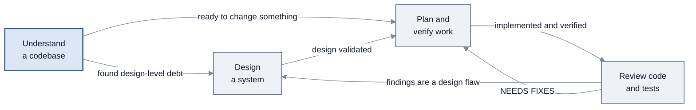

<!-- SPDX-License-Identifier: Apache-2.0 -->

# Use cases

[← Back to guide index](../README.md)

Four end-to-end walkthroughs, one per theme the package supports today. Each names the exact
SOPs, the owning agent, the prerequisites, a worked example in a domain that needs no
organisation-specific context, and where the workflow pauses for you.

Where [SOP workflows](../sop-workflows/README.md) documents each SOP mechanically — parameters,
steps, flowchart — these pages show the **journey**: which SOPs to chain, in what order, and what
you hold at the end.

**New here?** Start with [Understand a codebase](understand-a-codebase.md). It has zero setup cost
and gives the fastest read on what the package actually does.

---

## The four use cases

| Use case | What you end up with | Setup needed | How interactive |
| --- | --- | --- | --- |
| [Understand a codebase](understand-a-codebase.md) | A read-only critique at `.agents/scratchpad/critique-NNN.md`, or a full architecture report with three diagrams at `codebase-analysis.md` | None — both SOPs default every parameter | Runs start to finish; one optional interactive mode |
| [Design a system](design-a-system.md) | A PE-ready design doc at `docs/design/<slug>.md` plus AWS-validation and trade-off side reports, or a review report on an existing design package | A problem statement, or a `design_dir` containing `system-design.md` | The heaviest in the package — a Socratic interview of 5–15 questions, one at a time, plus a possible mid-run stop |
| [Plan and verify work](plan-and-verify-work.md) | An analysis summary, a phased plan with success criteria and a timeline, and a verification evidence report | A stated goal; a working build and test setup for real verification | Low — runs through unless it hits an architecture escalation |
| [Review code and tests](review-code-and-tests.md) | A code review report, three named test-coverage files plus the security skill's own output, source files edited in place by one SOP, and an adversarial security review | Changes in `source_dir`; a `test_dir` for coverage; a diff (`diff_input`) for the adversarial pass — a PR URL does not substitute | One hard `[y/n]` pause; the rest is autonomous |

---

## Before you start

You need Konductor installed and a session open with the relevant agent. If you have not done that
yet, start with the [Quick Start](../quick-start.md).

Once you are in a session, every page below shows two ways in:

- **Through the orchestrator** — describe what you want in plain language and let it route.
- **Direct to the owning agent** — faster when you already know which SOP you want.

---

## How the four fit together

*Typical routes between the four use cases. Start anywhere; the loops are the normal case.*

---

## What is not covered

Two themes the agents touch but no SOP supports, so there is no walkthrough for them:

- **Product ideation.** `k-product-manager` has real skills — `user-story-writing`,
  `requirements-extraction`, `decision-research`, `sprint-planning` and more — but declares
  **zero SOPs**. You can ask it directly for user stories or a requirements summary; there is
  just no scripted multi-step workflow to point a page at.
- **Issue triage.** No SOP in the package covers triaging incoming bugs or issues.

The same is true of `k-tpm`, `k-researcher`, `k-browser`, and
`k-media-analyzer` — all skill-driven, no SOPs. See the
[Agents reference](../agents.md#the-eight-specialists) for what each can do.

These four pages walk 11 of the 19 SOPs. Seven have no walkthrough here yet —
`kiro-spec-workflow`, `k-principal-engineer-design-review`, `k-e2e-test-generation`,
`k-light-ui-testing`, `k-full-sdlc`, `k-comprehensive-search`, and `about-konductor` — and
`k-delegate` is internal machinery rather than a workflow you would run. Each is documented step
by step, with a flowchart, in [SOP workflows](../sop-workflows/README.md).

`kiro-spec-workflow` is the most interactive of them: a narrower path producing a Kiro IDE spec
directory rather than a general SDLC outcome, with an approval gate on each of its three
documents. It is documented step by step,
with a flowchart, in
[SOP workflows](../sop-workflows/testing-and-specs.md#kiro-spec-workflow).

---

[← Back to guide index](../README.md) · [Next: Understand a codebase →](understand-a-codebase.md)
